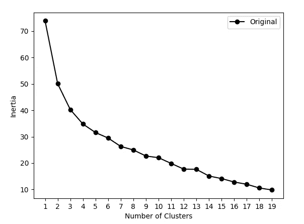
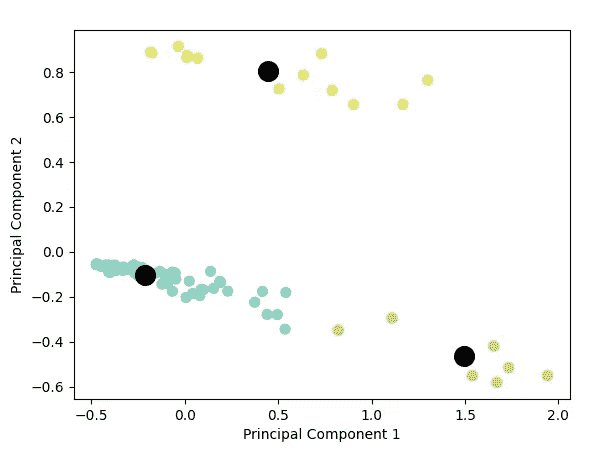

# 数据科学家应对 ML 面试初学者指南

> 原文：<https://towardsdatascience.com/the-beginners-guide-to-acing-ml-interviews-for-data-scientists-6ff04d8cb391?source=collection_archive---------25----------------------->

## [地面零点](https://pedram-ataee.medium.com/list/ground-zero-e79c47975d14)

## 解决集群挑战的分步指南


[Joppe Spaa](https://unsplash.com/@spaablauw?utm_source=medium&utm_medium=referral) 在 [Unsplash](https://unsplash.com?utm_source=medium&utm_medium=referral) 上的照片

数据科学面试通常有三个技术步骤:(a)**SQL 挑战**,( b)**ML 挑战**,( c)**现场技术面试**。前两步成为标准，而第三步因公司而异。在这篇文章中，我的目标是帮助你战胜“ML 挑战”这一步。如果您对 SQL 挑战感兴趣，可以查看下面的文章。

</the-beginners-guide-to-acing-sql-interviews-for-data-scientists-30317d6692ec>  

根据数据类型，机器学习挑战可以分为三组:**表格**、**文本**和**图像**。这些组的高级概念和步骤是相似的；但是实现细节不一样。

公司通常根据候选人使用的数据类型来面试他们。例如，如果他们处理文本数据，您将主要通过自然语言处理技术进行检查。尽管如此，许多公司仍然用经典的机器学习技术来评估候选人，这些技术主要集中在分类 T21 或聚类。

在本文中，我将一步步向您介绍一个典型的机器学习挑战的例子，这些挑战主要集中在聚类上。这是几年前我在一次采访中接受的挑战。现在，我想和大家分享一下我是如何解决的。我们开始吧。

<https://sharpestminds.com?r=pedram-ataee>  

# 问题

给定一个物品列表，将那些只与一个主题相关的物品分组。主题可以根据需要以任何方式定义。”

# 解决办法

这个问题和上面一样简单。对象列表及其相应的特征以表格的形式给出。我没有在这里描述这些数据，因为对于你的情况会有所不同。然而，解决这一挑战的主要步骤是相同的。为了解决这个挑战，我采取了几个步骤:

1.  **预处理**
2.  **模型建造**，以及
3.  **车型评测**。

在每次数据科学面试中，你都必须采取上述所有步骤。你可以在下面找到我的解决方案的细节。请注意，面试不仅仅是解决挑战。这个挑战是一个深入讨论每个步骤中存在的挑战的机会。所以，也要为此做好准备。

## 1 —预处理

在输入机器学习算法之前，必须对数据进行清理。为了简单起见，我进行了两个最重要的预处理步骤:M **丢失值**和**归一化**。

*   **缺少值。**您可以使用*插补*或*删除*等方法处理缺失值。为了简单起见，我在这个挑战中使用了简单的方法，没有探究它们的功效。我只是使用`df.fillna(0, inplace=True)`将值为`NaN` 的字段替换为`0` 。你可以在本文中阅读更多关于处理缺失值的技术:[如何处理缺失数据](/how-to-handle-missing-data-8646b18db0d4)。
*   **正常化**。我还使用`MinMax`方法标准化了数据。也可以使用其他方法，如`Standard Scaler`。你可能会问“哪个更好？”。答案是“看情况。”**最佳**必须是指总体上产生最佳分类或聚类结果的选择。因此，您必须建立一个完整的模型构建和评估管道。然后，在每个步骤中尝试不同的方法，以找到哪种配置会产生最佳结果。

```
mms = MinMaxScaler()
normalized_data = mms.fit_transform(df[df.columns[1:]])
df_original = pd.DataFrame(normalized_data, columns=df.columns[1:])
```

在这一步结束时，数据为模型构建步骤做好了准备。

## 2 —模型构建

正如问题描述中所描述的，我被要求根据一个主题对对象进行聚类。

要聚类一个没有标签的数据集，一个重要的问题是**“正确的聚类数是多少？”**。例如，当您想使用要求您固定聚类数的 **k-means** 算法时，您必须回答这个问题。我想在这个挑战中使用 k-means，所以我必须找出集群的数量。

通常使用两种主要技术来识别群集的数量:**轮廓**和**肘形**。我在这次挑战中使用了这两种技术来表明我意识到了它们的不同。在这篇文章中，我只分享了肘法。想了解更多关于廓形和手肘的知识，可以看看这篇文章:[廓形还是手肘？这是个问题。](/silhouette-or-elbow-that-is-the-question-a1dda4fb974)

在 Elbow 方法中，您必须绘制惯性(即样本到其最近聚类中心的平方距离之和)与聚类数的函数关系，如图 1 所示。然后，必须选择曲线的肘部作为簇的数量。根据肘法，在这个挑战中，集群的数量必须设置为 3。

```
def kmeans_simple(data, cluster_range):
    inertias = []
    for num_cluster in cluster_range:
        model = KMeans(n_clusters=num_cluster)
        model.fit(data)
        inertias.append(model.inertia_)

    return inertiascluster_range = range(1, 20)
inertias_original = kmeans_simple(df_original, cluster_range)
```



图 1 —“惯性”与“聚类数”的对比—肘形法

知道了`num_cluster`，我只需要对数据运行`KMeans`方法。注意，因为我想在下一步中可视化，所以在应用`KMeans`之前，我将数据维度减少到 2。这项挑战中使用的降维技术是主成分分析(PCA)，这是一种常用于可视化的经典技术。

```
pca = PCA(n_components=2)
df_reduced = pca.fit_transform(df_original)
pca_components = pd.DataFrame(df_reduced)
kmeans = KMeans(n_clusters=3, init='k-means++', max_iter=300, ... n_init=10, random_state=0)
kmeans.fit(df_reduced)
y_kmeans = kmeans.predict(df_reduced)
centers = kmeans.cluster_centers_
```

## 3 —模型评估

该问题要求根据主题对对象进行聚类。**在这个挑战中，我把“一个主题”解释为“一个可分离的集群”。**在步骤 2 中，我发现数据可以正确地分为 3 类。所以，我把物品分成三个主题。请注意，在这种挑战中，集群数量没有对错之分；**只有一个最优的**。用`num_clusters=3`运行 k-means 后，我可以很容易地确定两个对象是否属于一个集群。

```
plt.figure()
plt.scatter(pca_components[0], pca_components[1], c=y_kmeans, s=50, cmap='Set3')
plt.xlabel('Principal Component 1')
plt.ylabel('Principal Component 2')
plt.scatter(centers[:, 0], centers[:, 1], c='black', s=200)
plt.show()
```

最后，我将数据绘制成二维图，以验证拥有 3 个聚类的假设是否合理。图 2 支持这一发现。这是评估集群是否运行良好的最简单的方法。评估聚类结果的另一种方法是将一种技术的结果与另一种技术的结果进行比较。这就是为什么我同时使用肘部和轮廓的方法。



图 2—散点图

## 临终遗言

这是一个集群挑战的例子。我可以更详细地完成每一步。由于这是一次面试，所以我只执行了基本的，追求的是根本。如果你正在处理一个真实世界的挑战，你会看到它有多大的不同。希望这能帮助你赢得数据科学面试。

# 感谢阅读！

如果你喜欢这个帖子，想支持我…

*   *跟我上* [*中*](https://medium.com/@pedram-ataee) *！*
*   *在* [*亚马逊*](https://www.amazon.com/Pedram-Ataee/e/B08D6J3WNW) *上查看我的书！*
*   *成为* [*中的一员*](https://pedram-ataee.medium.com/membership) *！*
*   *连接上*[*Linkedin*](https://www.linkedin.com/in/pedrama/)*！*
*   *关注我上* [*推特*](https://twitter.com/pedram_ataee) *！*

<https://pedram-ataee.medium.com/membership> 