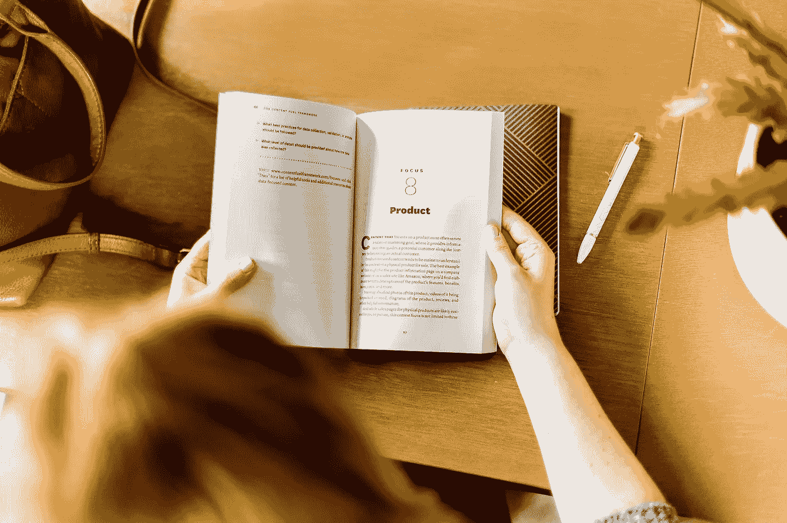
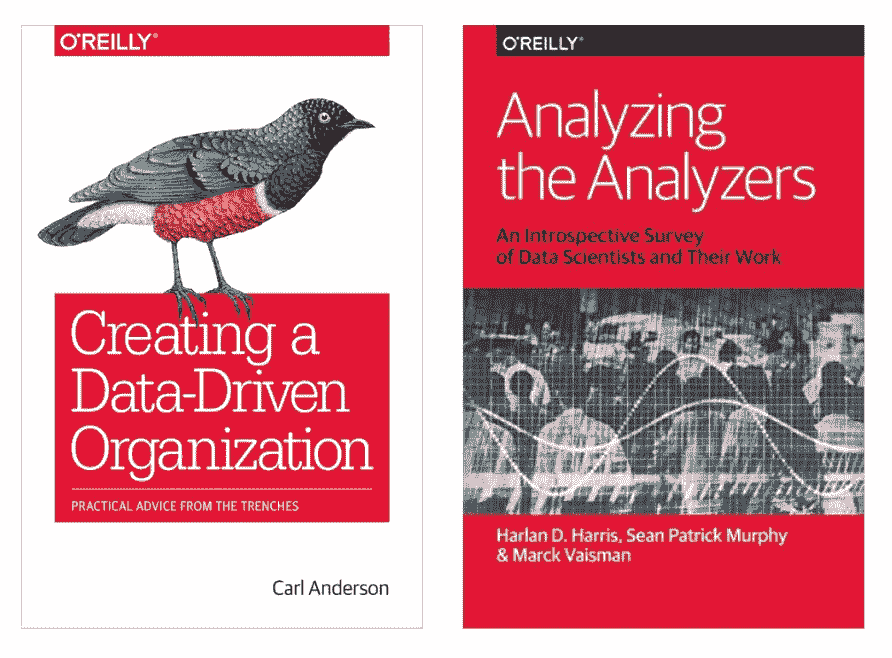
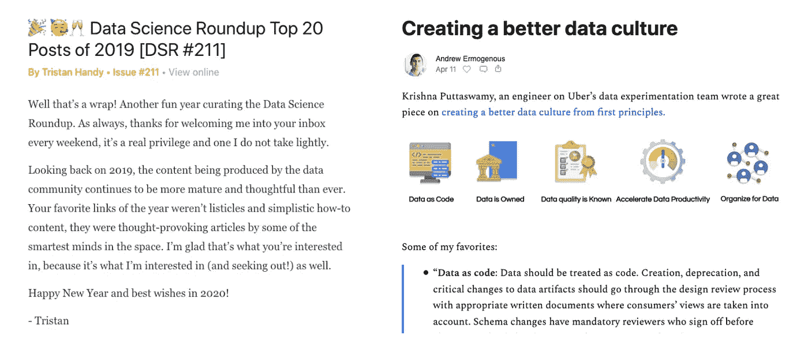

# 现代数据堆栈初学者指南

> 原文：<https://towardsdatascience.com/the-beginners-guide-to-the-modern-data-stack-d1c54bd1793e?source=collection_archive---------13----------------------->

## 一个由博客、书籍、时事通讯、播客和社区组成的列表，涵盖了所有现代数据堆栈

梅勒妮·德泽尔在 [Unsplash](https://unsplash.com/?utm_source=unsplash&utm_medium=referral&utm_content=creditCopyText) 上的照片

最近， [Atlan](https://atlan.com/) 的一名新员工问我，“你给我推荐了哪些资源来让我掌握现代数据堆栈的最新动态？”

现代数据堆栈杂乱而复杂，并且每天都在变化。有大量关于它的新闻，很难将炒作和噪音与现实分开。

以下是我们的团队如何与最新的新闻和趋势保持联系。

# 现代数据堆栈 101

## [**现代数据平台的基石**](/the-building-blocks-of-a-modern-data-platform-92e46061165)

我的博客文章是定义现代数据平台的初学者指南，现代数据平台的关键构建块，以及堆栈每个阶段的顶级工具和公司。

## [**现代数据基础设施的新兴架构**](https://future.a16z.com/emerging-architectures-modern-data-infrastructure/)

基于对 20 多名从业者的采访，从 [a16z](https://a16z.com/) 获得了关于哪些技术在现代数据堆栈中胜出的精彩、深入的阅读。

## [**2020 年现代数据栈大会**](https://resources.fivetran.com/mdsconference)

Fivetran 第一届现代数据堆栈会议的资源，介绍了最新的创新、工具和最佳实践。

## [**现代数据堆栈:过去、现在和未来**](https://blog.getdbt.com/future-of-the-modern-data-stack/)

特里斯坦·汉迪的这篇博客很好地介绍了创造现代数据堆栈的基础创新，我们现在所处的位置，以及未来创新需要关注的关键领域。

# 建立和运行数据团队

## [**创建数据驱动型组织**](https://www.oreilly.com/library/view/creating-a-data-driven/9781491916902/)

这是我最喜欢的入门书籍之一，讲述了如何建立和运行一个数据驱动的组织。这本书的特色是来自卡尔·安德森的实用建议，他在担任 Warby Parker 的数据科学总监时写了这本书，目前是 WW (Weight Watchers)的数据副总裁。

## [**分析分析仪**](https://www.oreilly.com/library/view/analyzing-the-analyzers/9781449368388/)

我在数据团队中遇到的最大挑战是将人们定型为传统的 JDs。以我的经验来看，我从来没有找到一个典型的“数据科学家”或者“数据工程师”或者“数据分析师”。

我找到了 Sandy，她是一名训练有素的经济学家，在理解业务问题、确定解决方案和构建数据科学方法原型以解决这些问题方面表现出色。或者 Pam，他是一名训练有素的计算机工程师，擅长生产和缩放模型，但也喜欢运行 POC。或者是 Mark，他也是一名计算机工程师，但更像是一名多面手，擅长一半是数据科学家、一半是工程师的角色。

Sean Murphy、Marck Vaisman 和 Harlan Harris 的这本书打破了我们对数据团队中不同类型的人的规范。它没有试图对数据人员进行定型，而是构建了不同技能集的热图，以及它们如何与数据团队中的不同角色相关联。

O'Reilly 关于建立和运行数据团队的两部巨著

# 萧条的社区

## [局部乐观](https://locallyoptimistic.com/community)

这是我最喜欢的供应商中立的数据领导者和从业者社区之一。它充满了非常深思熟虑的讨论，特别是关于数据团队和结构。

## [dbt](https://community.getdbt.com/)

dbt 的 Slack 社区是最活跃的数据从业者群体之一，他们称之为“分析工程师”。

## [远大前程](https://greatexpectations.io/community/)

这是一个新兴的社区，大部分都是数据工程师，他们在一起讨论我最喜欢的话题之一:信任！

# 时事通讯

## [**数据科学综述**](http://roundup.fishtownanalytics.com/)

每周，特里斯坦·汉迪(Tristan Handy)都会整理一系列数据链接以及他的叙述和想法，读起来总是很有趣。这些帖子内容广泛，涵盖了从数据文化和数据团队到新工具和堆栈层的所有内容。

## [**数据工程周刊**](https://www.dataengineeringweekly.com/)

Anand Packkildurai 每周策划顶级阅读，主要关注数据工程。

## [**数据委员会**](https://www.datacouncil.ai/)

他们的时事通讯包括热门阅读、即将到来的事件等等，通常集中在开源项目上。

## [**现代数据堆栈**](https://moderndatastack.substack.com/)

由 Andrew Ermogenous 策划，这份时事通讯分享了关于现代数据堆栈和数据文化的博客、指南和播客。

数据科学综述(左)和现代数据堆栈(右)新闻简报摘录

# 博客和播客

## [**走向数据科学**](https://towardsdatascience.com/)

这可能是涵盖所有数据的最受欢迎的博客。凭借广泛的外部贡献者和优秀的内容编辑指南，它已成为数据从业者分享文章的首选目的地。

## [数据工程播客 ](https://www.dataengineeringpodcast.com/)

由托拜厄斯·小萌主持，这个播客主要涵盖了关于不同数据工具的深入对话。现代的数据堆栈会很快变得混乱，所以这是一个解开宣传和营销信息的绝佳资源。他的谈话总是涉及到我们需要了解的关于新数据工具或项目的信息:它如何工作，如何部署，与其他工具相比如何，等等。

## [**局部乐观**](https://locallyoptimistic.com/)

本博客重点关注来自各种数据领导者的关于建立和运行数据团队的实用技巧、诀窍和知识。

**有什么推荐补充？联系 Atlan** **的** [**Prukalpa**](https://www.linkedin.com/in/prukalpa/) **或** [**团队。**](https://atlan.com/forms/talk-to-sales/)

**发现此内容有帮助？在我的时事通讯《元数据周刊》上，我每周都写关于活动元数据、数据操作、数据文化和我们的学习建设的文章。** [**在此订阅。**](https://metadataweekly.substack.com/)