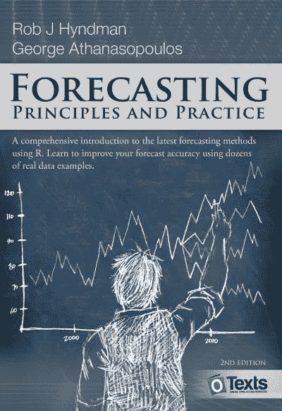

# 开始学习时间序列预测的最佳书籍

> 原文：<https://towardsdatascience.com/the-best-book-to-start-learning-about-time-series-forecasting-69fcc618b6bb?source=collection_archive---------7----------------------->

由 [Unsplash](https://unsplash.com/s/photos/book?utm_source=unsplash&utm_medium=referral&utm_content=creditCopyText) 上的[美元吉尔](https://unsplash.com/@dollargill?utm_source=unsplash&utm_medium=referral&utm_content=creditCopyText)拍摄的照片

## 更妙的是，它是免费的！

时间序列预测是统计学/机器学习中一个非常有趣且具有挑战性的领域。可以说，这可能是一个比标准回归任务更难解决的问题，因为我们必须考虑到时间依赖性和它们带来的额外假设。

虽然这可能是一个令人望而生畏的问题，但对几乎每个公司来说，这也是一个至关重要的问题，因为他们都要处理某种预测——销售、需求、收入、增长，等等。这正是数据科学领域的知识能够产生重大影响并为决策者提供附加值的地方。

在这篇文章中，我对这本书做了一个简短的概述，并提出了个人观点，我认为这本书是学习时间序列预测的一个很好的起点。这并不意味着这只是一本给初学者的书，因为我很确定即使是有经验的数据科学家也会从讲座中学到一些新东西。

我想到的书是罗伯·J·海曼和乔治·阿萨纳索普洛斯的《T4 预测:原则与实践》。这本书在这里可以免费获得，但你也可以购买平装本或电子版(通过这本书网站上的链接)。我以前读过这本书的第二版，但我惊喜地发现第三版是在 2021 年 2 月发布的，所以我更新了这篇文章，以包括最新的信息。

来源:[https://otexts.com/fpp2/](https://otexts.com/fpp2/)

正如我所提到的，这本书对于那些想研究预测问题的人来说是一个很好的起点——不管是专业的还是个人的。观众可能已经对该领域有了大致的了解，或者是从零开始。为了更好地利用这本书，数学(代数)的基础知识以及 R(编程语言)的知识肯定会有所帮助。

在阅读这本书的时候，后者绝对是一个不错的选择，因为它有一个专用的 R 库(`fpp3`)，并且广泛使用了`tsibble`和`fable`包(而不是第二版中的`forecast`包)。得益于此，你可以快速复制书中的所有例子，或者使用提供的数据集进行你自己的分析。

# 章节概述

在这一部分，我将很快浏览一下各章的内容，并提及我认为最相关的内容。你可以把它看作是一个精选的目录。

## 第 1 章:入门

在这一章中，作者通过定义基本术语和拟定在处理与时间序列相关的任务时需要遵循的一般步骤来介绍时间序列预测领域。此外，他们提供了书中描述的技术的一些用例。

## 第 2 章:时间序列图形

第二章包含了用于时间序列分析的非常有用的图表类型的选择，以及它们的解释和我们可以从中得出的结论。举几个例子，本章涵盖了时间序列图(线图)、季节图、散点图、自相关函数图(ACF)等等。在我的一篇文章的[中，我展示了如何用 Python 快速重现其中的一些情节。](/5-types-of-plots-that-will-help-you-with-time-series-analysis-b63747818705)

## 第三章:时间序列分解

这一部分对于任何处理时间序列的人来说都是至关重要的。在其中，作者描述了什么是**时间序列分解**，什么是季节/趋势/剩余部分，以及我们可以使用哪些方法来分解时间序列(classical、X11、SEATS、STL)。然后，他们提出了各自的优势和劣势，我们应该记住，而分解时间序列。

## 第 4 章:时间序列特征

本章的重点是从潜在的时间序列中自动提取有用的特征。作者描述了`feasts` R 包，它包括许多用于计算时间序列的*特征和统计数据的函数。通过使用该软件包，我们可以根据自相关系数(例如，原始/差异序列的前 *X* 系数的平方和)或趋势/季节性强度(基于 STL 分解)轻松提取特征。*

## 第五章:预测者的工具箱

在这一章中，作者为我们提供了一套基本的工具，这些工具对大多数时间序列问题都很有帮助。他们展示了如何:

*   准备和转换用于建模的数据，
*   使用简单的(天真的)模型作为基准，
*   理解拟合值和残差的概念，
*   通过观察残差的分布和自相关来诊断我们的模型，
*   使用一些流行的评估指标(如 MAE、MAPE、RMSE)进行预测，并了解它们的优势和劣势。
*   使用分位数得分、温克勒得分、连续排名概率得分(CRPS)或技能得分等指标来评估分布预测。
*   在处理时间序列问题时使用交叉验证。

## 第六章:判断性预测

**判断性预测**(或对统计预测的调整)由专家利用他们的领域知识人工做出。有时，我们要么不能依靠统计方法进行预测(例如，由于缺乏数据)，要么希望用领域知识来补充统计方法。后者可能特别有用，例如，当专家知道某件事将在不久的将来改变(例如，一项新的政策或法律)，但其影响在过去的数据中尚未出现。

作者介绍了几种判断性预测的方法，如德尔菲法或情景预测法。此外，它们还提供了在实践中如何有效、正确地实施此类预测的最佳实践，同时避免了潜在的偏差。

## 第七章:时间序列回归模型

在这一章中，作者解释了用于时间序列预测的最简单但非常强大的模型——线性回归模型**。它们涵盖的主题包括:**

*   **通用模型规范和基本方程(对于好奇的读者，还介绍了矩阵形式)，**
*   **模型的假设以及如何检验它们，**
*   **特征工程的流行方法，**
*   **使用不同的标准(调整后的 R、AIC、BIC)评估回归模型，并使用逐步方法选择最佳特征，**
*   **非线性回归的流行方法，**
*   **混淆相关性和因果关系的危险，以及为什么我们应该小心多重共线性。**

## **第八章:指数平滑**

**在第八章中，作者介绍了整类指数平滑模型。他们从经典模型开始，如简单指数平滑、霍尔特的线性趋势模型和霍尔特-温特的季节性模型。这样做之后，他们进一步解释了如何将**状态空间模型**纳入指数平滑框架。使用它们，我们实际上不仅能够获得点预测，而且能够量化不确定性并获得预测区间。**

## **第九章:ARIMA 模型**

**描述了指数平滑模型后，作者继续进行两种最流行的时间序列预测方法中的第二种——**ARIMA**类模型。与依赖于数据中趋势和季节性描述的 ES 模型相反，ARIMA 模型试图描述时间序列中存在的自相关性。**

**这就是为什么在这一章中作者关注平稳性和[差分](/an-intuitive-guide-to-differencing-time-series-in-python-1d6c7a2c067a)的概念。他们还介绍了 ARIMA 的构建模块——自回归和移动平均模型。虽然手动选择 ARIMA 模型的超参数可能相当棘手，但作者介绍了一种用于自动选择最佳组合的算法——著名的**自动 ARIMA** 。为了理解算法如何遍历可能的超参数空间以寻找最佳拟合，在这一部分花一些时间绝对是值得的。**

**最后，作者介绍了模型的更高级的变体，它能够解释时间序列中的季节性——季节性 ARIMA (SARIMA)。**

## **第十章:动态回归模型**

**在第十章中，作者介绍了另一类模型——动态回归模型。为了直观地理解这种模型，我们可以把它看作是书中提到的另外两种模型的组合。第一个是 ARIMA 模型，它利用过去的数据预测未来的观察结果。第二个是一般回归模型，它可以包含与预测相关的所有其他信息，例如，假期的影响，经济的整体变化等。**

**我们可以了解的另一个有用的技术是**动态谐波回归**，其中我们使用傅立叶项来模拟(较长的)季节模式，而短期时间序列动态则通过 ARMA 类型的误差来处理。**

## **第十一章:预测分层或分组时间序列**

**本章介绍了**聚合时间序列**的概念。假设您有一个在线商店总销售额的时间序列。对于**分层时间序列**最常见的情况是您将按地理区域分解总序列。您可以按国家/地区划分总销售额，如果需要，您还可以按地区进一步划分系列，依此类推。换句话说，有一个清晰的、分层次的逐步分解序列的方式。在预测这样一个系列时，重要的是，当你在层次结构中向上移动时，较低的级别会增加，所以所有区域销售额的总和会增加到国家级别，等等。**

**对于**分组的时间序列**，没有唯一的分解时间序列的层次方式。以在线商店为例，您可以按照产品类别和价格范围来划分总时间序列。在这种情况下，两个层次结构可以一起用于分解系列。这导致了比层次化场景稍微复杂一点的场景。**

**在介绍了两种聚合时间序列之后，作者回顾了预测这种序列的最流行的方法——自下而上、自上而下和中间向外的方法。**

## **第 12 章:高级预测方法**

**在描述了对时间序列预测有用的大多数基础知识之后，作者提出了一些高级方法:**

*   **建模**复杂的季节性**(具有多个季节周期)——例如，每日数据可能同时具有周模式和年模式。为了应对这一挑战，我们可能希望使用具有多个季节周期的 STL 分解、动态调和回归或 TBATS 模型(具有 Box-Cox 变换、ARMA 误差、趋势和季节成分的指数平滑状态空间模型——是的，这是:D 模型的全称)。**
*   **脸书的**先知**模型。**
*   **使用**向量自回归** (VAR，不要与风险值混淆)对多个变量之间的方向关系建模。**
*   **深度学习简介**神经网络自回归**(使用前馈 NNs 建模)。特别有趣的是关于如何获得这种模型的置信区间的附加解释。**
*   **自举和打包——作者描述了如何使用**块自举**、**打包的 ETS 预测**背后的想法，以及它们在准确性和估计时间之间的权衡。**

## **第十三章:一些实际的预测问题**

**在最后一章中，作者描述了我们在处理时间序列时可能会遇到的一些实际问题:**

*   **处理每周和次每日数据的挑战和解决方案，**
*   **如何确保预测保持在一定的范围内，**
*   **如何使用书中描述的不同模型的平均来提高整体精度，**
*   **处理很长或很短的时间序列有什么潜在的陷阱，**
*   **处理缺失值(取决于数据缺失的原因)和异常值(检测和清理数据的简单方法)的一些方法。**

# **意见**

**我已经对这本书赞不绝口，但我真的认为这种称赞是当之无愧的。我真正喜欢这本书的是它的实用方法。如果你很着急或者只是想玩玩你自己的数据，你可以复制粘贴选中的片段，然后在几分钟内得到模型的 MVP。**

**同时，你可以用这本书来更深入地了解这个领域。作者们足够仁慈，不让我们的大脑因过载的数学方程而爆炸，所以他们只使用公式来传达必要的信息，同时参考其他来源进行更详细的推导和更深入的挖掘。这样，我相信这本书更容易被更多的读者所理解。对我个人来说，当我想快速回顾某个特定主题时，它也可以作为一个参考点。据我所知，这本书写得详尽，但简明扼要。**

**这本书的另一个很大的特点是，它随着该领域的最新进展和新技术而不断更新。例如，今年发布的第三版增加了对 Prophet 算法的描述和一些最近的发展。**

**最后，这本书附带了专用的 R 包，其中包含了书中描述的所有方法(甚至更多！).所以你也可以把这本书看作是如何使用其中某个功能的扩展说明。作者还将书的内容(和包)与 *tidy 框架*和`tidyverse` [包集](https://www.tidyverse.org/)对齐。**

# **结论**

**我真的希望这篇文章能鼓励你阅读*预测:原则和实践。对于获得时间序列预测的实用知识来说，这绝对是一个很好的资源，我推荐它不仅作为一个起点，而且作为从事涉及时间序列的项目时的一个参考点。***

**一如既往，我们欢迎任何建设性的反馈。你可以在推特上或者评论里联系我。**

**如果您喜欢这篇文章，您可能还会对以下内容感兴趣:**

** [## 脸书的先知+深度学习= NeuralProphet

### 用深度学习的力量改进可解释的先知模型

towardsdatascience.com](/facebooks-prophet-deep-learning-neuralprophet-76796aed1d86)  [## 选择正确的误差度量:MAPE 与斯马普

### 两种流行的误差度量标准的利弊

towardsdatascience.com](/choosing-the-correct-error-metric-mape-vs-smape-5328dec53fac)  [## 5 个提高我工作效率的免费工具

### 这不是一个好的 IDE，尽管它很有帮助！

towardsdatascience.com](/5-free-tools-that-increase-my-productivity-c0fafbbbdd42) 

# 参考

*   Hyndman，R.J .，& Athanasopoulos，G. (2021) *预测:原则与实践*，第三版，原文:澳大利亚墨尔本。OTexts.com/fpp3.**