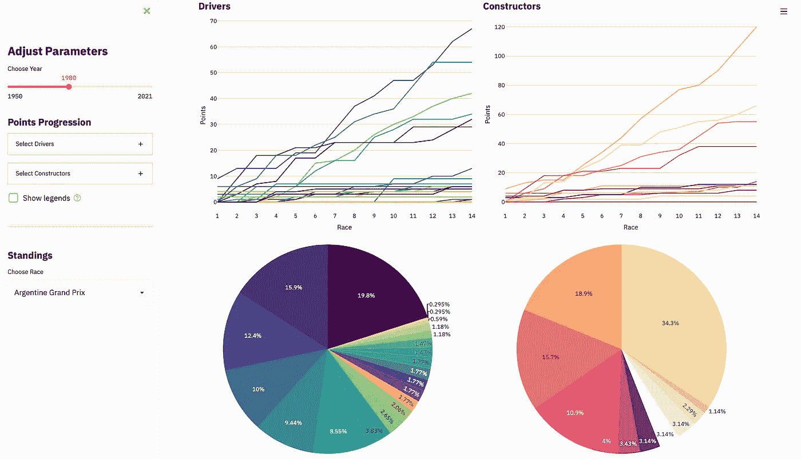
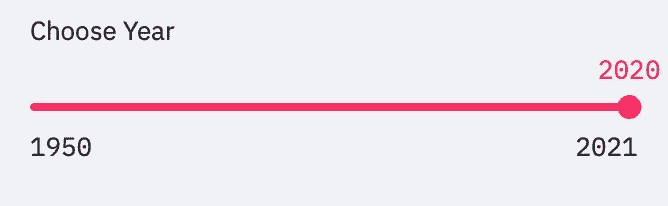
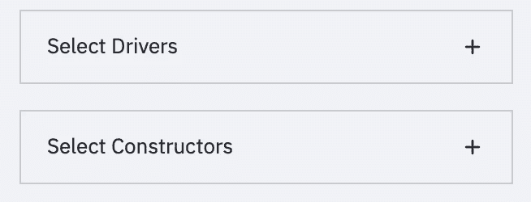
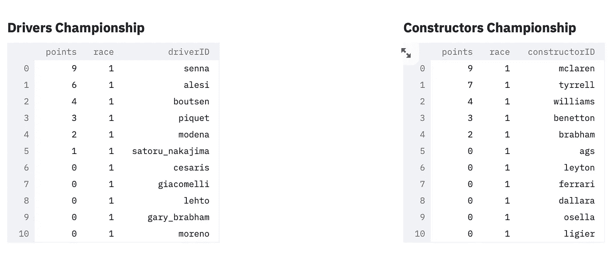
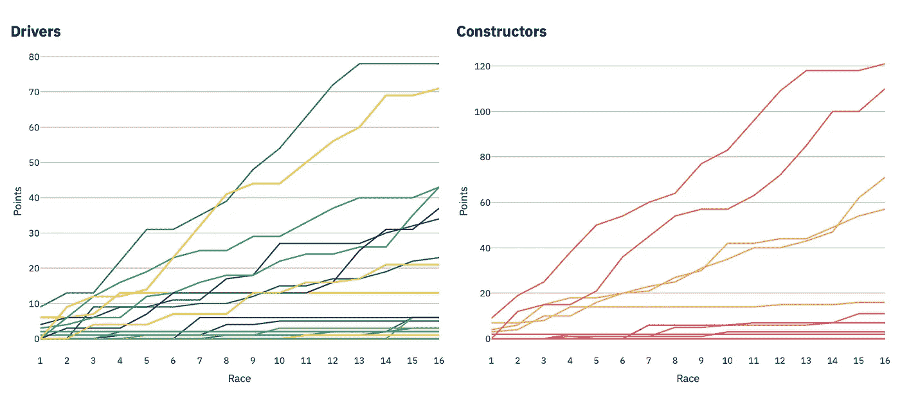

# 你从未听说过的最好的数据科学框架

> 原文：<https://towardsdatascience.com/the-best-data-science-framework-youve-never-heard-of-baf19120621c?source=collection_archive---------6----------------------->

## 以前所未有的速度构建漂亮的数据驱动型应用



Streamlit 内置的 web 应用程序(所有截图均由作者提供)

如果你曾经想要将你创建的机器学习模型或数据可视化转化为网络应用，供其他人查看和互动，在某些时候你可能会感到有点失落。

你可能是一名优秀的数据科学家，非常熟悉处理数据、提取见解、构建可视化和创建模型所需的工具，但将这些工具投入生产需要更多时间。正如 Streamlit 的联合创始人兼首席执行官 Adrien Treuille 所说，*“机器学习工程师实际上是应用程序的开发者。”*

Streamlit 是一个相对年轻的框架，它提供了一股新鲜空气，并提供了一种快速、轻松地创建漂亮的数据驱动应用程序的方法。那么它解决了什么问题，它是为谁准备的，你应该使用它吗？

# 问题是

机器学习/数据科学管道看起来像这样:

> 数据>培训>模型>生产

在整个过程中，通常需要设计许多定制的解决方案，从原型到演示再到仪表板等等……无论您是在构建一个将被您公司内的销售人员广泛使用的企业解决方案，还是仅仅致力于一个个人项目，这都需要软件工程。

## 一个例子

Adrien Treuille 回忆起他在 [Zoox](https://zoox.com) 工作时，大约有 80 名机器学习工程师正在建造无人驾驶汽车系统。他们什么都做:规划，视觉，行人检测，所有的一切。

他举例说明了工程师可能需要开发的一种工具:同时运行两个自动驾驶系统并进行比较的应用程序。这可能会以一个工程师的项目开始，写在 Jupyter 笔记本上，复制并粘贴到 Python 脚本中，推送到 GitHub，并用像 [Flask](https://flask.palletsprojects.com/en/2.0.x/) 这样的框架构建。

但是假设应用程序成为团队工作流程的重要组成部分，突然有更多的工程师需要使用它，并且需要添加功能，但是它没有被设计成一个完善的、可扩展的软件。这就是阿德里安所说的*“不可维护性陷阱”*。

在这个阶段，机器学习工程师会召集一个内部团队，他们本质上是构建 web 应用程序的专家。这个团队将收集系统的需求，用 JavaScript、Python、CSS、HTML 等在 [React](https://reactjs.org) 或 [Vue](https://vuejs.org) 中进行线框化和开发。，最终打造出一款惊艳且设计精良的应用。

但之后他们需要转移到不同的项目，支持不同的团队，应用程序将处于*“冻结区”*直到他们可以返回。即使你在做一个单独的项目，而不是在一家大公司，这种依赖软件工程来部署你的应用程序会让生活变得非常困难。

# 解决方案

Streamlit 是一个应用程序框架，它会提出以下问题:

> 如果我们能让构建工具像编写 Python 脚本一样简单，会怎么样？

目标是将 web 应用程序构建理念从以布局和开发事件模型开始，转变为数据科学家应该非常习惯的 Python 脚本式的自顶向下执行、数据流转换风格。

用阿德里安自己的话来说，Streamlit 应用程序是*“基本上是一个数据脚本，经过轻微的注释，使其成为一个交互式应用程序”*。

从个人经验来看，我可以告诉你，Streamlit 实现了这个承诺。您甚至可以通过添加几个 Streamlit 调用，将已经存在的 Python 脚本转换成 web 应用程序，所有这些都在一个文件中。

# 真的这么简单吗？

是啊！看看这个:

> **想创建一个滑块来选择一个值输入到模型中吗？**

```
val = st.slider()
# Use val
```

您只需声明一个变量并将其设置为等于 Streamlit 的 slider 小部件，然后根据您的喜好调整一些参数。这将在你的应用程序中显示滑块，并将 *val* 的值设置为用户滑动到的值。创建按钮、复选框、单选按钮、选择框、多选框等等也一样简单。



Streamlit 中的一个滑块和两个选择框

> 想要创建一个可隐藏的侧边栏，将一些控件和信息放到左边？

```
sidebar = st.sidebar()
with sidebar:
    # Add stuff
```

声明侧边栏变量并使用 Streamlit 的*和*符号将任何内容放入其中。同样的机制也可以应用于容器甚至列来定制你的应用程序的布局。

> **想要添加页眉、标题和文本吗？**

```
# Text
st.title()
st.header()
st.write()# Markdown
st.markdown()# LaTeX
st.latex()# Code
st.code()
```

格式基本上仅限于 markdown，所以不要期望任何花哨的字体或字体大小，但它可以完成工作。


Streamlit 中的降价文本

> **想要显示数据？**

```
st.write(pandas dataframe or chart from supported library)
```



Streamlit 中的熊猫数据帧

只需将 Streamlit 支持的绘图库中的一个数据帧或图表传递给我们前面看到的同一个 st.write 函数。如果您想要传入数据帧并显示图表:

```
st.line_chart(data)
st.area_chart(data)
st.bar_chart(data)# Etc.
```

如果您在使用支持的绘图库时想要更多的自定义控制:

```
st.altair_chart(altair chart)
st.plotly_chart(plotly express chart)# Etc.
```



Streamlit 中的 Plotly Express 图表

请注意，这绝不是 Streamlit 功能的详尽列表。为此，我强烈推荐文档。但我希望它能给你一个例子，说明显示文本、小部件和数据，以及接受用户输入和定制布局是多么容易。

## 部署

好吧，用 Streamlit 创建应用程序很容易，但是实际上把它们发布给其他人看呢？

那也很容易。有许多方法可以在云中托管 streamlit 应用程序，或者你甚至可以利用他们新的 T2 Streamlit 共享服务，让发布你的数据应用程序变得像开发时一样简单。

# 缺点

简单意味着妥协。例如，如果你追求高度的定制化，这个框架可能不适合你。

然而，Streamlit 社区非常活跃，非常有帮助，您可以请求新功能或查看是否有任何记录良好的技巧来实现您想要的。框架在不断完善。

不要忽视最佳软件实践！

开发一个应用程序太容易了，眨眼之间，就有了 500 行*。py* 文件(其中可能有 5%实际上是 Streamlit 调用，但 95%将是您的数据处理和模型构建)。这可不容易维持。将你的代码分成几个模块，并尝试在任何时候都遵循 DRY 原则——这只是一个 Python 脚本并不重要，即使是 Streamlit 也不重要，如果你有一个中型到大型的应用程序，它可以让你不必组织你的代码。

# 那么该不该用呢？

我看到一些文章和帖子认为 Streamlit 可能会杀死 Flask。这是荒谬的，不是因为 Streamlit 不够好，而是因为如果还不清楚的话，它们有非常不同的用例。然而，这并不意味着你不再需要像 Flask 这样的框架来构建特定类型的应用程序。

如果你没有建立一个数据驱动、机器学习、数据即仪表盘类型的应用程序，Streamlit 根本不适合你。这个框架是为那些想把他们的 Python 脚本

然而，如果你是，那么 Streamlit 提供了一个健壮、快速、简单、经过特别深思熟虑的方法来创建令人惊叹和实用的演示。我发现这极大地增强了数据科学家和机器学习工程师的能力，因为你不再需要依赖软件工程。

查看[图库](https://streamlit.io/gallery)看看人们在创造什么，如果你自己创造了非常酷的东西，你可以在那里得到它的特写！

我只想说，你还在等什么？

[**订阅**](https://medium.com/subscribe/@adenhaus) 📚为了不错过我的一篇新文章，如果你还不是中会员， [**加入**](https://medium.com/@adenhaus/membership) 🚀去读我所有的，还有成千上万的其他故事！

# 资源

*   **什么是 Streamlit** | *Adrien 在 PyData 演讲 2019 年 12 月*|[https://www.youtube.com/watch?v=R2nr1uZ8ffc&list = PLG KF 0 qak 9g 49 qltebtxuipapt 8 tzfpub 8&index = 2](https://www.youtube.com/watch?v=R2nr1uZ8ffc&list=PLgkF0qak9G49QlteBtxUIPapT8TzfPuB8&index=2)
*   **Streamlit 的网站** | *首页*|[https://Streamlit . io](https://streamlit.io)
*   **Streamlit 的网站** | *应用图库*|[https://streamlit.io/gallery](https://streamlit.io/gallery)
*   **精简文件**|[https://docs.streamlit.io/en/stable/](https://docs.streamlit.io/en/stable/)
*   **Streamlit 部署 wiki**|[https://discuse . Streamlit . io/t/Streamlit-deployment-guide-wiki/5099](https://discuss.streamlit.io/t/streamlit-deployment-guide-wiki/5099)
*   **细流分享**|[https://streamlit.io/sharing](https://streamlit.io/sharing)