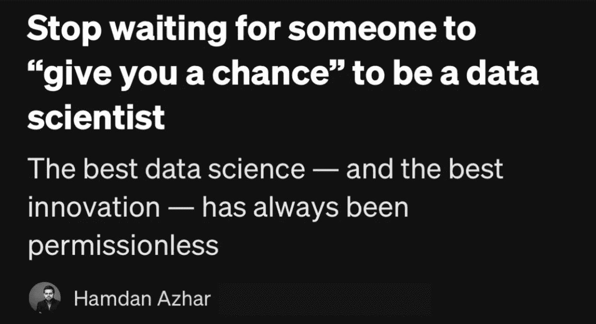
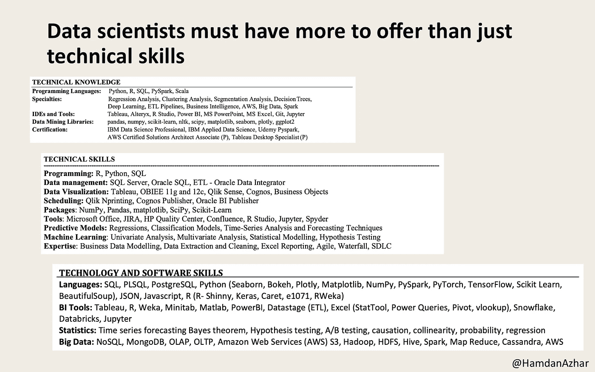

# 不要再等着别人“给你机会”成为数据科学家

> 原文：<https://towardsdatascience.com/the-best-data-science-is-permissionless-8c0d139a7369?source=collection_archive---------77----------------------->

## 最好的数据科学——以及最好的创新——总是没有许可的

多年来，科技界普遍接受的一句口头禅是，最好的创新是“未经许可的”——也就是说，它是由在现有权力结构边缘工作的局外人推动的，更有可能发生在人们的车库里，而不是大学或大公司里。

区块链社区大力支持无许可的概念，将其作为管理其核心技术以及这些技术旨在引入的社会类型的一种无所不包的精神特质。

作为一名花了近十年时间向 Nick Spanos 学习的数据科学家，Nick Spanos 在 2013 年创建了世界上第一个比特币实物交易所比特币中心 NYC，我最近突然想到**数据科学是真正无许可**的非凡领域之一——今天比以往任何时候都更是如此。

与火箭科学或土木工程不同，它们不仅是高度监管的领域，而且需要现实世界中的大量资源，今天的数据科学只需要一台笔记本电脑，学习核心统计学和计算机科学原理，并学习 R 或 Python 等统计编程语言——所有这些都可以很容易地自学。

另一个因素是获取数据，数据就在我们周围，可以很容易地从公开的数据集或从互联网上获得难以想象的数量。(当然，真正秘密的成分是找到一个好问题来问，但这只能通过不懈的重复和试错来学习。)

## 未经许可的创新是一种心态🧠

几周前，当我在一次采访中听到一个年轻人温暖人心的故事时，我想到了所有这些。(像这样的故事过去很常见，但我不确定发生了什么。)他在分析部门工作了几年，然后在一次裁员中丢掉了工作。他非常努力地找工作，但是找不到——所以他开了自己的公司！

他花了 9 个月的时间，开发了一个实际的产品，获得了客户，甚至建立了一个完整的离岸工程团队来维护和迭代这个产品。(从字面上看，他的简历上没有任何东西会让人相信他有这些品质——在他证明自己一直都有这些品质之前。)

他还犹豫地问我，一家大公司将如何看待他的创业之旅，我向他保证，大公司是最需要创业思维的公司，因为他们意识到，没有创新，他们就无法跟上来自四面八方的快速激烈的竞争。

## 数据科学家必须提供比技术技能更多的东西📦

我只希望我经常看到的那些有抱负的数据科学家能够意识到这一点——重要的不仅仅是你拥有什么技能和能力，而是你如何利用它们才是最重要的。

例如，任何看过数据科学简历的人都会非常熟悉我所说的“盒子”——几乎每个简历都有一个。

这个盒子是一份令人印象深刻和令人生畏的“除了厨房水槽以外的一切”的工具和技术清单，申请人声称拥有这些工具和技术(见下面实际简历中的一些例子)。

问题是，这些简历中只有极小一部分提供了有意义的例子，说明申请人在现实世界中使用这些工具建立了什么。

你所知道的工具和技术只是达到目的的手段——如果没有目的，它们就是对你未达到的潜力的控诉。(具有讽刺意味的是，大型科技公司的绝大多数日常数据科学和分析只需要三种工具:SQL、R 和 Python。)

这就是为什么我在数据科学面试中问的最重要的问题是“你用数据构建了什么？”或者“你如何利用你的数据技能来产生影响？”

每个有抱负的数据科学家都应该确保他们有可靠的经验和答案来回答这个问题，越有趣越好——没有其他方法可以从每年成千上万试图进入[“21 世纪最性感的工作”的毕业生中脱颖而出](https://hbr.org/2012/10/data-scientist-the-sexiest-job-of-the-21st-century)

## 数据无处不在，🗄️

我们生活在一个数据无处不在、广泛传播且几乎完全免费的世界。我们实际上生活在一个充斥着数据的世界。不仅如此，分析这些数据所必需的工具可以广泛获得，并且是免费的。(现在不再是上世纪 90 年代，那时你需要昂贵的 SAS、SPSS 或 Minitab 订阅——R 或 Python 完全免费，比这三者加起来有用得多。)

这意味着，在某种意义上，数据科学和数据分析的准入门槛从未如此之低，但具有讽刺意味的是，由于这个原因，它现在实际上相当高！

我的意思是，就业市场充斥着只具备技术技能、渴望爬上硅谷阶梯、但没有动力、直觉、天生的好奇心或跳出框框思考的能力的候选人。

他们中的许多人仍然在抱怨“每个职位都需要 X 年的经验”，而没有意识到，与火箭科学或桥梁建设不同，没有任何东西可以阻止他们获得数据科学或数据分析方面的经验。数据无处不在，工具全部免费——你还需要什么？！

就像我采访的一个年轻人，他认为没有理由等待某个公司“给他管理产品的机会”，相反，他开发了自己的产品，现在他正在与这些公司在平等的竞争环境中互动，不是作为一个恳求证明自己的机会的人，而是作为一个在现实世界中也创造了一些有价值的东西的同行技术专家。

## 要“以创造为导向”，而不仅仅是“以事业为导向”👗👔

我认为，我们现在比以前更少看到这种情况的一个原因是因为技术，特别是数据科学，已经成为一个稳定的领域，自然吸引了更多以职业为导向的人，而不是以创造为导向的人。

这些以职业为导向的人只能想象在线条内着色，并且只有当他们被允许着色时才着色。即使他们所拥有的技能能够回答无限多的问题，他们仍然专注于最无聊的问题，缺乏哪怕是最微弱的创造性尝试。对他们来说，他们的技能只是达到目的的一种手段，而这个目的是一份朝九晚五的工作，所以没有这份工作，他们怎么能想到用他们的技能为这个世界增加价值呢？

与此同时，对于那些在成为稳定职业之前首次进入这些领域的创业型自由思想者来说，职业甚至工作总是伴随着他们喜欢做的事情——创造、建设和使用技术来理解世界。

## 成为数据科学家的最佳方式是从事数据科学

我对新的和有抱负的数据科学家的建议是一样的，无论你是刚毕业的学生，还是正在初创公司工作，甚至是在大公司工作。

你不需要等待任何人“给你一个机会”来成为一名数据科学家。成为数据科学家的最佳(也是唯一)方式是从事数据科学。

它是通过在你内心深处寻找，找到你独特的技能和能力与你的激情和目标之间的交叉点，并弄清楚只有你才能对这个世界做出的独特贡献。(我在 2017 年 NYU 的 [TEDx 演讲](https://www.youtube.com/watch?v=SSZ6pRYcmIk)中提到了这一点。)

对于大多数人来说，这不是参加 Kaggle 比赛，并试图在别人的模型上提高 0.1%。相反，它是关于提出新奇的问题，将原始、杂乱的数据转化为精选的数据集，并在这些数据中找到对某人有价值的见解和模式——即使那只是另一个人。

数据科学家是探险家，所以让我们出去探索吧。

[*哈姆丹·阿兹哈尔*](http://hamdanazhar.com) *是一名数据科学、分析和研究领域的领导者，在复杂数据集中发现有意义的见解以及利用故事来推动业务、产品和社会影响方面拥有超过 10 年的经验。PRISMOJI 的创始人，他曾是区块链技术公司的董事，在此之前，他是脸书、GraphScience 和罗恩保罗 2012 年总统竞选的数据科学家。*