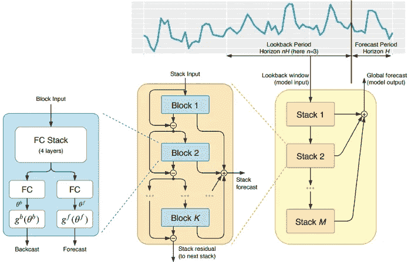
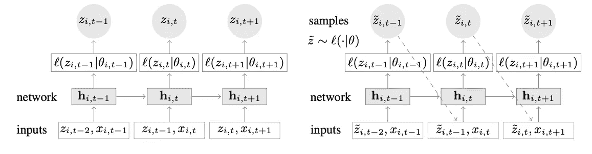
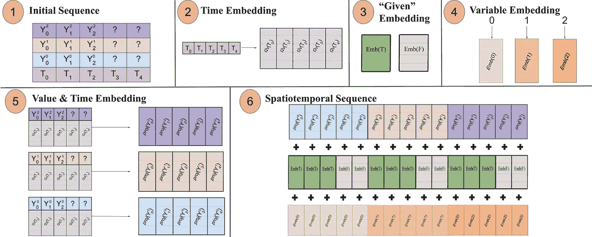
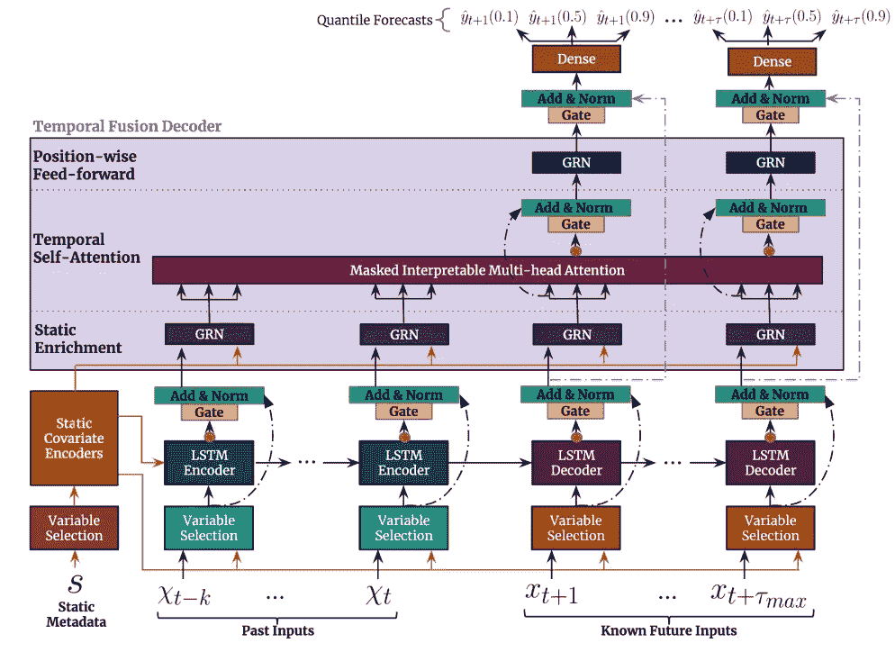
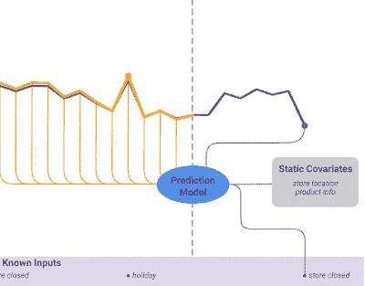

# 时间序列预测的最佳深度学习模型

> 原文：<https://towardsdatascience.com/the-best-deep-learning-models-for-time-series-forecasting-690767bc63f0?source=collection_archive---------0----------------------->

## 关于时间序列和深度学习你需要知道的一切

萨米·威廉姆斯在 [Unsplash](https://unsplash.com?utm_source=medium&utm_medium=referral) 上的照片

> ***一定要*** [***订阅此处***](https://medium.com/@nikoskafritsas/membership) ***千万不要错过另一篇关于数据科学话题、项目、指南等的文章！***

# **准备工作**

时间序列预测的前景在两年间发生了巨大的变化。

第四届和第五届 **Makridakis M 级比赛**(分别称为 **M4** 和 **M5** 比赛)于 2018 年和 2020 年举行。对于那些没有意识到的人来说，这些 M 竞争本质上是时间序列生态系统的现状，提供了指导预测理论和实践的经验和客观证据。

2018 年 M4 竞赛的结果表明，传统的统计方法在很大程度上优于纯粹的“最大似然”方法。这是出乎意料的，因为深度学习已经在计算机视觉和 NLP 等其他领域留下了不可磨灭的印记。然而，在两年后的 **M5 竞赛** [1]中，凭借一个更具创造性的数据集，名列前茅的提交仅采用了“ML”方法。更准确地说，所有 50 个表现最好的方法都是基于 ML 的。这场比赛见证了全能的 ***LightGBM*** (用于时间序列预测)的崛起，以及**亚马逊的*****DeepAR***【2】和***N-BEATS***【3】的登场。2020 年发布的 *N-BEATS* 型号，比 M4 竞赛的获胜者高出 3%！

最近的[**呼吸机压力预测**](https://www.kaggle.com/c/ventilator-pressure-prediction) Kaggle 比赛展示了使用深度学习方法应对真实案例时间序列挑战的重要性。具体来说，比赛的目标是在给定控制输入的时间序列的情况下，预测机械肺内压力的时间序列。每个训练实例本质上是一个时间序列，因此任务是一个多时间序列问题。获胜的团队提交了一个[多层深度架构](https://www.kaggle.com/shujun717/1-solution-lstm-cnn-transformer-1-fold)，其中包括一个 LSTM 网络和一个变压器块。

在过去的几年中，许多著名的架构已经出版，如*多地平线分位数递归预测器(MQRNN)和深空状态模型(DSSM)。*所有这些模型都利用深度学习为时间序列预测领域贡献了许多新奇的东西。除了赢得 Kaggle 比赛，还有其他因素在起作用，例如:

*   **多功能性:**将模型用于不同任务的能力。
*   **MLOps** :在生产中使用模型的能力。
*   **可解释性和可解释性:**黑盒模型不再那么流行了。

本文讨论了 4 种专门用于时间序列预测的新型深度学习架构。具体来说，这些是:

1.  **N 拍**(元素)
2.  DeepAR (亚马逊)
3.  **时空原**【4】
4.  **时间融合变压器或 TFT** (谷歌)【5】

前两种更经得起考验，已经在许多部署中使用过。*时空器*和 *TFT* 也是例外的型号，提出了很多新奇的东西。他们能够利用时间序列范围之外的新动态。

# n 拍

这种模式直接来自(不幸的)短命的[elemental](https://www.elementai.com/)，一家由 **Yoshua Bengio** 共同创立的公司。顶层架构及其主要组件如**图 1:** 所示

**图 1:**N-BEATS 架构([来源](https://arxiv.org/pdf/1905.10437.pdf))

从本质上来说， *N-BEATS* 是一个纯粹的深度学习架构，它基于集成前馈网络的深度堆栈，这些网络也通过互连*反向预测*和*预测*链接来堆叠。

> 每个后续块仅模拟由于从先前块重建*反向预测*而产生的残余误差，然后基于该误差更新*预测*。在拟合 ARIMA 模型时，这一过程模仿了 Box-Jenkins 方法。

这是该模型的主要优势:

**表现力强，易于使用:**模型简单易懂，具有模块化结构(块和栈)。此外，它被设计为需要最少的时间序列特征工程和没有输入缩放。

**多时间序列:**该模型能够对许多时间序列进行归纳。换句话说，可以使用分布略有不同的不同时间序列作为输入。在 *N-BEATS* 实现中，这是通过*元学习实现的。*具体来说*，*元学习过程由两个过程组成:内部学习过程和外部学习过程。内部学习过程发生在块内部，并帮助模型捕捉局部时间特征。另一方面，外部学习过程发生在堆栈内部，帮助模型学习所有时间序列的全局特征。

**双重残差叠加:**残差连接和叠加的想法非常棒，几乎在每一种深度神经网络中都有使用，比如 deep *Convnets* 和 *Transformers* 。同样的原理也应用于 N 拍的实现中，但是做了一些额外的修改:每个块有两个剩余分支，一个通过回顾窗口(称为 *backcast* )运行，另一个通过预测窗口(称为 *forecast* )。

每个后续块仅模拟由于从先前块重建*反向预测*而产生的残余误差，然后基于该误差更新*预测*。这有助于模型更好地逼近有用的反向预测信号，同时，最终的*堆栈预测*预测被建模为所有部分预测的分层总和。有趣的是，在拟合 **ARIMA** 模型时，这个过程模仿了 **Box-Jenkins 方法**。

**可解释性:**该模型有两种变体，*通用*和*可解释性*。在*通用*变体中，每个块的全连接层中的最终权重由网络任意学习。在*可解释的*变体中，每个块的最后一层被移除。然后，*反向预测*和*预测*分支乘以模拟**趋势**(单调函数)和**季节性**(周期性循环函数)的特定矩阵。

**注:**原 *N 拍*实现只对单变量时间序列有效。

# 迪帕尔

一种结合深度学习和自回归特性的新型时间序列模型。 *DeepAR* 的俯视图显示在**图 2** 中:

**图 2:** DeepAR 模型架构([来源](https://arxiv.org/pdf/1704.04110.pdf))

这是该模型的主要优势:

**多个时间序列:** *DeepAR* 对多个时间序列非常有效:通过使用分布略有不同的多个时间序列来构建全局模型。此外，该属性在许多现实世界场景中也有应用。例如，一家电力公司可能希望为他们的每个客户推出电力预测服务。几乎可以肯定的是，每个客户都有不同的消费模式(这意味着不同的分布)。

**丰富的输入集:**除了历史数据， *DeepAR* 还允许使用已知的未来时间序列(自回归模型的一个特征)和序列的额外静态属性。在前面提到的电力需求预测场景中，一个额外的时间变量可以是`month`(一个整数，取值范围为 1-12)。显然，假设每个客户都与一个测量功耗的传感器相关联，那么额外的静态变量将是类似于`sensor_id`或`customer_id`的东西。

**自动缩放:**如果您熟悉使用 MLPs 和 RNNs 等神经网络架构的时间序列预测，一个关键的预处理步骤是使用标准化技术缩放时间序列。在 *DeepAR* 中，不需要手动操作，因为引擎下的模型用缩放因子`v_i`缩放每个时间序列`i`的自回归输入`z`，缩放因子就是该时间序列的平均值。具体来说，本文基准中使用的比例因子公式如下:

然而，在实践中，如果目标时间序列的幅度相差很大，那么在预处理过程中应用我们自己的缩放可能会有所帮助。例如，在能源需求预测场景中，数据集可以包含中压电力客户(例如，消耗兆瓦级电力的小型工厂)和低压客户(例如，消耗千瓦级电力的家庭)。

**概率预测:** *DeepAR* 进行概率预测，而不是直接输出未来值。这是以蒙特卡罗样本的形式完成的。同样，通过使用**分位数损失函数**，这些预测用于计算分位数预测。对于那些不熟悉这种损失类型的人来说，分位数损失不仅用于计算估计值，还用于计算该值周围的预测区间。

# 时空形成器

在单变量时间序列的上下文中，时间依赖性是最重要的。然而，在一个多时间序列的场景中，事情并不那么简单。例如，假设我们有一个天气预报任务，我们想要预测五个城市的温度。同样，让我们假设这些城市属于同一个国家。鉴于我们目前所看到的，我们可以使用 DeepAR 将每个城市建模为一个外部静态协变量。

> 换句话说，该模型将考虑时间和空间关系。这是时空形成者的核心思想。

我们还可以更进一步，使用一个模型来利用这些城市/位置之间的空间关系，以便了解额外的有用依赖关系。换句话说，该模型将考虑时间和空间关系。这是*时空器的核心思想。*

**钻研时空序列**

顾名思义，这个模型使用了基于变压器的结构。在基于 transformer 的模型的时间序列预测中，产生时间感知嵌入的一种流行技术是通过***time 2 vec***【6】**嵌入层传递输入(提醒一下，对于 NLP 任务，使用位置编码向量而不是产生上下文感知嵌入的 *Time2vec* )。虽然这种技术对于单变量时间序列非常有效，但是对于多变量时间输入没有任何意义。在语言建模中，一个句子的每个单词都用一个嵌入来表示，一个单词本质上是一个**概念**，一个词汇的一部分。**

**在多变量时间序列环境中，在给定的时间步长`t`，输入具有`x_1,t`、`x_2,t`、`x_m,t`的形式，其中`x_i,t`是特征`i`的数值，而`m`是特征/序列的总数。如果我们将输入通过一个 *Time2Vec* 层，就会产生一个时间嵌入向量。在这种情况下，这种嵌入真正代表了什么？答案是，它将把整个输入集表示为一个实体(令牌)。因此，模型将仅学习时间步长之间的时间动态，但是将错过特征/变量之间的空间关系。**

***时空形成器*通过将输入展平成一个单一的大向量，称为**时空序列，解决了这个问题。**如果输入由`N`个变量组成，组织成`T`个时间步长，则生成的时空序列将具有(`N` x `T`)个标记。这在**图** 3 中显示得更清楚:**

****

****图 3:** 导致时空序列的一系列变换:论文陈述:“(1)包含时间信息的多元输入格式。解码器输入缺少("？”)值设置为零，在这里将进行预测。(2)时间序列通过 [Time2Vec](https://arxiv.org/abs/1907.05321) 层，以生成表示周期性输入模式的频率嵌入。(3)二进制嵌入表示该值是作为上下文给出的还是需要预测的。(4)每个时间序列的整数索引被映射到具有查找表嵌入的“空间”表示。(5)用前馈层投影每个时间序列的 Time2Vec 嵌入和变量值。(6) Value &时间、变量和给定嵌入被相加和布局，使得 MSA 以更长的输入序列为代价处理跨时间和变量空间的关系。”[来源](https://arxiv.org/pdf/2109.12218.pdf)**

**换句话说，最终的序列已经编码了统一的嵌入，由时间、空间和上下文信息组成。**

**然而，这种方法的一个缺点是序列可能变得太长，导致资源的二次增加。这是因为根据注意机制，每个令牌/实体都是相互检查的。作者利用了一种更有效的架构，适用于更大的序列，称为[表演者注意机制](https://ai.googleblog.com/2020/10/rethinking-attention-with-performers.html)。更多技术细节，查看 [Github](https://github.com/QData/spacetimeformer) 上的项目回购。**

# **时间融合变压器**

*****时态融合 Transformer*** (TFT)是 Google 发布的基于 Transformer 的时间序列预测模型。如果你想对这个令人敬畏的模型进行更全面的分析，请查看这个[帖子](/temporal-fusion-transformer-googles-model-for-interpretable-time-series-forecasting-5aa17beb621)。**

> ***TFT* 比以前的型号更通用。例如， *DeepAR* 不能处理目前已知的时间相关特性。**

****

****图 4:**TFT 顶层架构及其主要组件([来源](https://arxiv.org/pdf/1912.09363.pdf))**

***TFT* 的顶层架构如图**图 4 所示。这些是该型号的主要优势:****

*   ****多个时间序列**:和前面提到的模型一样， *TFT* 支持在多个、异构的时间序列上建立模型。**
*   ****丰富的特征数量** : *TFT* 支持 3 种类型的特征:I)输入未来已知的时变数据 ii)目前已知的时变数据 iii)分类/静态变量，也称为**时不变**特征。因此， *TFT* 比以前的型号更加通用。例如， *DeepAR* 不能处理目前已知的时间相关特性。在前面提到的电力需求预测场景中，我们希望使用湿度水平作为依赖于时间的特征，这是到目前为止才知道的。**这在 *TFT* 中可行，但在 *DeepAR 中不可行。*****

**如何使用所有这些功能的示例如图 5 所示:**

****

****图 5** :外部静态变量对预测的影响([来源](https://blogger.googleusercontent.com/img/a/AVvXsEjn-GEpuwiBa4Od21FBnTST8-z2jAgyw3rq68AYtrBosFLBgIaFnLC2NV8hwlj8xiuU4Bc5ZKNHrDPldINdgkr8Y2TmekuDp0oLKq9yYCrpooZfwpwKT9MVwQ11LGsXqBckgiPAxoWRdvxAE3RoRn4BHxVhJmnQkZT-w6DdYXEA3yP0xUSdbYDITSgOjQ=s1138))**

*   **可解释性 : *TFT* 非常强调可解释性。具体来说，通过利用**变量选择**组件(如图**图 4** 所示)，模型可以成功地测量每个特性的影响。因此，模型学习特征的重要性。
    另一方面， *TFT* 提出了一种新颖的**可解释的多头注意力机制:**来自这一层的注意力权重可以揭示回望期间哪些时间步长是最重要的。因此，这些权重的可视化可以揭示整个数据集中最显著的季节模式。**
*   ****预测区间:**与 *DeepAR* ， *TFT* 使用分位数回归，输出预测区间和预测值。**

# **结束语**

**考虑到以上所有因素，深度学习无疑彻底改变了时间序列预测的前景。除了无与伦比的性能之外，上述所有模型都有一个共同点:它们充分利用多种多元时态数据，同时它们以和谐的方式使用外源信息，将预测性能提高到前所未有的水平。**

****感谢您的阅读！****

# **参考**

**[1] Makridakis 等人，[M5 精确度竞赛:结果、发现和结论](https://www.researchgate.net/publication/344487258_The_M5_Accuracy_competition_Results_findings_and_conclusions)，(2020)**

**[2] D. Salinas 等人， [DeepAR:用自回归递归网络进行概率预测](https://arxiv.org/pdf/1704.04110.pdf)，国际预测杂志(2019)。**

**[3] Boris N .等人， [N-BEATS:可解释时间序列预测的神经基础扩展分析](https://arxiv.org/pdf/1905.10437.pdf)，ICLR (2020)**

**[4]杰克·格雷斯比等人，[用于动态时空预测的长程变压器](https://arxiv.org/pdf/2109.12218.pdf)，**

**[5] Bryan Lim 等人，[用于可解释的多时间范围时间序列预测的时间融合变换器](https://arxiv.org/pdf/1912.09363.pdf)，国际预测杂志，2020 年 9 月**

**[6]赛义德·迈赫兰·卡泽米等人[， *Time2Vec:学习时间的一种矢量表示*](https://arxiv.org/pdf/1907.05321.pdf) *，*2019 年 7 月**