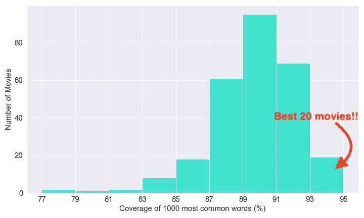

# 根据数据科学，学习外语的最佳迪士尼电影

> 原文：<https://towardsdatascience.com/the-best-disney-movies-to-learn-a-foreign-language-according-to-data-science-45e7fd084a78?source=collection_archive---------8----------------------->

## 使用数据找出 300 部迪士尼加版电影中哪一部最适合学习外语。


由 [Pixabay](https://pixabay.com/es/photos/mickey-spotlight-piano-en-miniatura-1185754/) 上的 [Skitterphoto](https://pixabay.com/es/users/skitterphoto-324082/) 拍摄

第一次使用 Disney Plus 时，我非常激动——这不是因为目录中有皮克斯和漫威的电影，而是因为它们的内容有多种语言版本。

英语、西班牙语、葡萄牙语、意大利语，应有尽有！那一刻，我想:“这是一个学习外语的好机会。”最重要的是，我们已经熟悉了一些迪士尼电影，这是一个优势，因为它增加了我们理解任何语言对话的机会。

但是 Disney+的目录中有大约 662 部电影。这有太多的内容可供选择，所以我做了一个数据分析，以找到最好的迪士尼电影，这将有助于我们轻松地学习外语，就像我之前为[网飞秀](/the-best-netflix-movies-series-to-learn-english-according-to-data-science-dec7b047b164)和 [3000 部顶级电影](/the-best-movies-to-learn-english-according-to-data-science-2dccb4b3ee23)所做的那样。

所分析的电影来自迪士尼+目录，因此来自皮克斯、漫威、星球大战和国家地理的内容也包括在内。

```
**Table of Contents** [1\. How Am I Choosing The Best Movies?](#a4d6)
[2\. The Best Disney Movies to Learn a Foreign Language](#c250)
 - [Ranking of The 300 Disney Movies](#8b5b)
 - [The Best Movies for Beginner, Intermediate and Advanced Level](#5e09)
 - [The Movie Genres With Simple and Hard Vocabulary](#80b5)
[3\. Methodology](#386b)
 - [Data Collection](#b3bc)
 - [Tokenization](#8f06)
 - [Lemmatization](#6759)
 - [Data Cleaning](#b32f)
[4\. Final Note](#f278)
```

# 我如何选择最好的电影？

为了选择最好的迪士尼电影来学习外语，我使用了包含每部电影中对话的抄本。

感谢为语言学领域的语料库分析创建的单词表，我可以找到每部电影中使用的词汇的难度。然后用一些 Python 代码，我根据下面的直方图创建了一个最佳电影的排名。

不要让图片吓到你！重要的是要知道，电影的词汇越简单，就越容易理解。例如，前 20 部电影是最好的，因为你只需要知道一种语言中最常用的前 1000 个单词，就可以识别至少 93%的单词。



作者图片

语言中的词汇遵循帕累托法则。一种语言中最常用的 1000 个单词占日常对话的 80%以上。**学习常用词是学习外语的好机会！**

现在你知道了我对“最佳电影”的定义，让我们来看看哪些是学习外语的最佳迪士尼电影。

*有关分析的更多详细信息，请参见以下章节。*

# 学习外语的最佳迪士尼电影

以下是 10 部最好的迪士尼电影，其中你只需要 1000 个单词就能认出至少 93%的对话。在之前显示的第一个栏中有 19 部电影，但我列出了 10 部最受欢迎的电影，以在轻松词汇和受欢迎程度之间找到平衡:


由 [inspiredbythemuse](https://pixabay.com/es/users/inspiredbythemuse-3854162/) 在 [Pixabay](https://pixabay.com/es/vectors/congelados-elsa-fr%C3%ADo-disney-2267127/) 上拍摄的照片——冰雪奇缘 2 进入前 10，而冰雪奇缘进入前 30。

1.  最后一首歌(2010)
2.  皮特的龙(2016)
3.  父母陷阱(1961 年和 1998 年)
4.  摇滚夏令营 2:最后的堵塞(2010)
5.  歌舞青春 3 (2008)
6.  一个青少年戏剧女王的自白(2004)
7.  熊哥哥(2003)
8.  时间的皱纹(2018)
9.  真实的故事(1999)
10.  冰雪奇缘 2 (2019)

但这还不是全部！分析超越了前 10 部电影。只看 10 部电影不会让你的外语变得流利，对吗？

## 300 部迪士尼电影的排名

如果你想找到前 20 名、50 名、100 名或者挑战自己，看排名#300 的电影(词汇量最难的那部)，你只需要在下表中搜索它们。

例如，我小时候喜欢看电影*海底总动员*，所以要知道这是看西班牙语还是葡萄牙语的好选择，我只需在框中键入*海底总动员*并找到它的排名。

所以，我发现*海底总动员*在排名中排在#123。还不错；然而，*寻找多莉*排在第 70 位，所以我想我会先看那部来提高我的语言能力。

## 初级、中级和高级水平的最佳电影

如果你想要更多的定制，那么你可以在下面的情节中找到适合你语言水平的完美电影。与前面的分析只关注最常见的 1000 字(初级水平)不同，在这种情况下，我们还分析了每部电影中最常见的 2000 和 3000 字所涵盖的对话的百分比。

如果 300 部电影对你来说还不够，看看我的其他文章，找到最好的[网飞电影和节目](/the-best-netflix-movies-series-to-learn-english-according-to-data-science-dec7b047b164)以及学习外语的最好的 [3000 部最受欢迎的电影](/the-best-movies-to-learn-english-according-to-data-science-2dccb4b3ee23)。

如果你想知道更多关于如何通过看电视节目和电影来学习语言，我写了一个完整的指南来解释我是如何通过看电视来学习 3 种语言的。

<https://medium.com/better-humans/a-data-driven-approach-to-learning-any-language-by-watching-tv-and-movies-95525ddff52e>  

## 词汇简单难懂的电影类型

在得到这个分析的结果后，我不禁注意到许多纪录片排在最后 10 名，所以我花了一些时间观看其中一些以获得更好的理解。

在迪士尼 Plus 上观看了*非洲狮*、*海豚礁*和*活沙漠*之后，我意识到这些词汇对大多数语言学习者来说可能是有挑战性的。除非你对动植物感兴趣，否则如果你的目标是流利地掌握一门外语，我不建议你看这类内容。

另一方面，前 10 名包含不同流派的电影，所以我无法得出一个关于学习外语的最佳电影流派的结论。我试着在这方面做一个不一样的分析。

# 方法学

我用 Python 做了所有这些分析。详情在我的 [Github](https://github.com/ifrankandrade/disney-movies.git) 上。这些是我遵循的步骤:

## 数据收集

在这个分析中，我使用了两个数据集——迪士尼 Plus 目录和电影脚本。我在谷歌上搜索电影脚本，尽可能多地找到迪士尼电影脚本。最后我只找到了 400 份左右，但是经过清洗过程，只剩下 300 份抄本可供分析。

然后我下载了可在 [Kaggle](https://www.kaggle.com/unanimad/disney-plus-shows) 上获得的迪士尼 Plus 目录数据集。它包括截至 2020 年迪士尼 Plus 上可用的游戏。我用目录将抄本与迪士尼 Plus 上的标题进行了匹配。

## **标记化**

为了分析抄本中的词汇，我标记了所有由人物说出的单词。Python 中有许多用于标记化的工具，但我使用了 CountVectorizer，因为它将收集的副本转换成标记计数的数据帧，从而简化了分析。在我分析了 [3000 部电影](/the-best-movies-to-learn-english-according-to-data-science-2dccb4b3ee23)的文章中，我解释了更多关于 CountVectorizer 如何工作的内容。

```
from sklearn.feature_extraction.text import CountVectorizer
from sklearn.feature_extraction import text 
import scipy.sparse
cv = CountVectorizer()
cv_matrix = cv.fit_transform(df_analysis['transcripts'])
df_dtm = pd.DataFrame.sparse.from_spmatrix(cv_matrix, index=df_analysis.index,columns=cv.get_feature_names())
df_dtm = df_dtm.T
```

## **词汇化**

在标记化之后，我必须找到每个标记的基本形式。您可以通过使用词汇化技术来实现这一点，您可以在 NLTK 库中找到这些技术。然而，我使用了词族表来做类似的工作，并根据每个单词的出现频率给你一个难度等级。截至 2020 年，共有 29 个单词家族列表，你可以在这里找到其中一些。这些列表在语言学和作为第二语言的英语学习的研究论文中被评估。

## **数据清理**

我去掉了电影里听不到的词，比如场景描述和说话人的名字。我使用的清理方法远非完美，但它帮助我标准化了抄本中的对话。我使用的 clean_transcripts 文件可以在我的 Github 上找到。

我还排除了对话中有超过 4.5%的单词与单词家族列表不匹配的抄本(它们可能是离群值或损坏的数据)。我通常使用 3.5%，但在这种情况下，我看了一些在 3.5%和 4.5%之间的电影，我没有在抄本中发现任何奇怪的东西。

```
from cleaning import clean_transcripts
round1 = lambda x: clean_transcripts(x)
df_analysis['transcripts'] = df_analysis['transcripts'].apply(round1)
...
df_statistics = df_statistics[df_statistics[100]<4.5]
```

# 最后一个音符

在这个分析中，我们找到了学习语言的最佳迪士尼电影。从简单的电影开始是一个很好的主意，这样我们在理解对话时就不会有太大的困难，在观看场景时也更有趣。然而，也要考虑看你喜欢的电影，所以挑你喜欢的排名靠前的电影。

用于分析的文字记录是英文的。我测试了一些语言的结果，比如西班牙语和葡萄牙语，它们运行良好。我想说这对于浪漫语言很有效，但是我不能保证对于其他语言也有同样的效果。

请让我知道，如果电影仍然有一个简单的词汇，通过观看你正在学习的语言。