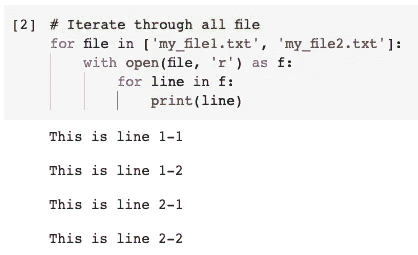
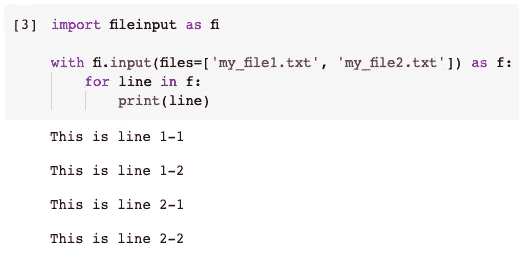
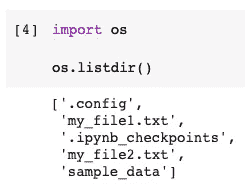
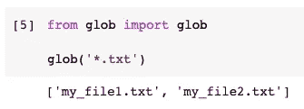
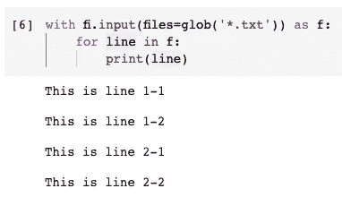
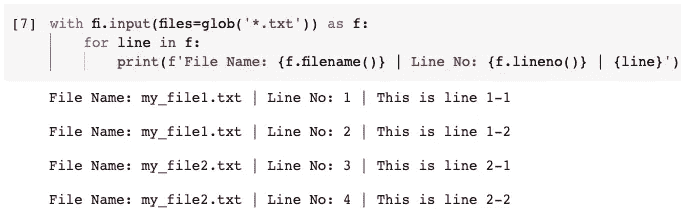
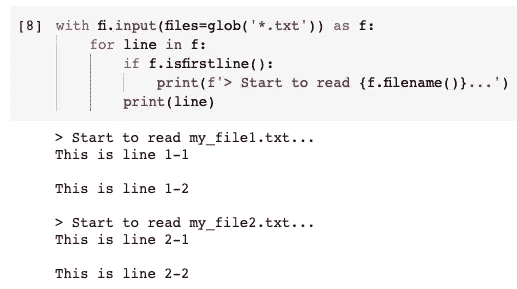
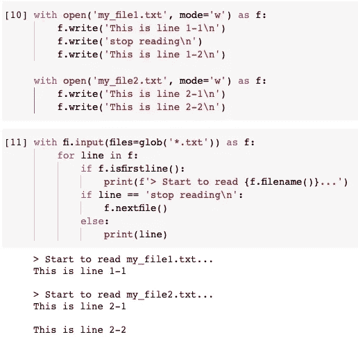
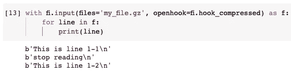

# 用 Python 读取文本文件的最佳实践

> 原文：<https://towardsdatascience.com/the-best-practice-of-reading-text-files-in-python-509b1d4f5a4?source=collection_archive---------8----------------------->


照片由 [Kollinger](https://pixabay.com/users/kollinger-15617407/) 在 [Pixabay](https://pixabay.com/photos/book-library-literature-bookshelf-5211309/) 上拍摄

## 将多个文件合并成一个具有更丰富元数据的流

与大多数其他编程语言相比，用 Python 读取文本文件相对容易。通常，我们只是在读或写模式下使用“open()”函数，然后开始逐行循环文本文件。

这已经是最佳实践了，没有比这更简单的方法了。但是，当我们想从多个文件中读取内容时，肯定有更好的方法。也就是使用 Python 内置的“文件输入”模块。它结合了来自多个文件的内容，允许我们在一个 for 循环中处理所有的内容，还有很多其他的好处。

在本文中，我将用例子演示这个模块。

# 0.没有 FileInput 模块


由 [DGlodowska](https://pixabay.com/users/dglodowska-388133/) 在 [Pixabay](https://pixabay.com/photos/book-rose-book-mark-open-book-419589/) 上拍摄的照片

让我们看看使用`open()`函数读取多个文本文件的“普通”方式。但是在此之前，我们需要创建两个示例文件用于演示。

```
with open('my_file1.txt', mode='w') as f:
    f.write('This is line 1-1\n')
    f.write('This is line 1-2\n')with open('my_file2.txt', mode='w') as f:
    f.write('This is line 2-1\n')
    f.write('This is line 2-2\n')
```

在上面的代码中，我们用模式`w`打开一个文件，这意味着“写”。然后，我们在文件中写两行。请注意，我们需要添加新的生产线`\n`。否则，这两个句子将被写成一行。

之后，我们应该在当前工作目录中有两个文本文件。


现在，假设我们想读取这两个文本文件并逐行打印内容。当然，我们仍然可以使用`open()`函数来实现。

```
# Iterate through all file
for file in ['my_file1.txt', 'my_file2.txt']:
    with open(file, 'r') as f:
        for line in f:
            print(line)
```



这里我们必须使用两个嵌套的 for 循环。外部循环用于文件，而内部循环用于每个文件中的行。

# 1.使用文件输入模块


由[在](https://pixabay.com/users/free-photos-242387/) [Pixabay](https://pixabay.com/photos/typewriter-book-notes-paper-801921/) 上的自由照片拍摄的照片

嗯，没有什么能阻止我们使用`open()`功能。然而，`fileinput`模块只是为我们提供了一种将多个文本文件读入单个流的更简洁的方式。

首先，我们需要导入模块。这是一个 Python 内置模块，所以我们不需要下载任何东西。

```
import fileinput as fi
```

然后，我们可以用它来读取这两个文件。

```
with fi.input(files=['my_file1.txt', 'my_file2.txt']) as f:
    for line in f:
        print(line)
```



因为`fileinput`模块是为读取多个文件而设计的，我们不再需要循环文件名。相反，`input()`函数将一个可迭代的集合类型(比如列表)作为参数。此外，最棒的是两个文件中的所有行都可以在一个 for 循环中访问。

# 2.将 FileInput 模块与 Glob 一起使用


由 [jarmoluk](https://pixabay.com/users/jarmoluk-143740/) 在 [Pixabay](https://pixabay.com/photos/old-books-book-old-library-436498/) 上拍摄的照片

有时，拥有这样一个包含所有手动键入的名称的文件名列表可能并不实际。从一个目录中读取所有文件是很常见的。此外，我们可能只对某些类型的文件感兴趣。

在这种情况下，我们可以将另一个 Python 内置模块`glob`模块与`fileinput`模块一起使用。

在此之前我们可以做一个简单的实验。`os`模块可以帮助我们列出当前工作目录下的所有文件。



可以看到，除了这两个文本文件之外，还有很多文件。因此，我们希望过滤文件名，因为我们只想读取文本文件。我们可以如下使用`glob`模块。

```
from glob import globglob('*.txt')
```



现在，我们可以将`glob()`函数作为参数放入`fileinput.input()`函数中。所以，只有这两个文本文件将被读取。

```
with fi.input(files=glob('*.txt')) as f:
    for line in f:
        print(line)
```



# 3.获取文件的元数据


由 [StockSnap](https://pixabay.com/users/stocksnap-894430/) 在 [Pixabay](https://pixabay.com/photos/reading-book-girl-woman-sunshine-925589/) 上拍摄的照片

您可能会问，当我们从实际上由多个文件组合而成的流中进行读取时，我们如何知道“行”到底来自哪个文件？

事实上，使用嵌套循环的`open()`函数似乎很容易获得这样的信息，因为我们可以从外部循环访问当前文件名。然而，这实际上在`fileinput`模块中要容易得多。

```
with fi.input(files=glob('*.txt')) as f:
    for line in f:
        print(f'File Name: {f.filename()} | Line No: {f.lineno()} | {line}')
```



看，在上面的代码中，我们使用`filename()`来访问`line`来自的当前文件，使用`lineno()`来访问我们正在获取的行的当前索引。

# 4.当光标到达新文件时


由 [DariuszSankowski](https://pixabay.com/users/dariuszsankowski-1441456/) 在 [Pixabay](https://pixabay.com/photos/glasses-book-education-eyeglasses-1052010/) 上拍摄的照片

除此之外，我们还可以利用来自`fileinput`模块的更多函数。例如，当我们到达一个新文件时，如果我们想做些什么呢？

函数`isfirstline()`帮助我们决定是否从一个新文件中读取第一行。

```
with fi.input(files=glob('*.txt')) as f:
    for line in f:
        if f.isfirstline():
            print(f'> Start to read {f.filename()}...')
        print(line)
```



这对于日志记录非常有用。所以，我们可以用当前的进度来表示。

# 5.跳到下一个文件


由[在](https://pixabay.com/users/free-photos-242387/) [Pixabay](https://pixabay.com/photos/running-man-glass-floor-reflection-1149787/) 上的自由照片拍摄的照片

我们也可以很容易地停止读取当前文件，跳到下一个文件。功能`nextfile()`允许我们这样做。

在我们演示这个特性之前，请让我重写两个示例文件。

```
with open('my_file1.txt', mode='w') as f:
    f.write('This is line 1-1\n')
    f.write('stop reading\n')
    f.write('This is line 1-2\n')with open('my_file2.txt', mode='w') as f:
    f.write('This is line 2-1\n')
    f.write('This is line 2-2\n')
```

与原始文件唯一不同的是，我在第一个文本文件中添加了一行文本`stop reading`。假设我们希望`fileinput`模块在看到这样的内容时停止读取第一个文件并跳转到第二个文件。

```
with fi.input(files=glob('*.txt')) as f:
    for line in f:
        if f.isfirstline():
            print(f'> Start to read {f.filename()}...')
        if line == 'stop reading\n':
            f.nextfile()
        else:
            print(line)
```



在上面的代码中，添加了另一个 if 条件。当行文本为`stop reading`时，它将跳转到下一个文件。因此，我们可以看到行“1–2”没有被读取和输出。

# 6.读取压缩文件而不解压缩


由 [Pixabay](https://pixabay.com/photos/technology-tablet-digital-tablet-792180/) 上的 [kaboompics](https://pixabay.com/users/kaboompics-1013994/) 拍摄的照片

有时我们可能需要阅读压缩文件。通常，我们必须先解压缩它们，然后才能读取内容。然而，使用`fileinput`模块，我们可能不需要在读取压缩文件之前提取其中的内容。

让我们用 Gzip 创建一个压缩文本文件。该文件稍后将用于演示目的。

```
import gzip
import shutilwith open('my_file1.txt', 'rb') as f_in:
    with gzip.open('my_file.gz', 'wb') as f_out:
        shutil.copyfileobj(f_in, f_out)
```

在上面的代码中，我们使用 gzip 将文件`my_file1.txt`添加到一个压缩文件中。现在，让我们看看`fileinput`如何在没有额外解压缩步骤的情况下读取它。

```
with fi.input(files='my_file.gz', openhook=fi.hook_compressed) as f:
    for line in f:
        print(line)
```



通过使用参数`openhook`和标志`fi.hook_compressed`，gzip 文件将被动态解压缩。

`fileinput`模块目前支持 gzip 和 bzip2。不幸的是，不是另一种格式。

# 摘要


由[免费拍摄的照片](https://pixabay.com/users/free-photos-242387/)在 [Pixabay](https://pixabay.com/photos/office-meeting-business-partners-336368/) 上

在本文中，我介绍了 Python 内置模块`fileinput`以及如何使用它读取多个文本文件。当然，它永远不会取代`open()`函数，但就将多个文件读入单个流而言，我相信它是最佳实践。

[](https://medium.com/@qiuyujx/membership) [## 通过我的推荐链接加入 Medium 克里斯托弗·陶

### 作为一个媒体会员，你的会员费的一部分会给你阅读的作家，你可以完全接触到每一个故事…

medium.com](https://medium.com/@qiuyujx/membership) 

如果你觉得我的文章有帮助，请考虑加入 Medium 会员来支持我和数以千计的其他作者！(点击上面的链接)