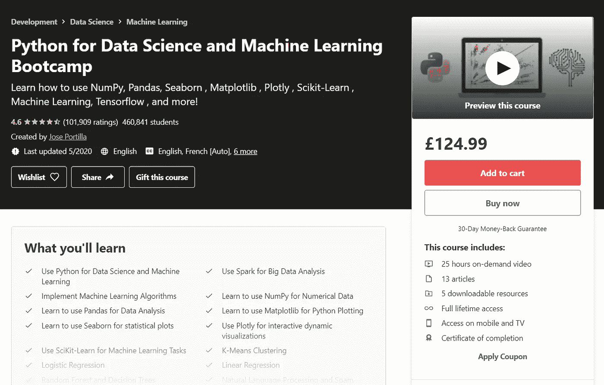
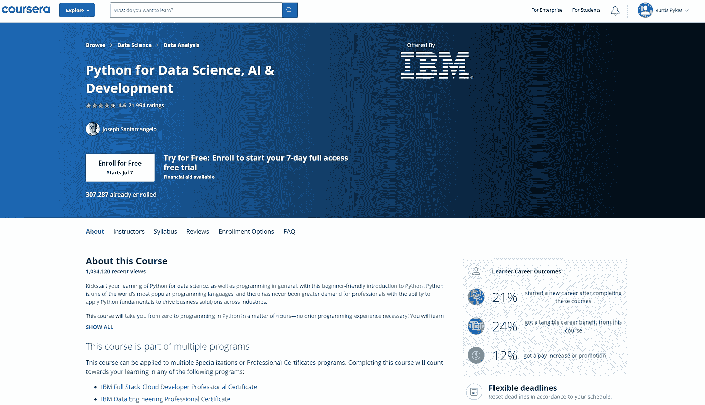
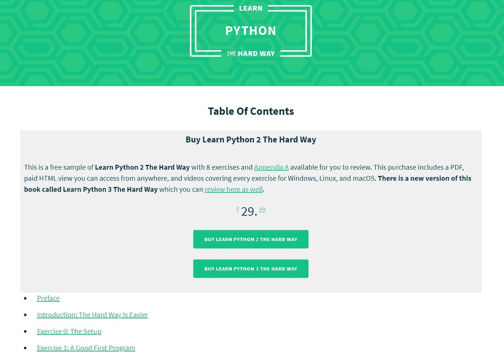
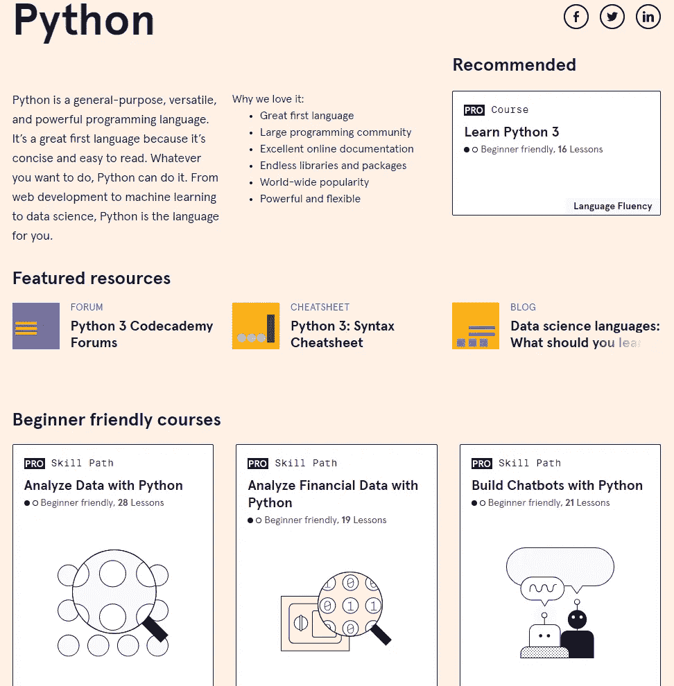
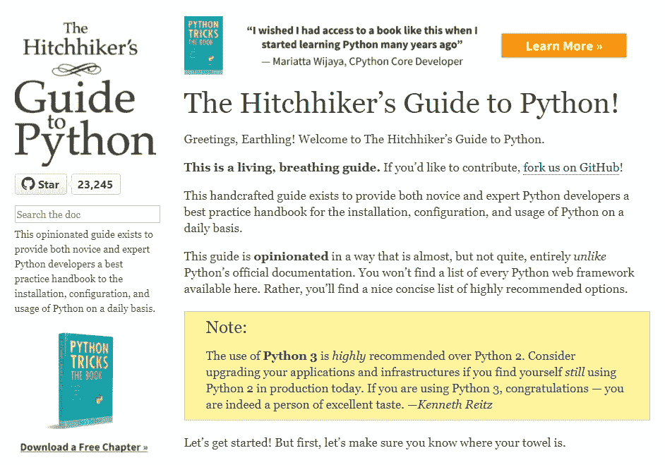
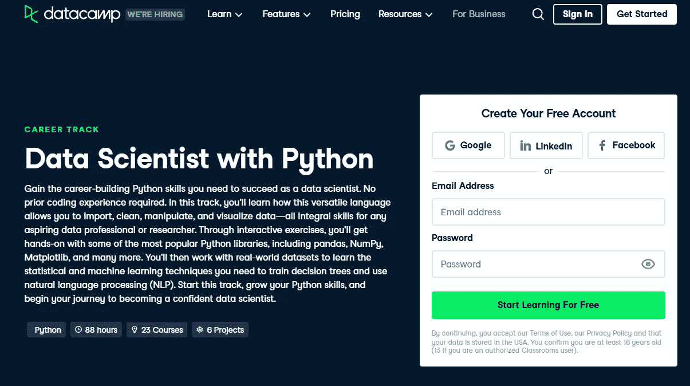

# 学习机器学习和数据科学 Python 的最佳资源

> 原文：<https://towardsdatascience.com/the-best-resources-to-learn-python-for-machine-learning-data-science-9fccd66fe943?source=collection_archive---------4----------------------->

## 挑一个，永不回头

在 [Unsplash](https://unsplash.com?utm_source=medium&utm_medium=referral) 上由 [Hitesh Choudhary](https://unsplash.com/@hiteshchoudhary?utm_source=medium&utm_medium=referral) 拍摄的照片

决定你想从事机器学习的职业意味着你必须决定你想用哪种语言来实现。机器学习从业者中流行的语言是 Python 和 R，尽管也有人们决定使用 C、C++、JavaScript 等的情况。

我选择 Python 是因为当我决定开始做机器学习时，它是我遇到的第一种语言。它最终为我工作，但如果你比我一开始更勤奋一点，这里有一些你可能想学习 Python 进行机器学习的原因。

*   许多人使用 Python 进行机器学习，所以网上有很多支持
*   Python 是一种高级编程语言，具有广泛的机器学习框架。
*   进入的门槛很低，因为 Python 读起来像英语

这个列表并不详尽，但是关于 Python 为什么是一种好语言的完整总结超出了本文的范围。

## 资源

虽然有很多资源可以用来开发 Python 的机器学习技能，但我不认为你有必要把它们都拿来。事不宜迟，下面列出了机器学习学习 Python 的资源(**免责声明** : *资源不分时间顺序。*):

## [Udemy](https://www.udemy.com/course/python-for-data-science-and-machine-learning-bootcamp/)

[Python For Data Science and Machine Learning boot camp(Udemy)](https://www.udemy.com/course/python-for-data-science-and-machine-learning-bootcamp/)

用于数据科学和机器学习的 Python 是一门很受欢迎的 Python 课程。在撰写本文时，它目前拥有近 50 万注册学生和 101，909 个评级。

在接触 Jupyter 笔记本电脑之前，它首先会引导您完成环境设置。课程的第一部分是 Python 速成班，涵盖了数据结构和 Python 语法。一旦解决了这个问题，你就可以学习数据科学和机器学习中常用的库，比如 NumPy、Pandas、Matplotlib 等等。

该课程由何塞·波尔蒂利亚教授，他是 Pierian Data Inc .的数据科学主管。他还为通用电气、Cigna、纽约时报、瑞士瑞信银行、麦肯锡等顶级公司的员工提供面对面的数据科学和 Python 编程培训课程。

在本课程中，您将涵盖一些关键概念，例如:

*   交叉验证和偏差-方差权衡
*   推荐系统
*   自然语言处理
*   各种机器学习算法

## [Coursera](https://www.coursera.org/learn/python-for-applied-data-science-ai)

Coursera 由广受欢迎的机器学习老师吴恩达于 2012 年 4 月创立。该平台与世界上一些最好的大学和顶级组织合作，提供许多科目的在线课程、认证和学位。IBM 的 Python for Data Science，AI & Development(由 IBM 的数据科学家 [Joseph Santarcangelo 博士](https://www.coursera.org/learn/python-for-applied-data-science-ai#instructors)教授)是组织在平台上提供知识的一个例子。

该课程旨在向初学者介绍 Python——带领学生在几个小时内从零知识到 Python 实用编程。因此，不需要事先有编程经验，因为本课程将涵盖许多基础知识(即 Python 基础、数据结构、数据分析等)。

在本课程中，您将涵盖一些关键概念，例如:

*   Python 基础
*   Python 数据结构和基础
*   在 Python 中使用数据
*   API 和数据收集

## [艰难地学习 Python](https://learnpythonthehardway.org/book/)

尽管《艰难地学习 Python》并不局限于机器学习和数据科学，但它可能是开始用 Python 编程的最流行的方式，这也是它上榜的原因。

该课程旨在带领学生从零到英雄，因此不要求事先有编程经验。除了这个课程，还有 Zed Shaw 写的《艰难地学习 Python》一书。

本教程中包含的一些关键主题如下:

*   变量和名称
*   读取和写入文件
*   Python 类和对象
*   功能
*   文件处理

## [代码学院](https://www.codecademy.com/catalog/language/python)

Codeacademy 是我开始接触 Python 的原因。我学的确切课程是数据科学的 Python & SQL，但我已经能够追溯它的下落，因为它已经过去 3 年多了。尽管如此，还是有很多同时学习 Python、数据科学和机器学习的好课程。

平台有各种技能路径课程。在我看来，它们类似于 Coursera 专业化，但要短得多。技能路线课程从初学者友好型、完全新手型到高级型都有。进一步补充一下，这个平台上还有许多其他有用的功能，比如 Codeacademy 博客。

您可能需要考虑的一些课程包括:

*   学习 Python 3
*   用 Python 可视化数据
*   如何用 Python 清理数据
*   用 Python 构建机器学习模型

## [Python 的搭便车指南](https://docs.python-guide.org/)

Python 的搭便车指南对我的 Python 开发产生了重大影响。它不是专门针对机器学习和数据科学的，但它挤满了来自作者 Kenneth Reitz 和 Tanya Schulusser 使用该语言的固执己见的经验的宝贵见解。

该指南作为一种结构化的方式，为 Python 开发新手和专家提供了最佳实践参考手册，涵盖了安装、代码风格、文档、测试等主题。

## [数据营](https://www.datacamp.com/tracks/data-scientist-with-python)

DataCamp 成立于 2013 年。这个想法是帮助人们在线建立他们的数据技能，在撰写本文时，80%的财富 1000 强公司使用 DataCamp 来提升他们团队的技能。

《Python 数据科学家》课程将带你从一个对 Python 一无所知的人成长为一名自信的数据科学家。它由各种交互式练习组成，允许学生实际操作 Python 中用于数据科学的一些事实上的库(即 NumPy、Matplotlib、Pandas 等)。

此外，学生采用自上而下的方法学习静态和机器学习技术。主题包括:

*   Python 简介
*   调查网飞电影
*   用熊猫操纵数据。

## 最后的想法

选择一门课程并坚持下去。尽量不要陷入一门又一门课程的陷阱。这个想法是参加一个课程，并尽快开始实施你所学到的东西。此外，尽量避免卷入 Python 与 R 的争论——这完全是浪费时间，而且不会让你的职业生涯更进一步。

感谢阅读！

如果你喜欢这篇文章，请通过订阅我的**免费** [每周简讯](https://mailchi.mp/ef1f7700a873/sign-up)与我联系。不要错过我写的关于人工智能、数据科学和自由职业的帖子。

## 相关文章

<https://medium.com/analytics-vidhya/courses-to-learn-data-science-in-2021-a52e64344e5c>  </do-i-need-a-degree-to-land-a-job-in-data-science-3e50b9a1a5e9>  </tips-to-land-a-data-science-role-in-2021-465dbb409f19> 