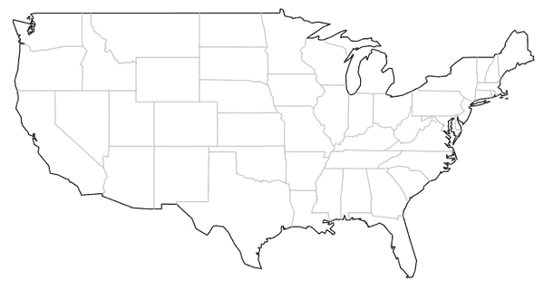

# 在 R 中使用的最佳空间分析包

> 原文：<https://towardsdatascience.com/the-best-spatial-analysis-packages-to-use-in-r-35855069f8b2?source=collection_archive---------25----------------------->

## 空间数据分析变得越来越重要。拥有最好的工具。

随着数据变得更加地理化，越来越有必要使空间数据更易于访问和处理。虽然有很多工具可以让您在处理空间数据时更加轻松(例如，QGIS 和 ArcMap ),但使用 R 进行空间分析也同样简单。如果您不熟悉其中的一些包，并且不想通读所有文档来学习这个包，或者更乏味的是，编写数百行自己的代码来做一些相对简单的事情，那就更是如此。在本文中，我将讨论几个软件包，它们使得常见的空间统计方法在 r。

*地图*

【https://cran.r-project.org/web/packages/maps/maps.pdf 号

地图包的核心不是空间统计包。它实际上是一个基本的软件包，可以用很少的代码非常快速地制作简单的地图。这对于快速查看 R 中的矢量化数据非常有用。虽然不一定是查看 shapefiles(用于存储几何信息的数据文件)的最佳方式，但如果你有一个带有纬度和经度坐标的数据集，将它们绘制到由 *maps* 包制作的地图上是相对容易的。

只需一行简单的代码，您就可以生成几乎任何地区的地图。我将以美国为例:

地图(“美国”)

当您输入该内容时，您应该会看到如下所示的地图:

使用 maps 包的 R 中的基本地图 mad 的图像。图片来源:作者。

诚然，这是一个简单的地图，但你仍然可以利用它来获得一个良好的数据视图。如果您想更进一步，您可以更改投影，高亮显示国家的特定区域(查看“地图”功能的区域参数)或添加点、线和多边形，以便轻松显示您的数据。

*spatstat*

[https://cran . r-project . org/web/packages/spat stat/spat stat . pdf](https://cran.r-project.org/web/packages/spatstat/spatstat.pdf)

Spatstat 是一个非常好的用于二维空间数据集的软件包。它本质上是一个完整的空间统计包，可用于点模式分析。点模式分析是研究空间中的空间点。使用 spatstat 包，您不仅可以围绕空间点及其属性构建模型，还可以构建模型来预测未来的点移动。该软件包使用多种方法构建模型，包括最大似然法和逻辑回归法。

当您尝试分析空间点模式移动和分布时，应该使用 spatstat 包。一个模型可以用一个简单的 glm()函数来拟合一个数据集，并且输出可以很容易地绘制到从地图部分提到的函数打印的地图上！Spatstat 还允许您进行内核密度估计(KDE)。使用 KDE 为您的空间数据构建概率分布是非常棒的。例如，如果您正在检查一个州内站点的降雨量，您可以使用核密度估计值来确定该州的哪个部分的哪个站点最有可能产生最多的降雨(并查看哪个站点的降雨量最少)。虽然检查定量值可能更容易，但可视化有助于了解数量最低的站点周围的站点的行为表现。

*spdep*

https://cran.r-project.org/web/packages/spdep/spdep.pdf

如果您的数据中可能有不明显的关系，但是您需要发现它们，那么您应该使用 spdep 包。Spdep 允许您为数据集构建空间权重，并对数据集进行自相关。空间权重允许您确定数据集中的哪些部分(位置)对数据本身的整体模式影响最大。如果您正在调查与数据集另一部分中的值(事件)相关的问题，那么空间权重非常有用。自相关对于测量两个变量之间的空间关系非常有用。比方说，你正试图确定一个城市的中等收入和犯罪之间的关系。您可以使用空间自相关来研究不同的财富分位数如何影响城市不同区域的犯罪率。

下次想要探索空间数据集中的关系时，请使用 spdep 包。

*地图工具*

[https://cran . r-project . org/web/packages/maptools/maptools . pdf](https://cran.r-project.org/web/packages/maptools/maptools.pdf)

Maptools 允许您读入和操作空间数据。虽然这里讨论的大多数其他包都侧重于绘图和分析，但 maptools 用于读取、写入和导出空间数据。在 KML、SHP 和 ASCII 中，如果您的数据有坐标，您可以使用 maptools 来浏览其中的信息。有许多函数可以使导入空间数据变得尽可能简单。

*GISTools*

[https://cran . r-project . org/web/packages/GIS tools/GIS tools . pdf](https://cran.r-project.org/web/packages/GISTools/GISTools.pdf)

对于空间数据来说，这可能是 R 中最通用和必需的 GIS 包之一。GISTools 不仅允许您制作地图，还允许您分析数据。您可以使用非常简单的函数进行内核密度估计:

kde.points()

结果是输出可以很容易地在地图上可视化。

GISTools 的其余功能允许您制作非常详细的制图产品。Choropleth 地图(根据颜色显示数值)、levelplots、多边形掩膜，几乎所有你能想到的制图功能都能在 GISTools 中找到。

以下是 GISTools 输出的一些示例。

虽然上述包在处理空间数据方面具有不可思议的通用性，但请记住，在 r 中进行分析时，没有一种包是万能的。例如，上述包可能难以处理大型栅格数据集，并且使用上述包制作的地图看起来相对简单，没有太多的细节。如果您想了解如何深入使用这些包或如何用 R 和 Python 制作漂亮的地图，请关注我或 Found Spatial 以了解更多信息！