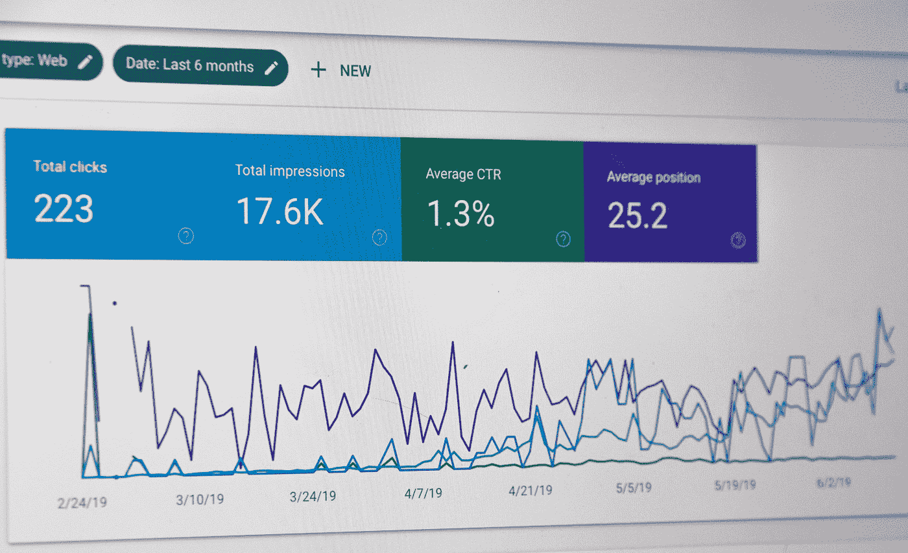

# 高效管理非结构化数据的最佳方式

> 原文：<https://towardsdatascience.com/the-best-way-to-manage-unstructured-data-efficiently-b54dda2c24?source=collection_archive---------5----------------------->

## 使用对象存储和数据湖处理非结构化数据

杰西·奥里科在 [Unsplash](https://unsplash.com?utm_source=medium&utm_medium=referral) 上的照片

> 多达 90%的数据被定义为非结构化数据。非结构化数据每年以[55–65](https://www.forbes.com/sites/bernardmarr/2019/10/16/what-is-unstructured-data-and-why-is-it-so-important-to-businesses-an-easy-explanation-for-anyone/?sh=2668ad2f15f6)的速度增长。

来源:[福布斯](https://www.forbes.com/sites/bernardmarr/2019/10/16/what-is-unstructured-data-and-why-is-it-so-important-to-businesses-an-easy-explanation-for-anyone/?sh=2668ad2f15f6)

如果您已经在数据科学领域工作了一段时间，您一定已经注意到了非结构化数据的庞大数量。如果您不熟悉“非结构化数据”这个术语，请考虑数据样本结构不一致的数据，例如音频文件、文本文件、视频甚至图像。

当前和预期的大量非结构化数据意味着数据科学必须完全能够分析和处理各种数据，以获得有意义的见解。我们最常阅读使用表格数据或其他带有标签的数据的论文，但在现实世界中，有标记和有标签的数据很少存在。如果你想从事数据科学，你需要擅长分析非结构化数据。

在处理非结构化数据领域，一项越来越受欢迎且证明非常有用的最新技术是 [**对象存储**](http://lakefs.io/object-storage) **。**它几乎解决了传统结构化存储系统面临的所有问题，包括:

1.  可扩展性问题
2.  相对于消耗的存储，数据检索速度保持不变
3.  标准文件层次结构的局限性

**什么是对象存储？它比传统的存储方式更好吗？**

很大一部分现代科技公司正在转向数据驱动的方法，这意味着他们希望收集大量关于用户的数据，以便他们可以根据这些数据而不是直觉和猜测来做出决策。这带来了一些挑战，第一个主要挑战是**可伸缩性**。

像文件存储或块存储这样的标准存储系统在可扩展性方面非常糟糕。这样想，如果你有大量的文件，你可能有很多嵌套的文件。当用户发送请求以查看其中一个文件时，文件系统必须继续挖掘文件层次结构以找到该文件。文件越多，这个过程就变得越慢，直到它开始提供一个糟糕的用户体验，特别是对于像我这样标准的没有耐心的用户。

对象存储通过提供一个**平面结构**解决了这个问题，这意味着所有的数据都存储在同一层。您可能想知道这如何改进对象存储中的导航(特别是因为这是文件系统的主要优点)。

典型的对象存储器为每个数据样本存储 3 样东西:

1.  数据本身
2.  元数据:这可以是数据的大小、修改/上传的日期等。关于对象存储的最好的事情之一是，这是一个可定制的字段，这意味着您可以为每个数据样本存储任何您想要的元数据。对于标准文件系统来说，情况并非如此。
3.  每个数据样本的唯一标识符。

现在，现代对象存储的快速导航和检索速度的诀窍在于利用唯一标识符。我认为这就像是[索引](https://stackoverflow.com/questions/1108/how-does-database-indexing-work)的魔力。

## 可扩展性和检索

对象存储不依赖于文件结构，它只将数据样本**存储为具有上述 3 个组件的节点**，并使用 ID 来查找数据样本。这意味着数据样本不需要位于同一设备/物理位置。这是一个很大的优势，因为数据样本可以被分割到多个不同的位置。

例如，如果你有一组数据点，你知道只有某个国家才能访问，你可以把它们存储在离这个国家最近的服务器上。这在没有额外成本的情况下提供了更快的检索时间。

此外，因为元数据是可定制的，所以您可以轻松地使用它来设置有关数据的政策和法规，以避免**法律冲突**，因为有些国家可能不允许存在某些类型的数据，或者例如，如果您有受出口管制的产品。

## 随着大量数据和大型对象存储的出现，数据科学的潜力也随之而来

斯蒂芬·菲利普斯-Hostreviews.co.uk 在 [Unsplash](https://unsplash.com?utm_source=medium&utm_medium=referral) 上拍摄的照片

在构建高质量的 ML 生产管道时，许多人似乎都非常关注数据分析技术和机器学习模型。然而，很多人忽略了存储是管道中最重要的一个方面。这是因为管道有 3 个主要部分:收集数据、存储数据和消费数据。有效的存储方法不仅能提高存储能力，还有助于提高收集和消费效率。对象存储提供了使用可定制元数据进行搜索的便利性，有助于实现这两个目标。

您不仅要选择正确的存储技术，还要选择正确的提供商。AWS 被认为是最好的对象存储提供商之一，这主要是因为它的基础设施提供了流畅的服务和易于扩展。

此外，为了有效使用数据，必须有一个软件层运行在该存储之上，用于数据聚合和收集。这也是一个重要的选择，需要在另一篇专门讨论该主题的文章中讨论。本质上，您希望有一个数据版本控制(DVC)来对数据进行版本化和管理。因为虽然一般来说机器学习模型的数据越多越好，但有时模型会出现异常数据点。这意味着该模型在这一特定异常或一组异常上表现不佳，如果发生这种情况，我们希望能够快速回到上一个最佳版本并调查这些异常。这些异常往往是改进机器学习模型的关键。

除了版本控制软件，你可能还需要一个数据聚合框架，比如数据湖管理平台或者 [Apache Spark](https://databricks.com/spark/about) 。这些层提供了重要的基本数据操作，从而大大减轻了机器学习模型对数据的消耗。我曾经认为添加这些层并不那么有效，但是从长远来看，将这些操作组分离到不同的层中可以为您节省大量调试模型的时间。这实际上是大多数高质量 web 应用程序/软件项目的主干。

**最后的想法和收获**

最后，您希望存储系统、版本控制平台和聚合平台之间的集成尽可能无缝。这是最重要的事情之一——并不是所有的选项都能很容易地相互兼容，不流畅的配置通常是一场噩梦。

我认为，每个数据科学家都应该开始考虑利用有效分析和存储非结构化数据的能力，因为它构成了当前数据的大部分，并且在未来会构成更多。