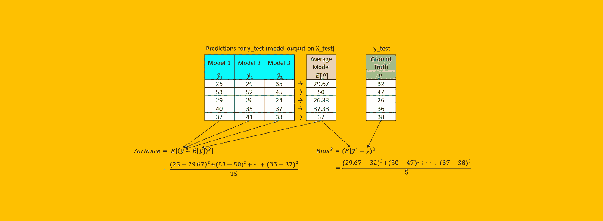
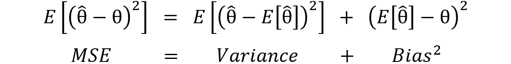
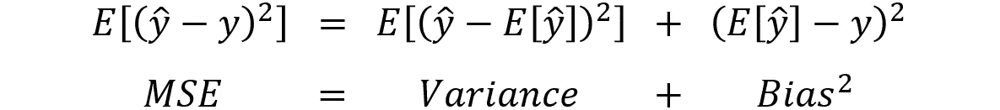
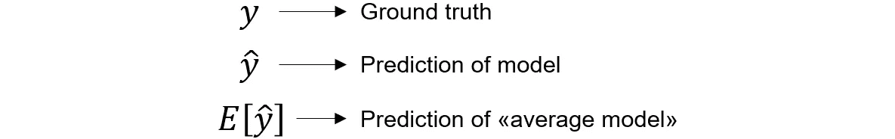
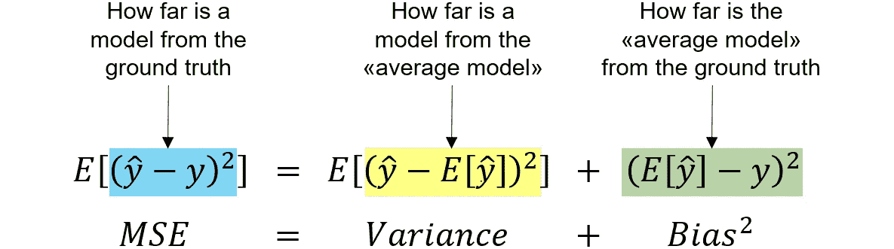
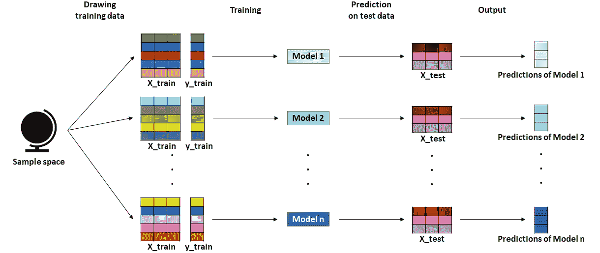
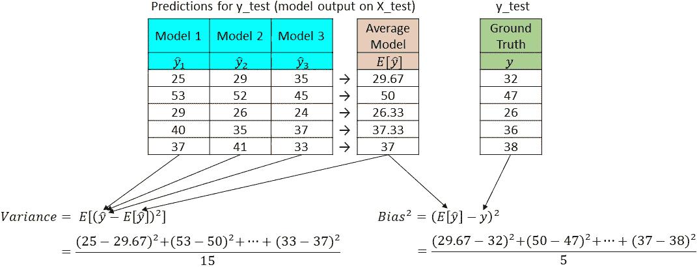
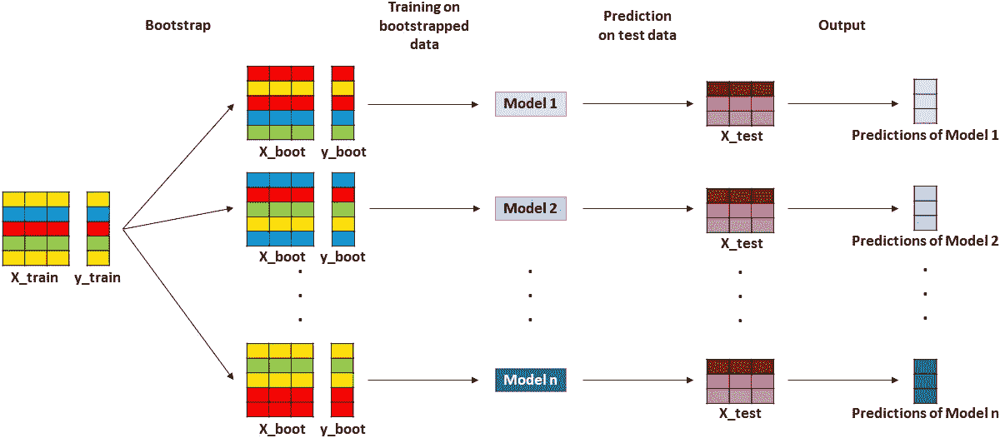
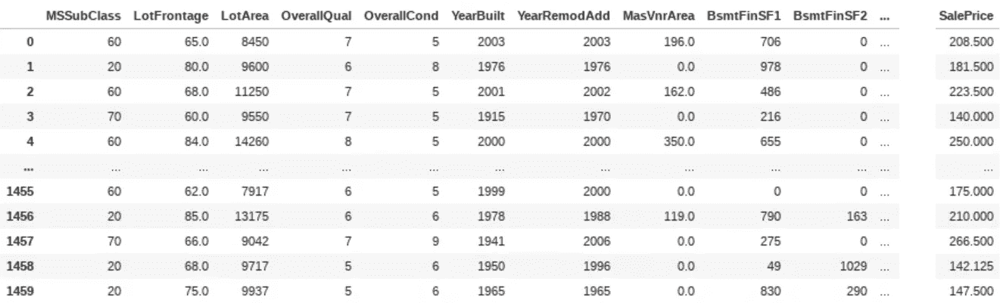
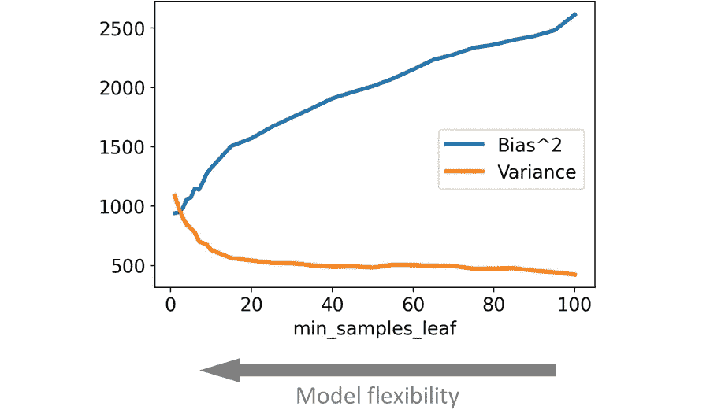

# “偏差-方差权衡”实用解释(Python 语言)

> 原文：<https://towardsdatascience.com/the-bias-variance-trade-off-explained-practically-in-python-48cf29d9e900?source=collection_archive---------11----------------------->

## [入门](https://towardsdatascience.com/tagged/getting-started)

## 如果你曾经对偏差-方差权衡感到困惑，那是因为你总是阅读理论解释。这比看起来简单——借助于几行 Python 代码。



[作者图]

“偏差-方差权衡”是数据科学面试中最常见的话题之一。尽管如此，许多候选人仍难以深入理解这个概念。我猜这是因为这个话题总是从完全理论的角度来解释。

然而，我相信理解一件事情的最好方法是自己去做——或者，更好的方法是，自己编写代码。

> 你不是真的懂，直到你不会编码！

在本文中，借助一些数据，我们将看到偏差-方差权衡在实践中意味着什么，以及如何在 Python 中计算它(从头开始和使用开箱即用的实现)。

# 偏差-方差公式:从理论到实践

偏差-方差分解的通常定义是:



偏差-方差分解(θ是包含模型参数的向量)。[作者图]

其中 MSE 代表均方误差，θ代表模型的参数(例如，在线性回归中，θ是包含所有回归系数的向量)。

**但是有一个问题:我们永远无法观测到θ** 的真实值。此外，在一些模型中，不可能明确地找到θ是什么。所以这个定义从实用的角度来看是相当没用的。

但是，我们在现实生活中观察到的是地面真实，是目标变量在一些测试数据上的实现(通常称为 *y* )。因此，从我们的角度来看，用 *y* 代替θ更有意义，并获得以下等式:



偏差-方差分解(y 是目标变量)。[作者图]

其中:



图例[作者图]

这个公式更方便，因为在现实生活中，我们实际上知道所有这些量。

此外，使用这个版本的公式，我们能够对 MSE、方差和偏差给出更非正式的解释:



偏差-方差分解。MSE、方差和偏差分别测量的非正式定义。[作者图]

这种分解经常被用来解释模型的结果是如何基于它的“灵活性”而变化的。

*   **灵活性低**。所有估计的模型都趋于相似，因此**方差很小**。另一方面,“平均模型”不够强大，无法接近地面真相，因此**偏差较大**。
*   **高灵活性**。每个模型在很大程度上依赖于它被训练的特定观察，所以模型彼此非常不同，因此**方差很大**。然而，从长远来看，灵活性可以让你考虑到所有的小细节。因此，平均所有模型允许我们获得非常精确的“平均模型”，因此**偏差很小**。

这是权衡的本质:如果复杂度太低或太高，由于偏差或方差，我们将分别具有高的均方误差。关键是如何获得恰到好处的模型灵活性，以便同时最小化偏差和方差。

# 但是我们所说的“平均模型”是什么意思呢？

此时，您可能想知道获得不同的模型(和一个“平均模型”)意味着什么。

假设您选择一个算法(例如 Scikit-learn 的`DecisionTreeRegressor`)并如下设置其超参数:

```
**from** sklearn.tree **import** DecisionTreeRegressoralgo = DecisionTreeRegressor(min_samples_leaf = 10)
```

此时，您可以根据训练算法的特定训练数据集获得无限可能的模型。

假设您可以绘制许多不同的训练数据集，并为每个数据集训练不同的模型。然后，你可以取每个模型预测的平均值:这就是我们所说的“平均模型”。

```
**import** pandas **as** pd**# initialize dataframe for storing predictions on test data**preds_test = pd.DataFrame(index = y_test.index) **# for each model: draw training dataset, fit model on training dataset and make predictions on test data****for** i **in range**(1, n_models + 1):
  X_train, y_train = draw_training_dataset()
  model = algo.fit(X_train, y_train)
  preds_test[f'Model {i}'] = model.predict(X_test) **# calculate "average model"'s predictions**mean_pred_test = preds_test.mean(axis = 1)
```

现在我们有了所有需要的量，我们终于可以计算均方误差、(平方)偏差和方差了。

```
**from** sklearn.metrics **import** mean_squared_errormse = preds_test.apply(**lambda** pred_test: mean_squared_error(y_test, pred_test)).mean()

bias_squared = mean_squared_error(y_test, mean_pred_test)

variance = preds_test.apply(**lambda** pred_test: mean_squared_error(mean_pred_test, pred_test)).mean()
```

这是我们刚刚遵循的流程的概念性草图:



获得 n 个不同模型的绘图过程。注 1:所有模型都用相同的算法和相同的超参数初始化。注 2:测试数据在不同的模型之间共享。[作者图]

让我们看看 3 个模型和 5 个测试观察的输出示例:



具有 5 个观察值和 3 个模型的测试集的偏差-方差计算示例。[作者图]

# 自举是你所需要的

但是有一个问题。

在上面的代码中，我们使用了一个虚构的函数`draw_training_dataset()`。然而，在现实生活中，我们实际上无法从无限的样本空间中提取训练数据集。事实上，我们通常只有一个训练数据集。怎么补？

诀窍是从我们的训练数据集中引导(即随机抽取替换)行。所以这个过程变成了:



从同一训练数据集中获得 n 个不同模型的引导程序。注 1:所有模型都用相同的算法和相同的超参数初始化。注 2:测试数据在不同的模型之间共享。[作者图]

现在我们准备把所有的东西包装在一起，编写一个 Python 函数来计算估计量的偏差和方差。我们所需要做的就是取上面的代码片段，用引导程序替换函数`draw_training_dataset()`。

这是一个解决方案:

```
**import** numpy **as** np
**import** pandas **as** pd
**from** sklearn.metrics **import** mean_squared_error**def** bias_variance_estimate(
  estimator, 
  X_train, 
  y_train, 
  X_test, 
  y_test, 
  bootstrap_rounds = 100
): **# initialize dataframe for storing predictions on test data** preds_test = pd.DataFrame(index = y_test.index) **# for each round: draw bootstrap indices, train model on bootstrap data and make predictions on test data** **for** r **in range**(bootstrap_rounds):
    boot = np.random.randint(len(y_train), size = len(y_train))
    preds_test[f'Model {r}'] = estimator.fit(X_train.iloc[boot, :], y_train.iloc[boot]).predict(X_test) **# calculate "average model"'s predictions** mean_pred_test = preds_test.mean(axis = 1) **# compute and return: mse, squared bias and variance** mse = preds_test.apply(**lambda** pred_test: mean_squared_error(y_test, pred_test)).mean()

  bias_squared = mean_squared_error(y_test, mean_pred_test)

  variance = preds_test.apply(**lambda** pred_test: mean_squared_error(mean_pred_test, pred_test)).mean()

  **return** mse, bias_squared, variance
```

# 在真实数据上

为了看到偏差-方差分解在起作用，让我们将它用于一些真实数据:来自 [Kaggle](https://www.kaggle.com/c/house-prices-advanced-regression-techniques/overview) 的房价数据集。数据集由 79 个预测值组成(如建筑类别、一般分区分类、与物业相连的街道的直线英尺数、以平方英尺为单位的地块大小等)，目标是预测最终销售价格(以千美元为单位)。



房价数据集。[作者图]

让我们用一个预测算法，例如 Scikit-learn 的`DecisionTreeRegressor`,看看偏差和方差如何根据模型的灵活性而变化。

但是模型的灵活性意味着什么呢？答案取决于具体的算法及其超参数。

在`DecisionTreeRegressor`的情况下，我们可以拿`min_samples_leaf`来举例。这个超参数决定了可以在决策树的任何末端叶子中结束的样本的最小数量。因此:

*   当`min_samples_leaf`为**高**时，意味着我们会有很少的顶生叶，每个顶生叶包含很多样本。因此，**模型并不灵活**，因为它被迫把许多不同的样本放在一起。
*   当`min_samples_leaf`为**低**时，表示树很深。**该模型非常灵活**，因为它允许对任意几个样本进行不同的预测。

所以这个想法是对`min_samples_leaf`的不同选择做一个偏差和方差的估计。

我们可以使用之前创建的函数。或者，我们可以使用库[**mlx tend**](http://rasbt.github.io/mlxtend/)**中的函数`bias_variance_decomp`([这里](http://rasbt.github.io/mlxtend/user_guide/evaluate/bias_variance_decomp/)你可以找到一个写得很漂亮的文档)。**

```
**import** pandas **as** pd
**from** mlxtend.evaluate **import** bias_variance_decompout = pd.DataFrame(columns = ['MSE', 'Bias^2', 'Variance'])**for** min_samples_leaf **in** list(range(1, 11)) + list(range(15, 105, 5)): model = DecisionTreeRegressor(min_samples_leaf = min_samples_leaf)

  mse, bias, variance = bias_variance_decomp(
    model, 
    X_train.to_numpy(), y_train.to_numpy(),
    X_test.to_numpy(), y_test.to_numpy(), 
    loss = 'mse'
  )

  out.loc[min_samples_leaf, 'Bias^2'] = bias
  out.loc[min_samples_leaf, 'Variance'] = variance
  out.loc[min_samples_leaf, 'MSE'] = mse
```

**这是结果:**

****

**min_samples_leaf 不同值的估计偏差和方差。[作者图]**

**这正是我们所预期的:当模型的灵活性增加时(即当`min_samples_leaf`减少时)，偏差趋于减少，但方差趋于增加。这是权衡的本质。在这两个极端之间找到正确的平衡是任何数据科学家的使命。**

**感谢您的阅读！我希望本演练有助于您深入理解偏差-方差权衡。**

**我感谢反馈和建设性的批评。如果你想谈论这篇文章或其他相关话题，可以发短信到[我的 Linkedin 联系人](https://www.linkedin.com/in/samuelemazzanti/)给我。**