# 偏差-方差权衡

> 原文：<https://towardsdatascience.com/the-bias-variance-tradeoff-84ca1343e766?source=collection_archive---------13----------------------->

## (几乎)没有统计数据的冒险

图片来自 [Pixabay](https://pixabay.com/?utm_source=link-attribution&utm_medium=referral&utm_campaign=image&utm_content=3102762) 的 [jplenio](https://pixabay.com/users/jplenio-7645255/?utm_source=link-attribution&utm_medium=referral&utm_campaign=image&utm_content=3102762)

无论您是一名实践数据科学家还是一名初学数据的学生，您可能都熟悉偏差-方差权衡。这是模型类型选择中的一个基本因素，就在准确性和可解释性的权衡之上。但是，在直觉层面上，你*有多了解*它呢？如果你和我一样，你可能已经记住了关键点:

*   一个模型的可约误差等于它的方差加上它的偏差
*   有一个最佳的偏差-方差权衡，使总误差最小
*   和飞镖靶有关吗？？

但是这种权衡在现实世界中有什么影响，了解这一点对您选择和训练模型有什么帮助？大多数解释都相当偏重于统计数据，尽管潜在的统计知识很重要，但我发现通过使用真实数据和可视化来获得实用的直觉要容易得多。记住这一点，这里有一个严肃的，简单的关于偏差-方差权衡如何影响模型选择的旅游，使用一个玩具问题。

# 问题是

你已经得到了一组 2D 的数据。假设是一组 *n* 唯一 *(x，y)* 点。你的任务是找到一个将输入点 *x* 映射到输出点 *y* 的函数。在理想情况下，您的数据集应该是这样的:

图 1:理想的数据集

但是我们并不是生活在一个完美的世界里。我们生活在数百万个可能不完美的世界中的一个，被预算削减和管理层破坏，他们不知道你需要数据来做数据科学。所以，这是你的数据集:

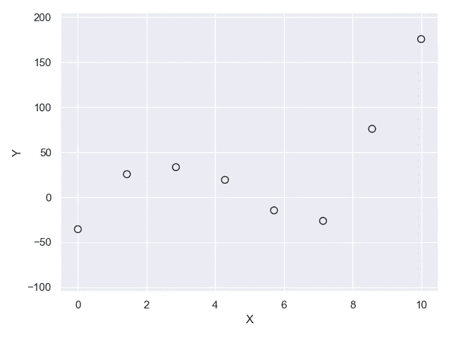

图 2:你的数据集。他们很友好，给了你 8 个数据点

与此同时，在一个平行宇宙中，DC 制作了成功的超级英雄电影，纳尔逊·曼德拉成为了南非总统，你的平行自我收到了这个数据集:

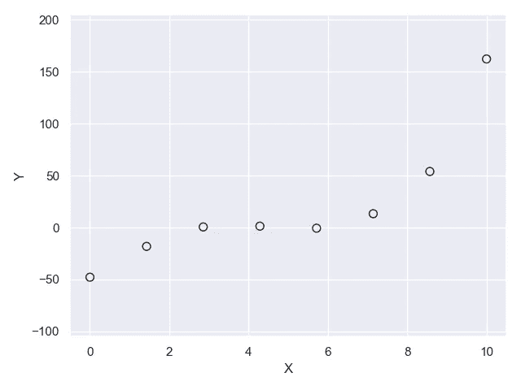

图 3:你的平行双胞胎的数据集。由于随机噪声，x 值相同，y 值不同。

两个数据集在 x 和 y 之间具有相同的关系:

> y = x - 12x + 39x - 28 + **ε**

其中，ε是正态分布的随机变量(随机噪声)，均值为 0，标准差为 15，与 x 无关。

尽管来自同一个分布，你的数据看起来和你的孪生兄弟有很大的不同。所以问题是，假设你和你的平行宇宙双胞胎使用完全相同的机器学习技术来拟合各自的数据集，你的拟合模型会有多大不同？让问题更接近现实，**训练数据中的随机噪声如何影响你的模型的误差，以及这将如何影响你对模型复杂性的选择？**

# 型号选择

作为第一步，您决定对数据进行多项式拟合。不确定是应该拟合斜线、二次曲线、三次曲线，还是只取所有点的平均 y 值，您决定用不同次数的多项式来拟合数据。这些是你的模型的预测:

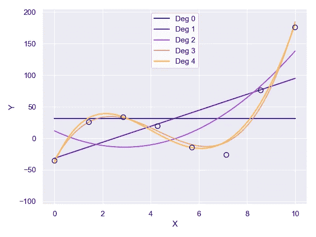

图 4:多项式适合你的数据，范围从 0 到 4 次

你的双胞胎兄弟对他们的数据做了同样的事情:

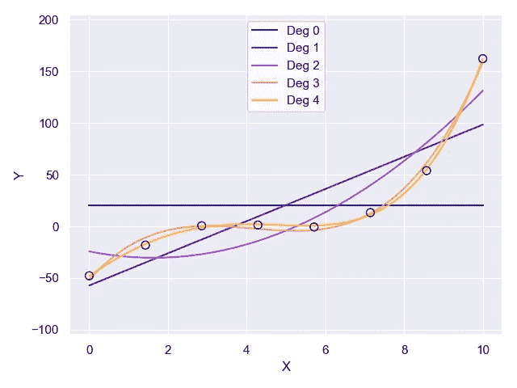

图 5:多项式拟合你双胞胎的数据，范围从 0 到 4 次

这些模型彼此大相径庭。值得注意的是，模型的程度越高(因此其复杂性越高)，两者之间的差异就越大。好奇。在下一次跨维度家庭团聚时，你、你的双胞胎和其他 48 个多宇宙兄弟姐妹决定将 2 次多项式拟合到你们各自的数据集，并比较你们的模型:

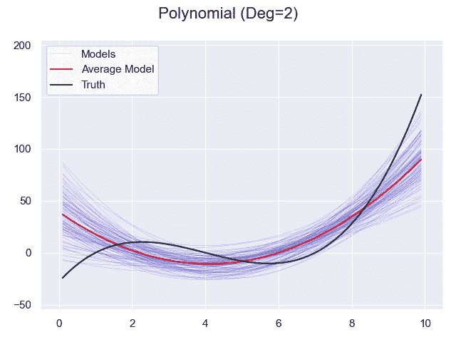

图 6:2 次多项式适合 50 个不同的 8 点数据集(每条蓝线是一个不同的模型)，这 50 个模型的平均预测(红色)，以及没有噪声的真实关系(黑色)。

有意思。看到这些结果，作为一群聪明的数据科学家，你决定对几个不同次数的多项式重复这个实验。

现在，在深入研究这些结果之前，我们需要简单谈谈偏差和方差。你知道——这篇文章的主题。请记住，我们谈论的是*模型*的偏差和方差，而不是数据。

**模型的偏差**是某一点的真实(无噪声)值与预期模型预测值之间的差值。如果一个模型在某一点上是无偏的，这意味着它应该高估和低估它。平均模型预测是预期模型预测的良好估计量；记住这一点，考虑图 6 中的点 x = 0；一般模型的值是 y=40，而真实值是-28；这意味着 x=0 时的估计偏差为 68。同样，考虑点 x = 5；平均模型和真实值都是-8，使得 2 次多项式在 x=5 时对于这种关系是无偏的。(注意:请记住，这是用数字完成的，您需要应用统计来确定这些点的实际偏差，比最接近的整数更精确)。

**模型的方差**是指拟合模型与期望模型的期望平方差(即 E[(E(f(x)-f(x))])。或者换句话说，对于图 6 中的任何给定点，它是所有蓝线相互展开程度的度量。在图 6 中，注意 50 个模型在 x=2 和 x=8 之间具有相当恒定的方差，但是在域的末端向外扩散。

模型的总可约**误差**是偏差+方差。为什么？没关系，这不是一篇统计文章。但是如果你必须知道，看看 Seema Singh 的[这个伟大的解释](/understanding-the-bias-variance-tradeoff-165e6942b229)。做完了再回来！

总之，回到手头的任务。我们想知道偏差、方差和误差与给定模型的复杂性有什么关系。让我们看看由那 50 对双胞胎生成的各种模型，并将它们与真实的关系进行比较。

## 1 度:最佳拟合线

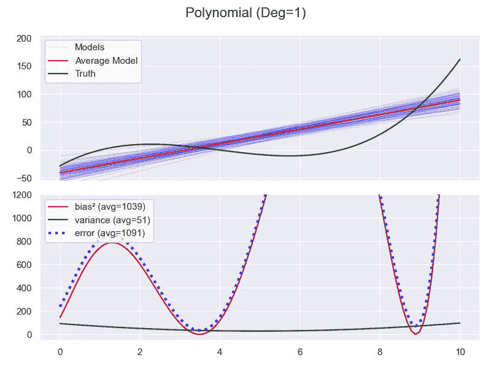

图 7: [Top] 50 个不同的 1 次多项式模型，每个模型训练 8 个点(蓝色)，这些模型预测的平均值作为预期模型的估计值(红色)，以及真实关系(黑色)。[底部]x 域中每个点的偏差、方差和误差。不要担心，在 5

In figure 7, the 50 twins each fit a degree-one polynomial (i.e. a “line of best fit”) to their 8 points of training data. As you can see by how similar each of the models (blue lines) are, this low-complexity modelling technique has low variance. This is made obvious in the bottom panel of figure 7, where the variance (green) is relatively low across the entire domain. Contrast this with the bias in the bottom panel (red); other than at a few points (e.g. x=3, x=9) it’s fairly high, and makes up the bulk of the total error at most points in the domain. Taken as a whole, we can say that applying this type of model (degree-one polynomial) to the given data distribution yields a low-variance, high-bias model.

## Degree 2: A Quadratic

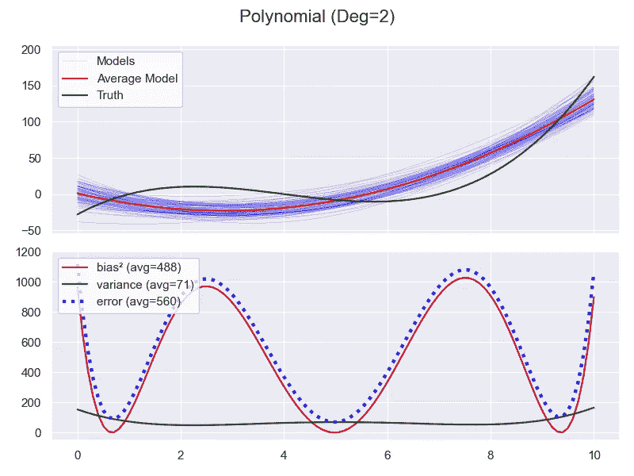

Fig 8: The same as figure 7, but using degree-two polynomials.

If instead the twins were to use a degree-two polynomial (a quadratic), figure 8 would be the resulting bias, variance, and error. As you can see, the variance is *略高*之间的曲线的截断部分没有什么特别令人兴奋的，而偏差和误差却大大降低了。虽然这仍然是一个高偏差、低方差的模型，但它肯定比一次多项式更适合。通过允许方差的轻微增加，我们大幅减少了偏差(并因此减少了总误差)；这是一个很好的权衡！

## 三度:一立方

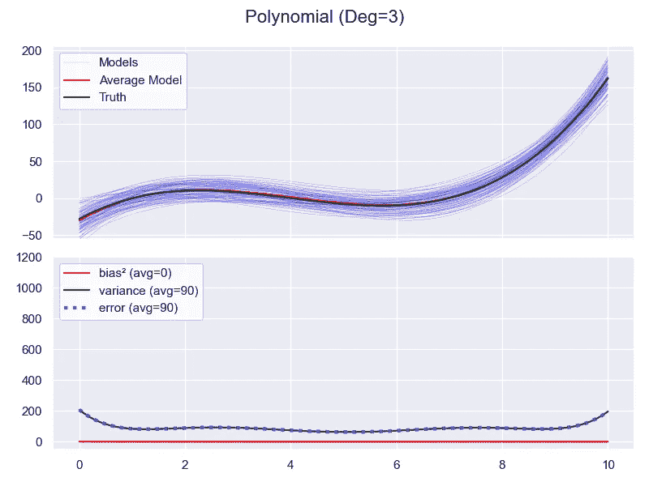

图 9:与图 7 相同，但是使用三次多项式。

哇，那里发生了什么？在整个域中 bias = 0…是这样吗？其实就是！我不会进入数学，但因为真实的关系是一个三次多项式，三次多项式是真实关系的一个**无偏估计量**。注意平均模型(顶部面板，红色)如何几乎完美地与真实关系重叠；这反映在底部面板中，其中方差与误差完全重叠。这是因为，在没有任何偏差的情况下，方差是模型中唯一的误差源。

从一级到二级再到三级，我们看到误差稳步下降。一个四级模型肯定会有更少的误差，对吗？

## 5 度:四次

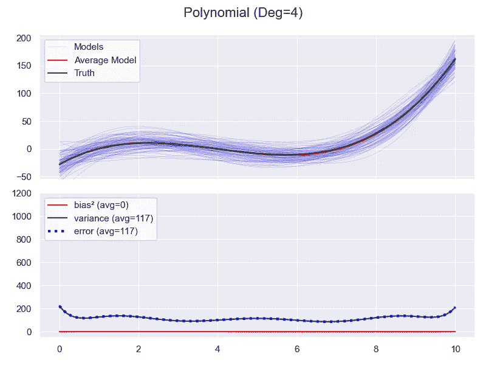

图 10:与图 7 相同，但是使用了四次多项式。

嗯。偏差的平方仍然为零，但是平均方差已经从 90 增加到 117。让我们看看更高的学位。

## 以及其他

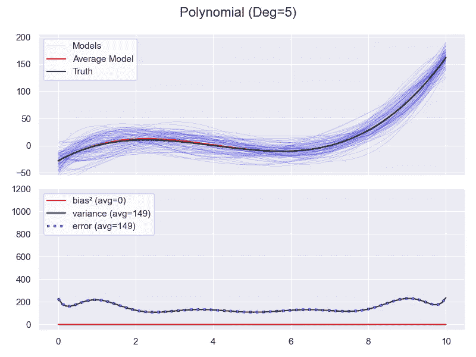

图 11:与图 7 相同，但是使用五次多项式。

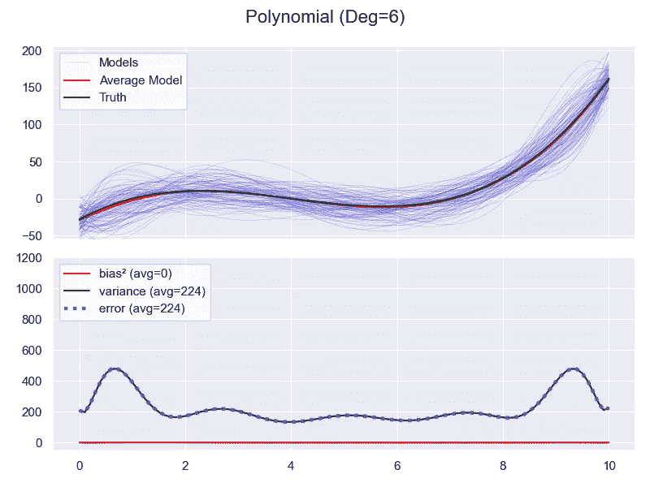

图 12:与图 7 相同，但是使用六次多项式。

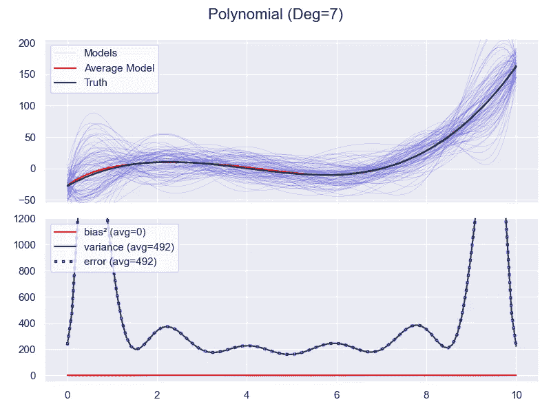

图 13:与图 7 相同，但是使用七次多项式。

该死的。我想我们不能只是不断增加模型的复杂性，并期望得到更好的结果。你可以看到为什么一些模型(蓝线)是如此的不稳定。事实上，这正是“过度拟合”的含义:当模型被调整到训练数据的噪声时，增加了它的方差，因此降低了它对看不见的数据进行概括的能力。因此，即使增加模型的复杂性没有增加偏差，但它增加了方差，损害了模型的整体性能。

## 把所有的放在一起

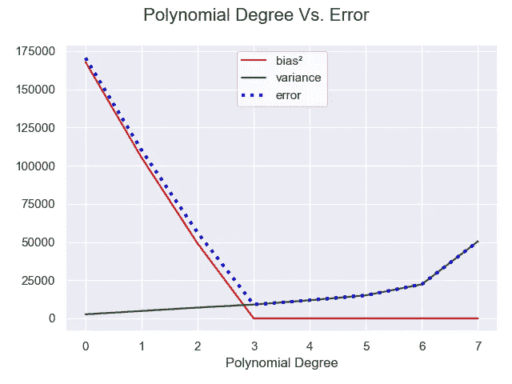

图 14:熟悉的偏差与方差曲线，使用上述多项式模型的结果制作。

如图 14 所示，使用三次多项式时会出现偏差方差最佳点。如果您要使用一个不太复杂的模型，您将会使您的模型不适合，并且将潜在的性能提升留在桌面上；如果你使用一个更复杂的模型，你会给你的预测增加不必要的误差。对于这个问题，三次多项式是最佳选择。

需要注意的是*的目标不应该是*达到零偏差；这只是因为真实的关系是一个简单的多项式，我们使用不同次数的多项式来做我们的预测。事实上，**偏差为零通常意味着你过度拟合了你的数据！**为了说明这一点，如果我们有一个更复杂的非多项式关系，我们的结果看起来会有点不同。相反，考虑从正弦关系中提取的数据:

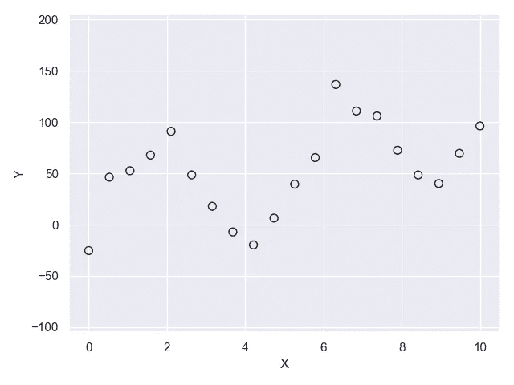

图 15:具有 20 个点的非多项式(正弦)数据集。

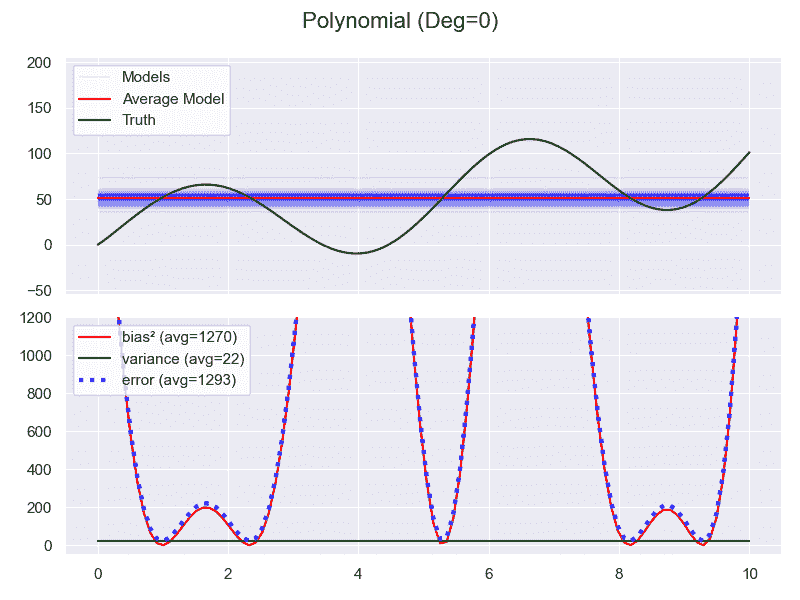

图 16:与图 7 相同，但是是正弦数据集和 gif 格式

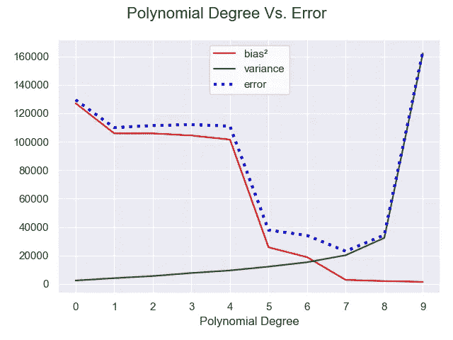

图 17:应用于正弦数据集的不同程度的多项式模型的偏差、方差和误差

正如您所看到的，这种关系的最佳点似乎是 degree=7，它通过在偏差和方差之间找到一个良好的平衡来最小化误差。与前面的关系不同，偏差实际上从未达到零；随着多项式次数的增加，它会继续减少，但方差增加得太快，以至于边际收益不值得:在机器学习中，允许一点额外的偏差通常会大幅降低总预测误差。

# 结束语

很长一段时间以来，我“知道”偏差方差权衡，但直到我实际投入到用模拟数据训练模型的工作中，我才真正*在直觉层面上理解了*。我希望在写这篇文章的时候，我已经帮助你对它是如何工作的有了一个坚实的直觉。尽管这是一个微不足道的例子——多项式和正弦曲线使用多项式回归拟合——但同样的原理适用于拟合任何模型(随机森林、神经网络等)。)在任何维度的数据空间(DNA 微阵列、图像等)。).我在这里[提供了代码](https://github.com/ConorLazarou/medium/tree/master/12021/bias_variance)，如果你想自己玩的话。

感谢阅读！

作者创作的所有未标注的图片。