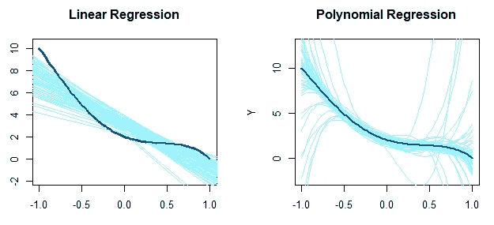
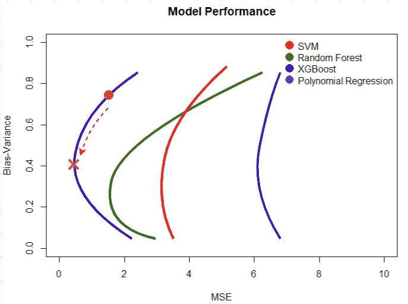
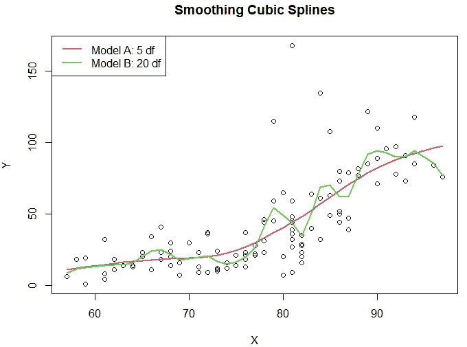
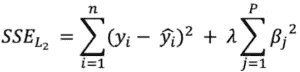
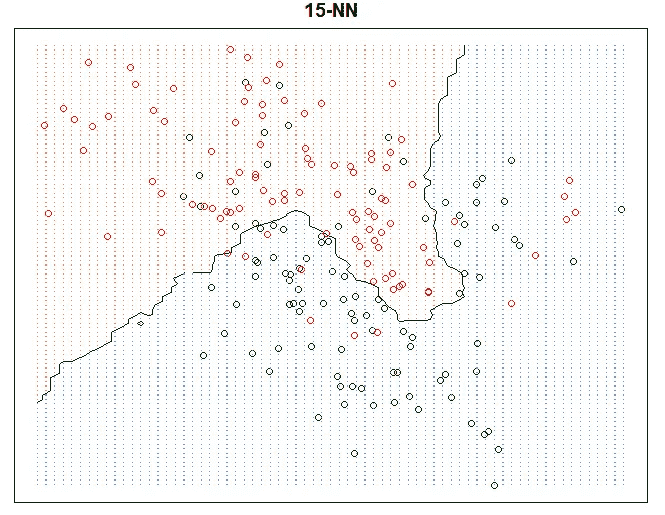
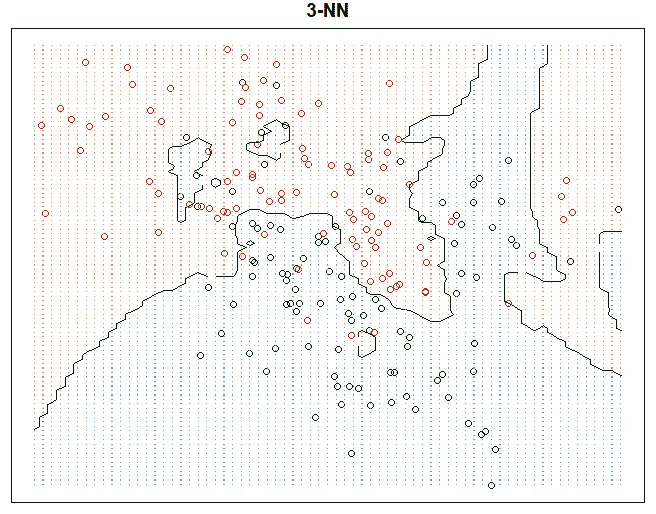
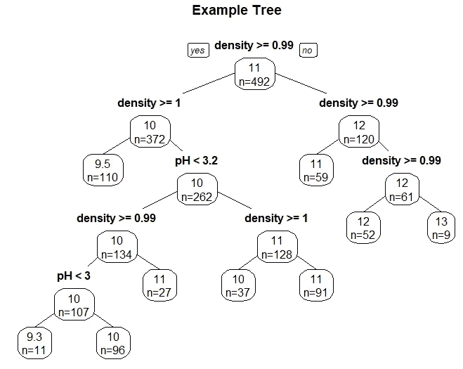
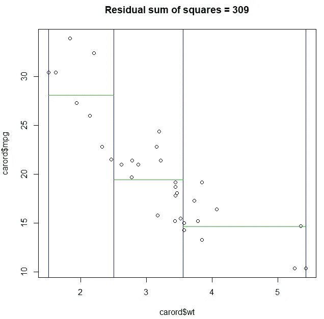
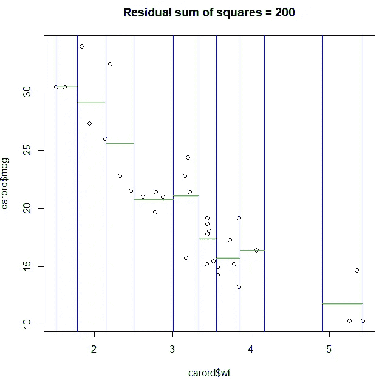

# 建模的偏差-方差权衡

> 原文：<https://towardsdatascience.com/the-bias-variance-tradeoff-for-modeling-5988db08ef91?source=collection_archive---------12----------------------->

## 通过实例通过统计学习模型直观理解过拟合和欠拟合。

[蒂姆·布朗](https://unsplash.com/@puppettim?utm_source=medium&utm_medium=referral)在 [Unsplash](https://unsplash.com?utm_source=medium&utm_medium=referral) 上拍照

# 思想实验

让我们假设我们正试图预测一些现象 **Y** 。设 **X** 是宇宙中除了 **Y** 之外所有可以用来解释 **Y** 的变量。然后有一些函数 *g* ( **X** )在预测 **Y** 时做得最好。最后，让我们假设 **Y** ，作为一个随机事件，永远不可能被完美预测。这意味着在预测中总会有一些误差ŷ。所有这些可以总结如下:

**Y**=*g*(**X**)+**δ**。

*g* ( **X** )称为*真结构*。它是使用 **X** 中每个解释变量的 **Y** 的最佳可能预测值。

**δ** 称为*不可约误差*。即使有了解释变量在 **X** 中的最佳组合，预测**ŷ**也永远不会准确。

实际上，最好的情况是我们的模型与真实的结构有些相似。*为什么？与理论概念的 **X** 相比，我们能够获得的解释变量要少得多。这导致了更熟悉的术语*随机误差*:*

**ε**=[*g*(**X**)—*f*(**X**’)+**δ**。

这里，*f*(**X**’)是我们用**X**’**构造的预测函数或模型，它是我们可以访问的数据集和解释变量。第一项[*g*(**X**)—*f*(**X**’]称为*偏差*，这是我们模型中的误差。我们知道第二项 **δ** 是不可约误差，或者是 **Y** 中真正无法解释的可变性。我们寻求最小化的随机误差 **ε** 由这两项之和组成。无论 *f* 的拟合度有多好， **ε** 最多能还原到 **δ** 。**

# **偏差-方差权衡**

**方程**ε**=[*g*(**X**)—*f*(**X【T39’)+**δ**或*误差=偏差+方差*代表某型号 *f* 的偏差方差权衡。保持误差不变，减少偏差意味着模型方差增加。同样，减少模型方差意味着偏差必然增加。为了可视化这种关系，我设置了两个简单的模型来拟合真实的结构 *g* ( **X** )，在这种情况下，它是一个 4 次多项式。****

****

**深蓝色线为 *g* ( **X** )。通过使用由浅蓝色线**描绘的数据 **X** 的随机子集拟合线性(左)和多项式(右)回归，模拟运行 75 次。**线性模型不能很好地拟合 *g* ( **X** )，并且显示出比多项式拟合更大的偏差。然而，线性拟合具有较小的模型方差。不管选择什么 **X** ，贴合都是一致的。这对于多项式拟合是不正确的。虽然有些几乎完全符合 *g* ( **X** )，但许多并不符合，从而产生较大的误差并增加模型方差。事实上，众所周知，多项式会过度拟合，并且对于超出 **X** 界限的预测不能很好地推广。这是因为这种模型固有的偏差-方差权衡。**

**总的来说，偏差-方差权衡的动态可以总结如下:**

****柔性模型**:高*偏差*和低*偏差*。**

****不灵活模型:**低*偏差*高*方差*。**

**虽然一个灵活的模型可以更好地概括，但它也可能会欠适应和追逐它的错误。虽然不灵活的模型可能对某些样本 **X** 给出很好的预测，但你也有过度拟合和得到较差预测的风险。**

**到目前为止，我们已经看到，我们可以权衡偏差的方差，反之亦然。对此的一个自然延伸是，我们可以使用某种标准优化模型中偏差与方差的比率，例如 RSS(如果是回归问题)，以获得最佳预测性能。这个过程被称为模型*调整*。通过使用 k-folds 或 bootstrapping 在验证集上改变不同的模型*参数*，我们实际上是在为给定的数据集寻找最优的偏差-方差权衡。**

**然而，你可能想知道，*有什么方法可以减少偏差和方差吗？*一般来说，答案是*是的*，但是你能得到更好的偏差和方差的程度取决于你所拥有的数据和你所使用的模型。**

**假设您有一个小数据集，其大小为 *n* =20。那么通过增加 *n* 的大小可以显著降低偏差和方差，假设增加的样本提供了新的信息(给定如此小的样本大小，它们可能会提供新的信息)。但是，如果你已经有大量的数据 **X** 接近 **X** ，偏差和方差只会减少很小的数量。**

**在讨论第二点时，重要的是要注意到并非所有的模型都是平等的。不同的模型在减少偏差和方差方面有不同的潜力。以前面的多项式回归为例。虽然它有利于生成已知数据的平滑线，但使用未知数据时，它往往会做出较差的预测。也许有一个用例或数据集，其中多项式回归确实做出了很好的预测，但这是非常罕见的。与此同时，像 *XGBoost* 这样的流行模型在一系列问题和数据集上都取得了持续的成功。例如，忽略边缘情况，我们可以通过将模型从多项式回归移到 *XGBoost* 来减少偏差和方差。**

**总的来说，我认为总结所有这些信息的一个好方法是通过图表。请注意，这个图是虚构的，我只是手动添加了曲线，它们不是基于实际数据绘制的。重点是让直觉变得清晰。**

****

**每条曲线或*边界*代表给定大小为 *n* 的数据集的单一模型。X 轴表示标准 MSE，它应该最小化。Y 轴代表偏差与方差的比率。通过调整给定模型的参数，我们可以沿着一个边界前进。请注意，边界有不同的形状，这意味着在给定的偏差和方差水平下，每个模型都可能表现得更好或更差。假设 *n* 足够大，对于给定的模型，降低 MSE 的唯一方法是通过调整参数来改变偏差-方差比。这具有沿着曲线移动*的效果。比如 XGBoost 有参数λ(学习率)。假设λ在 0.001(橙色圆圈)。通过将λ增加到 0.01，偏差减小，方差增加，我们沿着曲线向下移动到最佳 MSE(红色 *X* )。如果 *n* 足够小，我们可以通过增加 *n* 来将前沿转移到更小的 MSE。然而，随着 *n* 变大，MSE 的减少变小，有一个*极限*向 *n* 逼近。最后，通过查看 SVM 和兰登森林，您可以看到，一个调优不佳的优秀模型有可能表现不如一个调优良好的低劣模型。***

# **分类呢？**

**到目前为止，偏差-方差权衡的理论概念已被应用于回归分析并通过回归分析来理解。对于分类问题来说，偏差-方差权衡仍然存在，这是有道理的，我们只需要以稍微不同的方式重新定义它。**

**在点 **X** = **x** ₀ **，**处，在目标 **Y** 的 *k* 个可能类别中存在离散分布。**

****p**₁= p(y = 1 | x =**x**₀)**

****p**₂= p(y = 2 | x =**x**₀)**

**…**

**ₖ= p(y =*k*| x =**x**₀)**

***真*类是在 **X** = **x** ₀.时具有*最高*概率的任何类接下来，让我们介绍一个叫做*最优贝叶斯分类器*的理论概念。它被定义为一个概率模型，在给定某个 **X** 的情况下，做出最可能的预测。如果我们给这个模型 **X** (宇宙中除 **Y** 以外的所有其他变量)，那么*最优贝叶斯分类器*实际上就是我们之前描述过的*真结构 g* ( **X** )。*不可约误差* **δ** 由某类 *k* 表示，该类不是最可能被观察到的类。**

# **将概念应用于不同的模型**

**为了巩固偏差-方差权衡的概念，尝试将直觉应用于各种不同的模型是有意义的。经历这一过程会让你更好地理解模型参数，并允许你在需要时解释它的影响。通过将偏差-方差权衡作为一个框架来考虑，您可以更好地理解在不同的情况下您何时对数据过度拟合和欠拟合。**

## **样条和基函数**

****

**三次样条是一种基函数，其中每个函数都是三次多项式。x 被分成 *K-1* 个区域，并且三次多项式被拟合到该区域中的观测值。通过设置模型约束，每个功能在*节点*处连接，使每个功能块平滑地装配在一起。需要调整的主要参数是节数。注意，自由度 *df* 与节数 *k 有直接关系，k* 节意味着模型有 *k+3* *df。***

**让我们看看上面的情节。标绘为红色的函数使用三次样条，其 *df* =5(型号 A)，标绘为绿色的函数使用三次样条，其 *df* =20(型号 B)。因为 *k* 相对较小，所以模型 A 具有更大的偏差和更小的方差。因为 *k* 相对较大，所以模型 B 的偏差较小，方差较大。它是更复杂的型号。**

***哪个型号更合适？*如果你简单地按照最小化 MSE 这样的标准，那么答案就是模型 b。但是只要看看这个图，我们就知道这是错误的。除了不平滑(这是该图的全部目的)之外，它似乎没有捕捉到数据的总体*趋势*。该函数与最后两点几乎完全相交。如果我们通过在 X=110 附近随机添加一些新的观察值来进行一点推断，该图不太可能符合该数据。所以模型 B *过度拟合了数据，而模型 A 在平衡偏差-方差权衡方面做得更好。***

## **里脊回归**

**岭回归是对最小二乘回归(LSR)的一种改进。当*f*(**X**)=*g*(**X**)时，LSR*无偏。*虽然情况并非如此，但 LSR 可能存在非最优量的偏差和方差，当存在*多重共线性*(一些解释变量是相关的)时，这种情况会被放大。岭回归试图通过对模型的系数应用惩罚来减少方差(并增加偏差)。岭回归模型(也称为收缩最小二乘法)通过最小化以下各项来定义:**

****

**最后一项是*罚值*，其影响由调谐参数λ控制。这个术语也被称为 L2 正则化。可以通过使λ变小来减少过拟合。此*增加*偏差*减少*偏差。可以通过增大λ来减少欠拟合。此*增加*方差*减少偏差*。岭回归模型的要点是减少过拟合，因此通常λ < 1，导致系数落在零和最小二乘估计值之间。**

## **k-最近邻**

**KNN 是一个简单的分类模型，其工作原理如下:**

1.  **选择参数 *k* 作为邻域的大小。因此，任何邻域都由 k 个点组成，这些点用于根据它们的标签对一个类别进行投票。**
2.  **预测存在于 **X** 的 *p* 维空间中的一个点 **x** ₀。**
3.  **通过计算欧几里德距离来识别离 **x** ₀最近的 *k* 个点(其邻域)。称这个街区为₀.**
4.  **对于₀的每一分，数一数他们的阶级。**
5.  **然后**ŷ**(**x**₀)**(我们对 **x** ₀的预测)是计数最高的班级。****

****下图显示了二维空间中两个类别(红色和绿色)的一些数据( *p* =2)。调谐参数 *k* 已被设置为 15。****

********

****如果 **x** ₀落在绿色空间，那么它的预测类是绿色的。如果 **x** ₀落在红色空间，那么它的预测类是红色的。随着 *k* =15，边界(或邻域)似乎是合理的。是的，有些点在错误的空间，但如果我们必须用手画边界，我们可能会画出类似的东西。让我们通过设置 *k* =3 来减少 *k* 来尝试做得更好。****

********

****现在街区变小了，更多的岛屿出现了。好的一面是右边的大岛看起来很合理。不好的是小岛似乎太具体了。通过减少到 k = 3，这个模型看起来有点太复杂了。通过将 *k* 增加到 *k* =5，我们可能会消除小岛屿，保留大岛屿，从而得到我们正在寻找的适合度。****

*****那么从调 k 我们能得出什么结论呢？小 k* 会减少偏差，增加方差。偏差减小是因为我们可以看到 **ε** 从 *k* =15 减小。然而，差异更大，因为我们可以看到，不同的样本，地图看起来完全不同。可能是 *k* =3 模型太复杂(过拟合)，而 *k* =15 模型太一般(欠拟合)。因此，通过可视化模型，我们可以看到我们的最佳 *k* 落在这个范围内。****

## ****回归树****

****决策树是许多流行的回归和分类模型的基础，这些模型使用树的*集合*(*例如*打包和提升)。为了方便起见，我将使用回归树来解释这个模型中存在的偏差-方差权衡的一个方面。以下是递归计算*的回归树算法的简单说明*:****

1.  ****对于一个给定的区域 **X** ，我们想把它分成两个区域 **R** ₁和 **R** ₂.****
2.  ****为了找到最佳分区，迭代通过在 **X** 中 xᵢ和 xᵢ ₊₁之间的每个分割，并通过拟合水平回归线来计算 RSS。****
3.  ****最低的 RSS 分裂定义了新区域 **R** ₁和 **R** ₂.这在回归树中定义了一个新节点。****
4.  ****通过传入新区域 **R** ₁和 **R** ₂作为输入 **X.** 来递归调用这个函数****
5.  ****如果已经达到最大深度 *d* 或者该区域的观测值少于 *n* ，则可能触发基本情况(停止条件)。****

****这里， *n* 和 *d* 是可以被调整以优化偏差-方差权衡的参数。一旦使用上述算法构建了树，它看起来就像这样:****

********

****这棵树建立在至少两个解释变量上，那就是*密度* ( **X** ₁) 和 *pH* ( **X** ₂).为了获得某个 **x** ₁和 **x** ₂的预测，您可以从根节点到最终到达的叶节点遵循布尔逻辑。以参数 *d* 为例。d 越大，出现的分裂就越多，模型也变得越复杂。这么大的 *d* 导致偏倚减小，方差增大。同样，小的 *d* 会导致偏差增加，方差减少。当我们实际构建回归树(使用不同的数据)时，让我们也将它可视化。****

********

****蓝色垂直线代表分离，而绿色水平线是用于计算平均 RSS 的回归。请注意，这些不是最好的分割，因为我是手动选择它们的，但我试图找到一些合理的东西。我做了两次拆分，所以 *d* =2。考虑到我们仅有的少量数据，这似乎是合理的。让我们尝试添加更多的分裂。****

********

****通过增加 *d* ，我们可以进一步将偏置和 RSS 降低至 200。事实上，我们可以继续这个拆分过程，直到 RSS 为零，并且我们有 *n-1* 个拆分。这就是单棵树的问题所在:它们几乎是无偏的，但变化很大。与 KNN 的例子不同，尚不清楚哪棵树会成为更好的预测器，但很明显，增加 *d* 会减少*偏差*并增加*方差*。****

****事实是，一棵树本身并不能成为一个好的预测者。这就是为什么系综是一种如此强大的技术，系综是用装袋或助推来组合许多树木的过程。每一种都利用了决策树所描述的偏差-方差特性。例如，*随机森林*使用一种装袋技术，其中许多深度不相关的*树被平均。这对于相同的偏差产生了*较低的*方差的影响。使用像 *XGBoost* 这样的增强模型，许多*弱学习器*(浅树)的序列是基于先前的树残差构建的。这具有为相同的*方差*产生较低的*偏差*的效果。*****

# ****主要要点****

****虽然许多不同类型的监督机器学习模型尚未涵盖，但连接它们的一个常数是偏差-方差权衡。事实上，我发现理解每个模型的权衡是理解一个模型的机制的一个很好的起点，而不需要太深入数学。最后，让我们考虑一个更实际的用例。****

****假设您正在使用交叉验证(CV)和网格搜索来调整训练集上的模型。如果运行 5 重 CV(不重复)并使用 6 个值调整 5 个参数，则模型必须符合 5⁶ * 5 = 78125 次。即使你只需要几秒钟就能模拟火车，对于这么小的网格来说，这仍然是一个很大的计算时间。现在，如果您对模型进行初步拟合，并发现它明显过度拟合或欠拟合数据，您可以删除会明显增加该问题的网格值。****