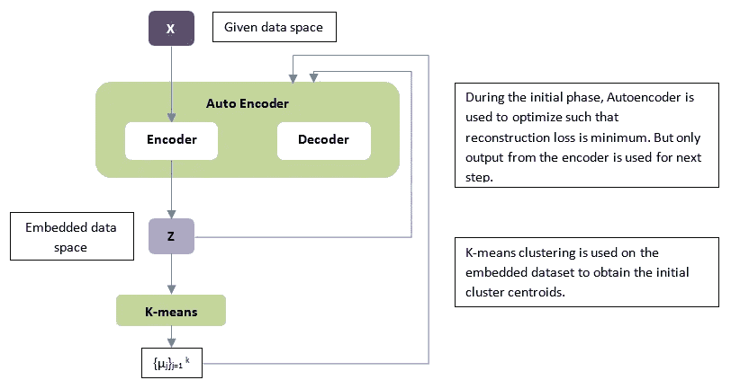
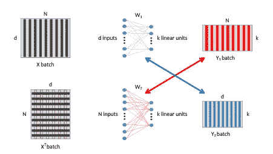
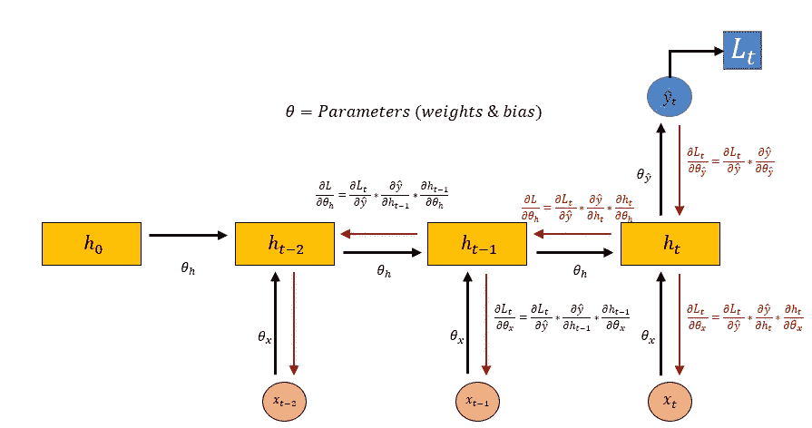
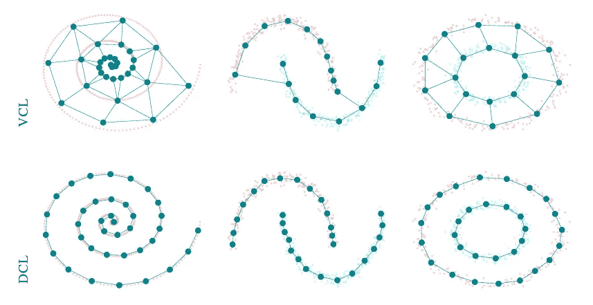
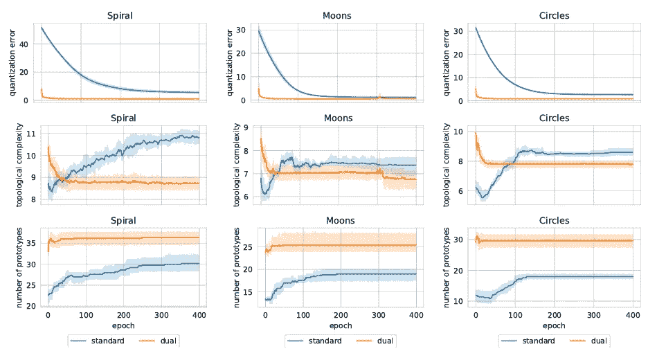
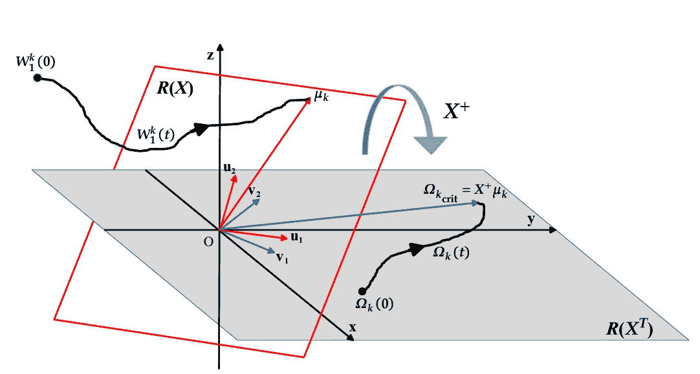

# 深度聚类中一个重要发现的诞生

> 原文：<https://towardsdatascience.com/the-birth-of-an-important-discovery-in-deep-clustering-c2791f2f2d82?source=collection_archive---------23----------------------->

## [思想和理论](https://towardsdatascience.com/tagged/thoughts-and-theory)

## 一本关于如何处理高维数据的侦探小说

> 这是我和我的学生 Pietro Barbiero、Gabriele Ciravegna 和 Vincenzo Randazzo 的论文《基于梯度的竞争学习:理论》的故事。如果你没什么更好的事情做，你可以在这里下载[。](https://arxiv.org/abs/2009.02799)

照片由 [Javier Grixo](https://unsplash.com/@grixo?utm_source=medium&utm_medium=referral) 在 [Unsplash](https://unsplash.com?utm_source=medium&utm_medium=referral) 上拍摄

## **背景**

最近在做深度聚类领域的工作。有趣的是，我可以将深度学习与聚类技术相结合，深度学习主要是受监督的(CNN，MLP，RNN)，而聚类技术具有无监督的性质。事实上，他们的行为是如此不同，以至于他们不能很好地融合。看看这个经典的方案:

图片来自[此处](https://medium.com/@dptmn200/unsupervised-deep-embedding-for-clustering-analysis-a-summary-f6e5f2dce94fhttps://medium.com/@dptmn200/unsupervised-deep-embedding-for-clustering-analysis-a-summary-f6e5f2dce94f)

即使重建和聚类损失经常被合并，事实是深度学习模块是用于聚类模块预处理的简单特征提取和降维工具。这是真正的融合吗？基于这一观察，我开始与我的硕士和博士生团队一起研究可能的解决方案。但是一个惊喜等待着我…

## 神秘

我正在研究深度学习在癌症基因组学中的一个有趣应用，突然，我在半夜接到一个奇怪的电话。是皮埃特罗·巴比洛，我最优秀的学生之一。当他试图做一些非常奇怪的事情时，他使用了一个非常简单的竞争层。他没有使用训练集数据矩阵，而是尝试使用它的转置。这毫无道理！特征成为样本，反之亦然。然而，输出是集群的原型！不可能。更好地检查它。如果这是正确的，就不会再有维数灾难的问题了。高维度成为更大的训练集，这产生了积极的效果。我简直不敢相信。

我们花了几天时间检查这个现象，但我们总是得到极好的结果。这怎么可能呢？我在努力寻找一个合理的解释。它必须存在，即使它违反直觉。结果就在我面前。他们是荒谬的，但我不能忽视他们。他们告诉我，必须有一个解释。但是哪一个？

## 首次调查

所以然后…
竞争层通过其神经元的权向量来估计原型，而输出不是很显著。相反，具有相同损失函数但具有转置输入的同一层具有显著输出(它们是原型)，而权重支持学习。从这个角度来看，已经可以说，只有这第二个网络是真正的神经性质的。在纠结这个想法的时候，我直觉地想象出一个二元性的原理，将两个网络结合在一起。这是我的第一个结果:

基本(顶部)和双重(底部)单层神经网络(图片由作者提供)

顶部的网络代表普通(基础)竞争层(VCL)，这是大多数聚类神经网络的基础。输入中的垂直线是数据样本。在训练之后，与输出神经元相关联的权重向量估计数据原型。底层网络，我称之为 DCL(双竞争层)，在批量/小批量演示之后输出原型(输出矩阵的行)。图中的颜色代表二元性(相同的颜色=相同的值)。下面的定理恢复了我的第一个分析:

如果单独使用该层，则第二个假设由数据归一化考虑，或者如果它是用于聚类的深度神经网络的最后一步，则由批量归一化考虑。

关于数据拓扑，我们应用了[竞争赫布边规则](https://link.springer.com/chapter/10.1007/978-1-4471-2063-6_104)来估计边。

至于训练，像往常一样，两个网络都必须最小化量化误差。我们为最小化邻接矩阵 2-范数的损失增加了另一项，以强制边缘的稀疏性。

好吧，我找到了二元性的原理，但我还远远不满足。然而，一个非常重要的第一个结果，这个原则的结果，证明了 DCL 在深度学习中的重要性。正如我之前告诉你的，深度监督学习和聚类的本质没有很好地集成，因为它们的本质不同。事实上，反向传播规则，你可以从这样的计算图中清楚地看到，对于 RNNs，

图片来自[这里](https://stackoverflow.com/questions/63862738/gradient-calculation-in-rnn-backpropagation-through-time-many-to-one-relatio)

基于通过局部梯度从每个节点的输出到输入的传播。权重梯度估计只是这种传播的副产品。但是，如果输出没有意义，比如在深度聚类中，该怎么办呢？相反，DCL 与深层模块完美地集成在一起，正如您在下图中看到的，该图展示了 DCL 深层版本的架构。

深度 DCL(图片由作者提供)

> **DCL 是唯一完美集成到深度神经网络(deep DCL)的竞争层。**

## 神秘越来越深

不幸的是，我的学生对 VLC 和 DCL 的实验显示了 DCL 的明显优势。这怎么可能呢？看看基准合成数据集上的这些比较。

基准实验。从左到右，螺旋，月亮和圆数据集深 DCL(图片由作者)。

VCL(标准)和 DCL 的三个关键指标的比较。度量是(顶行)量化误差，(中间行)边(邻接)矩阵的范数，(底行)有效原型的数量(图片由作者提供)。

通过考虑量化误差，两个网络在所有情况下都趋向于收敛到相似的局部最小值，从而验证了它们的理论等价性。尽管如此，DCL 表现出更快的收敛速度。最显著的区别在于(1)有效原型的数量，因为 DCL 倾向于使用更多的资源，以及(2)拓扑的复杂性，因为 VCL 喜欢更复杂的解决方案。VCL 工作得更好。为什么？为什么？我绝望的呼喊划破夜空。神秘加深了，我仍然处在最黑暗的痛苦中。我的二元性理论在解释这些结果时绝对不能令人满意。事实上，我们没有使用深度版本，因为最佳集成与此无关。我绝望了。我只有两个选择，要么用病毒破坏我学生的电脑，恶化 DCL 结果，要么用新的理论方法来解决问题。

是时候揭开我绝望的面纱，勇敢地面对这个问题了。这个问题非常简单，我用一种非常简单的方式解释了它。假设我们有一个由 4 个大小为 100000 的样本组成的训练集。如果我可以转置它，就像在 DCL 中一样，我将得到一个大小为 4 的 10000 个样本的数据集。除了维度诅咒！关键在哪里？与此同时，我可以说，当我们需要估计原型的 Voronoi 集，以评估量化误差时，维数灾难再次出现。松了一口气！然而，现在必须看看对于高维数据，DCL 是否比 VCL 表现得更好。三言两语，维度诅咒对 DCL 的影响有多大？所以，我让我的学生检查 VCL 和 DCL 版本的结果，也深入 w.r.t .问题的维度。

准确性是问题维度的函数。误差带对应于平均值的标准误差(图片由作者提供)。

尽管我观察了估计 Voronoi 集的问题，但很明显 DCL，更重要的是，由于其卓越的集成能力，deep DCL 给出了极好的结果。特别是，在 2000–3000 个特征之前，这两种方法的准确率接近 100%!DCL 再次让我大吃一惊。

是时候用我的演绎法来解开这个谜了。该上数学课了！这似乎是一个显而易见的选择，但我们不要忘记，深度学习已经见证了新技术的蓬勃发展，这些技术通常仅由经验解释支持。怎么说，你想成为深度学习专家吗？就这样拿 DCL 吧，谢谢，继续别的。

## 一丝光亮照亮了黑暗

从哪里开始？这两种方法的训练都是基于梯度的，就像深度学习中的通常情况一样。所以我决定走这条路。让我们首先分析梯度流的渐近行为，然后分析它的动力学。我必须找到一个解释，DCL 是可行的，这是不可否认的。

## 解开谜团的第一步

首先，我用随机逼近理论分析了两个网络梯度流的渐近性质。关于 VCL，我发现梯度流是稳定的，并且在所有方向上以与 exp(t)相同的指数方式减少。这意味着该算法非常严格，因为其稳态行为不依赖于数据。对我来说有希望的结果！更有趣的是，我发现 DCL 梯度流依赖于数据。

三言两语(如果想看情商。34，欢迎你下载我的[论文](https://arxiv.org/abs/2009.02799)，该陈述声称双梯度流在更相关的方向上移动更快，即**，在那里数据变化更大**。事实上，轨迹朝着数据差异越大的方向发展得越快。这意味着更快的收敛速度，因为它是由数据内容决定的，正如在上面的数值实验中已经观察到的。

好吧，我终于解开了部分谜团。现在是结束调查的时候了。我觉得我已经抓到罪犯了。

## 最后的“致命一击”

当我着手研究这两种梯度流的动力学时，我没有想到扭转就在眼前。起初，我意识到 VCL 梯度流在其输入矩阵的值域空间中演化，而对偶梯度流在其转置矩阵的值域中演化。这个事实有非常重要的后果。例如，DCL 流是迭代最小二乘解，而 VCL 流只是隐式地做同样的事情。在最有趣的情况 *d* > *n* (其中 *d* 是输入的维数，而 *n* 是样本的数目)中，VCL 梯度流停留在维数为 *d* 的空间中，但是渐近地，倾向于位于一个 *n* 维的子空间中，即 *X* 的范围中。相反，双梯度流是 *n* 维的，并且总是在表示 *X* 转置范围的 *n* 维子空间中演化。在这种情况下，考虑输入矩阵及其转置矩阵具有相同的秩。请看下图，它说明了这一分析。

VCL(顶部)和 DCL(底部)梯度流以及 n = 2 和 d = 3 的相应子空间(图片由作者提供)

注意，VCL 解和 DCL 解通过由 *X* 的伪逆表示的线性变换相关。

我终于解开了这个谜。以下两个定理揭露了罪魁祸首。

首先，第一个定理是对偶网络是一种新颖的、非常有前途的高维聚类技术的基础。实际上，DCL 梯度流向子空间隧道中剩余的解，该子空间的维度不依赖于数据的维度。**这里有重大发现！然而，不要忘记，基础理论只是近似的，给出了一个平均的行为。**

## 收场白

我已经向你们展示了对深度聚类的一个重要贡献。但是，不仅仅是描述我的文章，我还想向你们展示让我理性地解释我的一个学生的发现的思维过程。然而，不要忘记，一个人决不能局限于对观察到的现象的经验解释。不要再把神经网络视为黑盒。现在我终于平静下来，准备开始新的调查。很快！