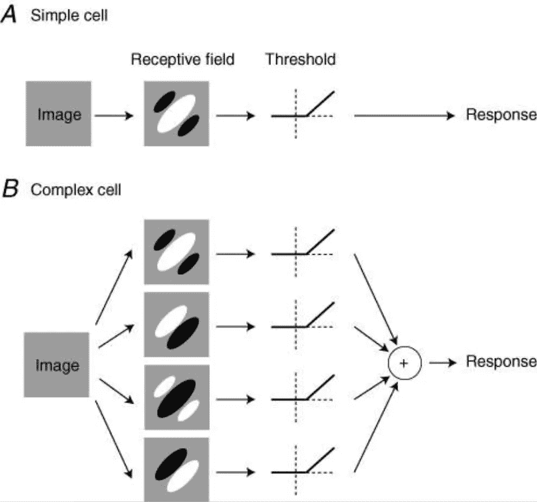
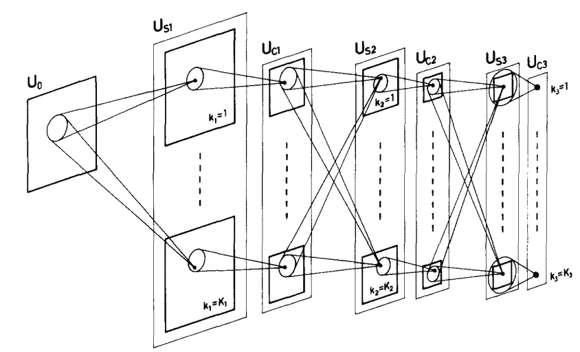
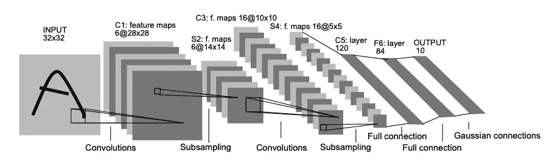
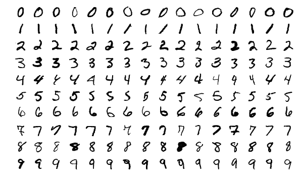
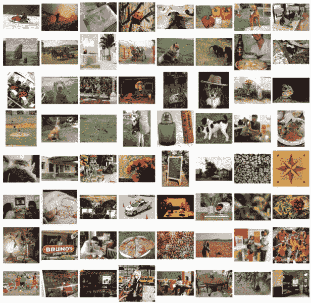

# 卷积神经网络简史

> 原文：<https://towardsdatascience.com/the-brief-history-of-convolutional-neural-networks-45afa1046f7f?source=collection_archive---------8----------------------->

## 人工智能精要

## 探索几乎用于每项计算机视觉任务的最受欢迎的深度学习模型之一的历史

图一。乔尔·菲利普在 [Unsplash](https://unsplash.com?utm_source=medium&utm_medium=referral) 上的照片

C 对于几乎任何计算机视觉和图像处理相关的人工智能任务，选择性神经网络是当今最重要的人工神经网络架构。在这篇文章中，我们将简单地访问从 20 世纪 50 年代的生物实验到今天复杂的预训练计算机视觉模型的 CNN 的起源。

# 从简单和复杂到祖母细胞

1959 年，David Hubel 和 Torsten Wiesel 发现了简单细胞和复杂细胞。根据他们的研究，对于视觉模式识别，我们使用两种细胞。简单的单元格可以识别图像特定部分的特定方向的边缘和线条，如下图所示:

图二。由 Movshon、Thompson 和 Tolhurst 提出的简单和复杂细胞模型(图由 Movshon 在论文[中给出)](https://www.ncbi.nlm.nih.gov/pmc/articles/PMC1890437/)

另一方面，复杂的细胞也会对特定方向的边缘和条做出反应。除了这种能力之外，与简单单元相反，复杂单元可以在场景中的任何位置对这些边和条做出响应。

> 例如，简单单元只能响应位于场景上部的垂直条，而复杂单元可以响应位于场景中任何位置的垂直场景。

复杂单元可以通过对来自多个简单单元的信息求和来实现这种位置不可知的识别能力。在整个人体中，我们看到简单和复杂的细胞结构，它们共同组成了我们的视觉系统。

> [祖母或灵知细胞是一种假设的神经元，代表复杂但具体的概念或对象。当一个人“看到、听到或以其他方式敏感地辨别”一个特定的实体，如他或她的祖母时，它就会激活。](https://en.wikipedia.org/wiki/Grandmother_cell)

因此，在我们的身体中，很可能有一个复杂的神经元从其他复杂的神经元获得信息(检测特定物品所必需的)，并且只有当我们拥有奶奶的视觉时才会激活。

# 福岛国彦的新认知

受 Hubel 和 Wiesel 工作的启发，20 世纪 80 年代，Kunihiko Fukushima 博士设计了一个模拟简单和复杂细胞功能的人工神经网络。S 细胞作为人造简单细胞运行，而 C 细胞作为人造复杂细胞运行。它们是人工的，因为它们不是生物神经元，而是模仿简单和复杂细胞的算法结构。福岛新认知基因的主要思想很简单:使用从其他低级复杂细胞收集信息的复杂细胞或检测简单模式的简单细胞(如尾巴)来捕捉复杂模式(如狗)。

图 3。说明 Neocognitron 中各层之间相互连接的示意图(图由 Fukushima 在[Neocognitron 论文](https://www.rctn.org/bruno/public/papers/Fukushima1980.pdf)中提供)

查看 Neocognitron 的论文: [Neocognitron:不受位置移动影响的模式识别机制的自组织神经网络模型](https://www.rctn.org/bruno/public/papers/Fukushima1980.pdf)

# Yann LeCun 的 LeNet

尽管 Fukushima 的工作在新兴的人工智能领域非常强大，但卷积神经网络的第一个现代应用是在 20 世纪 90 年代由 Yann LeCun 等人在他们的论文[基于梯度的学习应用于文档识别](http://yann.lecun.com/exdb/publis/pdf/lecun-01a.pdf)中实现的，这可能是迄今为止 90 年代最受欢迎的人工智能论文(被 34378 篇论文引用)。

图 4。用于数字识别的 LeNet-5 的架构(图由 LeCun 在 LeNet 论文[中提供)](http://yann.lecun.com/exdb/publis/pdf/lecun-01a.pdf)

在论文中，亚村用手写数字的 MNIST 数据集训练了一个卷积神经网络。

> MNIST 数据库包含 60，000 幅训练图像和 10，000 幅测试图像，取自美国人口普查局员工和美国高中生。MNIST 数据集包含手写数字(从 0 到 9)的灰度 RGB 代码，其标签代表实际数字:

图 5。手写数字示例的示例网格(从 MNIST 数据集创建)

这个想法是福岛新克隆的后续:使用复杂的人造细胞将简单的特征聚合成更复杂的特征。通过以下方式对 LeNet 进行 MNIST 培训:

*   为模型提供示例图像；
*   求模型预测标签；
*   更新模型设置，比较预测结果和实际标签值；
*   重复此过程，直到达到损耗最小的可选模式设置。

LeCun 的实现为当今的计算机视觉和图像处理应用设定了标准。

# 从 20 世纪 90 年代开始

在 90 年代、00 年代和 10 年代，构建卷积神经网络的简化过程被用于在越来越大的数据集上训练的越来越复杂的模型。

在 2005 年的 PASCAL VOC 挑战赛中，参与者竞相以他们的模型实现最低的损失+最高的精度性能，比赛从大约 20，000 幅图像和 20 个对象类别开始。然而，随着该领域的进步，这些数字与其他私人研究相比相形见绌。从 2010 年开始，费-李非开始与 PASCAL VOC 团队合作，以 ImageNet 的名称制作一个非常大的图像数据集。每年，研究人员都会受邀参加 ImageNet 大规模视觉识别挑战赛(ILSVRC)。目前，ImageNet 数据集包含 1000 个不同对象类中的 14，197，122 幅图像。

图 6。随机照片网格示例(从 ImageNet 数据集创建)

2012 年，一个名为 AlexNex 的深度卷积神经网络架构通过利用 GPU 实现了 16%的错误率(比亚军低 10%)。在 AlexNext 在当时取得令人难以置信的成就后，使用 GPU 完成计算机视觉任务成为了标准。

查看 AlexNet 论文:[使用深度卷积神经网络的 ImageNet 分类](https://papers.nips.cc/paper/2012/file/c399862d3b9d6b76c8436e924a68c45b-Paper.pdf)

2017 年，ILSVRC 的 38 个参赛团队中有 29 个团队的误差小于 5%。因此，由于我们正处于解决复杂的 2D 分类问题的阶段，国际空间遥感中心的组织者宣布，在不久的将来，国际空间遥感中心的格式将是三维物体分类。

# 最终注释

从我们大脑中简单和复杂细胞的发现到 3D 物体检测的挑战，卷积神经网络结构走过了漫长的道路，从这一刻起，它们只会变得更加先进。看到在不久的将来我们将看到多少新的发展是令人兴奋的。如果你有兴趣成为这个过程的一部分，并学习深度学习，请查看我的内容指南。

<https://oyalcin.medium.com/a-guide-to-my-content-on-artificial-intelligence-c70c9b4a3b17>  

更具体地说，如果您正在寻找使用 TensorFlow 构建自己的卷积神经网络，并使用 MNIST 数据集对手写数字进行分类，请查看这篇文章:

</image-classification-in-10-minutes-with-mnist-dataset-54c35b77a38d> [## 使用 MNIST 数据集在 10 分钟内完成图像分类

towardsdatascience.com](/image-classification-in-10-minutes-with-mnist-dataset-54c35b77a38d) 

# 订阅邮件列表获取我的最新内容

如果你喜欢我迄今为止分享的内容，可以考虑订阅[**简讯**](http://eepurl.com/hd6Xfv) **！✉️**

> [*现在就订阅*](http://eepurl.com/hd6Xfv)

对于我的订阅者，我也分享我的私人 Google Colab 笔记本，其中包含我发表的每篇文章的完整代码。

如果你正在阅读这篇文章，我确信我们有着相似的兴趣，并且正在/将要从事相似的行业。那么我们就通过[*Linkedin*](https://linkedin.com/in/orhangaziyalcin/)*来连线吧！请不要犹豫发送联系请求！*[*Orhan g . yaln—Linkedin*](https://linkedin.com/in/orhangaziyalcin/)