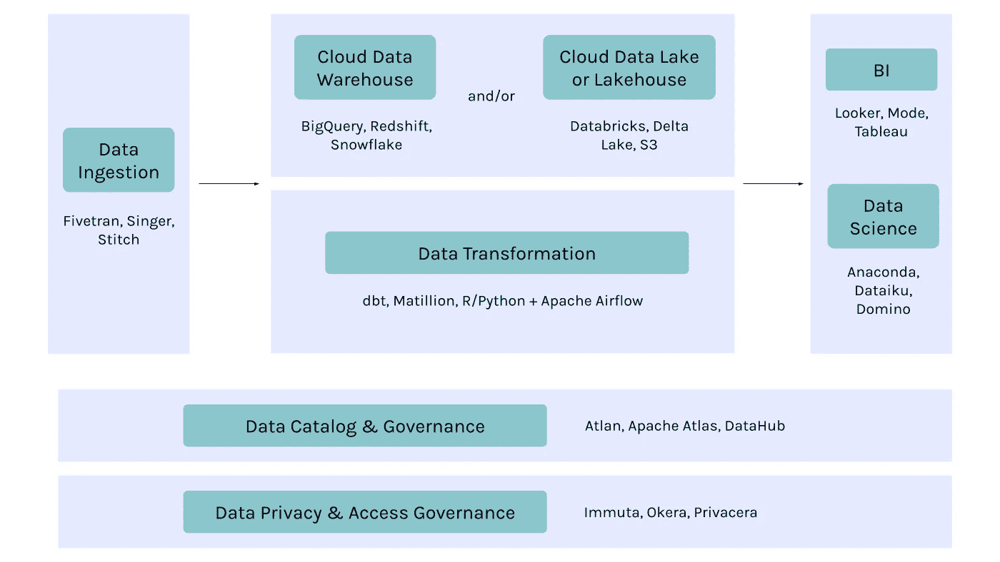

# 现代数据平台的构建模块

> 原文：<https://towardsdatascience.com/the-building-blocks-of-a-modern-data-platform-92e46061165?source=collection_archive---------2----------------------->

## 为您的数据平台计划提供最佳工具和功能的初学者指南

亚当·诺瓦克斯基在 [Unsplash](https://unsplash.com) 上的照片

如果你在谷歌上搜索“现代数据平台”，你会立即被广告和许多声称自己是真正的数据平台的公司轰炸。没什么帮助，对吧？

那么什么是现代数据平台呢？那到底是什么意思，还有**2021 年是什么样子？**

**简而言之:现代数据平台是工具和功能的集合，当这些工具和功能组合在一起时，可以让组织达到黄金标准，即从根本上实现数据驱动的组织。**

**在本文中，我将分析现代数据平台在今天的实践中意味着什么。这包括三个核心特征、六个基本构建模块和您应该知道的最新数据工具。**

# **现代数据平台的 3 个特征**

**鉴于当今数据的庞大规模和复杂性，现代数据平台已不足以处理和存储数据。It 必须以前所未有的速度移动和适应，以跟上数据和数据用户的多样性。有三个基本特征使数据平台真正“现代”。**

## **为各种用户提供自助服务**

**在一个每个人——从商业用户和营销人员到工程师和产品经理——都是分析师的世界里，人们不应该需要分析师来帮助他们理解他们公司的数据。**

**现代数据平台的一个关键方面是它可以被广泛的用户直观地使用。如果有人想把数据带进他们的工作，他们应该能够很容易地找到他们需要的数据。**

**这意味着该平台应该使所有用户能够…**

*   **轻松发现和分析平台中的数据**
*   **了解与数据相关的上下文，如列描述、历史和沿袭**
*   **从数据中获得洞察力，对数据或 IT 团队的依赖性最小**

## **实现“敏捷”数据管理**

**遗留数据平台的主要挑战之一是其复杂性。仅仅是访问数据通常就需要设置耗时的 ETL 作业。需要修改您的数据或查询吗？漫长的过程又重新开始了。**

**现代数据平台旨在改变这种状况。有了构建良好的现代平台，数据驱动的决策应该能够与业务同步发展。**

**管理现代数据平台的两个基本原则是可用性和弹性:**

*   ***可用性*:数据在数据湖或数据仓库中已经可用。现代数据湖和数据仓库将存储和计算分开，这使得以相对低廉的成本存储大量数据成为可能。**
*   ***弹性*:计算基于云平台，具有弹性和自动可扩展性。例如，如果最终用户在周五下午消耗最多的数据和分析，则应该可以在周五下午自动扩展处理能力，为用户提供出色的体验，然后在几个小时内缩减规模。**

## **灵活、快速的设置和按需付费**

**现代数据平台与 Hadoop 时代复杂的本地实施相去甚远。它们构建在云优先、云原生的环境中，这意味着它们可以在几个小时内完成设置，而不是几年。**

**现代平台应该是…**

*   ***易于设置* —没有冗长的销售流程、演示电话和实施周期。只需登录，通过信用卡支付，然后就可以了！**
*   ***随用随付*——无需预付和百万美元的许可费。“现代”堆栈就是将权力交到消费者手中，也就是说，只为你使用的东西付费**
*   ***即插即用* —现代数据堆栈将继续发展和创新，同类最佳的工具不会像传统时代的工具那样强制“锁定”,而是基于开放标准的 API 构建，允许与堆栈的其余部分轻松集成**

# **现代数据平台的关键构建模块**

****

**图片由 [Atlan](https://atlan.com/)**

## **现代数据摄取**

**数据摄取可能是您构建现代数据平台的起点，即，您如何从各种不同的数据源获取数据并将其摄取到您的核心数据存储层？**

**以下是一些关键的现代数据摄取工具:**

*   ***SAAS 工具* : [Fivetran](https://fivetran.com/) ， [Hevo 数据](https://hevodata.com/)， [Stitch](https://www.stitchdata.com/)**
*   ***开源工具* : [歌手](https://www.singer.io/)，[流集](https://streamsets.com/)**
*   **基于流程编排引擎的定制数据接收管道，如[气流](https://airflow.apache.org/)**

## **现代数据存储和处理**

**数据存储和处理层是现代数据平台的基础。虽然这种架构在不断发展，但我们通常会看到 3 种工具或框架:**

**数据仓库:这个架构的基石是一个现代的数据仓库。这些系统通常是分析师的首选，因为它们优化了计算和处理速度。**

**一些关键的数据仓库工具包括 [BigQuery](https://cloud.google.com/bigquery/) 、[红移](https://aws.amazon.com/redshift/)和[雪花](https://www.snowflake.com/)。**

****数据湖:**数据湖架构指的是存储在像亚马逊 S3 这样的对象存储上的数据，以及处理这些数据的工具，比如 Spark。这些廉价的存储系统通常用于存储大量的原始数据，甚至是非结构化数据。**

**以下是数据湖的一些关键工具:**

*   ***数据存储* : [亚马逊 S3](https://aws.amazon.com/s3/) ，[Azure Data Lake Storage gen 2](https://docs.microsoft.com/en-us/azure/storage/blobs/data-lake-storage-introduction)，[谷歌云存储](https://cloud.google.com/storage/)**
*   ***数据处理引擎* : [数据块](https://databricks.com/)或[火花](https://spark.apache.org/)；[雅典娜](https://aws.amazon.com/athena/)、[急变](https://prestodb.io/)，或者[星爆](https://www.starburst.io/)；德雷米奥**

****新趋势预警:数据仓库**！我们今年看到的趋势之一是期待已久的数据仓库和湖泊的融合。这将有助于统一大多数公司在过去十年中创建的孤立系统。**

**例如，一个正在出现的概念是“[数据湖库](https://databricks.com/blog/2020/01/30/what-is-a-data-lakehouse.html)”—一种将数据管理功能(如 ACID 事务和来自数据仓库的变更数据捕获)与数据湖的低成本存储相结合的系统设计。**

**</the-top-5-data-trends-for-cdos-to-watch-out-for-in-2021-e230817bcb16>  

## 现代数据转换

我们今天看到的数据转换层有两个核心实现。对于采用数据仓库优先架构的公司，像 dbt 这样利用原生 SQL 进行转换的工具已经成为数据转换的首选。另一种常见的实现是使用 Airflow 作为编排引擎，并在 Python 这样的编程语言中进行定制转换。

以下是一些用于数据转换的关键工具:

*   *带数据仓库* : [dbt](https://www.getdbt.com/) ， [Matillion](https://www.matillion.com/)
*   *带编排引擎*:[Apache air flow](https://airflow.apache.org/)+[Python](https://www.python.org/)， [R](https://www.r-project.org/) ，或者 [SQL](https://www.iso.org/standard/63555.html)

## 现代商业智能和分析

BI 仪表板已经存在很久了，但最新的 BI 和分析工具是为了适应更大的现代数据平台而构建的。这些通常是更多的自助服务平台，允许用户探索数据，而不仅仅是消费图形和图表。

现代 BI 工具有 [Looker](https://looker.com/) 、 [Mode](https://mode.com/) 、 [Redash](https://redash.io/) 、[适马](https://www.sigmacomputing.com/)、 [Sisense](https://www.sisense.com/) 、 [Superset](https://superset.apache.org/) 、 [Tableau](https://www.tableau.com/) 。

## 现代数据目录和治理

虽然现代数据平台在某些领域很棒(超快、易于扩展、开销小)，但它很难为数据带来发现、信任和上下文。

随着元数据本身成为大数据，我们正处于元数据管理的飞跃之中，该领域将在未来 18-24 个月内出现大量创新。[我最近写了关于数据目录 3.0](/data-catalog-3-0-modern-metadata-for-the-modern-data-stack-ec621f593dcf) 的想法:一个新的软件时代，它将建立在**嵌入式协作**的前提下，这是当今现代工作场所的关键，借用了 Github、Figma、Slack、opinion、Superhuman 和其他当今常见的现代工具的原则。

以下是现代数据编目和治理的一些关键工具:

*   *SAAS 工具:* [Atlan](https://atlan.com/)
*   *开源工具:* Apache [Atlas](https://atlas.apache.org/) ，LinkedIn 的 [DataHub](https://github.com/linkedin/datahub) ，Lyft 的 [Amundsen](https://eng.lyft.com/amundsen-lyfts-data-discovery-metadata-engine-62d27254fbb9)
*   *内部工具:* Airbnb 的[数据门户](https://medium.com/airbnb-engineering/democratizing-data-at-airbnb-852d76c51770)，脸书的 [Nemo](https://engineering.fb.com/2020/10/09/data-infrastructure/nemo/) ，优步的[数据手册](https://eng.uber.com/databook/)

</data-catalog-3-0-modern-metadata-for-the-modern-data-stack-ec621f593dcf>  

## 现代数据隐私和访问治理

最后，随着现代数据平台中工具的增长，一个主要的挑战是能够跨整个堆栈管理隐私控制和访问治理。虽然现在还为时过早，但最近该领域已经出现了一些参与者和发展，并且出现了一些工具，这些工具可以充当授权引擎，在整个数据堆栈中应用隐私和安全策略。

以下是数据隐私和访问治理的一些关键工具:

*   *SAAS 服务* : [Immuta](https://www.immuta.com/) ， [Okera](https://www.okera.com/) ， [Privacera](https://privacera.com/)
*   *开源引擎* : [阿帕奇游侠](https://ranger.apache.org/)

# 你应该知道的其他现代数据工具

上面列出的功能和工具是现代数据平台的基础层。然而，每个公司使用数据的方式不同，因此许多公司针对特定的用例添加了额外的层和工具。

## 实时数据处理工具

需要实时数据处理的公司通常会向其数据平台添加两种额外的工具:

*   *实时流媒体管道* : [汇流](https://www.confluent.io/)，[卡夫卡](https://kafka.apache.org/)
*   *实时分析* : [德鲁伊](https://druid.apache.org/)，[暗示](https://imply.io/)

## 数据科学工具

已经从 BI 和分析转向强大的预测和数据科学分析的公司通常会在其数据堆栈中添加特定的数据科学工具:

*   *数据科学家的首选* : [Jupyter 笔记本](https://jupyter.org/)
*   *其他选项* : [大台库](https://www.dataiku.com/)，[数据机器人](https://www.datarobot.com/)，[多米诺](https://www.dominodatalab.com/)，[萨格马克](https://aws.amazon.com/sagemaker/)

## 事件收集器

拥有大量数字业务的公司通常会添加事件收集器来记录和存储外部事件。像 [Segment](https://segment.com/) 和 [Snowplow](https://snowplowanalytics.com/) 这样的工具是他们数据摄取堆栈的重要补充。

## 数据质量工具

这个领域相对来说还处于萌芽状态，但是现在已经非常活跃了。概括地说，我们看到数据质量的几个方面[融入了整个数据堆栈——概要分析期间的数据质量检查、业务驱动的质量规则，以及管道中的单元测试框架。](/the-top-5-data-trends-for-cdos-to-watch-out-for-in-2021-e230817bcb16)

*   *数据剖析*:这正在被数据目录和治理工具如 [Atlan](https://atlan.com/) 或开源剖析框架如 [Amazon Deequ](https://github.com/awslabs/deequ) 所吞没。
*   单元测试:像开源的[远大前程](https://greatexpectations.io/)这样的框架正在出现和发展，允许单元测试作为数据管道本身的一部分来编写。

**觉得这个内容有帮助？在我的时事通讯《元数据周刊》上，我每周都写关于活动元数据、数据操作、数据文化和我们的学习建设的文章。** [**在此订阅。**](https://metadataweekly.substack.com/)**