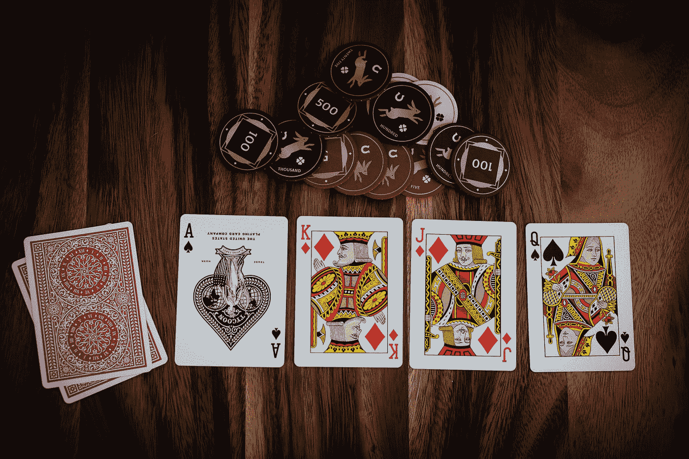
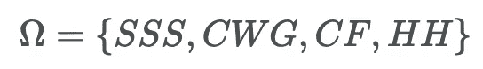
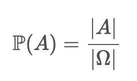
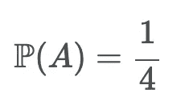
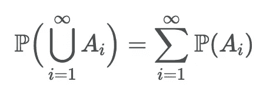
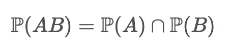
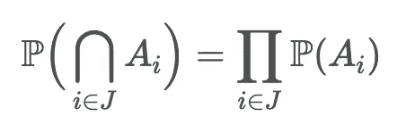
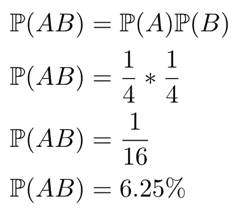

# 概率的积木变得简单

> 原文：<https://towardsdatascience.com/the-building-blocks-of-probability-made-simple-de936d3c1548?source=collection_archive---------19----------------------->

## 三强争霸赛、轮盘和扑克有什么共同点？

迪伦·克里夫顿的照片在 [Unsplash](https://unsplash.com?utm_source=medium&utm_medium=referral) 上

让我们言归正传，讨论一下“概率”到底是什么？

基本上每个事件*和*都被赋予一个实数ℙ(A).换句话说，它是一个将某个事件映射到某个实数的映射。ℙ通常被称为**概率度量**。

这里有一些警告，如果你愿意的话。

ℙ被认为是一个[函数](https://en.wikipedia.org/wiki/Function_(mathematics))，而不仅仅是**任何**函数。它需要是一个遵循三条规则的函数，稍后会详细介绍。

首先，需要注意的是，概率度量只是**一种**类型的“度量”。有许多不同的测度，对它们的研究被称为“测度论”。

但是这个帖子不是关于**测量理论**。

## 先决条件和符号

*   ω:样本空间；被认为是一个[集合](https://en.wikipedia.org/wiki/Set_(mathematics))。
*   ω:样本结果。
*   *A* :事件；ω的[子集](https://en.wikipedia.org/wiki/Set_(mathematics))。
*   | *A* |:集合中元素的个数 *A.*
*   a ∈ *S* :值 a 是集合 *S* 的“一个成员”或简单地“在”集合*S*中。

那么是什么让一个**概率度量**如此特别，又是什么让它不同于任何其他度量？

好吧，在你回答这个问题之前，我们先来看一个激励人心的例子！

在三强争霸赛的第一个任务中，所有四个冠军都被要求把手伸进一个装有四条微型龙的袋子里:瑞典短吻龙、普通威尔士绿龙、中国火球龙和匈牙利角尾龙！加分，对于那些知道哪个冠军选择了哪个龙的人。

我们将这第一个任务选择称为**实验**。为了简化，我们假设哈利·波特总是先选择(否则对这个实验建模会更困难)。

## 概率测度

哈利·波特实验的样本空间如下:

哈利选择瑞典短吻鳄的事件是 *A* = {SSS}。

[李中清](https://unsplash.com/@picsbyjameslee?utm_source=medium&utm_medium=referral)在 [Unsplash](https://unsplash.com?utm_source=medium&utm_medium=referral) 上拍照

在这个实验中，样本空间是**有限的**，这意味着样本空间中包含的元素数量是有限的。在这种情况下，样本空间中有四个元素，我们的事件中有一个元素:|ω| = 4 和| *A* | = 1。如果ω和每个样本结果的可能性相等，则:

请记住，这只适用于概率度量的特定选择。然而，这是概率度量最常见的选择，但我们也可以选择不同的方法。因此，哈利从袋子里选择瑞典短吻猪的概率是

很简单。根据我们刚刚学到的知识，现在，我问，概率度量的最高值是多少？它能取的最低值是多少？换句话说，ℙ函数的界限是什么？回想一下，在我们上面的例子中，ω= { SSS，CWG，CF，HH}那么ℙ(ω)= 1(意味着“事件的概率ω”)。哈利·波特选择瑞典短吻龙、普通威尔士绿龙、中国火球或匈牙利犀鸟的概率是 1.0，因为他必须从这四种龙中选择一种！换句话说，以前的事件会对将来的事件产生影响。

**定义**:如果满足以下条件，函数ℙ是一个概率测度:

**规则 1**:ℙ(*a*)≥0
**规则 2**:ℙ(ω)= 1
**规则 3** :如果 A₁，A₂，…是不相交的

如果两个事件不能同时发生，则认为它们是不相交的(互斥的)。例如，我们不能同时向左转和向右转，在篮球中投篮和传球，或者掷骰子并让它落在两个不同的数字上。

## 独立和从属事件

随机事件在生活中无时无刻不在发生，比如，在免下车餐馆的五个人中，哪一个会和你点一样的菜，或者一家商店有你的运动鞋尺码的可能性有多大？大多数情况下，样本空间很小:两个“是”或“不是”的结果。然而，把握这些结果很重要。

看，就像我告诉我家人的，不要担心事情，相信数字，一切都会好的。

然而，为了导航，我们必须讨论两个非常重要的概念:1) **独立**和 2) **依赖**事件。

从属事件是指依赖于之前发生的事件的事件。最好的例子就是扑克！之前的牌对之后的牌(翻牌圈、转牌圈和河牌)有很大影响。这些被称为相关事件，因为未来的事件依赖于以前发生的事件。反过来，一个独立的事件并不关心之前的事件。

简单。不要想多了！

**定义**两个事件 A 和 B 是独立的，如果

一组事件{Aᵢ : *i* ∈ *I* }是独立的如果

例如，在赌场的轮盘赌桌上，你有时会看到一个屏幕，显示球落在红色和黑色上的次数。通常，球员会认为既然球已经落在红色上 100 次，落在黑色上 90 次，那么在接下来的投掷中，球更有可能落在黑色上。然而，**每次**球被滚动，这被认为是一个**独立事件**，事实并非如此，通常被称为[赌徒谬误](https://en.wikipedia.org/wiki/Gambler%27s_fallacy)。因此，屏幕是没有意义的！

回到我们的哈利波特的例子。假设当哈利从袋子里选择一条龙时，它会被放回袋子里，让下一个人选择。因此，哈利和塞德里克都有可能选择匈牙利犀鸟。在这种假设下，袋中选龙的概率就成了独立事件。哈利(ℙ(A))和塞德里克选择匈牙利犀鸟(ℙ(B))的概率有多大？

简单的按照定义。将两个概率相乘:

分析依赖事件有点棘手，需要单独发布。总之，在这篇文章中，我们学习了概率的定义，以及如何用它来理解日常生活中可能发生的基本事件。