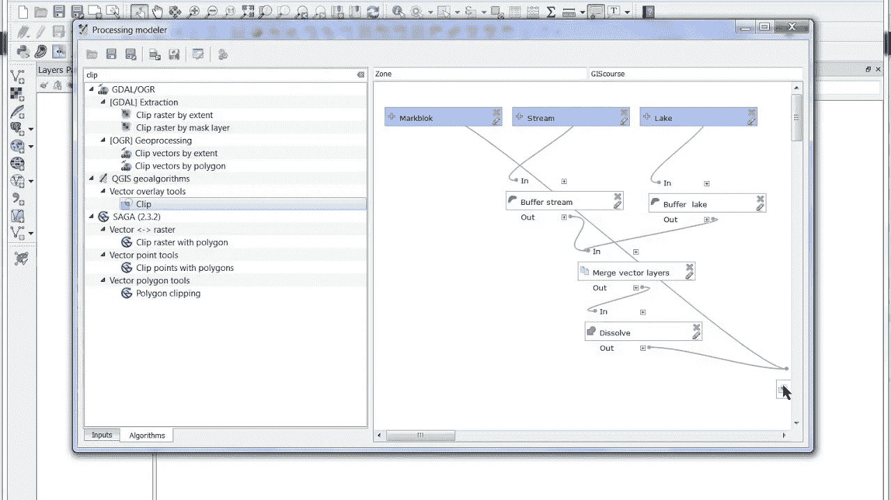
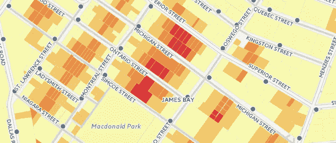
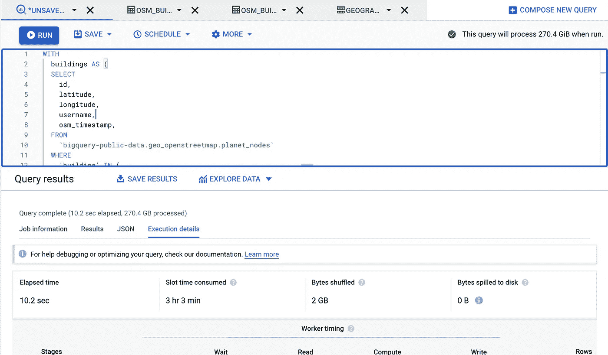

# 使用空间 SQL 的案例

> 原文：<https://towardsdatascience.com/the-case-for-using-spatial-sql-1bf25b3b800d?source=collection_archive---------22----------------------->

## 为什么空间 SQL 很重要，以及它如何帮助您加快 GIS 和地理空间工作流的速度


盖尔·加博雷尔在 [Unsplash](https://unsplash.com/s/photos/globe?utm_source=unsplash&utm_medium=referral&utm_content=creditCopyText) 上的照片

那是 2012 年的春天，我第一次遇到了 SQL 查询。

2011 年底，我刚搬到纽约，花了一个下午的时间在 CARTO 办公室观看他们平台的演示。CARTO 的创始人贾维尔·德·拉·托雷向我展示了他们为上传、可视化和在网上发布地图而开发的神奇工具。

然后他按了一下屏幕上的开关，告诉我:

> 在这里，您可以在 PostGIS 中编写任何想要的查询，并立即将其显示在地图上！

```
SELECT * FROM us_states
```

这是我第一次看到 SQL 查询，虽然我当时并不知道，但这个简单的语句将成为我未来日常工作中不可或缺的一部分，并以惊人的方式帮助我提高技能。

多年来，我已经成为空间 SQL 的主要倡导者，我相信这是我投资的最重要的技能之一。也就是说，开始可能会让人望而生畏。

要使用空间 SQL，您需要有扎实的常规 SQL 基础，同时还要理解空间 SQL 的细微差别，这无疑需要时间。但最终，投资回报会弥补这一点:您可以更有效率，并获得大量自由，因为您将永远不必依赖任何工具或界面来分析或操作您的地理空间数据。

# 什么是空间 SQL，为什么它与普通 SQL 不同？

[来源](https://giphy.com/gifs/nike-ad-9JgeSP0jlRAVBOG9FD)来自 GIPHY

很棒的问题！空间 SQL 使用普通 SQL 的所有相同元素和结构，但允许您使用另一种数据类型:几何或地理。

*   几何是指数据位于投影坐标系或地球的平面表示中
*   地理是指你的数据在地球上(或其他地方，如[火星](http://www.bostongis.com/blog/index.php/archives/266-geography-type-is-not-limited-to-earth.html?utm_source=postgresweekly&utm_medium=email))以球面坐标表示的地方。你可以在这里阅读更多关于两个[的区别。](https://blog.crunchydata.com/blog/postgis-and-the-geography-type)

随着这些新的数据类型而来的是一组函数，通常用 ST(如 ST_Intersects)表示，ST 代表**空间类型。**

许多数据库提供空间功能，例如:

*   带 PostGIS 的 PostgreSQL
*   Microsoft SQL Server
*   关系型数据库
*   带空间元素的 SQLite
*   甲骨文空间

以及数据仓库，例如:

*   谷歌大查询
*   雪花
*   AWS 红移

# 那么，为什么要学习空间 SQL 呢？

就个人而言，它使我能够用空间数据和非空间数据做任何我能想到的事情。如果我能想到，我可以用空间 SQL 来实现。这也意味着我从不依赖任何单一的工具或数据管理解决方案。如果您将数据存储在具有空间化 SQL 的数据库中，您可以做任何需要做的事情。

简而言之，它使您对空间数据的处理更加高效、可重复和可扩展。

# 哪些人应该学习空间 SQL？

就个人而言，我认为任何使用空间数据的人都应该有一些使用空间 SQL 的经验，但是有几个群体绝对应该在空间 SQL 上投入一些时间:

*   使用基于 SQL 的数据库(如 PostgreSQL/PostGIS 或空间化数据仓库)中的数据的团队
*   空间数据科学家或使用空间数据的数据科学家
*   寻求分析和工作流更大灵活性的 GIS 用户
*   前端开发人员使用空间数据(尤其是地图)创建应用程序
*   寻求传统建模工具或软件更大灵活性的分析师
*   组织中处理大量可能具有空间成分(地名、地址、纬度/经度等)的数据的人员。)

# 空间 SQL 有什么优势？

我将介绍几个关键领域，希望能让您相信学习空间 SQL 是一项值得的投资:

*   提高日常工作流程的效率
*   确保组织内外的可重复性
*   在您的组织中跨职能工作
*   创建高效的工作流和任务管理
*   在支持 SQL 的数据仓库中处理大规模数据

让我们详细分析一下每一项:

# 提高日常工作流程的效率

[资料来源](https://giphy.com/gifs/funny-elephant-fast-Gpu3skdN58ApO)来自 GIPHY

空间 SQL 可以通过几种不同的方式提高工作效率。与传统 GIS 工作流中加载和读取文件不同，数据已经存在。即使您需要加载数据，也有许多工具可以帮助您这样做，并在数据发生变化时更新数据。不需要每次启动项目时都读取新文件，当数据变大时，这是非常有益的。

在[地图抓取](https://open.spotify.com/show/57EmXdDgrUNYxtrer6LVsI)播客的“*空间 SQL —没有 GIS 的 GIS* ”一集中，[保罗·拉姆齐](http://blog.cleverelephant.ca/)讲述了在 GIS 中学习和使用 SQL 的优势和必然性:

> 毫无疑问，如果你想让你的职业生涯超越…由你和其他程序员提供的抽象概念，你会想要学习 SQL…

除此之外，还有 SQL 的灵活性。假设您想要返回一个包含以下内容的查询:

您始终可以使用空间 SQL 创建新要素，并动态连接/聚合数据:

*   多边形质心纬度/经度
*   到另一点的距离
*   连接另一个表中的值

这很容易在一个查询中完成:

不仅如此，您还可以在一个查询中连接其他数据(空间数据和非空间数据)、限制和过滤数据等等。在更传统的 GIS 工作流中，您需要类似模型构建器的工具来完成这一任务。



QGIS 中的 GIS 模型示例— [来源](https://www.youtube.com/watch?v=1-ENmwX_buw)

在 Python 中，您可以执行许多相同的功能，特别是使用 Geopandas 处理空间关系。[但是在规模](https://blog.dask.org/2017/09/21/accelerating-geopandas-1)上，你通常需要添加一些其他库来匹配 PostGIS 或另一个 SQL 数据库的性能。

更不用说在许多空间数据库中，你可以[在你的几何图形上创建索引](http://blog.cleverelephant.ca/2021/05/indexes-and-queries.html)以使使用几何图形的操作和功能运行得更快。

# 确保组织内外的可重复性

[来源于 GIPHY 的](https://giphy.com/gifs/fallontonight-bryan-cranston-tonightshow-do-it-again-bNpLfNOskgvGIfKIZN)

SQL 的一个优点是它非常具有可移植性，这意味着代码片段可以很容易地在您的团队中共享。

当有人编写了一个非常棒的查询或查询的一部分时，你可以共享它，任何人(只要他们在同一个数据库上，并且可以访问相同的表)都可以使用它，这是我们 CARTO 团队每周至少发生一次的事情。

对模型构建器这样的东西做同样的事情不仅意味着来回传递文件，还意味着传递模型文件和其他数据。此外，只获取一个模式的一部分并添加到您的模型中并不像简单地复制和粘贴一段 SQL 代码那么简单。

不仅如此，您还可以利用其他 SQL 用户在线共享的大量在线信息。您可以从博客、StackOverflow 帖子、Gists 以及 spatial SQL 社区中获得无穷无尽的资源。

我反复使用的一个例子来自 PostGIS 的创始人之一保罗·拉姆齐的帖子，关于如何运行[批量最近邻查询](https://carto.com/blog/lateral-joins/)。



在大约 3 秒钟内找到 30，000 多块地产到最近的 PostGIS 消防栓的距离— [来源](https://carto.com/blog/lateral-joins/)

简而言之，它表明您可以快速地做事情并使其可重复，并提供代码供他人使用和扩展。

# 在您的组织中跨职能工作

[来源](https://giphy.com/gifs/nfl-football-touchdown-l3mZjdRvlqk4LB0A0)来自 GIPHY

如果您在一个执行 GIS 或地理空间分析的组织中与其他执行非空间分析的团队一起工作，那么您就知道将这些领域结合在一起会产生多大的潜力。

“数据在哪里，就去哪里”的思想在这里适用，因为大多数团队将生产级数据存储在某种 SQL 数据库中。

通过确保您可以无缝地跨职能地工作，意味着您不仅仅局限于您团队的数据。你也可以把宝贵的空间专业知识带给其他团队学习，反之亦然。

这方面的一个例子是一家零售公司，它在不同的商店存储有关个人购买的交易数据。使用空间数据，您可以创建包含客户人口统计数据的贸易区，以与客户购买数据相结合，从而了解不同的人口统计特征如何影响不同产品的性能或需求。

# 创建高效的工作流和任务管理

关于 SQL 和数据库，我最喜欢的一点是它们对于不同任务的可扩展性:

*   当新数据可用时，用 Update 语句更新记录
*   使用触发器根据特定表中发生的事件设置操作
*   使用几何索引使空间关系查询更快、更有效
*   使用用户定义的函数创建自己的函数

一个非常简单的例子，但是让我们假设您有一个定期插入新数据的表，您想从数据中的纬度和经度字段创建一个几何，并从另一个表中计算一定距离内的位置数。

使用 PostgreSQL 中的[触发器，您可以设置一次，并且(在大多数情况下)再也不用担心它了。](https://www.postgresqltutorial.com/postgresql-triggers/)

[来源于 GIPHY 的](https://giphy.com/gifs/billy-mayes-1hMjJILpxoWpQad37L)

# 在支持 SQL 的数据仓库中处理大规模数据

数据仓库在许多大大小小的组织中变得越来越普遍，因为它们能够在一个公共数据存储库中快速查询大型数据集。你可以在这里了解更多关于数据仓库的信息。

主要的数据仓库(如 BigQuery、Snowflake 和 Redshift)预装了许多空间函数，随时可供使用。除了空间功能，您还可以使用机器学习工作流，如 [BigQuery ML](https://cloud.google.com/bigquery-ml/docs/introduction) 和 CARTO 等平台，通过直接来自数据仓库的[空间扩展](https://docs.carto.com/spatial-extension-bq/overview/getting-started/)为空间分析和可视化带来额外的功能。

为了突出数据仓库的速度，您可以在下面看到一个示例查询，它计算 OpenStreetMap 中属于每个美国人口普查区块组的建筑物数量。



10 秒钟内 110 万栋建筑物与所有美国区块组(270 GB 数据)的空间交集！根据消耗的时间段，可能需要 3 个小时的事情—取自个人查询

我希望这能启发你自己尝试空间 SQL，我还计划继续写一些教程！

*马特·福里斯特目前在* [*CARTO*](https://carto.com/) *工作，这是一个使用大量空间 SQL 的空间平台。如果您对空间 SQL 或如何开始有任何疑问，请随时联系*[*LinkedIn*](https://www.linkedin.com/in/mbforr/)*。*