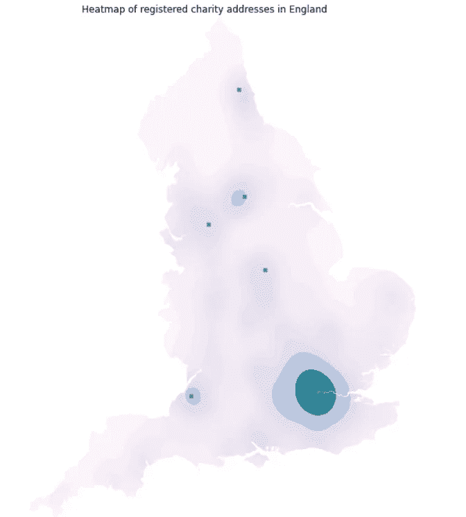
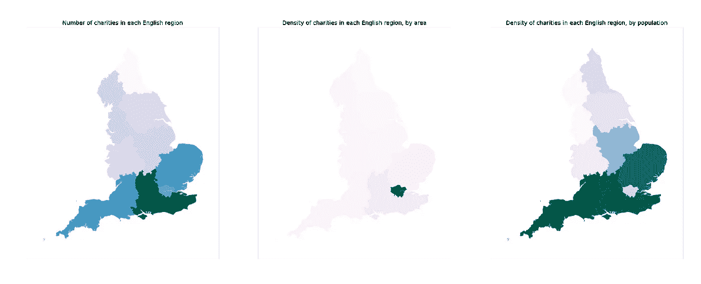
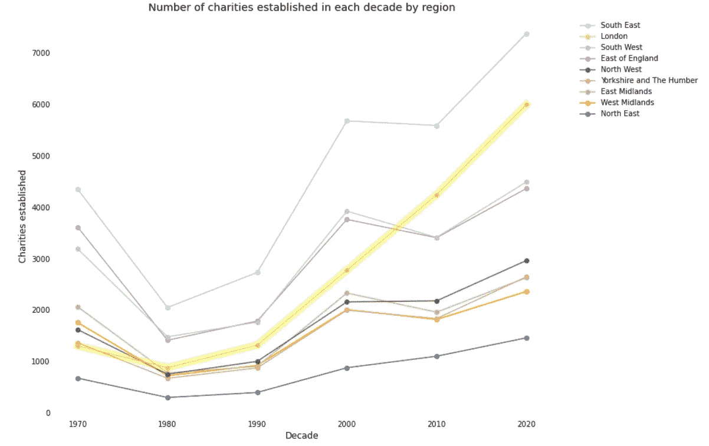
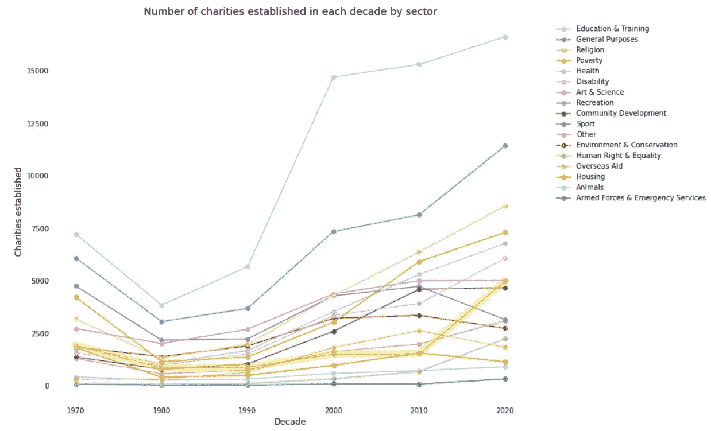

# 慈善部门真的是以伦敦为中心的

> 原文：<https://towardsdatascience.com/the-charity-sector-is-like-really-london-centric-8d2e81c234e9?source=collection_archive---------27----------------------->

## 使用公开可用的数据绘制英格兰每个慈善机构的位置。

毫不奇怪，英格兰的慈善机构非常集中在伦敦，但看看慈善委员会关于英格兰目前注册的大约 14 万个慈善机构的详细资料，就会发现这种聚集的程度远远超出了我的想象。

作者图片

这是我开始学习 Python 语言数据分析以来，第一次深入研究大型数据集的结果。因此，它是不完整的，很可能有缺陷。我要说的是，在你根据原始数据采取任何行动之前，请仔细检查原始数据。

左边的图表显示了伦敦的引力有多明显。其他活动的点代表明显的大城市中心，如曼彻斯特和利物浦，但令人惊讶的是，在利兹、布里斯托尔、诺丁汉和纽卡斯尔也有重要的点，原因对我来说不是很明显。

作者图片

## 无论你往哪个方向看，南方都占主导地位

热图并不能说明全貌。当我们看任何一个地区的慈善机构数量时，东南部是最高的，但我们仍然看到南部和东部与该国其他地区之间的明显差异。当我们将慈善机构的数量与每个地区的面积相比时，伦敦再次占据主导地位，几乎完全掩盖了地图的其余部分。最后，当我们将慈善机构的数量与每个地区的人口进行比较时，西南地区占主导地位，但南部和东部、中部和北部之间的对比再次形成鲜明对比。

作者图片

## 伦敦以外的城市中心吸引慈善机构

可以预见的是，即使在个别地区，慈善机构主要在人口多的地方注册。虽然这是预料之中的，而且几乎肯定会与其他活动的集中重叠，但在这些地区之外似乎确实存在相对的沙漠，使得农村地区的人们可能得不到慈善服务。

# 随着时间的变化

作者图片

《1960 年慈善法》引入了慈善机构登记制度，因此在 1970 年之前的十年中有大量登记，从 20 世纪 70 年代开始，与上一个十年相比，每十年新慈善机构的数量都有所增加。鉴于这些数据是基于目前注册活跃的慈善机构，这并不特别令人惊讶。

各地区之间的差异基本保持不变，中部和北部以及南部之间的差距略有扩大。伦敦是个例外，如图所示，自上世纪 90 年代以来，伦敦的市场份额大幅上升。

至于为什么会出现这两种趋势，我无法给出详细的答案，但慈善行业也不能幸免于技术和研究生水平的工作流向伦敦的趋势，这可能是一个恶性循环，慈善机构认为他们必须在南方吸引最好的人才，吸引更多的人才到伦敦来，等等。新慈善机构的普遍增加可能是由于需求增加、慈善事业增加，或者一些更世俗的因素，如更多的融资机会只适用于注册慈善机构。

## 受益者、部门和服务因地区而异

我惊讶地发现，除了伦敦的宗教和扶贫慈善机构略有过多之外，慈善机构在不同地区运营的部门分布没有太大差异。鉴于全国各地的不同需求，我认为伦敦的慈善机构集中在国内和国际上，我预计会有更多的分布。

各地区的受益者可能比各个部门更加一致，只有伦敦例外，那里有更多针对特定种族的慈善机构，考虑到伦敦的大都市性质，这并不奇怪。

提供的服务类型稍有不同，但仍相当一致，东北地区和伦敦是明显的例外，东北地区提供赠款的慈善机构较少，伦敦的慈善机构较少，但有更多的慈善机构提供宣传和建议，并进行研究，这可能反映了伦敦慈善机构的更大专业化。

作者图片

## 慈善部门的每个部分都在增长

自 1970 年代以来，除了少数例外，每个部门、受益者和服务群体都提高了增长率。最大的群体倾向于以更快的速度变大。也有一些例外，如娱乐部门和提供宣传的慈善机构的增长。

总体而言，慈善领域的情况是，规模较大的团体继续增长最快，而那些关注动物、帮助特定族裔群体或进行研究的团体等代表性较低的团体增长较慢，现在占该领域的比例比前几十年小得多。

## 慈善部门似乎相当稳定

可能有很多因素没有在这个数据中捕捉到，但这个数据集包括了英格兰目前运营的每一个慈善机构，以及他们告诉慈善委员会他们正在做什么，所以它呈现的画面值得关注。

这种情况并不代表该国的状况或需求。它主要以伦敦为基地，并没有根据其运营地的独特需求调整其在全国的行动。它的部门、受益者和活动不会随着挑战的变化而变化。英国各地的不平等正在加剧，但关注贫困的慈善机构并没有增加在该领域的代表性。我们比以往任何时候都更加意识到种族和民族问题，以及影响不同群体的挑战可能是该群体所特有的，但专注于特定民族群体的慈善机构仍然明显不足。

我自己对该行业的经验是，它为自己试图做正确的事情而沾沾自喜，但却依赖于旧策略，不质疑假设，并厌恶风险。随着这个行业变得越来越专业化，它越来越倾向于有专业技能、有能力但没有经验的人——包括我自己。

我的经验与这些数据所呈现的画面相吻合，但我不认为我们可以从中得出任何有力的结论，但或许其他花更多时间从整体上观察该行业的人可以将它与其他发现结合起来，给出一个更清晰的想法，说明为什么我们会看到如此黯淡的画面。

我很想听听人们对这项工作的印象，对我的业余分析的批评，或者任何额外的见解。你可以在 Twitter [@willhoyles](https://twitter.com/WillHoyles) 上找到我，或者发邮件到 will@whocommunications.co.uk[给我，在 GitHub](mailto:will@whocommunications.co.uk) 上阅读[的完整笔记本。](https://github.com/willhoyles/charity_data)