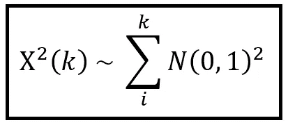
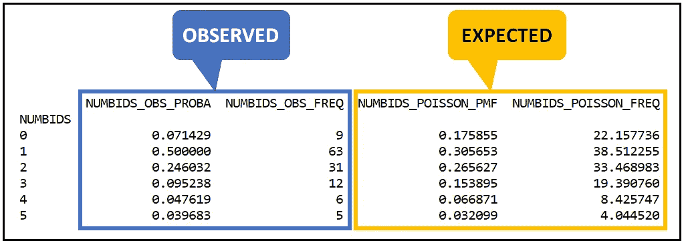
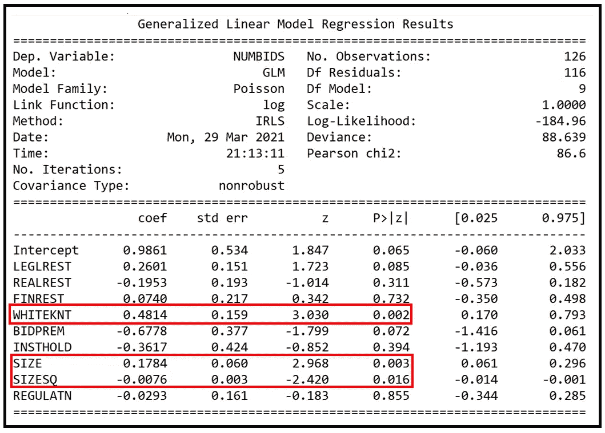

# 回归分析的卡方拟合优度检验

> 原文：<https://towardsdatascience.com/the-chi-squared-goodness-of-fit-test-for-regression-analysis-b2d2e4b487ab?source=collection_archive---------15----------------------->


观察到的和预期的 NUMBIDS 频率(图片由[作者](https://sachin-date.medium.com/)提供)

## 以及如何使用 Python、SciPy 和 Statsmodels 来使用它的教程

卡方检验(读作 *Kai-* 平方，如 *Kai* zen 或 *Kai* ser)是最通用的统计显著性检验之一。

以下是卡方检验的一些用途:

1.  **分布的拟合优度:**卡方检验可用于确定您的数据是否符合已知的理论概率分布，如正态或泊松分布。
2.  **回归模型的拟合优度:**卡方检验可用于测量您的训练回归模型在训练、验证或测试数据集上的拟合优度。
3.  **最小卡方估计:**对于服从参数分布(如正态分布、泊松分布或二项式分布)的数据集，卡方检验可用于找出观察值服从理论分布的参数范围。
4.  **独立性检验:**卡方检验可用于检验两个分类随机变量(如年龄和收入，其值已在实验中测量)是否相互独立。
5.  **残差分析:**在某些[广义线性回归模型](/generalized-linear-models-9ec4dfe3dc3f)中，**皮尔逊残差**在残差是独立的同分布正态变量的零假设下服从(缩放)卡方分布，表明拟合模型的拟合优度很高。
6.  **嵌套回归模型的拟合优度:**可用于比较嵌套回归模型对数似然性的**偏差统计量**遵循卡方分布，假设添加回归变量不会增加模型的拟合优度。因此，选择两种型号中较简单的型号可能会更好。
7.  **与 G 平方检验的关系:**当观察值和期望值几乎相等时，拟合优度的 G 检验简化为拟合优度的卡方检验。

在本文的其余部分，我们将重点关注卡方检验在回归分析中的应用。

我们将使用真实世界的数据集**收购出价**，这是回归建模文献中的一个流行数据集。我们将使用 [*SciPy*](https://docs.scipy.org/doc/scipy/reference/stats.html#module-scipy.stats) 和 [*Statsmodels*](https://www.statsmodels.org/stable/index.html) 库作为我们的实现工具。

# **卡方检验的起源**

卡方检验基于**卡方分布**。卡方分布是将 *n* 个独立随机变量的平方相加得到的，每个变量都遵循标准正态分布，即每个正态变量的均值和单位方差都为零。

以符号形式:



以 k 个标准正态随机变量的平方和表示的𝛘概率分布(图片由[作者](https://sachin-date.medium.com/)

总和中的 *N(0，1)* 表示均值和单位方差为零的正态分布随机变量。如果你将 k 个 T21 这样的变量和它们的“实现”值的平方相加，你会得到一个自由度为 k 的卡方分布。

如果人们愿意将 1/方差比例因子添加到结果分布中，则可以放宽单位方差约束。

*𝛘 (k)* 分布的均值为 *k* ，方差为 *2k* 。下图取自维基共享资源，显示了随着 *k* 值的增加， *𝛘 (k)* 的形状:


k 自由度的 Ch 平方概率分布(来源:[维基媒体](https://commons.wikimedia.org/wiki/File:Chi-square_pdf.svg)下 [CC BY 3.0](https://creativecommons.org/licenses/by/3.0/deed.en) )

> 卡方检验可用于那些被证明在零假设下渐近遵循卡方分布的检验统计量。

现在让我们看看如何使用卡方拟合优度检验。

# **使用卡方检验测试已知概率分布的拟合优度**

为了测试给定的数据集是否服从已知的概率分布，我们使用以下称为皮尔逊卡方统计量的测试统计量:


检验观察值是否服从某种期望的频率分布的检验统计量(图片由[作者](https://sachin-date.medium.com/)提供)

其中:

*O_i* 是随机变量的*与*结果的观测频率。
*E_i* 是随机变量第*次与第*次结果的期望频率。

可以看出，对于 *O_i* 和 *E_i* 的“足够大”的值，并且当 *O_i* 与 *E_i* 相差不大，即数据没有严重分散时， ***T*** 遵循具有*N-p*自由度的卡方分布，其中 *N* 是类别的数量例如，当理论分布是泊松分布时， *p=1* ，因为泊松分布只有一个参数——平均利率。

# **示例**

让我们看看如何在一组实际的观察数据上使用这种检验，我们将假定这些数据是泊松分布的，我们将使用卡方拟合优度检验来证明或否定我们的假设。

我们将使用的观察数据集包含 1978 年至 1985 年间记录的 126 个公司收购活动观察数据。每个观察包含几个参数，例如经历了接管事件的公司的规模(以十亿美元计)。因变量' ***y*** '是对该公司进行的收购出价的数量。需要注意的一点是，该数据集中的所有 126 家公司最终都是在对每家公司的最终记录收购出价后的某个时期内被收购的。

数据集可以从这里下载[。](https://gist.github.com/sachinsdate/08039ec2685b77a4af4b20feca23ec1f)

让我们从导入所有必需的 Python 包开始:

```
**import** pandas **as** pd
**import** numpy **as** np
**from** patsy **import** dmatrices
**from** matplotlib **import** pyplot **as** plt
**from** scipy.stats **import** poisson
**import** scipy.stats **as** stats
**import** statsmodels.api **as** sm
```

让我们将数据集读入熊猫数据帧:

```
df = pd.**read_csv**(**'takeover_bids_dataset.csv'**, header=0, index_col=[0])
```

打印出前 15 行。每行包含一个独特公司的收购相关活动:

```
df.**head**(15)
```


我们感兴趣的变量如下:

## **解释变量(X 矩阵):**

*BIDPREM* :买入溢价=买入价格/买入前 15 天的股票市价。
*FINREST:* 指示变量(1/0)，表示公司的股权结构是否拟变更。
*机构持股:*机构持股比例。
*【legl rest:*指示变量(1/0)表示被接管的公司是否进行了法律辩护。
*REALREST:* 指示变量(1/0)，表示公司的资产结构是否拟变更。
*REGULATN:* 指示美国司法部是否干预的指示变量(1/0)。
*规模:*以十亿美元计的公司规模
*规模 SQ:* 规模的平方，以说明规模中的任何非线性。
*WHITEKNT:* 指示变量(1/0)，表示公司管理层是否邀请了任何友好投标，例如用于避免敌意收购的投标。

## **因变量(y 向量):**

***NUMBIDS****:*整数，包含对公司进行的收购出价的数量。

打印因变量的汇总统计数据:NUMBIDS

```
stats_labels = [**'Mean NUMBIDS'**, **'Variance NUMBIDS'**, **'Minimum NUMBIDS'**, **'Maximum NUMBIDS'**]stats_values = [**round**(df[**'NUMBIDS'**].**mean**(), 2), round(df[**'NUMBIDS'**].**var**(), 2), df[**'NUMBIDS'**].**min**(), df[**'NUMBIDS'**].**max**()]**print**(**set**(**zip**(stats_labels, stats_values)))
```

我们看到以下统计数据:

```
{(‘Mean NUMBIDS’, 1.74), (‘Variance NUMBIDS’, 2.05), (‘Minimum NUMBIDS’, 0), (‘Maximum NUMBIDS’, 10)}
```

我们注意到 *NUMBIDS* 的平均值是 1.74，而方差是 2.05。它们很接近，但不相同。存在少量的过度分散，但这不足以排除 *NUMBIDS* 可能是理论平均速率为 1.74 的泊松分布的可能性。

让我们形成两个假设:

**H0:** *NUMBIDS* 遵循平均值为 1.74 的泊松分布。

**H1:** H0 是假的。 *NUMBIDS* 不是泊松分布。

我们将继续我们的探索，用卡方拟合优度检验来证明(或否定)H0。为此，我们将使用以下步骤:

1.  定义这两个假设。我们已经这样做了。
2.  为***y =****NUMBIDS*变量的每个值计算观察到的频率 *O_i* 。
3.  假设泊松分布 ***y*** ，计算***y =****NUMBIDS*的每个值的期望频率 *E_i* 。
4.  计算我们上面给出的测试统计量。
5.  在卡方表中查找检验统计的 p 值。如果 p 值小于 0.05，拒绝 95%置信水平的 H0，否则接受相同置信水平的 H0 ( *即 NUMBIDS* 为泊松分布)。

为了计算观察到的频率 *O_i* ，让我们创建一个分组数据集，按 *NUMBIDS* 的频率分组。

```
grouped_df = df.**groupby**(**'NUMBIDS'**).**count**().**sort_values**(**by**=**'NUMBIDS'**)
grouped_df[**'NUMBIDS_OBS_FREQ'**] = grouped_df[**'SIZESQ'**]
```

打印分组的数据集:

```
**print**(grouped_df[**'NUMBIDS_OBS_FREQ'**])
```


观察到的数字频率(图片由[作者](https://sachin-date.medium.com/)提供)

我们看到*数字> = 5* 的频率非常少。卡方检验对于频率非常小的箱是不准确的。为了解决这个问题，我们将对所有 *NUMBIDS > = 5* 的频率求和，并将该数字与 *NUMBIDS=5 相关联。*

```
grouped_df.**at**[5, **'NUMBIDS_OBS_FREQ'**] = 5
```

让我们也删除 *NUMBIDS > 5* 的行，因为*NUMBIDS = 5*捕获所有 NUMBIDS > =5 的频率。

```
grouped_df = grouped_df.**drop**([6,7,10])
```

同时计算并存储 *NUMBIDS* 的观测概率。

```
grouped_df[**'NUMBIDS_OBS_PROBA'**] = grouped_df[**'NUMBIDS_OBS_FREQ'**]/**len**(df)
```

现在，假设 *NUMBIDS* 是泊松分布，计算并存储 *NUMBIDS* 的期望概率。

```
grouped_df[**'NUMBIDS_POISSON_PMF'**] = poisson.**pmf**(**k**=grouped_df.**index**, mu=df[**'NUMBIDS'**].**mean**())
```

对于 *NUMBIDS > =5* ，我们将使用泊松**生存函数**，它将给出我们看到 *NUMBIDS > =5 的概率。*

生存函数 *S(X=x)* 给出了观察到大于 *x 的 *X* 值的概率，即 S(X=x) = Pr(X > x)*

```
grouped_df.**at**[5, **'NUMBIDS_POISSON_PMF'**] = poisson.**sf**(**k**=4, mu=df[**'NUMBIDS'**].**mean**())
```

计算每个*数字*的泊松分布期望频率 *E_i*

```
grouped_df[**'NUMBIDS_POISSON_FREQ'**] = grouped_df[**'NUMBIDS_POISSON_PMF'**]***len**(df)
```

打印观察值和预期值:

```
print(grouped_df[[**'NUMBIDS_OBS_PROBA'**, **'NUMBIDS_OBS_FREQ'**, **'NUMBIDS_POISSON_PMF'**, **'NUMBIDS_POISSON_FREQ'**]])
```

我们看到以下输出:



观察到的(O_i)和预期的(E _ I*)*NUMBIDS 的频率(图片由[作者](https://sachin-date.medium.com/)提供)

绘制所有 *i* 的观察值( *O_i* )和期望值( *E_i* ):

```
labels=[**'0'**, **'1'**, **'2'**, **'3'**, **'4'**, **' >=5'**]
x = np.**arange**(len(labels))
width = 0.35
fig, ax = plt.**subplots**()ax.**set_title**(**'Poisson Predicted versus Observed Frequencies of NUMBIDS'**)ax.**set_xlabel**(**'NUMBIDS'**)
ax.**set_ylabel**(**'Frequency of NUMBIDS'**)
ax.**set_xticks**(x)
ax.**set_xticklabels**(labels)bar1 = ax.**bar**(**x**=x - width/2, **height**=**list**(grouped_df[**'NUMBIDS_OBS_FREQ'**]), **width**=width, **label**=**'Observed Frequency'**)bar2 = ax.**bar**(**x**=x + width/2, height=list(grouped_df[**'NUMBIDS_POISSON_FREQ'**]), **width**=width, **label**=**'Expected Frequency'**)ax.**legend**()
ax.**bar_label**(bar1, padding=3)
ax.**bar_label**(bar2, padding=3)
fig.**tight_layout**()
plt.**show**()
```

我们看到下面的情节:


NUMBIDS 的观察频率和预期频率的柱状图(图片由[作者](https://sachin-date.medium.com/)提供)

现在让我们计算卡方检验统计量:


卡方拟合优度检验统计(图片由[作者](https://sachin-date.medium.com/)提供)

```
grouped_df[**'CHI_SQUARED_STAT'**] = np.**power**(grouped_df[**'NUMBIDS_OBS_FREQ'**]-grouped_df[**'NUMBIDS_POISSON_FREQ'**], 2)/grouped_df[**'NUMBIDS_POISSON_FREQ'**]chi_squared_value = grouped_df[**'CHI_SQUARED_STAT'**].**sum**()
```

在计算上述统计的 p 值之前，我们必须确定自由度。以下是总自由度:

```
total_degrees_of_freedom = **len**(grouped_df)
```

我们必须将这个数字减少 *p* ，其中*p*=泊松分布的参数数量。所以 p=1。

```
reduced_degrees_of_freedom = total_degrees_of_freedom - 1
```

获得自由度为 *(N-p)* 的卡方检验统计的 p 值。请注意，我们再次使用生存函数，它给出了观察到大于某个值的结果的概率，在这种情况下，该值是卡方检验统计量。

```
chi_squared_p_value = stats.**chi2**.**sf**(**x**=chi_squared_value, **df**=reduced_degrees_of_freedom)
```

我们还将获得与 0.05 (95%置信水平)的临界 alpha 相对应的测试统计值。我们将使用生存函数的反函数来得到这个值。
自生存函数*S(****X****= X)= Pr(****X****>X)**S 的逆(***= X)*会给你**= X***

```
**critical_chi_squared_value_at_95p = stats.**chi2**.**isf**(**q**=0.05, **df**=reduced_degrees_of_freedom)**
```

**打印出我们到目前为止计算出的所有值:**

```
**stats_labels=[**'Degrees of freedom'**, **'Chi-squared test statistic'**, **'p-value'**, **'Maximum allowed Chi-squared test statistic for H0 at alpha=0.05'**]stats_values=[reduced_degrees_of_freedom, chi_squared_value, chi_squared_p_value, critical_chi_squared_value_at_95p]**print**(**set**(**zip**(stats_labels, stats_values)))**
```

**我们看到以下输出:**

```
**{('Degrees of freedom', 5), ('p-value', 4.9704641133403614e-05), ('**Chi-squared test statistic**', 27.306905068684152), ('**Maximum allowed Chi-squared test statistic for H0 at alpha=0.05**', 11.070497693516355)}**
```

**我们看到卡方拟合优度统计的计算值为 27.306905068684152，其 p 值为 4.9704641133403614e-05，远小于 *alpha=0.05* 。**

**因此，我们得出结论，在 95%的置信水平下(甚至在 9.99%的置信水平下)，可以坚决拒绝零假设 H0，即*数字*是泊松分布。**

**还要注意，在 95%置信水平下接受 H0 的临界卡方检验统计值是 11.07，比 27.31 小得多。**

**我们可以通过绘制卡方(5)来可视化这种情况:**

```
**plt.**xlabel**(**'Chi-squared distributed random number'**)plt.**ylabel**(**'Chi-squared(df='**+str(reduced_degrees_of_freedom)+**') probability density'**)rv = stats.**chi2**.**rvs**(df=reduced_degrees_of_freedom, size=100000)plt.**hist**(**x**=rv, **bins**=100, **density**=**True**, **histtype**=**'stepfilled'**)plt.**show**()**
```

****

**𝛘 (5)概率分布显示了数据遵循给定概率分布(在我们的情况下，泊松)的零假设的接受区和拒绝区(图片由[作者](https://sachin-date.medium.com/)提供)**

# **测试回归模型的拟合优度**

**我们现在将了解如何使用卡方检验来检验泊松回归模型的拟合优度。**

**首先，让我们用泊松回归模型来拟合我们的收购出价数据集。我们将使用 [Patsy](https://patsy.readthedocs.io/en/latest/quickstart.html) 使用的语法来构建模型方程。在下面的表达式中，我们说 *NUMBIDS* 是因变量，RHS 上的所有变量是回归的解释变量。**

```
**expr = **'NUMBIDS ~ LEGLREST + REALREST + FINREST + WHITEKNT + BIDPREM + INSTHOLD + SIZE + SIZESQ + REGULATN'****
```

**使用 Patsy，雕刻出 ***X*** 和 ***y*** 矩阵:**

```
**y_train, X_train = **dmatrices**(expr, df, return_type=**'dataframe'**)**
```

**在训练数据集上建立和拟合泊松回归模型:**

```
**poisson_training_results = sm.**GLM**(y_train, X_train, **family**=sm.families.**Poisson**()).**fit**()**
```

**打印培训总结:**

```
****print**(poisson_training_results.**summary**())**
```

**我们得到以下输出:**

****

**泊松模型训练总结(图片由[作者](https://sachin-date.medium.com/))**

**只有 3 个回归变量——white knt、SIZE 和 SIZESQ——在 alpha 值为 0.05 时具有统计显著性，这可以从它们的 z 值得到证明。**

**顺便提一下，忽略 statsmodels 报告的 Pearson chi2 值。它是回归的皮尔逊残差之和。顺便说一下，这个和也是在零假设下的卡方分布，但这不是我们想要的。**

**我们想知道的是，通过增加回归变量，泊松回归模型是否能够解释 *NUMBIDS* 中的一些方差，从而使模型预测与数据集的拟合度更好。**

**在前面的部分中，我们已经证明了关于 NUMBIDS 的以下内容:**

***Pr(NUMBIDS=k)* 不服从*泊松(=1.73)***

**我们现在想看看:**

***Pr(NUMBIDS = k |****X****= X)~泊松(|****X =****X)***

***即 NUMBIDS 泊松分布是否取决于回归变量的值？***

**让我们首先打印出泊松模型对训练数据集的预测。**

```
****print**(poisson_training_results.**mu**)**
```

**以下是它们的样子:**

```
**[2.72889817 1.30246609 2.15499739 1.1900047  1.21599906 2.09184785
 1.82652758 1.06685393 0.79514164 1.14477171 0.99898271 1.92814556
 2.20779028 1.43286411 1.73940628 0.90328133 2.27706959 1.87184259
 1.54905093 0.93227952 0.93033507 1.51971811 2.08993763 3.19936595
 1.89919831 1.59212915 1.52079672 1.00089633 2.00393774 1.1054032
 1.57265323 1.76745435 2.00783088 1.61220849 1.83879678 4.41843589
 1.04601311 1.31612754 1.6392279  1.37670449 1.06614718 1.66242252
 2.34573342 2.04544149 0.883722   2.90131042 2.31600229 2.29251975
 0.91892439 2.20332645 1.44903512 1.13939068 3.47003593 0.71567673
 1.6650563  1.69170618 1.03992301 2.84548307 1.69812667 1.27352075
 1.03938293 1.79108836 1.37244044 2.21050863 1.86560189 1.8648059
 1.86403231 1.41217325 1.67946352 0.87193693 2.17762357 3.19137732
 1.57576042 2.58713174 2.76491122 1.85562101 0.95351014 1.07514803
 1.03481096 2.88297676 1.12614708 2.32323011 3.14995344 1.1434731
 1.01097106 1.9373812  1.07089043 1.26067475 1.83816698 1.94861201
 1.53542301 1.78289842 1.27713579 1.99077092 2.13675676 1.92808338
 1.29938303 1.58595018 2.05336739 1.18530808 1.1440799  4.00075889
 1.11596048 1.63979224 2.01608871 1.09786493 2.73455853 1.40900652
 1.15158314 0.9380958  2.58107119 2.16988211 1.07493149 1.17958898
 1.33171499 1.78776301 1.37353721 2.68417969 1.61699478 2.23254292
 1.02306676 1.76736974 2.31367053 1.38449909 0.91364522 4.22397452]**
```

**上述数组中的每个数字都是 *NUMBIDS* 的期望值*取决于该行回归变量的相应值，即 ***X=x*** 。对应于 ***X*** 中的 126 行，共打印了 126 个期望值。于是，上面的数组给了我们*条件期望***|****X****的集合。*****

*我们的任务是在给定训练模型生成的泊松率的期望值的情况下，计算 *NUMBIDS* 的每个观察值的预期概率(以及频率)。为此，我们将在训练集中取 *NUMBIDS* 的每个观察值，并在给定值数组中的每个预测比率的情况下，计算观察该值的泊松概率。对于该 *NUMBIDS* 值，我们将对所有这些预测概率进行平均，以获得在训练泊松模型下观察到该 *NUMBIDS* 值的预测概率。*

```
***def** get_poisson_conditional_probability(row):
    num_bids = int(row.name)
    **if** num_bids < 5:
        **return** np.**mean**(poisson.**pmf**(**k**=num_bids, mu=poisson_training_results.**mu**))
    **else**: #use the Survival Function for NUMBIDS >=5
        **return** np.**mean**(poisson.**sf**(**k**=num_bids, mu=poisson_training_results.**mu**))grouped_df[**'PM_NUMBIDS_POISSON_PMF'**] = grouped_df.**apply**(**get_poisson_conditional_probability**, axis=1)grouped_df[**'PM_NUMBIDS_POISSON_FREQ'**] = grouped_df[**'PM_NUMBIDS_POISSON_PMF'**]***len**(df)*
```

*现在，我们已经在泊松回归模型下获得了 *NUMBIDS* 的每个值的预期频率 *E_i* ，让我们再次对观察频率和预期频率进行卡方拟合优度检验:*

```
*stats.**chisquare**(**f_obs**=grouped_df[**'NUMBIDS_OBS_FREQ'**], f_exp=grouped_df[**'PM_NUMBIDS_POISSON_FREQ'**], **ddof**=reduced_degrees_of_freedom)*
```

*我们看到以下输出:*

```
*Power_divergenceResult(**statistic**=33.69923990742465, **pvalue**=nan)*
```

*我们看到，使用泊松回归模型，我们的卡方统计值为 33.69，比我们之前得到的值 27.30 还要大。p 值也太低而无法打印(因此有 nan)。泊松回归模型无法解释因变量 *NUMBIDS* 的方差，其对泊松概率分布的拟合优度很差就是证明(这次以***X***为条件)。**因此，我们拒绝了该数据集的泊松回归模型。***

*或许另一种回归模型，如[负二项式](/negative-binomial-regression-f99031bb25b4)或[广义泊松](/generalized-poisson-regression-for-real-world-datasets-d1ff32607d79)模型，能够更好地解释我们之前提到的 *NUMBIDS* 的过度分散，因此可能比泊松模型具有更好的拟合优度。*

*以下是完整的源代码:*

# *参考文献、引文和版权*

## *资料组*

*目标管理阻力导致的多重投标:一种计数数据方法。*Rev Quant Finan Acc***3、**447–457(1993)。[https://doi.org/10.1007/BF02409622](https://doi.org/10.1007/BF02409622)T20**PDF 下载链接***

## *纸质和图书链接*

*Cameron A. Colin，Trivedi Pravin K .， [*计数数据回归分析*](http://cameron.econ.ucdavis.edu/racd/count.html) ，计量经济学会专论№30，剑桥大学出版社，1998 年。国际标准书号:0521635675*

*McCullagh P .，Nelder John A .， [*广义线性模型*](https://www.routledge.com/Generalized-Linear-Models/McCullagh-Nelder/p/book/9780412317606) ，第二版。，CRC 出版社，1989，ISBN 0412317605，9780412317606*

## *形象*

*本文中的所有图片版权所有 [Sachin Date](https://www.linkedin.com/in/sachindate/) 在 [CC-BY-NC-SA](https://creativecommons.org/licenses/by-nc-sa/4.0/) 下，除非图片下面提到了不同的来源和版权。*

# *相关文章*

*</an-illustrated-guide-to-the-poisson-regression-model-50cccba15958>  </negative-binomial-regression-f99031bb25b4>  </generalized-poisson-regression-for-real-world-datasets-d1ff32607d79>  

*感谢阅读！如果您喜欢这篇文章，请* [***关注我***](https://timeseriesreasoning.medium.com) *获取关于回归和时间序列分析的技巧、操作方法和编程建议。**