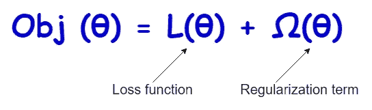

# 正则化的选择:脊、套索和弹性网回归

> 原文：<https://towardsdatascience.com/the-choice-of-regularization-ridge-lasso-and-elastic-net-regression-fc696f697209?source=collection_archive---------12----------------------->

## 将 L1、L2 或 L1 和 L2 正则化应用于线性回归


安德烈·亨特在 [Unsplash](https://unsplash.com/?utm_source=unsplash&utm_medium=referral&utm_content=creditCopyText) 上的照片

大概，你可能听过**【山脊】****【套索】****【弹力网】**这样的术语。这些只是技术术语。这些背后的基本概念是正规化。我们将很快在本帖中澄清这一点。

之前，我们已经从另一个角度讨论过正则化:[用正则化](/how-to-mitigate-overfitting-with-regularization-befcf4e41865)减轻过拟合。正则化的主要好处是减轻过度拟合。正则化模型能够很好地概括未知数据。

基本上，正则化是通过向我们试图最小化的损失(成本)函数添加另一项来限制(控制)模型学习过程的过程。



(图片由作者提供)

**正则项**(也称为**惩罚项**)可以采取不同的形式，这将在本文中很快讨论。

预测连续值输出的线性回归模型通过最小化其损失函数来学习其系数的最佳值。同样的事情也适用于预测离散值输出的逻辑回归模型。在这两种情况下，我们都可以在模型训练阶段应用正则化。

当我们考虑将 Scikit-learn[**LogisticRegression()**](https://scikit-learn.org/stable/modules/generated/sklearn.linear_model.LogisticRegression.html)类用于逻辑回归模型时，有一个名为 **penalty** 的超参数用于选择正则化类型。

```
LogisticRegression(**penalty**='...')
```

对于**惩罚**(规则化类型)，有 4 个选项可供选择。

*   **‘无’**—不应用正则化
*   **‘l1’**—应用 L1 正则化
*   **‘l2’**—应用 L2 正则化(默认选择)
*   **“弹性网”**—L1 和 L2 正则化均适用

然而，当我们考虑将[**linear regression()**](https://scikit-learn.org/stable/modules/generated/sklearn.linear_model.LinearRegression.html)类用于线性回归模型时，没有特定的超参数来选择正则化类型。相反，我们应该为每种类型的正则化使用 3 个单独的类。

*   当我们将 **L2 正则化**应用于线性回归的成本函数时，它被称为**岭**回归。
*   当我们将 **L1 正则化**应用于线性回归的代价函数时，称为**类** o 回归。
*   当我们同时将**L1 和 L2 正则化**应用于线性回归的成本函数时，称为**弹性网**回归。

以上所有回归类型都属于 ***正则化回归*** 的范畴。

让我们详细讨论每一种类型。

# 里脊回归

这里，我们将 L2 正则化项(定义如下)应用于线性回归的成本函数:

**L2 =α.σ(系数的平方值)**

[岭回归](https://scikit-learn.org/stable/modules/generated/sklearn.linear_model.Ridge.html)的 Scikit-learn 类为:

```
Ridge(**alpha**=...)
```

**alpha** 是控制正则化强度的超参数。它必须是正浮点数。默认值为 1。较大的α值意味着较强的正则化(较少过拟合，可能欠拟合！).较小的值意味着弱正则化(过度拟合)。我们想要建立一个既不过度拟合也不欠拟合数据的模型。所以，我们需要为α选择一个最佳值。为此，我们可以使用[超参数调整技术](/python-implementation-of-grid-search-and-random-search-for-hyperparameter-optimization-2d6a82ebf75c)。

**注:** `Ridge(**alpha=0**)`相当于 **LinearRegression()** 类求解的正态线性回归。不建议将`alpha=0`与岭回归一起使用。相反，你应该使用正常的线性回归。

# 套索回归

这里，我们将 L1 正则化项(定义如下)应用于线性回归的成本函数:

**L1 =α.σ(系数的绝对值)**

套索回归的 Scikit-learn 类是:

```
Lasso(**alpha**=...)
```

这个α及其定义与 L2 术语中定义的α相同。默认值为 1。

**注:** `Lasso(**alpha=0**)` 相当于 **LinearRegression()** 类求解的正态线性回归。不建议将`alpha=0`与套索回归一起使用。相反，你应该使用正常的线性回归。

# 弹性净回归

这里，我们同时将 L1 和 L2 正则化项应用于线性回归的成本函数。

[弹性网回归](https://scikit-learn.org/stable/modules/generated/sklearn.linear_model.ElasticNet.html)的 Scikit-learn 类为:

```
ElasticNet(**alpha**=..., **l1_ratio**=...)
```

超参数 **l1_ratio** 定义了我们如何混合**L1 和 L2 正则化。因此，它被称为 ***ElasticNet 混合参数*** 。 **l1_ratio** 的可接受值范围为:**

```
**0 <= l1_ratio <= 1**
```

**以下是可能的情况:**

*   **`l1_ratio = 0`意味着没有 L1 项，只有 L2 正则化。**
*   **`l1_ratio = 1`表示没有 L2 项，只有 L1 正则化。**
*   **`0 < l1_ratio < 1`是指该法规被定义为 L1 和 L2 术语的组合。如果`l1_ratio`接近 1，这意味着 L1 项占优势。如果`l1_ratio`接近 0，这意味着 L2 项占优势。**

**所以，这就是术语**【脊】****【套索】****【弹力网】**背后的想法！**

# **摘要**

**没有必要总是将正则化应用于线性回归模型。首先，您可以尝试使用 **LogisticRegression()** 类，然后查看输出。如果测试 RMSE 的值较低，而火车 RMSE 的值较高，则您的回归模型过拟合。然后，您可以尝试应用每种类型的正则化并查看输出。您也可以为超参数 **alpha** 和 **l1_ratio** 尝试不同的有效值。最后，你会有很多模型。通过查看训练集和测试集上的 RMSE，您可以选择一个好的模型。请注意，一个好的模型既不过度拟合也不欠拟合数据。它应该能够在训练数据上表现良好，并且还能够在看不见的数据(测试数据)上进行很好的概括。**

****注:**除了应用正则化，还有其他方法来解决过拟合问题。你可以通过阅读我写的以下系列文章来学习它们。**

**[](https://rukshanpramoditha.medium.com/list/addressing-overfitting-868959382d1d)

“解决过度拟合”的文章列表(作者截图)** 

**今天的帖子到此结束。我的读者可以通过下面的链接注册成为会员，以获得我写的每个故事的全部信息，我将收到你的一部分会员费。**

**[](https://rukshanpramoditha.medium.com/membership) [## 通过我的推荐链接加入 Medium

### 作为一个媒体会员，你的会员费的一部分会给你阅读的作家，你可以完全接触到每一个故事…

rukshanpramoditha.medium.com](https://rukshanpramoditha.medium.com/membership) 

非常感谢你一直以来的支持！下一个故事再见。祝大家学习愉快！

特别要感谢 Unsplash 网站上的 **Andre Hunter** 、**T3，他为我提供了一张很好的封面图片。**

[鲁克山·普拉莫迪塔](https://medium.com/u/f90a3bb1d400?source=post_page-----fc696f697209--------------------------------)
**2021–10–12****