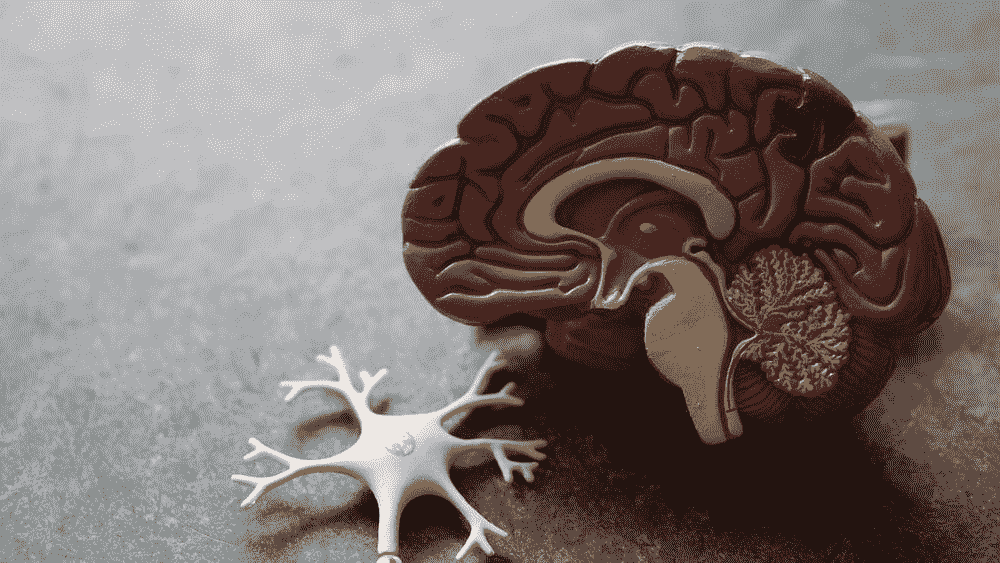
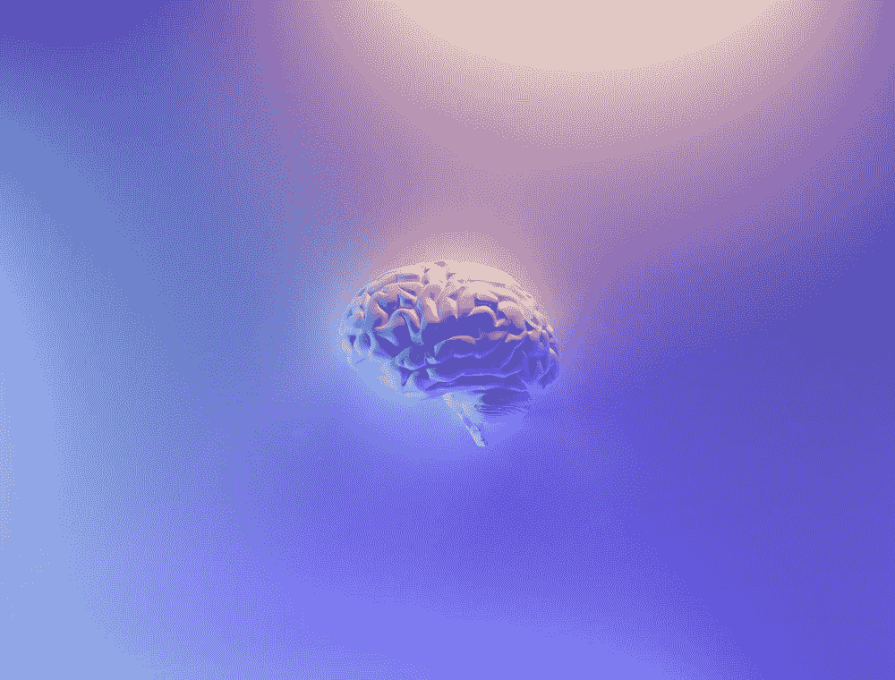
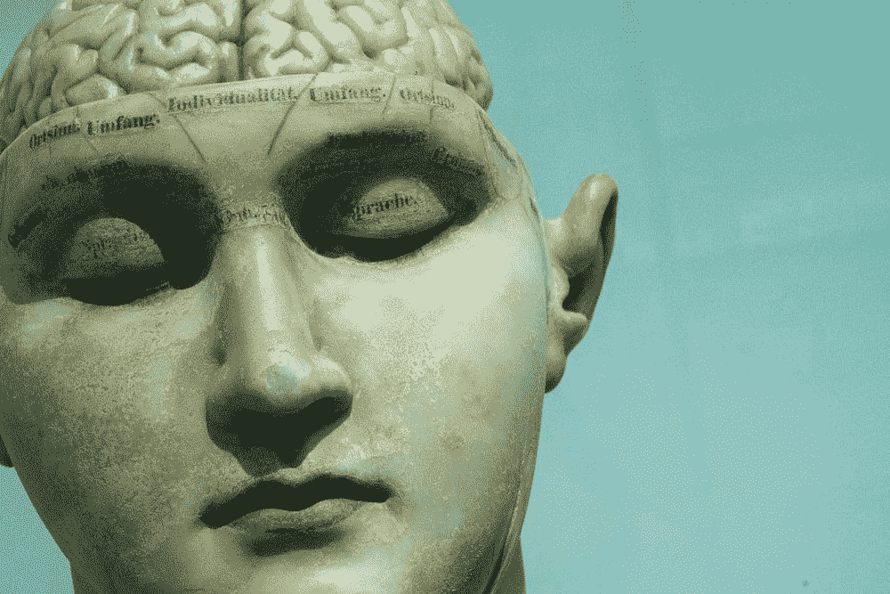

# AGI 的认知科学

> 原文：<https://towardsdatascience.com/the-cognitive-science-of-agi-139e1f4b31d5?source=collection_archive---------26----------------------->

## [思想和理论](https://towardsdatascience.com/tagged/thoughts-and-theory)

## 人工智能概论系列的第 2 部分

大脑和思维是一回事吗？资料来源:Bret Kavanaugh via[Unsplash](https://unsplash.com/photos/_af0_qAh4K4)。

> “为什么大脑不证明自己在做所有这些事情呢？哦，顺便说一下，是我，聪明的——在你脑子里。我是让你保持平衡和咀嚼食物的东西；我是你入睡或坠入爱河的原因……”
> 
> Patricia S. Churchland 博士，触动神经:作为大脑的自我

欢迎来到这个探索人工智能的新系列的第二部分(AGI)。如果你错过了第 1 部分，或者只是在寻找一些关于 AGI 的背景知识，那么点击这里查看。本周我们将看看世界上*认知科学*是什么，为什么它与 AGI 相关，以及为什么每个人工智能/AGI/人工智能的追随者都应该至少知道一点点*。*

在这个系列中，每周/每隔一周会有一个新的帖子出现(我希望如此),如果有问题、评论或澄清，可以随时给(mferg@mit.edu 发电子邮件。尽情享受吧！

*免责声明:毫无疑问，有些人更有资格深入探讨我将涉及的问题和主题，从情感到神经形态计算。对于这些人来说，这个系列只是对这些主题的介绍，因此，如果为了简洁而省略或浓缩了一些内容，请见谅。我真的只是想要这个系列，以及激发它的课程，作为一个相关 AGI 主题的调查，这些主题通常在学习人工智能或人工智能时不会被教授。还要注意:这个系列与麻省理工学院或其品牌没有任何关系——我只是喜欢写一些我感兴趣的东西，麻省理工学院并不正式认可这里陈述的观点。*

# 第一部分:什么是认知科学？

## 与心理学或神经科学相比如何？

> "现实存在于人的头脑中，而不存在于其他地方."
> 
> ―乔治·奥威尔， *1984*

心灵的本质是什么？你是否等同于你所有的大脑过程，被裹得严严实实，为生活做好了准备？或者对你来说，除了记忆、感知和注意力过程的结合之外，还有什么别的东西吗？你是你的信仰、理想、目标和恐惧吗？本周，我们将对认知科学领域进行一次简短的旅行，看看其中有哪些概念对我们 AGI 人有所帮助和相关。让我们开始吧。

简而言之，认知科学是对*思维及其过程*的研究，包括:

1.  注意:“我在关注什么？”
2.  感知:“我在看什么？”
3.  意识:“什么是*我*？”
4.  记忆:“我是怎么记住事情的？”
5.  理性:“我怎么做决定？”
6.  自我:“*谁*是*我*？”
7.  元认知:“关于思考的思考是什么？”
8.  语言:“什么是*语义*？”
9.  潜意识过程:“什么影响我的想法？”
10.  思考(认知):“思考是什么意思？”

还有一个非常粗糙的类比，将大脑与运行思维“软件”的“硬件”联系起来。这种类比在某些层面上是站不住脚的，并且与所谓的*计算机心理理论*(认为大脑是一台计算机/计算机器)有所关联，但在很大程度上，这是对大脑和思维之间差异的一个很好的介绍。

来自斯坦福哲学百科全书[1]的 cog sci 的官方定义是:

> 认知科学是对思维和智力的跨学科研究，包括哲学、心理学、人工智能、神经科学、语言学和人类学。

大脑。3 磅瘦肉。来源:**Robina Weermeijer via[un splash](https://unsplash.com/@averey)**。****

**希望现在你能明白为什么这个领域可能对人工智能研究人员有用:看看 DeepMind 和 AlphaGo 的成功就知道了。人工智能研究的许多方面都涉及到研究或再现一些作为认知过程基础的算法——为了试图再现这些算法，人们必须对他们所观察的现象的认知科学有坚实的理解。人工智能研究人员也是认知科学家已经有很长的历史了，现在仍然如此。**

**那么神经科学、认知科学和心理学的区别是什么呢？什么是认知神经科学？认知心理学？*一切听起来都变得一样了……***

**这里有一个很好的概述:简而言之，神经科学是“最底层”，也就是最接近大脑硬件的*，下面列表向下的每个领域都从这个硬件“向上”移动到更多的“软件”；从突触到心理过程到人类行为。微观到宏观，如果你愿意的话。***

1.  *****神经科学*** 关注的是*脑*的低级功能，在抽象的神经元/神经化学水平及其以下。**
2.  *****认知神经科学*** 专门针对*头脑的*过程的*大脑*(神经)基础，在大脑中寻找认知功能的“标记”。**
3.  *****认知科学*** 更上一层楼，关注的是*头脑*灌输的过程，如前一节所列。**
4.  *****认知心理学*** 定义起来有点棘手，但主要研究*心理*现象背后的*心智*过程。**
5.  *****心理学*** 主要关注*人类行为和互动*以及信息处理。**

**这些就是这些领域的差异，以一种非常粗略的方式。请注意，许多大脑/思维研究人员在以上所有方面都有经验，但最终大多专注于一两个一般领域以获得研究生学位。例如，麻省理工学院的 BCS 项目提供认知科学、系统神经科学、细胞和分子神经科学以及计算方面的研究生学位——但不包括心理学[2]。**

**因此，简而言之，认知科学研究的是思维及其过程。那么大脑又如何呢？**

# **第二部分:对你大脑的基本介绍**

## **比如说，*真的是*基本。比如神经 101 基础课的前 10 分钟。**

> **人们应该知道，我们的快乐、喜悦、欢笑和玩笑，以及我们的悲伤、痛苦、悲伤和眼泪，都来自大脑，而且只能来自大脑。**
> 
> **――希波克拉底，公元前 400 年**

**W 大脑的基本解剖是什么？大脑分为三个主要部分[3]:**

1.  **脑干**
2.  **小脑**
3.  **大脑**

****

**脑干是杆状的东西，小脑是右下的一小部分，大脑是大的上半部分。资料来源:Milad b . faku rian via[un splash](https://unsplash.com/photos/58Z17lnVS4U)。**

***根据[梅菲尔德诊所](https://mayfieldclinic.com/pe-anatbrain.htm)【3】和[医药网](https://www.medicinenet.com/script/main/art.asp?articlekey=2517)【4】，***

> ***…是连接脊髓的大脑基底的茎状部分。它控制着大脑和身体其他部分之间的信息流动，以及其他基本的身体功能，如呼吸、吞咽、心率、血压以及人是清醒还是困倦。它由中脑、脑桥和延髓组成。***

***接下来，[梅菲尔德诊所](https://mayfieldclinic.com/pe-anatbrain.htm)【3】也给了我们一个关于小脑的很好的概述:***

> *****小脑**位于脑干顶部(脊髓与大脑交汇处)的后面，由两个半球(两半)组成。它接收来自感觉系统、脊髓和大脑其他部分的信息，然后调节运动。它还协调随意运动，如姿势、平衡、协调和言语，从而产生平稳和平衡的肌肉活动。它对学习*运动行为*也很重要，但它只占大脑相对较小的一部分——约占总重量的 10%，但它包含了*大脑神经元的大约一半*。***

***最后，《大英百科全书》对大脑的最后一部分——大脑——有很大的研究:***

> *****大脑**是大脑最大和最上面的部分，由*大脑半球*组成，占大脑总重量的三分之二。一个半球，通常是左半球，在功能上占主导地位，控制语言和言语。另一个半球解释视觉和空间信息。大脑半球由有髓神经纤维的内核、[白质](https://www.britannica.com/science/white-matter)和[灰质](https://www.britannica.com/science/gray-matter)的外皮层组成。一般来说，大脑负责整合感觉冲动，指导运动活动，并控制高级智力功能。大脑皮层的灰质通常分为四个叶，大致由主要的表面褶皱定义。这些脑叶是额叶、顶叶、颞叶和枕叶。***

******

***所有这些大脑单词听起来都一样…来源:大卫·马托斯 via [Unsplash](https://unsplash.com/photos/xtLIgpytpck) 。***

***好的，这是很多信息——别担心，这只是一个调查，之后没有考试——我只是想给你一个很好的概述。那么，为什么所有这些谈论神经科学、认知科学和所有其他听起来像认知的科学呢？***

# ***第三部分:为了创造/理解 AGI，我们需要知道认知科学/神经科学中的哪些重要概念？***

## ***看看 AGI 人的几个相关话题***

> ***“现在在大脑中发现的工作原理可能会在未来提供比我们目前所能预见的更强大的机器……”***
> 
> ***― J.Z. Young,《科学中的怀疑和确定:生物学家对大脑的思考》, 1960 年***

***如果你愿意的话，可以复述一下，你是一名来自计算机科学领域的游客，正在认知科学领域进行一次旅行。有哪些大的收获可以带给你的深度学习弟兄们，他们可能没有接触过？让我们来看看认知科学中的几个重要话题和主题，这将有助于我们稍后理解它们如何(或是否)可以在机器中复制。***

***首先出场的是 ***记忆*** ，以及其鲜明的类型。所有的记忆都是一样的吗？不会。最大的区别在于长期记忆和短期记忆(也称为工作记忆):短时记忆通常可以同时处理 5-9 件事情，持续时间长达 18 秒左右，而 LTM 可以持续一生，但对编码的内容有选择性。另一种记忆二分法是*陈述性*和*程序性*:陈述性是关于*事物*的知识，通常被认为包括语义记忆(事实)和情景记忆(经历)。程序记忆是*如何做事情*，比如骑自行车，弹吉他和弦，或者在《光晕 3》中杀死一群圣约人野兽。***

******

***如果你真的想让你的思维爆炸(哈哈)，查一下[“扩展思维理论](https://www.oxfordbibliographies.com/view/document/obo-9780195396577/obo-9780195396577-0099.xml)”。资料来源:劳拉·富尔曼转自 [Unsplash](https://unsplash.com/photos/73OJLcahQHg) 。***

***接下来是*的边缘系统:为此我们期待昆士兰大学[【6】:](https://qbi.uq.edu.au/brain/brain-anatomy/limbic-system)****

> ****…大脑中与行为和情绪反应有关的部分，尤其是当涉及到我们生存所需的行为时:喂食、繁殖和照顾后代，以及战斗或逃跑反应。你的边缘系统埋藏在大脑深处，大脑皮层之下，脑干之上。丘脑和下丘脑(产生重要的激素和调节口渴、饥饿、情绪等)和基底神经节(奖励处理、习惯形成、运动和学习)也参与其中。你的杏仁核位于海马体旁边，左右杏仁核在我们的情绪反应中起着核心作用，包括快乐、恐惧、焦虑和愤怒等感觉。杏仁核也将情感内容与记忆联系在一起。最后，海马体本质上是我们大脑的记忆中心。情景记忆被形成并分类，在大脑皮层的其他部分长期储存。****

********

****恐惧很大程度上是由边缘系统控制的。来源:Benjamin wede Meyer via[Unsplash](https://unsplash.com/photos/9FMDYPCv8mQ)。****

****还有数不清的其他认知科学现象和主题，涵盖这些将是有益的:我只是选择了上面的两个(和下面的一个)作为起点。其他可能包括[视觉感知](https://en.wikipedia.org/wiki/Visual_perception)、[音频/语言处理](https://www.linguisticsociety.org/resource/language-and-brain)、[认知周期](https://en.wikipedia.org/wiki/LIDA_(cognitive_architecture)#:~:text=LIDA%27s%20cognitive%20cycle%20The%20LIDA%20cognitive%20cycle%20can,stimuli%20activate%20low-level%20feature%20detectors%20in%20sensory%20memory.)和[全局工作空间](https://en.wikipedia.org/wiki/Global_workspace_theory)，以及[意识](https://en.wikipedia.org/wiki/Integrated_information_theory)。****

****最后介绍一个认知科学的话题，我们下周会深入探讨: ***心智与大脑的本质*** 。认知科学和神经科学的圣杯是发现思维是如何从大脑中产生的。长久以来，哲学家们一直在争论到底是什么让你成为你；从苏格拉底到笛卡尔到佛陀。我们不可能希望回答一个 AGI 人是否有“头脑”的问题，除非我们能就是什么造就了头脑达成一致——这是一个巨大的问题，但一些答案正开始从现代神经科学的土地上浮现出来……****

********

****下周，威尔将介绍一些心灵哲学。资料来源:K . Mitch Hodge via[un splash](https://unsplash.com/photos/wZfndoCA1rA)。****

# ******TL；博士******

## ****本周快速总结****

> ****“只要我们的大脑是一个谜，宇宙，大脑结构的反映，也将是一个谜。”****
> 
> ****―圣地亚哥·拉蒙·卡哈尔，西班牙医生，诺贝尔奖获得者****

****本周，我们研究了世界上的认知科学是什么(对思维的研究)，以及它为什么与我们 AGI 人相关(记忆、注意力、感知等重要话题)。下周，我们将介绍一些奇特的心灵哲学，来讨论灵魂、心灵和同一性的本质。重磅消息，敬请关注！****

********

****西斯廷教堂里藏着大脑吗？来源:Calvin Craig via[Unsplash](https://unsplash.com/photos/y8b001e2bs0)。****

# ****需要思考的进一步问题:****

1.  ****计算机能像人类一样拥有思维吗？****
2.  ******思维是否独立于实施它们的基质？******
3.  ******你认为大脑是从头脑中产生的，还是有其他东西缺失了？******

# ****关于作者****

****Mike Ferguson 是麻省理工学院 DiCarlo 实验室的计算研究开发人员。他将研究大脑评分工具，这是一种测量人工神经网络有多像大脑的工具。他将于 2021 年春天从弗吉尼亚大学毕业，获得计算机科学和应用数学学士学位，以及认知科学和哲学学士学位。他是《一周挑战》一书的参与者，在两年内阅读了超过 138 本关于人工智能、哲学以及对人类意味着什么的书籍。他和他的伯恩山犬“博伊·温斯顿”以及收养的边境牧羊犬“影子”住在弗吉尼亚州的夏洛茨维尔。****

# ****参考资料:****

1.  ****[认知科学(斯坦福哲学百科全书)](https://plato.stanford.edu/entries/cognitive-science/)****
2.  ****[研究生项目|大脑和认知科学(mit.edu)](https://bcs.mit.edu/academic-program/graduate-program)****
3.  ****[https://mayfieldclinic.com/pe-anatbrain.htm](https://mayfieldclinic.com/pe-anatbrain.htm)****
4.  ****h[ttps://www . medicine net . com/script/main/art . ASP？articlekey=2517](https://www.medicinenet.com/script/main/art.asp?articlekey=2517)****
5.  ****[https://www.britannica.com/science/cerebrum](https://www.britannica.com/science/cerebrum)****
6.  ****[边缘系统——昆士兰脑研究所——昆士兰大学(uq.edu.au)](https://qbi.uq.edu.au/brain/brain-anatomy/limbic-system)****