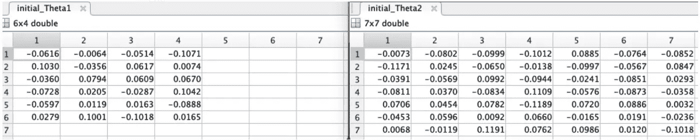

# 神经网络多类分类完全指南

> 原文：<https://towardsdatascience.com/the-complete-guide-to-neural-networks-multinomial-classification-4fe88bde7839?source=collection_archive---------0----------------------->

## 神经网络到底是什么？本文将向您全面完整地介绍如何从头开始编写神经网络，并使用它们进行多项式分类。包括 python 源代码。


作者照片:与朋友一起骑山地车 2018

神经网络反映了人脑的行为。它们允许程序识别模式并解决机器学习中的常见问题。这是执行分类而不是逻辑回归的另一种选择。在 [Rapidtrade](http://www.rapidtrade.com) ，我们使用神经网络对数据进行分类并运行回归场景。这篇文章的源代码可以在 [GitHub](https://github.com/shaunenslin/machinelearning/tree/master/python/neural%20networks) 上找到。

我们将使用来自 Kaggle 的数据集，你可以在这里下载[。所以为了**可视化**我们将在本文中使用的数据，见下文。我们将使用它来训练网络根据 j 列对我们的客户进行分类。我们还将使用突出显示的 3 个特征对我们的客户进行分类。我需要 3 个特征来适应我的神经网络，这是最好的 3 个特征。](https://www.kaggle.com/abisheksudarshan/customer-segmentation)


图 1:我们的数据集

> 请记住，我们将把所有的字母字符串值转换成数字。毕竟我们不能把字符串塞进方程*；-)*

**这是一篇相当长的文章，分为两个部分:**

*   介绍
*   把所有的放在一起

**好运；-)**

# 介绍

神经网络总是由层组成，如图 2 所示。这看起来很复杂，但是让我们把它拆开，让它更容易理解。


图 2:神经网络

一个神经网络有 6 个重要的概念，我将在这里简单解释一下，但在这一系列文章中会详细介绍。

- **权重** — *这些就像我们在其他算法中使用的* ***theta 的*** *-**层** — *我们的网络将有 3 层*
- **前向传播** — *使用特征/权重来获得 Z 和一个*
- **反向传播***

在这个系列中，我们将建立一个三层的神经网络。在进入正题之前，让我们快速讨论一下这些层次。

## -输入层

参考上面的图 2，我们将这一层的结果称为 **A1** 。该图层的**大小** (# units) 取决于我们数据集中要素的**数量。**

构建我们的输入层并不困难你只需简单地**将 X 复制到 A1** ，但是添加一个所谓的**偏向层**，默认为“1”。

第 1 栏:**偏向的**图层默认为“1”
第 2 栏:**“曾经结婚”**我们的第一个特征，并被重新标记为 1/2
第 3 栏:**“毕业”**我们的第二个特征，并被重新标记为 1/2
第 4 栏:**“家庭规模”**我们的第三个特征


图 3:可视化 A1 —输入层

## -隐藏层

参考上面的图 2，我们只有 **1 个隐藏层**，但是你可以为每个特征设置一个隐藏层。如果您有比我下面提到的逻辑更多的隐藏层，您将为每个隐藏层复制计算。

大小(单位数)由你决定，我们选择了#features * 2 **ie。6 台**。

该层是在向前和向后传播期间计算的。运行**和**这两个步骤后，我们**计算每个单元的 Z2、A2 和 S2** 。运行每个步骤后的输出如下。

**正向传播**

参考图 1，在这个步骤中，我们计算 Z2，然后是 A2。

*   **Z2** 包含我们对隐藏层中的**假设**的计算结果。
*   而 **A2** 也包括偏置层(col 1)并且具有应用于来自 Z2 的每个单元的 sigmoid 函数。

因此，根据图 4，Z2 具有 6 列，A2 具有 7 列。


图 4:可视化 Z2 和 A2-隐藏层

**反向传播**

因此，在前向传播穿过所有层之后，我们然后执行**反向传播**步骤来计算 **S2** 。S2 被称为每个单元假设计算的**δ**。这用于计算该θ的**梯度**，随后，结合该单元的**成本**，帮助梯度下降计算出最佳θ/重量。


图 5:可视化 S2 的梯度

## -输出层

我们的输出层给出了我们假设的结果。即。如果应用这些 thetas，我们对这些客户分类的最佳猜测是什么。**大小**(#单位)源自 y 的数字标签。如图 1 所示，有 7 个标签，因此输出层的大小为 7。

与隐藏层一样，这个结果是在**向前和向后**传播的 2 个步骤中计算出来的。运行这两个步骤后，结果如下:

**正向传播**

在向前推进期间，我们将为输出层计算 **Z3** 和 **A3** ，就像我们为隐藏层所做的那样。参考上面的图 1，可以看到不需要偏置柱，下面可以看到 Z3 和 A3 的结果。


图 6:可视化 Z3 和 A3

**反向传播**

现在(参考图 1)我们有了 Z3 和 A3，让我们计算 **S3** 。由于 S3 只是一个基本的成本计算，从 Y 中减去 A3，所以我们将在接下来的文章中探索这些等式，但我们仍然可以看到下面的结果

# 把所有的放在一起

因此，上面是一个有点尴尬，因为它可视化的输出在每一层。我们在神经网络中的主要焦点是计算神经网络成本的函数。该函数的编码将采取以下步骤。

1.  **准备**数据
2.  **设置**神经网络
3.  **初始化**一组权重/θ
4.  创建我们的**成本函数**，它将
    4.1 执行**正向传播**
    4.2 计算正向传播
    的**成本**4.3 执行**反向传播** 4.4 计算**增量**，然后从反向道具计算**梯度**。
5.  执行**成本优化**
6.  **预测**结果以检查准确性

# 1.准备数据

为了开始这个探索性的分析，首先导入库并定义使用 matplotlib 绘制数据的函数。根据数据的不同，并不是所有的图都要绘制。

> 嘿，我只是一个简单的内核机器人，而不是卡格尔比赛的大师！

```
from mpl_toolkits.mplot3d import Axes3D
from sklearn.preprocessing import StandardScaler
from sklearn.preprocessing import LabelEncoder
import seaborn as sns
import matplotlib.pyplot as plt # plotting
import numpy as np # linear algebra
import os # accessing directory structure
import pandas as pd # data processing, CSV file I/O (e.g. 
from scipy import optimize as optpd.read_csv)
import matplotlib.pyplot as plt
```

现在，让我们阅读我们的数据并快速浏览一下。

```
df = pd.read_csv(‘customertrain.csv’)
df.head()
```


图 4:可视化测向

做一个信息，我们可以看到我们有一些工作要做的空值以及一些对象字段转换成数字。

```
df.info()
```


图 8

因此，让我们将对象字段转换为数字，并删除我们不需要的列。

```
columns = [“Gender”,”Ever_Married”,”Graduated”,”Profession”,”Spending_Score”]
for feature in columns:
  le = LabelEncoder()
  df[feature] = le.fit_transform(df[feature])df = df.drop([“ID”,”Gender”,”Age”,”Profession”,”Work_Experience”,”Spending_Score”], axis=1)
df.dropna(subset=['Var_1'], inplace=True)df.head()
```


图 9 准备数据后的测向结果

使用 fit_transform 将我们的多项式类别编码成我们可以处理的数字。

```
yle = LabelEncoder()
df[“Var_1”] = yle.fit_transform(df[“Var_1”])
df.head()
```

**填写缺失的特征**

回归的一个重要部分是理解哪些特征缺失了。我们可以选择忽略所有缺少值的行，或者用 mode、median 或 mode 填充它们。

*   模式=最常见的值
*   中位数=中间值
*   平均值=平均

这里有一个方便的函数，你可以调用它，用你想要的方法来填充缺失的特性。我们将选择用平均值填充值。

经过下面的搞笑，你应该看到 7992 没有空值。

```
def fillmissing(df, feature, method):
  if method == “mode”:
    df[feature] = df[feature].fillna(df[feature].mode()[0])
  elif method == “median”:
    df[feature] = df[feature].fillna(df[feature].median())
  else:
    df[feature] = df[feature].fillna(df[feature].mean()) features_missing= df.columns[df.isna().any()]
for feature in features_missing
  fillmissing(df, feature= feature, method= “mean”)df.info()
```

**提取 Y**

让我们将 Y 列提取到一个单独的数组中，并将其从 dataframe 中移除。

```
Y = df[“Var_1”]df = df.drop([“Var_1”], axis=1
```

现在把我们的 X 和 y 列复制到矩阵中，以便于以后的矩阵操作。

```
X = df.to_numpy() # np.matrix(df.to_numpy())
y = Y.to_numpy().transpose() # np.matrix(Y.to_numpy()).transpose()
m,n = X.shape
```

**规格化特征**

现在，让我们将 X 归一化，使其值介于-1 和 1 之间。我们这样做是为了让所有的特征都在一个相似的范围内。我们使用下面的等式


执行标准化的目标是将所有特征降低到一个共同的比例，而不扭曲值范围的差异。这一重定要素等级的过程使得它们的均值为 0，方差为 1。

# 2.设置神经网络

现在，我们可以设置我们的神经网络的大小，首先，下面是我们要放在一起的神经网络。

在下面的初始化中，确保实现了上述网络。所以，现在你会问“合理的数字是多少？”

*   输入层=设置为尺寸的大小
*   隐藏层=设置为输入层* 2
*   输出层=设置为 y 的标签大小。在我们的例子中，这是 7 个类别

```
input_layer_size = n                      # Dimension of features
hidden_layer_size = input_layer_size*2    # of units in hidden layer
output_layer_size = len(yle.classes_)     # number of labels
```

# 3.初始化重量(θs)

事实证明，对于梯度下降来说，这是一个相当重要的话题。如果你没有处理过梯度下降，那么先查一下[这篇文章](/geekculture/gradient-descent-in-matlab-octave-954160e2d3fa)。从上面可以看出，我们需要 2 组砝码。(用表示)。

> 我们仍然经常称这些重量为θ，它们的意思是一样的。

我们需要一套 2 级的 thetass 和一套 3 级的 theta。每个θ是一个矩阵，大小为(L) * size(L-1)。因此如上所述:

*   θ1 = 6×4 矩阵
*   θ2 = 7×7 矩阵

我们现在必须猜测哪个初始 thetas 应该是我们的起点。这里，epsilon 来拯救我们，下面是 matlab 代码，可以轻松地为我们的初始权重生成一些随机的小数字。

```
def initializeWeights(L_in, L_out):
  epsilon_init = 0.12
  W = np.random.rand(L_out, 1 + L_in) * 2 * \
     epsilon_init - epsilon_init
  return W
```

如上所述，在对每个θ的大小运行上述函数后，我们将得到一些好的小随机初始值，如图 7 所示。对于上面的图 1，我们提到的权重指的是下面矩阵的第 1 行。



图 7:初始θ

# 4.成本函数

我们需要一个函数来实现用于执行分类的两层神经网络的神经网络成本函数。

在 GitHub 代码中，checknn.py 我们名为 **nnCostFunction** 的成本函数将返回:

*   梯度应该是神经网络偏导数的“展开”向量
*   最后的 J 是这个重量的成本。

我们的成本函数需要执行以下操作:

*   将 nn_params 重新整形为参数θ1 和θ2，这是我们的 2 层神经网络的权重矩阵
*   执行正向传播以计算(a)和(z)
*   执行反向传播以使用(a)计算(s)

因此，我们的成本函数首先需要将 theta 重新整形为隐藏层和输出层的 theta。

```
# Reshape nn_params back into the parameters Theta1 and Theta2, 
# the weight matrices for our 2 layer neural networkTheta1 = nn_params[:hidden_layer_size * \
   (input_layer_size + 1)].reshape( \
   (hidden_layer_size, input_layer_size + 1))
Theta2 = nn_params[hidden_layer_size * \
   (input_layer_size + 1):].reshape( \
   (num_labels, hidden_layer_size + 1))# Setup some useful variables
m = X.shape[0]
```

## 4.1 正向传播

前向传播是神经网络的重要组成部分。这并不像听起来那么难。

在图 7 中，我们可以看到去掉了很多细节的网络图。我们将重点介绍第二级的一个单元和第三级的一个单元。这种理解可以复制到所有单位。注意我们可以做的矩阵乘法(图 7 中蓝色部分)来执行正向传播。

> 我在每一层显示一个单元的细节，但是你可以重复所有层的逻辑。


图 7:神经网络正向传播

> 在我们展示正向推进代码之前，让我们谈一谈正向推进过程中需要的两个概念。

**4.1.1 乙状结肠功能**

既然是做分类，我们就用 sigmoid 来评估我们的预测。sigmoid 函数是一种数学函数，具有特征性的“S”形曲线或 sigmoid 曲线。sigmoid 函数的一个常见示例是逻辑函数，如图一所示，由以下公式定义


在 github 中，checknn.py 创建了以下方便的函数:

*   sigmoid 是计算输入参数 Z 的 sigmoid 的简便函数
*   sigmoidGradient 计算在 z 处计算的 sigmoid 函数的梯度。无论 z 是矩阵还是向量，这都应该有效。

```
def sigmoid(z):
  g = np.frompyfunc(lambda x: 1 / (1 + np.exp(-x)), 1, 1)
  return g(z).astype(z.dtype)def sigmoidGradient(z)
  return sigmoid(z) * (1 - sigmoid(z))
```

**4.1.2 正规化**

我们将实现正则化，因为数据科学专业人员面临的最常见问题之一是避免过度拟合。过度拟合会给你一种情况，你的模型在训练数据上表现得非常好，但是不能预测测试数据。神经网络很复杂，使它们更容易过度拟合。正则化是一种对学习算法进行轻微修改以使模型更好地概括的技术。这反过来也提高了模型在不可见数据上的性能。

如果你研究过机器学习中正则化的概念，你会有一个公平的想法，正则化惩罚系数。在深度学习中，它实际上惩罚了节点的权重矩阵。

我们在 nnCostFunction 中通过传递一个 lambda 来实现正则化，该 lambda 用于惩罚计算的梯度和成本。

**4.1.3 实施正向推进**

根据图 1，让我们计算 A1。你可以看到它几乎是我的 X 的特征，我们在前面添加了硬编码为“1”的 bias 列。下面是实现这一点的 python 代码:

```
# Add ones to the X data matrix
a1 = np.insert(X, 0, 1, axis=1)
```

现在，结果将为您提供图 4 中 A1 的结果。特别注意前面增加的偏差栏“1”。

很好，A1 完成了，让我们继续 A2。在我们得到 A2 之前，我们将首先运行一个假设来计算 Z2。一旦你有了假设，你就可以通过 sigmoid 函数得到 A2。同样，根据图 1，将 bias 列添加到前面。

```
# Perform forward propagation for layer 2
z2 = np.matmul(a1, Theta1.transpose())
a2 = sigmoid(z2)
a2 = np.insert(a2, 0, 1, axis=1)
```

好了，我们快到了…现在在 A3 上，让我们做与 A2 相同的事情，但是这一次，我们不担心添加偏差列。

```
z3 = np.matmul(a2, Theta2.transpose())
a3 = sigmoid(z3)
```

你可能会问，**“我们为什么要保留 Z2&Z3】**。嗯，我们在反向传播中需要这些。所以我们最好把它们放在手边；-).

## 4.2 计算前进支柱的成本

在我们继续之前，如果您了解我们的 Y 列(图 9 ),其中包含用于对客户进行分类的标签。然后，为了计算成本，我们需要将 Y 重新格式化为一个与标签数量相对应的矩阵。在我们的案例中，我们的客户有 7 个类别。

图 8 显示了如何将 **Y** 转换为矩阵 y_one_hot，并且标签现在在适当的列中显示为二进制。

```
# turn Y into a matrix with a new column for each category and marked with 1
y_one_hot = np.zeros_like(a3)
for i in range(m):
  y_one_hot[i, y[i] - 1] = 1
```


图 8:将 Y 从 vector 映射到矩阵 y_one_hot

现在我们有了矩阵形式的 Y，让我们看看计算成本的等式。


嗯，这非常复杂，但好消息是，通过一些矩阵操作，我们可以用如下几行 python 代码来完成。

```
# Calculate the cost of our forward prop
ones = np.ones_like(a3
A = np.matmul(y_one_hot.transpose(), np.log(a3)) + \
  np.matmul((ones - y_one_hot).transpose(), np.log(ones - a3))J = -1 / m * A.trace()
J += lambda_ / (2 * m) * \
  (np.sum(Theta1[:, 1:] ** 2) + np.sum(Theta2[:, 1:] ** 2))
```

## 4.3 执行反向传播

因此，我们简化了图 1 中的神经网络，首先只显示了细节:

*   从 Y 减去 A1(3)计算 S3
*   此后，使用下面提到的θ乘以 S3 来计算线性方程。S2。


由于一张图片描绘了 1000 个单词，图 9 应该解释我们用什么来计算 S3 以及随后的 S2(用红色标记)。


图 9:反向传播

从(3)中，我们了解了我们的权重(θs)是如何初始化的，所以只是为了可视化图 9 所指的权重(φ),参见下面的图 10。


图 9:反向传播中使用的权重

因此，有了矩阵操作的帮助，正向传播在 python 中并不是一件困难的事情

```
# Perform backward propagation to calculate deltas
s3 = a3 - yv
s2 = np.matmul(s3, Theta2) * \
  sigmoidGradient(np.insert(z2, 0, 1, axis=1))# remove z2 bias column
s2 = s2[:, 1:]
```

## **4.4 从反向道具计算坡度**

我们需要返回梯度作为我们的成本函数的一部分，这是需要的，因为梯度下降是在**反向属性**中发生的过程，其中目标是基于权重 *w* 在相反方向上连续重新采样模型参数的梯度，持续更新，直到我们达到函数 *J(w)* 的**全局最小值**。


反向推进方程

简单来说，我们用梯度下降最小化代价函数， *J(w)* 。


图 10

再一次，矩阵操作拯救了它，只需要几行代码。

我们的第一步是计算一个可以用来调整我们的成本的惩罚。如果你想要一个关于正规化的解释，那么看看这篇[文章](/geekculture/logistics-regression-regularisation-2-3-4a0d8b85564c)。

```
# calculate regularized penalty, replace 1st column with zeros
p1 = (lambda_/m) * np.insert(Theta1[:, 1:], 0, 0, axis=1)
p2 = (lambda_/m) * np.insert(Theta2[:, 1:], 0, 0, axis=1)
```

对于成本优化，我们需要反馈这组特定权重的梯度。图 2 显示了梯度一旦被绘制出来。对于输入到我们的成本函数的权重集，这将是绘制线的梯度。

```
# gradients / partial derivitives
Theta1_grad = delta_1 / m + p1
Theta2_grad = delta_2 / m + p2
grad = np.concatenate((Theta1_grad.flatten(), 
  Theta2_grad.flatten()), axis=None)
```

然而，成本优化函数不知道如何处理 2θ，所以让我们把它们展开成一个向量，结果如图 5 所示。

```
grad = np.concatenate((Theta1_grad.flatten(),  
   Theta2_grad.flatten()), axis=None)
```

好了，哇，这是很多信息，但我们的成本函数已经完成，让我们继续运行梯度下降和成本优化。

# 5.执行成本优化

## 5.1 验证我们的成本函数

一件很难理解的事情是我们的成本函数是否表现良好。检查这一点的一个好方法是运行一个名为 checknn 的函数。

创建一个小的神经网络来检查反向传播梯度，它将输出由反向传播代码产生的分析梯度和数值梯度(使用 computeNumericalGradient 计算)。这两个梯度计算应该产生非常相似的值。

如果你想更深入地研究这种技术背后的理论，这在吴恩达的机器学习课程第 4 周是很难的。

您不需要每次都运行，只需在第一次设置成本函数时运行即可。

这里就不放代码了，但是在 checknn.py 里面检查一下 github 项目有没有以下功能:

*   检查梯度
*   去基尼化权重
*   计算美国梯度

运行 cheecknn 之后，您应该会得到以下结果


图 11:验证我们的成本函数的结果

## 5.2 梯度下降

梯度下降是一种优化算法，主要用于寻找函数的最小值。在机器学习中，梯度下降用于更新模型中的参数。参数可以根据算法而变化，例如线性回归中的*系数*和神经网络中的权重。我们将使用 SciPy 优化模块来运行我们的梯度下降。

```
from scipy import optimize as optprint('Training Neural Network... ')
#  Change the MaxIter to a larger value to see how more 
#  training helps.
options = {'maxiter': 50, 'disp': True}# You should also try different values of lambda
lambda_ = 1;# Create cost function shortcuts to be minimized
fun = lambda nn_params: nnCostFunction2(nn_params, input_layer_size, hidden_layer_size, output_layer_size, xn, y, lambda_)[0]jac = lambda nn_params: nnCostFunction2(nn_params, input_layer_size, hidden_layer_size, output_layer_size, xn, y, lambda_)[1]# Now, costFunction is a function that takes in only one 
# argument (the neural network parameters)res = opt.minimize(fun, nn_params, method='CG', jac=jac, options=options)nn_params = res.x
cost = res.fun
print(res.message)print(cost)
```


图 12:运行梯度下降的结果

通过使用 reshape 为每一层获取我们的 thetas

```
# Obtain Theta1 and Theta2 back from nn_paramsTheta1 = nn_params[:hidden_layer_size * (input_layer_size + 
   1)].reshape((hidden_layer_size, input_layer_size + 1))Theta2 = nn_params[hidden_layer_size * (input_layer_size + 
   1):].reshape((output_layer_size, hidden_layer_size + 1))
```

# 6.预测结果以检查准确性

现在我们有了最佳权重(thetas ),让我们使用它们来进行预测，以检查准确性。

```
pred = predict(Theta1, Theta2, X)print(f’Training Set Accuracy: {(pred == y).mean() * 100:f}’)
```

你应该得到 65.427928%
的准确率，是的，有点低，但那是我们正在处理的数据集。我用物流回归& SVM 测试了这个数据集，得到了相同的结果。

# 结论

我希望这篇文章能让你对神经网络有更深层次的理解，以及你如何用它来分类数据。让我知道你怎么走…