# 多项式完全指南

> 原文：<https://towardsdatascience.com/the-complete-guide-to-polynomials-6a221f360357?source=collection_archive---------29----------------------->

## 多项式到底是什么？本文将向您全面完整地介绍多项式，包括一些源代码。


来源:肖恩·安斯林拍摄于 2014 年飞越南极洲。我想知道那会是什么形状的多项式？

# 1.介绍

需要简单易懂的多项式介绍吗？提前阅读或在 youtube 上观看本教程。您也可以从 [github](https://github.com/shaunenslin/polynomials/blob/main/singlefeature/main.m) 下载本文中的源代码。

线性回归的问题是数据通常不是直线的。如果我们看下面的数据集，一个线性函数是完全有意义的。

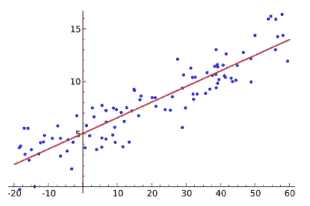

来源:图为[德斯莫斯](https://www.desmos.com)

多项式由以下公式定义

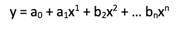

# 2.多项式的次数(转折点)

多项式的形状取决于次数项的数量，我已经在下面解释过了，所以正如你所看到的，一旦你理解了多项式的形状，你就可以开始计算它可能是哪一次了。一些学位的名称如下所示。

*   蓝色=线性多项式
*   黑色=二次多项式
*   红色=三次多项式

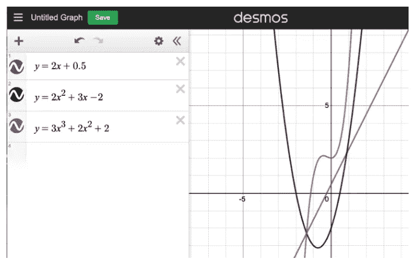

来源:绘制在 [desmos](https://www.desmos.com) 上

# 3.过度拟合/欠拟合

因此，增加多项式的次数，可以让直线更好地拟合数据。但是，要小心，过高也会“过度拟合”数据，也不会给你一个准确的预测。

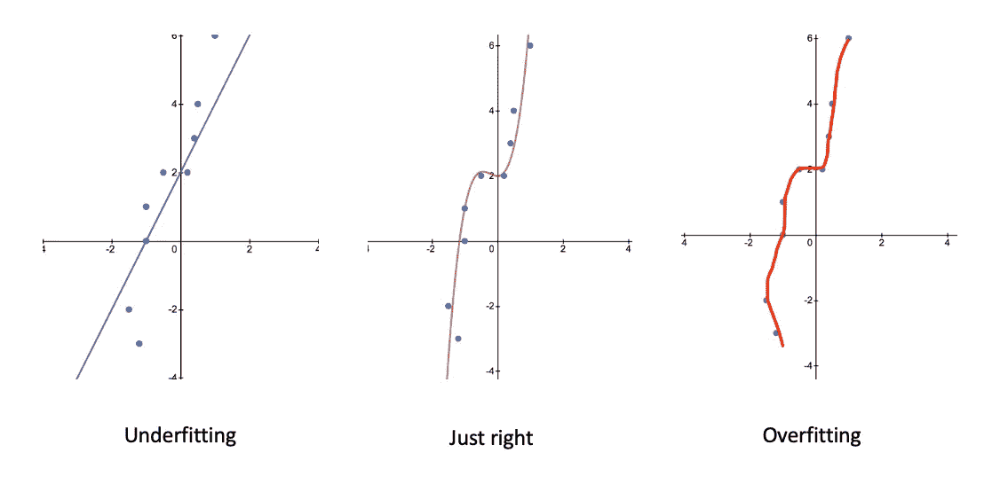

来源:在 [desmos](https://www.desmos.com) 上绘制

# 4.常数或指数变化的影响

现在让我们看看其他一些二次函数，看看当我们改变 x 的系数时会发生什么。我们将使用一个数值表来绘制图形，但我们将只填写那些靠近函数转折点的值。

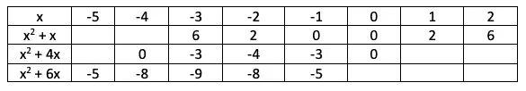

您可以在表格的每一行中看到对称性，这表明我们已经将注意力集中在每个函数转折点周围的区域。我们现在可以使用这些值来绘制图表。

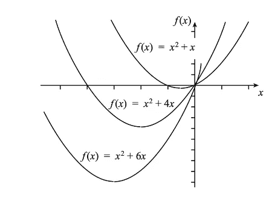

来源:在 [desmos](https://www.desmos.com) 上绘制

你为什么不登录[www.desmos.com](http://www.desmos.com)并绘制下面的多项式。尝试改变系数和常数项，看看形状的变化。


来源:在 [desmos](https://www.desmos.com) 上绘制

# 5.分解多项式

理解多项式如何因式分解很重要。这将允许稍后理解如何计算零来指示 x 轴上的截距。如果你喜欢看，那就看看我的 youtube 教程。

事实上，因式分解的过程是如此重要，以至于在不理解它的情况下，很少能完成超过这一点的代数。

**例 1:带有 GCF 的二次型**

理解这一点最简单的方法是做一个例子，假设我们有多项式:

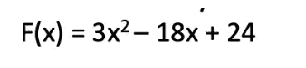

所以，我们的第一步是看看能不能找到最大公因式(gfc)。在这种情况下，它将是 3，因此这允许我们将每一项除以 3。这导致:

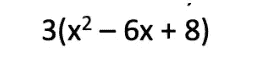

现在，我们需要将 8 分解成 2 个数字，它们相乘应该等于 8，但是相加等于 6:

```
 8
 / \
-4 -2
```

所以，-4 * -2 = 8，而-4–2 = 6
现在我们有了-4 和-2，我们可以因式分解我们的多项式如下:

```
F(x) = (x — 4) (x — 2)
```

在我们的因式分解多项式或原始多项式中插入一个 x 值，会得到相同的结果。

**示例 2:没有 GCF 的二次函数**

现在，当没有 gcf 的时候呢？让我们来看看多项式:

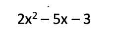

我们的第一步是将第一个系数乘以常数项。
Ie。2 * -3 = -6

现在，让我们找出两个数字，它们乘以-6，但也加到-5

```
 -6
 /  \
-6  +1
```

下一步是扩展我们的“- 5x”术语，以使用上述数字。记住
-6x+1x = 5x。

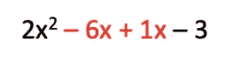

所以，让我们把这两部分分开

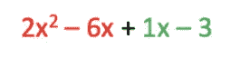

从第一个红色部分，我们可以去掉 2x，所以 2x 2–6x 变成

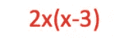

我们的第二部分，我们可以分解 1，得到:1(x-3)。
所以，我们以

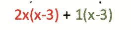

很好，让我们把(x-3)分解掉，我们最终得到一个分解的多项式

```
f(x) = (x-3) (2x + 1)
```

**示例:分组的三次多项式因子**

处理二次多项式的方法如上所述，那么现在，我们如何处理分解一个三次多项式。

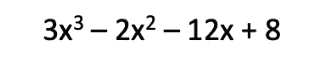

看看我们能否通过划分系数来分组。在下面的例子中，两者给我们的值都是 1.5，所以我们可以通过分组进行因式分解。

```
3/2 == -12/8 == -1.5
```

将上述分为两项，并对其进行分解。我们第一项的 GCF 是 x2，而第二项的 GCF 是-4。

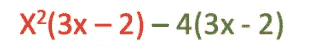

现在，让我们分解各项，我们可以分解出(3x — 2)

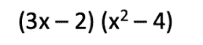

这留下了一个问题，因为我们有一个完美的正方形的差异。我们可以如下纠正这一点，取 x2 和 4 的平方根，将这一项分成两项，最后得到最终的因式多项式。

```
f(x) = (3x -2) (x — 2) (x + 2)
```

**什么是多项式的零点？**
如果你喜欢看，那就去 [youtube](https://youtu.be/OBW0r_ir2Sc) 。

我们需要它们只是因为我们经常在物理和其他情况的建模中使用多项式！零非常有用，因为它有助于找到根。那么，为什么要找到根源呢？

好吧，假设我们知道我们有问题，


那么，x 能是什么呢？

如果我们把一边化为零，问题就变得简单多了。

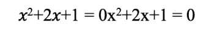

现在，我们可以把它代入二次公式，求出 x。

当然，你可能会说这只适用于二次型。然而，给定任意一个多项式，如果让它等于零，求根就变得容易多了。

所以，回答你的问题，我们实际上不需要零，但是它们真的很方便！

如果我们取以下分解多项式:
P1(x) = (x-1)(x-2)(x-3)

好吧，那么 x 的任何值，其中上面的等式=“零”。
所以任何时候上面 3 个表达式中的任何一个都是零，那么自然地所有 3 的乘积也将是零


因式分解后，这变得很容易推导，正如我们可以看到，当 x 是 1，2 或 3，P1(x)的结果将是零。

让我们再举一个例子，我们可以用图表来表示。

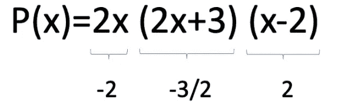

从上面我们可以看到，当 x = [-2，-3/2，2]时，我们的 3 个项都为零的点。当我们画出这个多项式时，它在图中也很明显。

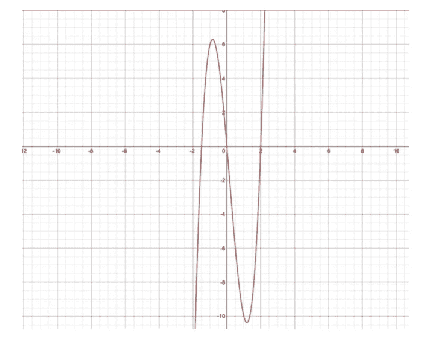

来源:图为[德斯莫斯](https://www.desmos.com)

我相信这可以清除零，这些可以在下一篇文章中看到，当我们讨论多项式的重数时。

# **6。多项式的多重性**

简单来说，重数是多项式穿过 x 轴的次数。如果你喜欢看，去 YouTube[看看](https://youtu.be/Oj6pQWMk8ZI)。

让我们以下面两个已经是因子形式的多项式为例。

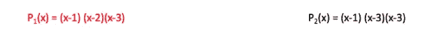

所以，在我们的下一步中，如果我们想计算多项式的重数，我们可以看到我们有多少个单独的零项。在上面的例子中。我们下面的第一步是计算出每一项下的零值。

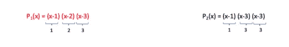

因此，如果我们创建一个表，我们现在可以在重数列中输入，对于这个零 x 值，我们有多少个零项。

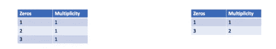

如果重数是奇数，那么我们有一个符号变化，而如果重数是偶数，那么我们没有符号变化。这告诉我们:

1.  对 P1 来说，因为所有的重数都是奇数，所以每当它碰到 x 轴，它就会改变符号。
2.  然而，对 P2 来说，当它达到 3 时，符号没有变化，因为多重数是偶数。

你可以在下面的动作中看到这一点，每次 P1 接触 x 轴时，它从负变为正，反之亦然。

然而，当 x=1 时，P2 确实从负变为正，但是当 x=3 时，它反弹并保持正。

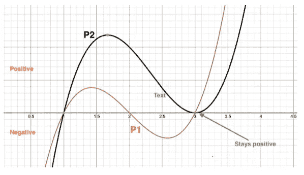

来源:在 [desmos](https://www.desmos.com) 上绘制

# 7.Matlab 中多项式的编码

是我们开始编码的时候了，系好安全带，让我们试一试…
[github 上的源代码。](https://github.com/shaunenslin/polynomials.git)
如果取以下多项式:


现在，如果我们将下面的 **x** 值代入上述等式，我们将得到下面的 **y** 结果。

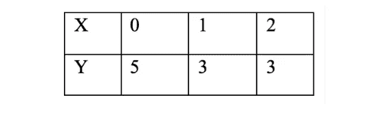

你现在可以启动 Matlab，创建你的 x 和 y 向量如下。然后运行 polyfit 命令，在最后一个参数中输入 2，因为我们使用的是二次函数。

```
x=[0,1,2]
y=[5,3,3]
polyfit(x,y,2)
```

运行以上，你应该得到一个如下的系数。很好，从我们的数据中，polyfit 找到了正确的多项式系数。

```
ans =1.0000 -3.0000 5.0000
```

这是一个很好的基本例子，但是让我们来尝试一些更复杂的例子。

**7.1 生成样本数据**

在这个例子中，我们没有数据集，但没关系，我们可以让 Matlab 生成一些样本数据来拟合我们的二次方程。首先，让我们定义我们的二次函数如下，称之为 *f* 。

```
clc;
clear;
close all;% declare our quadratic polynomial
f = @(x) 2*x.² — 4*x + 5;
```

现在，让我们使用 unifrnd 函数生成一些样本 x 值。我们用 *+ 1.5*randn(size(x))给 y 值添加一些变化。*毕竟，我们不希望数据太完美；-)

```
% Create x by getting random uniform values between -1 and 5
x = unifrnd(-1, 5, [100,1]);% Calculate y by running the polynomial but add some variations
y = f(x) + 1.5 * randn(size(x));
```

绘制数据点，这样我们就可以可视化数据

```
% plot the data points
figure;
plot(x,y,’rx’);
```

执行后，您将看到我们已经生成了一个很好的数据集来补充我们的二次函数。

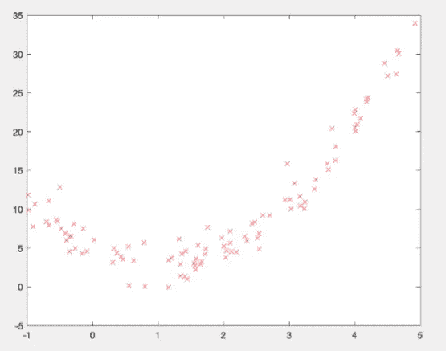

来源:来自 matlab 的屏幕截图

**7.2 找到我们的最佳系数**

现在我们有了数据，让我们对二次曲线进行拟合，找出最佳系数。我们选择二次曲线，因为我们可以看到在 x 轴上大约“1”处的数据中有一圈，因此形状符合二次曲线。

```
% find the best coeffeciant
[p,S] = polyfit(x,y,2);
```

我们现在有了 p 的最佳系数，可以用 polyval 为我们的系数画一条线了。

```
xx = linspace(-1, 5, 100);       % generate even spaced xx
[yy, delta] = polyval(p,xx,S);   % Now get the y for xx
hold on;
plot(xx,yy);
```

执行后，您的系数应该被绘制出来

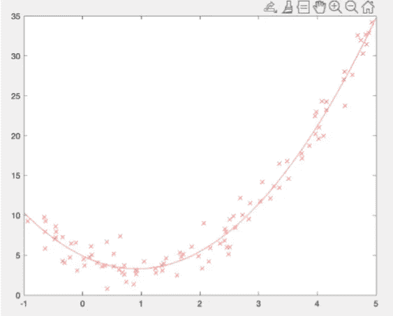

来源:来自 matlab 的屏幕截图

**7.3 绘制我们的支撑线/阻力线**

一个很好的小特性是，我们可以使用从 polyval 返回的 delta 来绘制多项式的支撑线和阻力线。这些图给了我们 90%的信心，数据将落在这些范围内。

```
% Lets use our delta to plot our support and resistance lines
plot(xx, yy + 2*delta, ‘b:’);
plot(xx, yy — 2*delta, ‘b:’);
```

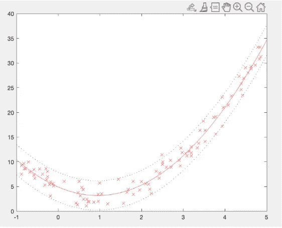

来源:截图来自 Matlab

# **8 结论**

阅读完本文后，您应该能够:

*   解释什么是多项式
*   因式分解多项式
*   计算零点
*   理解多项式的多重性

最后，我们在 Matlab 中构建了一个很好的示例，创建了具有二次多项式形状的数据。这就给出了你的假设，基于 X 值来预测 Y。