# R 平方、调整 R 平方和伪 R 平方完全指南

> 原文：<https://towardsdatascience.com/the-complete-guide-to-r-squared-adjusted-r-squared-and-pseudo-r-squared-4136650fc06c?source=collection_archive---------5----------------------->

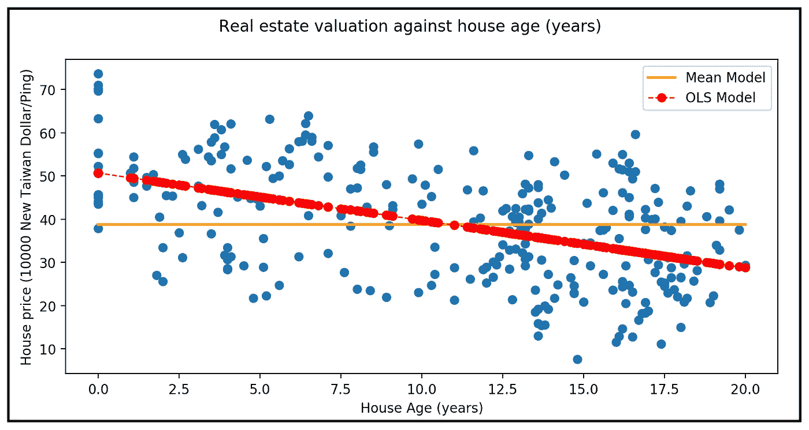

线性模型和均值模型(图片由[作者](https://sachin-date.medium.com/)

## 了解如何使用这些方法来评估线性和某些非线性回归模型的拟合优度

回归分析中最常用也是最常被误用的*之一是 R(读作 R 平方)。它有时被称为它的长名字:*决定系数*，它经常与相关系数 r 混淆。看，它已经变得令人困惑了！*

R 的技术定义是，它是响应变量 ***y*** 中方差的比例，您的回归模型能够通过回归变量的引入来“解释”。

显然，这并不能消除误会。

因此，我们呼吁熟悉的视觉线性回归线叠加在云的 *(y，x)* 点:


线性模型和均值模型(图片由[作者](https://sachin-date.medium.com/))(数据集:[台湾新北市房价](https://archive.ics.uci.edu/ml/datasets/Real+estate+valuation+data+set))

平坦的水平橙色线代表平均模型。均值模型是可以为数据构建的最简单的模型。对于每个 x 值，均值模型预测相同的 *y* 值，该值就是你的 ***y*** 向量的均值。在这种情况下，它恰好是 38.81 x 10000 新台币/坪，其中一坪是 3.3 米。

在解释 ***y*** 的方差方面，我们可以比均值模型做得更好。为此，我们需要添加一个或多个回归变量。我们将从这样一个变量开始——房子的年龄。图中红线表示线性回归模型拟合到*(****y****，****X****)*数据集时的预测，其中***y***=房价，***X***=房龄。如您所见，单变量线性模型比均值模型更适合。

*R 让您量化与均值模型相比，线性模型拟合数据的程度。*

让我们放大上图的一部分:

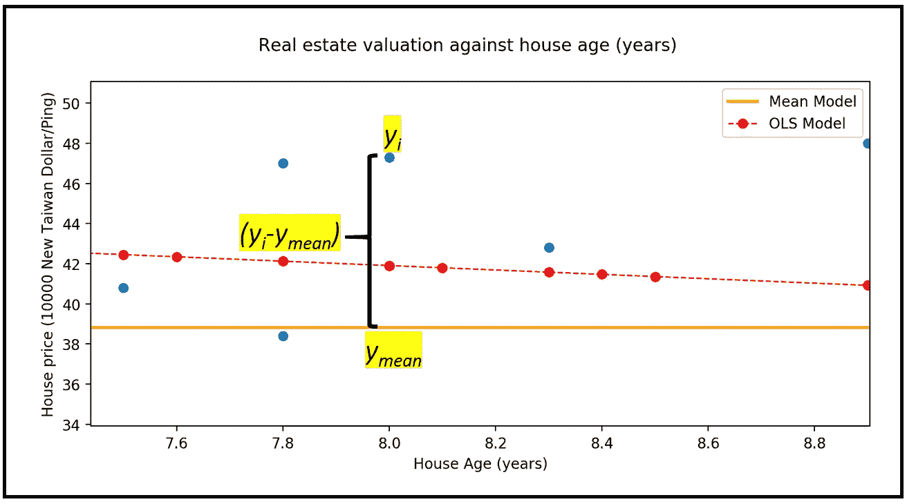

均值模型的预测误差(图片由[作者](https://sachin-date.medium.com/)提供)

上图中， *(y_i — y_mean)* 是均值模型在预测 *y_i* 时产生的误差。如果对**y的每个值计算这个误差，然后计算每个误差的平方和，就会得到一个与**y中的方差成正比的量。它被称为 TSS 平方的总和。****

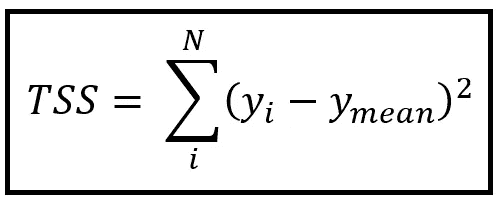

总平方和(TSS)(图片由[作者](https://sachin-date.medium.com/)提供)

> 平方和的总和与数据的方差成正比。这是均值模型无法解释的方差。

因为 *TSS/N* 是 ***y*** 中的实际方差，所以 TSS 与数据中的总方差成比例。

作为平方和，任何数据集的 TSS 总是非负的。

均值模型是一个非常简单的模型。它只包含一个参数，即因变量 ***y*** 的平均值，表示如下:

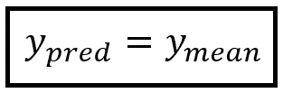

平均模型(图片由[作者](https://sachin-date.medium.com/)

> 均值模型有时也被称为零模型或仅截距模型。但是这种定义的可互换性仅在零模型或仅截距模型被拟合时才是适当的，即在数据集上被训练。只有这样截距才会成为**y的无条件均值。**

如前所述，如果你想比均值模型更好地解释 ***y*** 中的方差，你需要添加一个或多个回归变量。让我们仔细看看添加回归变量房屋年龄如何帮助线性模型减少预测误差:

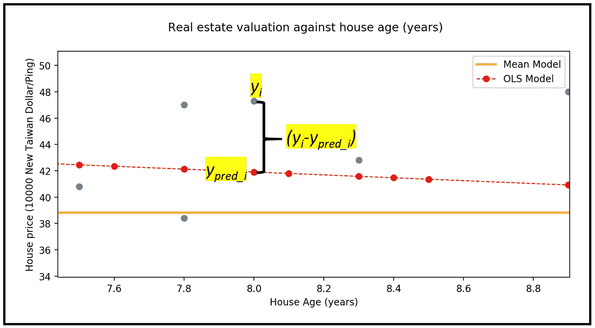

线性模型的预测误差(图片由[作者](https://sachin-date.medium.com/))

上图中， *(y_i — y_pred_i)* 是线性回归模型预测 *y_i* 的误差。这个量被称为**残差**或简称为**残差**。

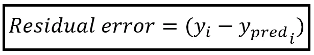

残差(图片由[作者](https://sachin-date.medium.com/)提供)

在上图中，残差明显小于均值模型的预测误差。这种改进是不保证的。在次优或构造不良的线性模型中，残差可能大于平均模型的预测误差。

如果你为每个 ***y*** 的值计算这个残差，然后计算每个这样的残差的平方和，你会得到一个与线性模型的预测误差成正比的量。它被称为 RSS 平方和的残差。

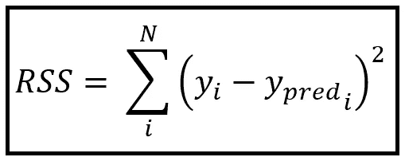

残差平方和(RSS)(图片由[作者](https://sachin-date.medium.com/)提供)

> 残差平方和捕捉自定义回归模型的预测误差。

作为平方和，回归模型的 RSS 总是非负的。

因此，*(残差平方和)/(总平方和)*是***【y】***中总方差的分数，这是您的回归模型无法解释的。

相反地:

*1 —(残差平方和)/(总平方和)*是你的回归模型*能够解释的*中方差的分数。**

*我们现在将根据 RSS 和 TSS 来陈述 *R* 的公式如下:*

*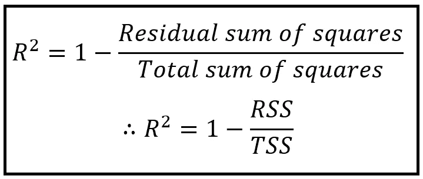*

*R 平方公式(图片由[作者](https://sachin-date.medium.com/)提供)*

*下面是生成上述图形的 Python 代码:*

*这里是数据集的[链接。](https://gist.github.com/sachinsdate/91a681e8aadf2f7d48128d3c81d46c9a)*

# *R 的范围*

*对于使用普通最小二乘(OLS)估计技术拟合(即训练)的线性回归模型，R 的范围是 0 到 1。考虑以下情节:*

*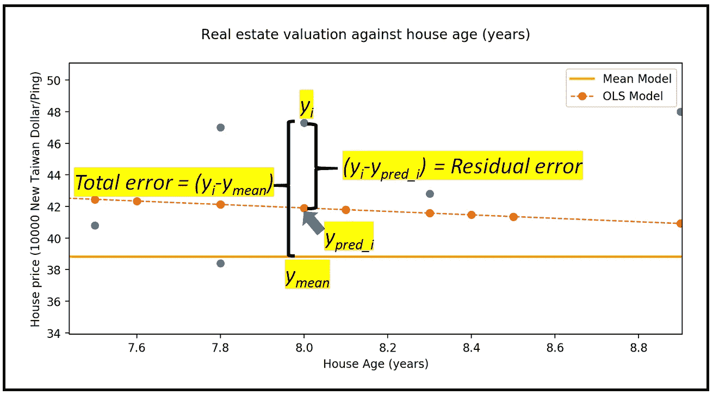*

*总误差和残差(图片由[作者](https://sachin-date.medium.com/)*

*从上图可以看出，残差 *(y_i — y_pred_i)* 小于总误差 *(y_i — y_mean)。*可以证明，如果使用 OLS 技术，即通过最小化残差平方和(RSS)将线性回归模型拟合到上述数据，最差的结果是均值模型。但是均值模型的残差平方和就是 TSS，即对于均值模型，RSS = TSS。*

*因此对于 OLS 线性回归模型， *RSS ≤ TSS* 。*

*由于 *R =1 — RSS/TSS* ，在完全拟合的情况下，RSS=0，R =1。最差情况下，RSS=TSS，R = 0。*

> *对于普通的最小二乘线性回归模型，R 的范围是从 0 到 1*

# *R 对非线性回归模型的适用性*

*许多非线性回归模型不*而*使用普通的最小二乘估计技术来拟合模型。这种非线性模型的例子包括:*

*   *用于在范围(-∞，∞)内连续变化的*y 的**指数、伽玛和逆高斯**回归模型。**
*   ****二元选择模型，如 Logit(又名逻辑)和 Probit** 及其变体，如用于 y = 0 或 1 的有序 Probit，以及二项式回归模型的一般类别。**
*   **离散非负的**【ϵ[0，1，2，…, ∞】的**泊松、广义泊松和负二项**回归模型。*即基于计数的数据集模型。***

**这些非线性模型的模型拟合过程不是基于逐步最小化残差平方和(RSS ),因此最佳拟合模型可能具有大于总平方和的残差平方和。这意味着，这种模型的 R 可以是一个负数。因此，对于大多数非线性模型，R 不是有用的拟合优度度量。**

> **对于大多数非线性回归模型，r 平方不是有用的拟合优度度量。**

**一个显著的例外是使用**非线性最小二乘** ( **NLS** )估计技术拟合的回归模型。NLS 估计量寻求最小化残差的平方和，从而使 R 适用于 NLS 回归模型。**

**在本文的后面，我们将研究非线性回归模型的 R 平方的一些替代方法。**

# **线性模型 R 平方的替代公式**

**我们再来看下图:**

**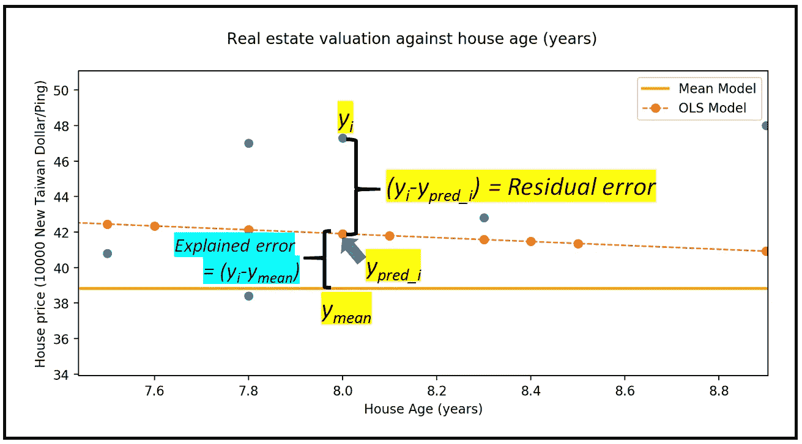**

**解释错误(ESS)(图片由[作者](https://sachin-date.medium.com/)提供)**

**在上图中， *(y_pred_i — y_mean)* 是我们通过向模型中添加回归变量 **HOUSE_AGE_YEARS** 而实现的预测误差减少。**

**如果你计算每一个 ***y*** 值的差值，然后计算每一个差值的平方和，你将得到一个与*y 中的方差成比例的量，这是线性回归模型*能够解释的。它被称为 ESS 平方的解释和。****

***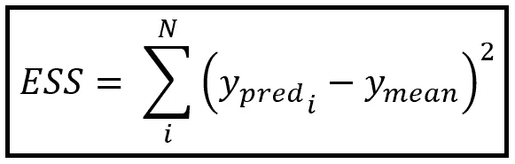***

***解释平方和(ESS)(图片由[作者](https://sachin-date.medium.com/)提供)***

> ***解释的平方和与您的回归模型**能够解释的数据方差成比例。*****

***让我们做一些数学。***

***从上面的情节可以看出:***

***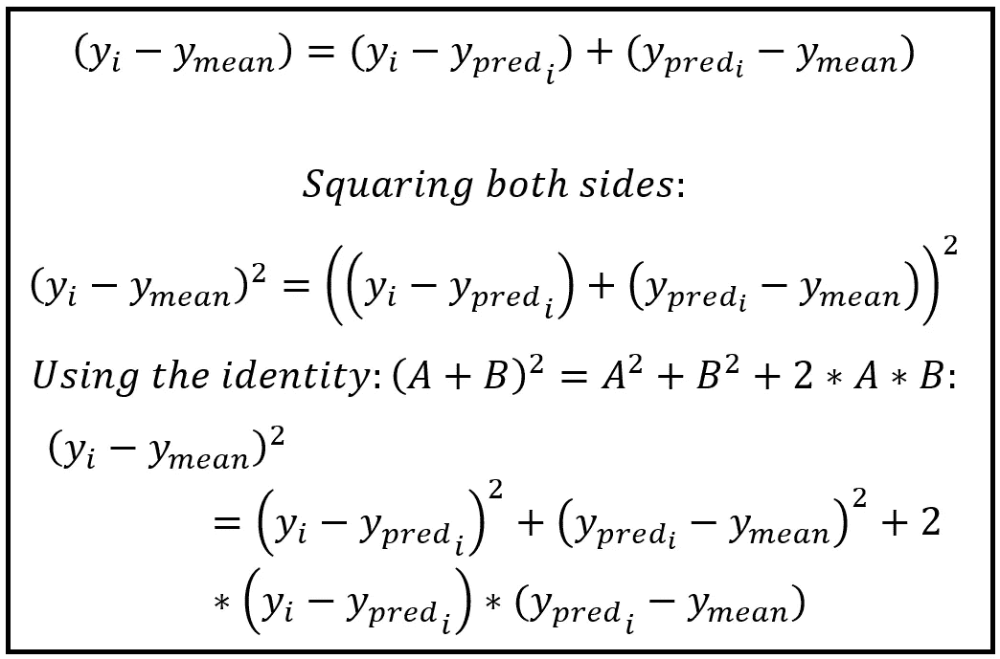***

***OLSR 模型的 R 平方替代公式的推导(图片由[作者](https://sachin-date.medium.com/)提供)***

***[可以看出](https://en.wikipedia.org/wiki/Explained_sum_of_squares#Partitioning_in_the_general_ordinary_least_squares_model)当使用最小二乘估计技术拟合线性回归模型时，项*2 *(y _ I—y _ pred)*(y _ pred—y _ mean)为 0。****

**所以对于 OLS 回归模型的特例:**

**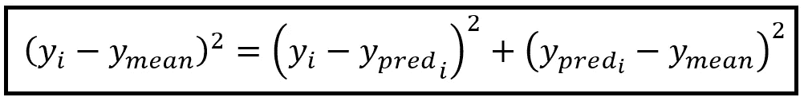**

**适用于 OLSR 模特的身份(图片由[作者](https://sachin-date.medium.com/))**

**换句话说:**

**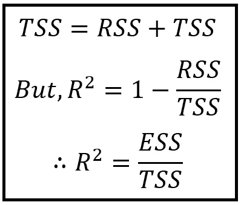**

**OLSR 模型的 R 平方的替代公式(图片由[作者](https://sachin-date.medium.com/)提供)**

# **例子**

**我们用来说明这些概念的线性回归模型已经适用于[新北市房地产数据集](https://gist.github.com/sachinsdate/91a681e8aadf2f7d48128d3c81d46c9a)的策划版本。让我们看看如何建立这个线性模型，并找到它的 R 值。**

**我们将从导入所有需要的库开始:**

```
****import** pandas **as** pd
**from** matplotlib **import** pyplot **as** plt
**from** statsmodels.regression.linear_model **import** OLS **as** OLS
**import** statsmodels.api **as** sm**
```

**接下来，让我们使用 Pandas 读入数据文件。[您可以从这里下载数据集](https://gist.github.com/sachinsdate/91a681e8aadf2f7d48128d3c81d46c9a)。**

```
**df = pd.read_csv(**'taiwan_real_estate_valuation_curated.csv'**, header=0)**
```

**打印前 10 行:**

**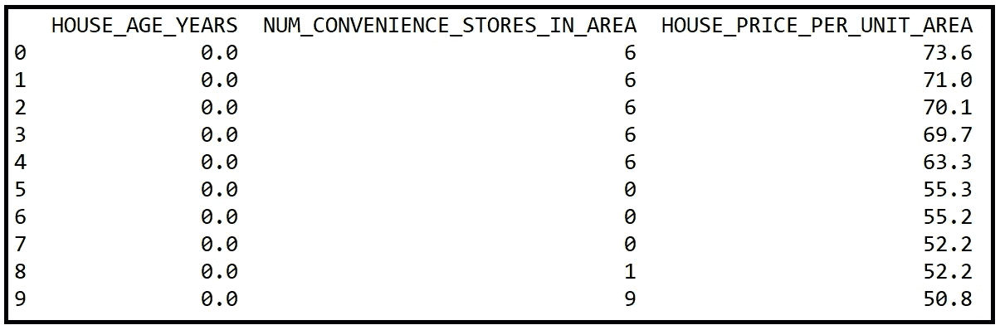**

**[新北市房地产数据前 10 行 se](https://gist.github.com/sachinsdate/91a681e8aadf2f7d48128d3c81d46c9a) t(图片由[作者](https://sachin-date.medium.com/)**

**我们的因变量 ***y*** 为**房价单位面积**我们的解释变量又称为回归变量 ***X*** 为**房屋年龄年限**。**

**我们将雕刻出 ***y*** 和 ***X*** 矩阵:**

```
**y = df[**'HOUSE_PRICE_PER_UNIT_AREA'**]
X = df[**'HOUSE_AGE_YEARS'**]**
```

**由于房龄为零的房屋，即新的房屋也将有一些非零价格，我们需要添加一个 y 截距。这就是直线方程中的'***β0***':***y _ pred*****=****β1*********X****+****β0******

```
*X = sm.**add_constant**(X)*
```

*接下来，我们构建并拟合 OLS 回归模型，并打印培训摘要:*

```
*olsr_model = **OLS**(**endog**=y, **exog**=X)
olsr_results = olsr_model.**fit**()

print(olsr_results.**summary**())*
```

*下面是我们得到的输出:*

*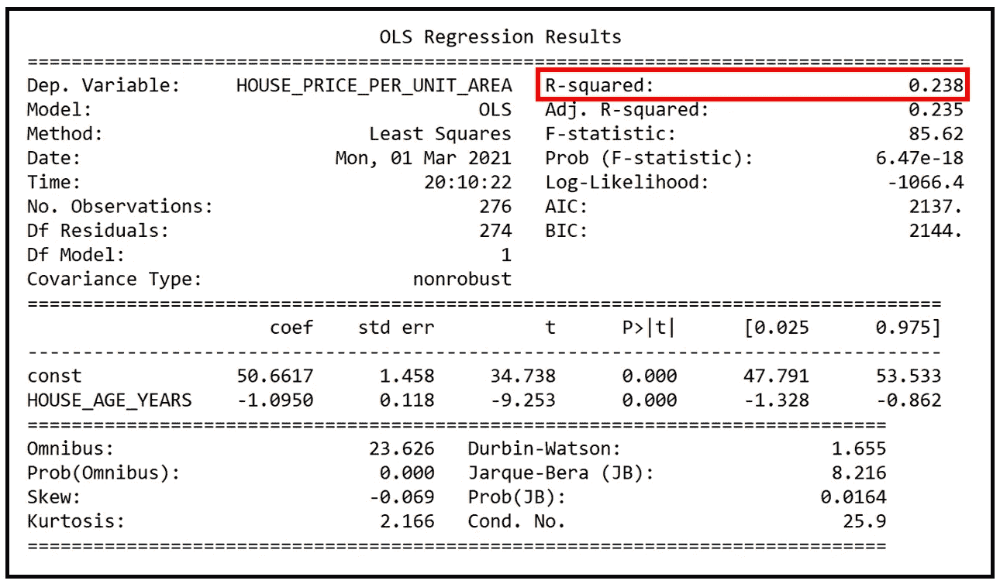*

*OLSR 模型的输出(图片由[作者](https://sachin-date.medium.com/)提供)*

*我们看到 R 是 0.238。r 不是很大，表明**房价单位面积**和**房龄年限**之间的线性关系很弱。*

*拟合模型的方程如下:*

**HOUSE _ PRICE _ PER _ UNIT _ AREA _ pred =-1.0950 * HOUSE _ AGE _ YEARS+50.6617。**

*房子的年龄和它的价格之间有一种微弱的负相关。而零楼龄的房子，预计单位面积的*均价*为 50.6617 x 10000 新台币/坪。*

# *如何增加 R 平方*

*某种程度上，这就像在问如何变得富有或者如何减肥？俗话说，小心你的要求，因为你可能会得到它！*

*在 OLS 线性回归模型中增加 R 的简单方法是加入更多的回归变量，但这也会导致模型过度拟合。*

*要了解为什么向 OLS 回归模型添加回归变量不会降低 R，请考虑使用 OLS 技术拟合的两个线性模型:*

****y _ pred****=****β1*********X1****+****β0****

****y _ pred****=*********X2****+****β1*********X1****+****β0******

****OLS 估计技术使残差平方和(RSS)最小化。如果第二个模型没有比第一个模型提高 R 的值，OLS 估计技术将把***【β2】***设置为零或某个统计上不重要的值，这将使我们回到第一个模型。一般来说，每次您添加一个新的回归变量并使用 OLS 重新调整模型，您将获得一个具有更好 R 的模型，或者与更受约束的模型具有基本相同的 R。****

****OLS 的这种属性估计会对你不利。如果您继续添加越来越多的变量，模型将变得越来越不受约束，过度适应训练数据集的风险也将相应增加。****

****另一方面，添加正确选择的变量将增加模型的拟合优度，而不会增加过度拟合训练数据的风险。****

****我们增加 R 的愿望和最小化过度拟合的需要之间的斗争导致了另一种拟合优度度量的产生，称为**调整的 R .******

# ****调整-R****

****Adjusted-R 背后的概念很简单。为了得到调整后的-R，我们每增加一个新的回归变量就要罚 R。****

****具体来说，我们通过与回归变量的数量成正比的因子来缩放(1-R)。模型中回归变量的数量越多，比例因子就越大，R 的向下调整也越大。****

****调整后 R 的公式为:****

****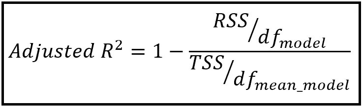****

****调整后的 R 公式(图片由[作者](https://sachin-date.medium.com/)提供)****

*****df_mean_model* 是均值模型的自由度。对于大小为 N 的训练数据集， *df_mean_model=(N-1)* 。****

*****df_model* 是回归模型的自由度。对于有 *p* 个回归变量的模型， *df_model=(N-1-p)* 。****

****替换为:****

****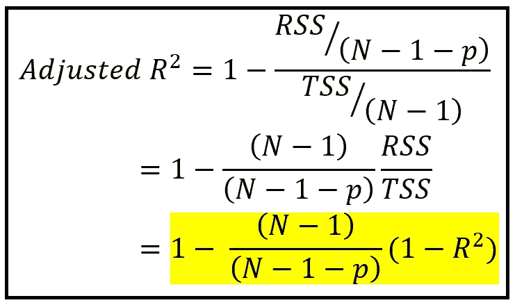****

****调整后的 R 公式(图片由[作者](https://sachin-date.medium.com/)提供)****

****可以看到，随着模型获得更多的变量， *p* 增加，并且因子 *(N-1)/(N-1-p)* 增加，这具有抑制 R 的效果。****

## ****调整-R 的缺点****

****Adjusted-R 存在一些问题，特别是:****

1.  ****它平等地对待所有回归变量的影响。实际上，在使模型适合(或过度适合)训练数据的能力方面，一些变量比其他变量更有影响力。****
2.  ****当 R 低于 p/(N-1)时，调整后的 R 的公式产生负值，从而将调整后的 R 的使用限制为仅高于 p/(N-1)的 R 值。****

# ****使用 Adjusted-R 比较两个线性模型的拟合优度****

****我们将使用我们的示例数据集来说明使用 Adjusted-R 的过程。为此，让我们引入另一个回归变量**NUM _ conveniency _ STORES _ IN _ AREA**，并根据数据集重新调整我们的 OLS 回归模型:****

```
****y = df[**'HOUSE_PRICE_PER_UNIT_AREA'**]
X = df[[**'HOUSE_AGE_YEARS'**, **'NUM_CONVENIENCE_STORES_IN_AREA'**]]
X = sm.**add_constant**(X)olsr_model = **OLS**(endog=y, exog=X)
olsr_results = olsr_model.**fit**()****
```

****让我们打印模型培训总结:****

****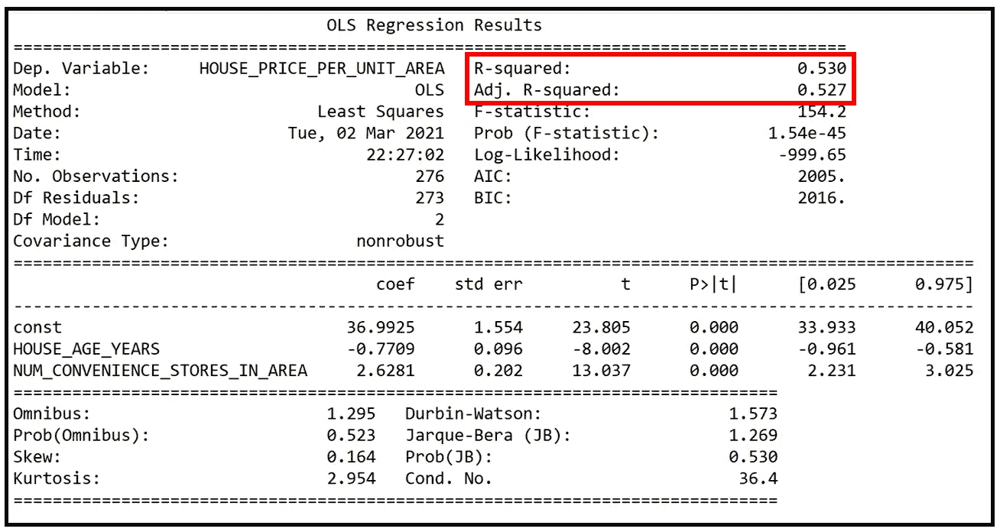****

****具有两个回归变量的 OLSR 模型的输出(图片由[作者](https://sachin-date.medium.com/)提供)****

****请注意，具有两个回归变量的模型的 R 和调整后 R 是具有一个变量的模型的两倍多:****

****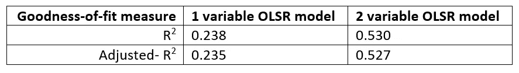****

****一元和二元 OLSR 模型的 R 和调整后 R 的比较(图片由[作者](https://sachin-date.medium.com/)****

****总的来说，新回归变量的加入提高了拟合优度。回归参数系数的 p 值进一步支持了这一结论。我们从回归输出中看到，2 变量 OLSR 模型中所有三个系数的 p 值基本为零，表明所有参数都具有统计显著性:****

****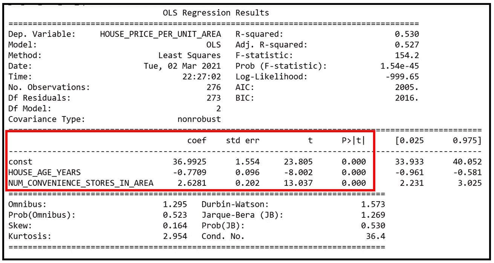****

****具有两个回归变量的 OLSR 模型的参数(图片由[作者](https://sachin-date.medium.com/)****

****拟合的双变量模型的方程如下:****

*****HOUSE _ PRICE _ PER _ UNIT _ AREA _ pred =-0.7709 * HOUSE _ AGE _ YEARS+2.6287 * NUM _ 便利店 _IN_AREA + 36.9925*****

# ****非线性回归模型中的 r****

****非线性模型通常使用模型拟合技术，如**最大似然估计(MLE)** ，这些技术不一定会使残差平方和(RSS)最小化。因此，给定两个使用 MLE 拟合的非线性模型，拟合优度较大的模型可能具有较低的 R 或调整后的 R。这一事实的另一个结果是，向非线性模型添加回归变量会降低 R。总体而言，R 或调整后的 R 不应用于判断非线性回归模型的拟合优度。****

****对于非线性模型，已经提出了一系列的替代方案。我们将研究一个这样的替代方案，它基于我们已经非常熟悉的以下等式:****

*****总平方和(TSS) =残差平方和(RSS) +解释平方和(ESS)。*****

****虽然这个恒等式适用于 OLS 线性回归模型，也称为线性模型，但对于非线性回归模型，事实证明，类似的*三角形*恒等式使用**偏差**的概念起作用。我们稍后会解释偏差的概念，但现在，让我们来看看非线性回归模型的这种同一性:****

*****仅截距模型的偏差=拟合的非线性模型的偏差+由拟合的非线性模型解释的偏差。*****

****符号方面:****

****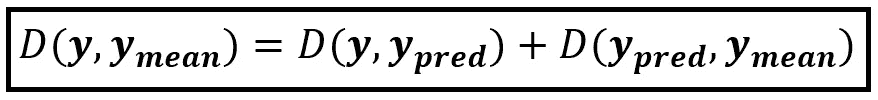****

****非线性回归模型的偏差单位(图片由[作者](https://sachin-date.medium.com/)提供)****

****其中:****

*****D(****y****，****y _ mean****)=仅截取模型的偏差*****

*****D(****y****，****y _ pred****)=拟合的非线性模型的偏差*****

*****D(****y _ pred****，****y _ mean****)=拟合非线性模型解释的偏差*****

****使用上述恒等式，Cameron 和 Windmeijer 描述了(参见文章末尾的论文链接)以下基于偏差的 R 公式，该公式适用于非线性模型，尤其适用于拟合离散数据的广义线性回归模型(称为 GLMs)。这种非线性模型的常见例子是泊松和广义泊松模型、负二项式回归模型和逻辑回归模型:****

****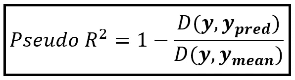****

****用于离散数据的非线性模型的 Pseu-R(图片由[作者](https://sachin-date.medium.com/)提供)****

****在我们继续之前，有些术语需要解释一下。****

## ****异常****

******回归模型的偏差**通过拟合回归模型的**对数似然**(更多关于对数似然)比**饱和模型的对数似然**大多少来衡量。具体来说，****

****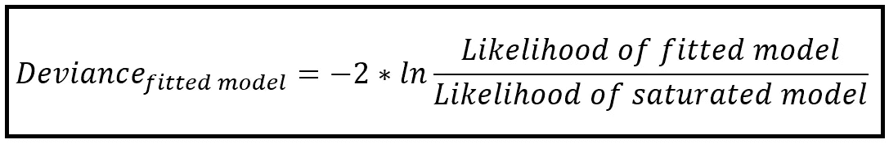****

****拟合回归模型的偏差(图片由[作者](https://sachin-date.medium.com/)提供)****

****所以这回避了两个问题:什么是饱和模型**和什么是可能性**？********

## ******饱和模型******

********饱和回归模型**是回归变量的数量等于样本数据集中唯一 y 值*的数量的模型。饱和模型给你的本质上是 N 个变量的 N 个方程，我们从大学代数中知道，N 个变量的 N 个方程的系统产生每个变量的精确解。因此，可以构建饱和模型来完美地拟合每个 ***y*** 值。因此，饱和模型最大可能地符合您的训练数据集。*******

## *****可能性*****

*****现在让我们来解决**可能性**。拟合回归模型的似然性是使用拟合模型的预测作为概率分布函数的平均参数，联合观察训练数据集中所有 ***y*** 值的概率(或概率密度)。计算可能性的过程如下:*****

*   *****假设你的训练数据集包含 100 个 ***y*** 观察值。你要计算的是用你拟合的回归模型观察到 *y1* 和 *y2* 和 *y3* 和……直到 *y100* 的**联合**概率。*****
*   *****因此，您首先要根据这些训练数据拟合您的回归模型。*****
*   *****接下来，通过拟合的模型输入训练集中的 100 行，以从该模型获得 100 个预测。这 100 个 *y_pred_i* 值就是您的 100 个条件平均值(具有平均值的*取决于您的 ***X*** 矩阵中相应的具有*行的*)。******
*   *****现在，您在*的概率(密度)函数中设置 100 个观察到的 **y** 值和 100 个条件均值(预测值)以获得 100 个概率值。 ***y*** 中每个 *y_i* 一个概率。******
*   ******最后，你把这 100 个概率相乘得到可能性值。这是在给定拟合模型的情况下观察训练数据集的可能性。******

******为了对计算有个感觉，我建议你参考下面的文章。它包含泊松模型似然性的示例计算:******

******[](/an-illustrated-guide-to-the-poisson-regression-model-50cccba15958) [## 泊松回归模型图解指南

### 和使用 Python 的泊松回归教程

towardsdatascience.com](/an-illustrated-guide-to-the-poisson-regression-model-50cccba15958) 

**对数似然**就是拟合模型似然的自然对数。

有了这些概念，让我们回到伪 R 的基于偏差的公式:


用于离散数据的非线性模型的 Pseu-R(图片由[作者](https://sachin-date.medium.com/)提供)

如前所述:

*D(****y****，****y _ pred****)=拟合的非线性模型的偏差*

*D(****y****，****y _ mean****)=仅截距模型的偏差*(又名空模型)。零模型仅包含截距，即没有回归变量。

使用我们的异常公式:


拟合回归模型的偏差(图片由[作者](https://sachin-date.medium.com/)提供)

而且，

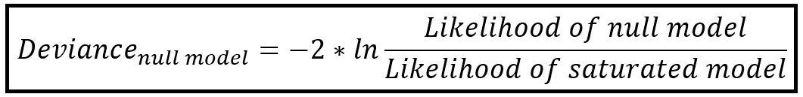

零模型的偏差(图片由[作者](https://sachin-date.medium.com/)提供)

因此:

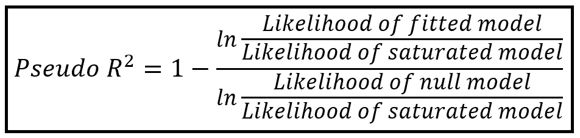

用于离散数据的非线性模型的 Pseu-R(图片由[作者](https://sachin-date.medium.com/)提供)

有时会使用麦克法登提出的以下**更简单版本的伪 R** (详情见下文论文链接):

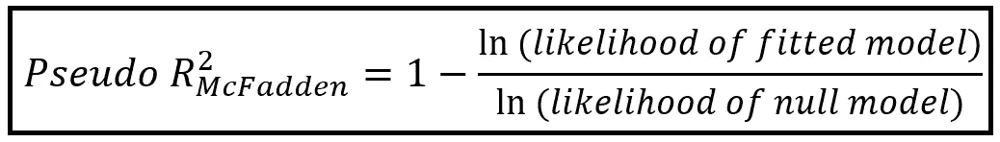

麦克法登的伪 R(图片由[作者](https://sachin-date.medium.com/)

麦克法登的伪 R 由 Python [statsmodels](https://www.statsmodels.org/stable/index.html) 库实现，用于离散数据模型，如泊松或负经济或逻辑(Logit)回归模型。如果你调用`[DiscreteResults.prsquared()](https://www.statsmodels.org/stable/generated/statsmodels.discrete.discrete_model.DiscreteResults.prsquared.html?highlight=prsquared#statsmodels.discrete.discrete_model.DiscreteResults.prsquared)`，你将得到你拟合的非线性回归模型上麦克法登的 R 平方值。

有关如何在基于离散(计数)的数据集上拟合此类非线性模型，请参见我的泊松和负双项回归模型教程:

[](/an-illustrated-guide-to-the-poisson-regression-model-50cccba15958) [## 泊松回归模型图解指南

### 和使用 Python 的泊松回归教程

towardsdatascience.com](/an-illustrated-guide-to-the-poisson-regression-model-50cccba15958) [](/negative-binomial-regression-f99031bb25b4) [## 负二项式回归:逐步指南

### 外加一个关于负二项式回归的 Python 教程

towardsdatascience.com](/negative-binomial-regression-f99031bb25b4) 

另请查看:

[](/generalized-linear-models-9ec4dfe3dc3f) [## 广义线性模型

### 它们是什么？我们为什么需要它们？

towardsdatascience.com](/generalized-linear-models-9ec4dfe3dc3f) 

# 参考文献、引文和版权

## **数据集**

叶以智、徐东光(2018)。[通过案例推理用比较法建立房地产估价模型](https://archive.ics.uci.edu/ml/datasets/Real+estate+valuation+data+set)。应用软件计算，65，260–271。

## 纸质和图书链接

Cameron A. Colin，Trivedi Pravin K .， [*计数数据回归分析*](http://cameron.econ.ucdavis.edu/racd/count.html) ，计量经济学学会专论№30，剑桥大学出版社，1998 年。国际标准书号:0521635675

McCullagh P .，Nelder John A .， [*广义线性模型*](https://www.routledge.com/Generalized-Linear-Models/McCullagh-Nelder/p/book/9780412317606) ，第二版。，CRC 出版社，1989，ISBN 0412317605，9780412317606

d .麦克法登(1974)， [*定性选择行为的条件逻辑分析*](https://eml.berkeley.edu/reprints/mcfadden/zarembka.pdf) ，载于:p .扎伦布卡(编。)，计量经济学前沿，学术出版社，纽约，105–142 页。 [**PDF 下载链接**](https://eml.berkeley.edu/reprints/mcfadden/zarembka.pdf)

卡梅伦和弗兰克温德梅杰。(1996).*应用于医疗保健利用的计数数据回归模型的 R 平方测量*。商业杂志&经济统计， *14* (2)，209–220。doi:10.2307/1392433[PDF 下载链接 ](http://cameron.econ.ucdavis.edu/research/jbes96preprint.pdf)

A.Colin Cameron，Frank A.G. Windmeijer，[](https://www.sciencedirect.com/science/article/pii/S0304407696018180)*一些常见非线性回归模型拟合优度的 R 平方度量，计量经济学杂志，第 77 卷，1997 年第 2 期，第 329-342 页，ISSN 0304-4076，
[https://doi . org/10.1016/s 0304-4076(96)01818-0](https://doi.org/10.1016/S0304-4076(96)01818-0.)[PDF 下载链接 ](http://faculty.econ.ucdavis.edu/faculty/cameron/research/je97preprint.pdf)*

*名词（noun 的缩写）J. D. Nagelkerke， [*关于决定系数*](https://academic.oup.com/biomet/article-abstract/78/3/691/256225) 一般定义的注记，《生物计量学》，第 78 卷，第 3 期，1991 年 9 月，第 691-692 页，【https://doi.org/10.1093/biomet/78.3.691】T4。 [**PDF 下载链接**](https://www.cesarzamudio.com/uploads/1/7/9/1/17916581/nagelkerke_n.j.d._1991_-_a_note_on_a_general_definition_of_the_coefficient_of_determination.pdf)*

## *形象*

*本文中的所有图片版权归 [Sachin Date](https://www.linkedin.com/in/sachindate/) 所有，版权归 [CC-BY-NC-SA](https://creativecommons.org/licenses/by-nc-sa/4.0/) 所有，除非图片下面提到了不同的来源和版权。*

# *相关文章*

*[](/an-illustrated-guide-to-the-poisson-regression-model-50cccba15958) [## 泊松回归模型图解指南

### 和使用 Python 的泊松回归教程

towardsdatascience.com](/an-illustrated-guide-to-the-poisson-regression-model-50cccba15958) [](/negative-binomial-regression-f99031bb25b4) [## 负二项式回归:逐步指南

### 外加一个关于负二项式回归的 Python 教程

towardsdatascience.com](/negative-binomial-regression-f99031bb25b4) [](/generalized-linear-models-9ec4dfe3dc3f) [## 广义线性模型

### 它们是什么？我们为什么需要它们？

towardsdatascience.com](/generalized-linear-models-9ec4dfe3dc3f) 

*感谢阅读！如果你喜欢这篇文章，请* [***关注我***](https://timeseriesreasoning.medium.com) *获取关于回归和时间序列分析的技巧、操作和编程建议。********