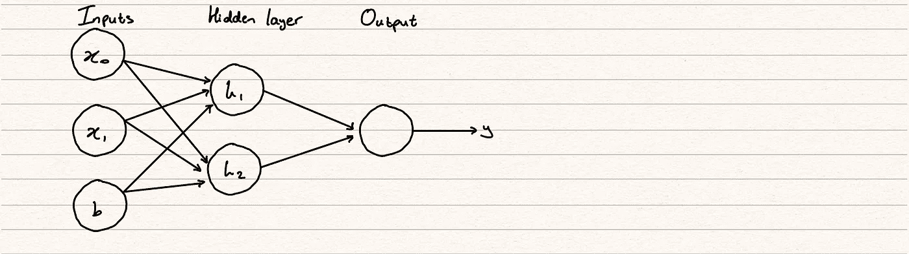

# 神经网络的组成部分

> 原文：<https://towardsdatascience.com/the-components-of-a-neural-network-af6244493b5b?source=collection_archive---------16----------------------->

## 对构建最常用的深度学习方法之一的关键部分的总结

本文是我正在撰写的关于机器学习关键理论概念的系列文章的延续。除了对 ML 的介绍，我还写了关于分类和回归的文章，可以在我的 [*页面*](https://dhruva-krishna.medium.com/) *访问。*

马库斯·斯皮斯克在 [Unsplash](https://unsplash.com/s/photos/neural-network?utm_source=unsplash&utm_medium=referral&utm_content=creditCopyText) 上拍摄的照片

## 介绍

神经网络是深度学习的典范，深度学习是机器学习的一部分，其特点是使用大量交织的计算。单个计算本身相对简单，但正是连接的复杂性赋予了它们高级的分析能力。

## 神经元

神经网络的构建模块是单个**神经元**。下图显示了具有一个输入的中子的结构。

作者图片

神经元的输入是 x，它有一个与之相关的权重 w。权重是固有参数，是模型为了更好地拟合输出而控制的参数。当我们将一个输入传递给一个神经元时，我们将它乘以它的权重，得到 x * w。

输入的第二个元素称为**偏置**。因为节点的值是 1，所以偏差仅由值 b 决定。偏差给我们的模型增加了不可预测性的因素，这有助于它一般化，并使我们的模型在使用测试数据时能够灵活地适应不同的未知输入。

偏差和输入的组合产生了我们的输出 y，给出了公式 w*x + b = y。这应该看起来很熟悉，因为它是对直线方程 y = mx + c 的修改。神经网络由数十、数百甚至数千个相互连接的神经元组成，每个神经元都运行自己的回归。本质上是类固醇的退化。

## 多端输入

自然，我们将无法使用如上图那样简单的回归来分析我们在现实世界中遇到的大多数数据集。我们将会看到更多的输入被组合起来估计输出。这是以与具有一个输入的神经元相似的方式实现的。

作者图片

上述等式的公式将读作 x0 * w0 + x1 * w1 + x2 * w2 + b = y。

## 层

神经网络将神经元组织成**层**。其中每个神经元都与其下一层中的所有其他神经元相连的层被称为**密集**层。

作者图片

通过这种不断增加的复杂性，神经网络能够以各种复杂的方式转换数据并推断关系。随着我们向网络中添加更多的层和节点，这种复杂性也在增加。

## 激活功能

目前，我们的模型仅适用于预测数据中的线性关系。在上图中，与一系列回归相比，运行这个神经网络没有任何好处。

神经网络以两种方式提供了解决方案。第一个是在输入和输出之间增加更多层的能力，称为隐藏层。这些隐藏层中的每一层都将具有预定数量的节点，并且这种增加的复杂性开始将神经网络与其回归对应物分开。

神经网络增加复杂性的第二种方式是通过在每个不是输入或输出的节点引入一个**激活** **功能**。如果你对这个术语不熟悉，我肯定会查看我以前写的关于线性分类的文章[，这篇文章更深入地研究了激活函数，但是总结一下，激活函数是一个使用非线性方法转换输入数据的函数。Sigmoid 和 ReLu 是最常用的激活函数。](/a-look-at-the-maths-behind-linear-classification-166e99a9e5fb)

作者图片

这两个模型都是非线性的这一事实意味着我们为我们的模型添加了另一个适应性元素，因为它现在可以预测没有线性决策边界或近似非线性函数的类。用最简单的话来说，没有激活函数，神经网络只能学习线性关系。如果不引入激活函数，像 x 曲线这样简单的对象的拟合将是不可能的。

因此，隐藏层中神经元的作用是获取输入及其权重的乘积之和，并将该值传递给激活函数。这将是作为输入传递给下一个神经元的值，无论它是另一个隐藏神经元还是输出。

作者图片

## 优化重量

当神经网络初始化时，其权重是随机分配的。神经网络的强大之处在于它可以通过调整这些权重来控制大量的数据。网络迭代地调整权重并测量性能，继续这个过程，直到预测足够准确或达到另一个停止标准。

我们预测的准确性由一个**损失**T2 函数决定。也称为成本函数，该函数将模型输出与实际输出进行比较，并确定我们的模型在估计数据集时有多差。本质上，我们为模型提供了一个旨在最小化的函数，它通过增量调整权重来实现这一点。

损失函数的常见度量是**均值** **绝对值** **误差**，**平均误差**。这测量了估计值和它们的实际值之间的绝对垂直差的总和。

作者图片

寻找最佳权重集的工作由优化器完成。在神经网络中，使用的优化方法是**随机**梯度下降**下降**。

每个时间周期或时期，随机梯度下降算法将重复某一组步骤，以便找到最佳权重。

1.  从权重的初始值开始
2.  不断更新我们知道会降低成本函数的权重
3.  当我们达到数据集的最小误差时停止

梯度下降需要一个可微分的算法，因为当我们找到最小值时，我们通过计算我们当前位置的梯度，然后决定向哪个方向移动以达到我们的梯度 0。我们知道误差函数的梯度等于 0 的点是曲线上的最小点，如下图所示。

作者图片

作者图片

我们迭代的算法，即梯度下降算法的步骤 2，采用我们当前的权重，并从中减去微分成本函数乘以所谓的学习率，学习率的大小决定了我们收敛或偏离最小值的速度。在我关于线性回归的文章中，我对梯度下降的过程有更详细的解释。

## 过度和不足

**过度拟合**和**欠拟合**是机器学习的两个最重要的概念，因为它们可以帮助你了解你的 ML 算法是否能够达到其真正的目的，被释放到世界上并遇到新的未知数据。

数学上，过度拟合被定义为训练数据的准确性大于测试数据的准确性的情况。不适应通常被定义为在训练和测试方面表现不佳。

那么这两个实际上告诉我们关于我们的模型什么呢？嗯，在过度拟合的情况下，我们基本上可以推断出我们的模型不能很好地概括看不见的数据。它获取了训练数据，而不是找到我们正在寻找的这些复杂、精密的关系，它建立了一个基于观察到的行为的严格框架，将训练数据视为真理。这个模型没有任何预测能力，因为它过于依赖提供给它的初始数据，而不是试图概括和适应略有不同的数据集。

在拟合不足的情况下，我们发现了相反的情况，我们的模型根本没有将自己附加到数据上。与之前类似，该模型无法找到强关系，但在这种情况下，它生成了松散的规则来提供数据的粗略估计，而不是任何具体的东西。因此，欠拟合模型在训练数据上的表现也会很差，因为它缺乏对变量之间关系的理解。

避免欠拟合通常比它的对应物更直接，因为一般认为欠拟合模型不够复杂。我们可以通过向模型中添加层、神经元或特征，或者增加训练时间来避免欠拟合。

一些用于避免过度适应的方法与避免适应不足正好相反。我们可以移除一些要素，尤其是那些与数据集中已经存在的其他要素相关的要素，或者那些与我们的输出几乎没有相关性的要素。更早地停止模型还可以确保我们获得更通用的模型，而不是让它过度分析我们的数据。

在某些情况下，过度拟合可能是由于模型过度依赖于某一组权重或我们神经网络中的路径而发生的。在训练期间，该模型可能已经发现，我们的神经网络的一部分中的某一组权重提供了与输出的非常强的相关性，但是这与其说是实际关系的发现，不如说是巧合。如果出现这种情况，那么当提供测试数据时，模型将无法提供相同级别的准确性。

我们这里的解决方案是引入**辍学**的概念。辍学背后的概念是，在我们培训过程的每一步，从本质上排除网络的一部分。这将帮助我们在整个网络中生成更均匀的权重，并确保我们的模型不会过于依赖任何一个子部分。

这就是你对神经网络组成部分的总结。我希望在以后的文章中更详细地介绍更多的概念，所以请密切关注这些概念！接下来是评估模型。如果你对我以前的文章感兴趣，也可以关注我的[页面](https://dhruva-krishna.medium.com/)。在那之前，✌️.