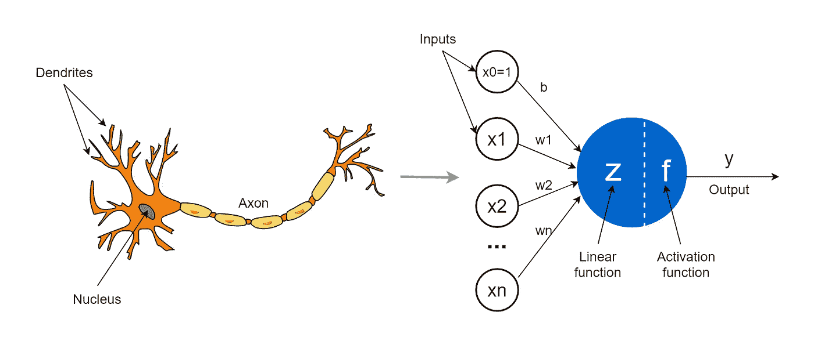
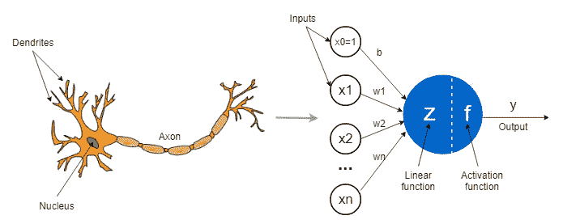
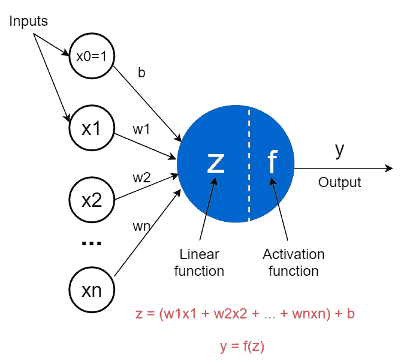
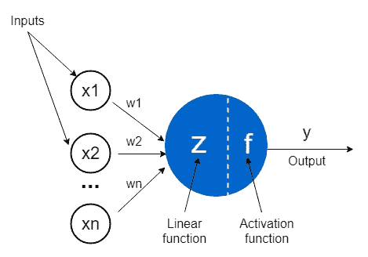
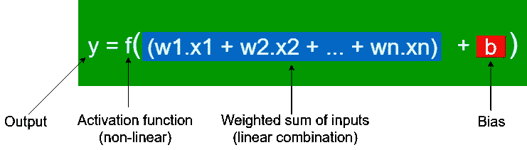
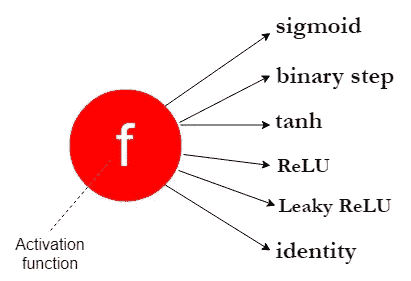
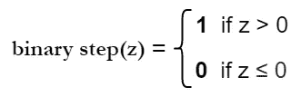
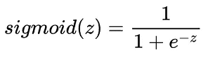
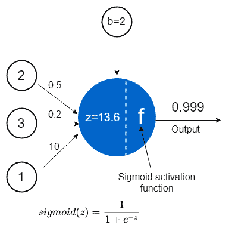

# 神经网络中人工神经元(感知器)的概念

> 原文：<https://towardsdatascience.com/the-concept-of-artificial-neurons-perceptrons-in-neural-networks-fab22249cbfc?source=collection_archive---------1----------------------->

## 神经网络和深度学习课程:第一部分



来自 [Pixabay](https://pixabay.com/?utm_source=link-attribution&utm_medium=referral&utm_campaign=image&utm_content=296581) 的 [Clker-Free-Vector-Images](https://pixabay.com/users/clker-free-vector-images-3736/?utm_source=link-attribution&utm_medium=referral&utm_campaign=image&utm_content=296581) 的图片(左图)和作者用 draw.io 制作的图片(右图)

今天，我们正式开始我们的 [**神经网络和深度学习课程**](https://rukshanpramoditha.medium.com/list/neural-networks-and-deep-learning-course-a2779b9c3f75) 正如这里介绍的。我们将从对神经网络中人工神经元(感知器)概念的扎实介绍开始。

***人工神经元*** (也叫 ***感知器*** ， ***单元*** 或 ***节点*** )是神经网络中最简单的元素或积木。它们的灵感来自于人类大脑中的生物神经元。

在本文中，我们将讨论感知器是如何受到生物神经元的启发，绘制感知器的结构，讨论感知器内部的两个数学函数，最后，我们将在感知器内部执行一些计算。

# 感知机是如何受到生物神经元的启发的？

人工神经元(感知器)如何受到生物神经元的启发，值得探讨。您可以将人工神经元视为受生物神经元启发的数学模型。



来自 [Pixabay](https://pixabay.com/?utm_source=link-attribution&utm_medium=referral&utm_campaign=image&utm_content=296581) 的[Clker-Free-Vector-Images](https://pixabay.com/users/clker-free-vector-images-3736/?utm_source=link-attribution&utm_medium=referral&utm_campaign=image&utm_content=296581)的图像(在左边)和作者的图像(在右边)，使用 draw.io 制作

*   一个生物神经元通过**树突**(小纤维)接收来自其他神经元的输入信号。同样，一个感知器通过**输入神经元**接收来自其他感知器的数据。
*   树突与生物神经元的连接点称为**突触**。同样，输入和感知器之间的连接被称为**权重**。他们衡量每个输入的重要性水平。
*   在生物神经元中， ***核*** 根据树突提供的信号产生输出信号。同样，感知器中的 ***核心*** (蓝色)基于输入值执行一些计算，并产生一个输出。
*   在一个生物神经元中，输出信号由 ***轴突*** 带走。同样，感知器中的轴突是**输出值**，它将是下一个感知器的输入。

# 感知器的结构

下图显示了感知器的详细结构。在某些情况下，偏差 **b** 用 **w0** 表示。输入值 **x0** 总是取值 1。所以， **b*1 = b** 。



感知器的结构(图片由作者提供，用 draw.io 制作)

> 一个感知器接受输入， **x1** ， **x2** ，…， **xn** ，将它们乘以权重， **w1** ， **w2** ，…， **wn** ，并添加偏置项， **b，**，然后计算线性函数， **z** ，激活函数，**f**

**在画感知器时，为了方便起见，我们通常忽略偏置单元，并将图表简化如下。但是在计算中，我们仍然考虑偏差单位。**

****

**没有偏差单元的感知器的简化版本(图片由作者提供，使用 draw.io 制作)**

# **感知器内部**

**感知器通常由两个数学函数组成。**

## **感知器的线性函数**

**这也被称为感知器的线性组件。用 **z** 表示。其输出是输入加上偏置单元的加权和，计算公式如下。**

****

**感知器的线性函数(图片由作者提供，用 draw.io 制作)**

*   ****x1** 、 **x2** 、…、 **xn** 是取数值的输入。单个神经元可以有几个(有限的)输入。它们可以是原始输入数据或其他感知器的输出。**
*   ****w1** 、 **w2** 、…、 **wn** 为 ***权重*** 取数值，控制每个输入的重要程度。值越高，输入越重要。**
*   ****w1.x1 + w2.x2 + … + wn.xn** 称为输入的加权和。**
*   ****b** 称为 ***偏置项*** 或 ***偏置单元*** 也是取数值。它被添加到输入的加权和中。包含偏置项的目的是移动每个感知器的激活函数，以不得到零值。换句话说，如果所有的 **x1** 、 **x2** 、…、 **xn** 输入都为 0，则 **z** 等于 bias 的值。**

**在神经网络模型中，权重和偏差被称为 ***参数*** 。这些参数的最佳值在神经网络的学习(训练)过程中找到。**

**你也可以把上面的 **z** 函数想象成一个线性回归模型，其中权重被称为 ***系数*** ，偏差项被称为 ***截距*** 。这只是用来在不同的上下文中标识同一事物的术语。**

## **感知器的非线性(激活)功能**

**这也被称为感知器的非线性部分。用 **f** 表示。它应用于 **z** 上，根据我们使用的激活函数类型得到输出 **y** 。**

****

**(图片由作者提供，用 draw.io 制作)**

****

**(图片由作者提供，用 draw.io 制作)**

**功能 **f** 可以是不同类型的激活功能。**

****

**激活功能的类型(图片由作者提供，使用 draw.io 制作)**

**由于有许多不同类型的激活函数，我们将在另一篇文章中详细讨论它们。现在，记住激活函数的目的是向网络引入非线性就足够了。如果没有激活函数，神经网络只能模拟线性关系，而不能模拟数据中存在的非线性关系。在现实世界的数据中，大多数关系是非线性的。因此，如果没有激活功能，神经网络将毫无用处。**

# **“激发一个神经元”是什么意思？**

**为此，考虑下面的 ***二进制步骤*** 激活函数，也称为 ***阈值激活函数*** 。我们可以为阈值设置任何值，这里我们指定值为 0。**

****

**二进制步进激活函数(图片由作者提供，用 draw.io 制作)**

**我们说，只有当 **z** 的值超过阈值 0 时，神经元或感知机才会激发(或激活)。换句话说，如果 **z** 的值超过阈值 0，则神经元输出 1(触发或激活)。否则，它输出 0。**

**因此，激活函数的类型决定了神经元如何激活或激发，而偏置项 ***b*** 控制了激发的难易程度。现在考虑线性函数， **z** 。**

****z =(w1 . x1+w2 . x2+…+wn . xn)+b
z =(输入的加权和)+ bias****

**假设偏差为-2。这里，我们也考虑二元阶跃激活函数。因此，只有当输入的加权和超过+2 时，神经元才会激活。用数学术语来说，这可以表示如下。**

**为了激活神经元，根据上面定义的二进制阶跃激活函数，它应该输出 1。它只发生在，**

****z > 0**
**(输入加权和)+ bias > 0
(输入加权和)> -bias****

**在我们的例子中，当偏差为-2 时，**

****(输入的加权和)> -(-2)
(输入的加权和)> 2****

**因此，在这种情况下，输入的加权和应该超过+2，以激发或激活神经元。**

# **在感知器内执行计算**

**让我们在感知内部进行一个简单的计算。假设我们有 3 个输入，值如下。**

```
**x1=2**, **x2=3** and **x3=1**
```

**因为我们有 3 个输入，所以我们也有 3 个权重来控制每个输入的重要程度。假设重量值如下。**

```
**w1=0.5**, **w2=0.2** and **w3=10**
```

**偏差单位也有以下值。**

```
**b=2**
```

**我们来计算一下线性函数， **z** 。**

****z =(0.5 * 2+0.2 * 3+10 * 1)+2
z = 13.6****

**激活函数将 **z** (13.6)的输出作为其输入，并根据我们使用的激活函数类型计算输出 **y** 。现在，我们使用下面定义的*激活函数。***

******

***Sigmoid 激活函数(图片由作者提供，用 draw.io 制作)***

*****y = sigmoid(13.6)
y = 0.999
y ~ 1*****

***整个计算过程可以用下图表示。为了便于理解，我们也在单独的节点中表示偏置项。***

******

***感知器内部的计算过程(图片由作者提供，用 draw.io 制作)***

***恭喜你！你已经成功地在感知器中完成了计算。***

# ***摘要***

***感知器是一种数学模型，其中线性函数和非线性激活函数一起工作来计算输出，该输出可以是下一个感知器的输入或者仅仅是最终输出。***

***我们在感知器中使用激活函数用于以下目的。***

*   ***它给网络带来了非线性。它使神经网络能够模拟现实世界数据中常见的非线性关系。***
*   ***激活函数的类型决定了神经元应该如何激发或激活。***
*   ***它将 **z** 的输出值保持在一定的范围内。例如，sigmoid 激活功能将 **z** 的值保持在 0 和 1(包括 0 和 1)的范围内。无论 **z** 的值是大是小。***

***事实上，没有激活函数的神经网络只是线性回归模型，只能对数据中的线性关系进行建模。***

***感知器的参数是**权重**和**偏差**。权重控制每个输入的重要程度。偏置项具有以下功能。***

*   ***如上所述，它决定了神经元点火或激活的难易程度。***
*   ***它移动每个感知器的激活函数以不得到零值。有时，零值可能会影响网络的训练过程。***

***随着感知器数量的增加，神经网络中可能有数千个参数(权重和偏差)。如前所述，这些参数的最佳值在神经网络的学习(训练)过程中找到。因此，参数(权重和偏差)从我们提供的数据中学习它们的最佳值。***

***本课程第 1 部分到此结束。第 2 部分见。***

***一如既往，祝大家学习愉快！***

***通过 [**订阅我的** **邮件列表**](https://rukshanpramoditha.medium.com/subscribe) ，再也不要错过精彩的故事。我一点击发布按钮，你就会在收件箱里收到每一篇文章。***

***如果你愿意，你可以 [**注册成为会员**](https://rukshanpramoditha.medium.com/membership) 以获得我写的每一个故事的全部信息，我将收取你一部分会员费。***

***[鲁克山·普拉莫迪塔](https://medium.com/u/f90a3bb1d400?source=post_page-----fab22249cbfc--------------------------------)
**2021–12–26*****