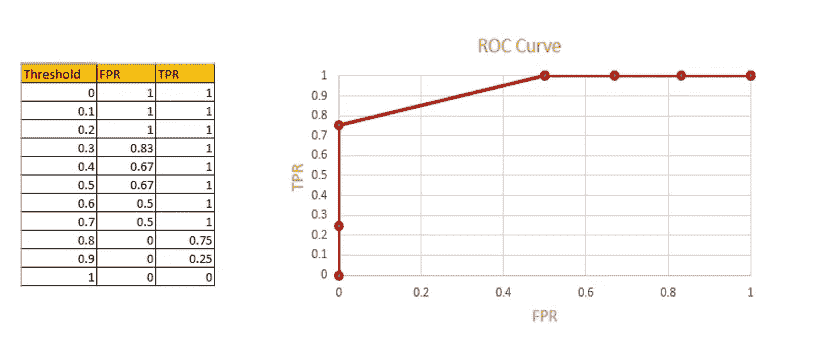

# 逻辑回归背后的概念

> 原文：<https://towardsdatascience.com/the-concepts-behind-logistic-regression-6316fd7c8031?source=collection_archive---------15----------------------->

## Sigmoid 函数、对数损失、优势比、模型系数、指标

米凯尔·布隆维斯特摄于[佩克斯](https://www.pexels.com/photo/marketing-fashion-art-creative-6483626/?utm_content=attributionCopyText&utm_medium=referral&utm_source=pexels)

# 逻辑回归

逻辑回归是用于分类的监督机器学习算法之一。在逻辑回归中，因变量是分类变量。

模型的目标是，给定独立变量，类可能是什么？[对于二元分类，0 或 1]

在本文中，我介绍了以下概念。

*   逻辑回归如何使用 sigmoid 函数来预测类？
*   哪个成本函数用于确定最佳拟合的 sigmoid 曲线？
*   什么是赔率，赔率比，对数赔率？
*   如何解读模型系数？
*   如何从模型系数中得到优势比？
*   用于评估模型的指标是什么？
*   如何利用 ROC 曲线设置阈值？

# 为什么不是线性回归？

在逻辑回归-二元分类中，我们将输出预测为 0 或 1。

**举例:**

1.  糖尿病患者(1)或非糖尿病患者(0)
2.  垃圾邮件(1)或火腿(0)
3.  恶性(1)或非恶性(0)

在线性回归中，产量预测将是连续的。所以，如果我们拟合一个线性模型，它不会预测 0 到 1 之间的输出。

因此，我们必须使用 sigmoid 函数将线性模型转换为 S 曲线，这将在 0 和 1 之间转换输入。

# Sigmoid 函数

sigmoid 函数用于将输入转换为范围 0 和 1。

1.  如果 z → -∞，则 sigmoid(z) → 0
2.  如果 z → ∞，则 sigmoid(z) → 1
3.  如果 z=0，则 sigmoid(z)=0.5

Sigmoid 曲线[图片由作者提供]

因此，如果我们将线性模型输入到 sigmoid 函数，它将在范围 0 和 1 之间转换输入

在线性回归中，y 的预测值通过使用下面的等式来计算。

在逻辑回归中， **ŷ是 p(y=1|x)。**这意味着 **ŷ** 提供了对 y=1 的概率的估计，给定一组特定的自变量(x) ***→****如果预测值接近 1，则意味着我们可以更确定该数据点属于第 1 类。
→如果预测值接近 0，意味着我们可以更确定该数据点属于 0 类。*

# 如何确定最佳拟合的 sigmoid 曲线？

## 价值函数

## 为什么不用最小二乘法作为代价函数？

在逻辑回归中，实际的 y 值将是 0 或 1。预测的 y 值 **ŷ** 将在 0 和 1 之间。

在最小二乘法中，误差是通过减去实际 y 值和预测 y 值并将它们平方来计算的

误差=(y- **ŷ)**

如果我们为错误分类的数据点计算最小二乘，比如说
y=0，而 **ŷ** 接近 1，误差只会非常小。

即使对于错误分类的数据点，产生的成本也非常少。这是原因之一，最小二乘法没有被用作逻辑回归的成本函数。

## 成本函数—对数损失(二元交叉熵)

对数损失或二元交叉熵被用作逻辑回归的成本函数

让我们检查分类成本函数的一些属性

1.  如果 y= **ŷ** ，误差应该为零
2.  错误分类的误差应该很高
3.  误差应该大于或等于零。

让我们检查一下这些性质是否适用于对数损失或二元交叉熵函数。

1.  **如果 y=ŷ，误差应该为零。**

情况 1: y=0 且 **ŷ** =0 或接近 0

情况二:y=1， **ŷ** =1 或接近 1。

ln1 =0 且 ln0 = -∞时

2.错误分类的误差应该很高

情况 1: y=1 且 **ŷ=0 或接近 0**

情况 2: y=0 且 **ŷ=1 或接近 1**

对于错误分类的数据点，误差往往非常高。

3.误差应该大于或等于零。

**误差= -{y ln ŷ + (1-y) ln (1-ŷ)}**

*→ y 为 0 或 1
→ ŷ始终在 0 和 1 之间
→ ln ŷ为负，ln (1-ŷ)为负
→在包含表达式以使误差为正之前的负号【在线性回归最小二乘法中，我们将平方误差】*

因此，误差将总是大于或等于零。

# 解释模型系数

为了解释模型系数，我们需要知道术语优势，对数优势，优势比。

## 赔率，对数赔率，赔率比

## 可能性

赔率被定义为事件发生的概率除以事件不发生的概率。

**例子:**掷出一个公平骰子时得到 1 的赔率

## 对数概率(Logit 函数)

对数赔率=ln(p/1-p)

应用 sigmoid 函数后，我们知道

根据这个等式，赔率可以写成:

**对数比值= ln(p/1-p) =** β 0+ β 1x

因此，我们可以通过使用对数优势将逻辑回归转换为线性函数。

## 让步比

赔率是两个赔率的比率

## 解释逻辑回归系数

逻辑回归模型

β 0 →当 X 为零时，对数几率为β 0。
β 1 →与变量 X1 相关的对数优势比的变化。

如果 X1 是数值变量，β 1 表示 X1 每增加一个单位，对数优势就增加β 1。

如果 X1 是一个二元分类变量，β 1 表示 x1=1 相对于 X1=0 的对数优势的变化。

# 如何从模型系数得到优势比？

## 逻辑回归中的优势比

逻辑回归中独立变量的优势比取决于在保持所有其他独立变量不变的情况下，特定变量增加一个单位时优势如何变化。

β 1 →与变量 X1 相关的对数优势变化。
变量 X1 的优势比是β 1 的指数

## 从模型系数推导优势比

# 分类的评估标准

1.  准确(性)
2.  pulse
3.  TNR
4.  定期用量法(Fixed Period Requirements)
5.  PPR
6.  F1 分数

## 准确(性)

准确性衡量实际预测占总预测的比例。这里我们不知道误差的确切分布。[假阳性和假阴性之间的分布]

困惑矩阵[图片由作者提供]

在准确性度量中，我们不知道误差的确切分布[假阳性和假阴性之间的分布]。因此，我们去寻找其他指标。

## 敏感度或回忆率或真阳性率(TPR)

真实阳性率衡量被正确分类的实际阳性的比例。

## 特异性或真阴性率(TNR)

真实否定率衡量被正确分类的实际否定的比例。

## 假阳性率或(1-特异性)

假阳性率衡量被错误分类的实际阴性的比例。

## 正预测率(PPR)或精度

预测阳性率衡量实际阳性占总阳性预测的比例。

## **F1 比分**

F1 分数是精确度和召回率的调和平均值

调和平均值怎么算？

1.  取精度和召回的倒数(1/精度，1/召回)
2.  求精度和召回率倒数的平均值

3.然后，求逆结果。

## 选择哪个指标？

这取决于问题陈述。

1.  **精度** →当我们需要知道预测精度时，比如有多少个 1 被归类为 1，有多少个 0 被归类为 0，但不考虑误差的分布(FP 和 FN)。
2.  **灵敏度** →当我们希望所有阳性记录都被正确识别时。更重视假阴性[在癌症数据集中，应正确预测癌症患者]
3.  **特异性** →当我们不希望任何负面标签被错误分类时。更重视误报[在垃圾邮件检测中，我们希望所有真正的电子邮件都能被正确预测]
4.  **F1 得分**指标用于不平衡的数据集。

# 度量公式

指标[作者图片]

# 门槛水平是多少？门槛水平如何设置？

## 阈电平

逻辑回归模型根据概率预测结果。但是，我们想预测 0 或 1。这可以通过设置阈值来实现。

如果阈值设置为 0.5 均值，则大于 0.5 的预测概率将转换为 1，其余值为 0。

## 受试者工作特征曲线

ROC 曲线是在所有分类阈值水平的 **FPR 和 TPR**or(**1-特异性对敏感性**)之间的权衡。

FPR →错误分类的负标签分数。
TPR→正确分类的阳性标记分数

如果 FPR=TPR=0，表示模型将所有实例预测为负类。
如果 FPR=TPR=1 表示模型预测所有实例为正类

如果 TPR=1，FPR=0 意味着模型正确预测了所有数据点。(理想模型)

**示例:**我已经根据实际 y 和所有阈值级别的预测概率计算了所有指标。

实际 y 和预测概率

为所有阈值级别(0–1)计算的所有指标

让我们画出所有阈值水平的 ROC 曲线(FPR 对 TPR)。

受试者工作特征曲线

## ROC 曲线的解释

从上面的 ROC 曲线，我们可以选择最佳的阈值水平。在 FPR =0 和 TPR =0.75 时，是上述 ROC 曲线的最佳阈值水平。
该点的 AUC 往往较高，FPR 也为零。

AUC——曲线下面积是 ROC 曲线覆盖的面积。AUC 范围从 0 到 1。

对于任何随机分类器，AUC =0.5。所以好模型的 AUC 评分应该在 0.5 到 1 之间。

如果 TPR=1，FPR=0 意味着模型正确预测了所有数据点。(理想模式)。在这种情况下，AUC 为 1。

AUC = 1[图片由作者提供]

## 为什么要用 ROC 曲线？

1.  比较不同型号的性能。从 ROC 曲线计算 AUC，AUC 越高的模型表现越好。
2.  为模型选择最佳阈值。

# 关键要点

1.  为了解释模型系数，我们使用以下等式

2.为了计算 **ŷ** ，我们使用以下等式

3.指数模型系数给出了优势比

# 结论

在本文中，我介绍了逻辑回归中的基本概念，如模型如何预测输出，如何解释模型系数，如何评估模型的性能。希望你们都喜欢。

感谢阅读！

</line-of-best-fit-in-linear-regression-13658266fbc8>  

*关注此空间，了解更多关于 Python 和数据科学的文章。如果你喜欢看更多我的教程，就关注我的* [***中***](https://medium.com/@IndhumathyChelliah)[***LinkedIn***](https://www.linkedin.com/in/indhumathy-chelliah/)*[***推特***](https://twitter.com/IndhuChelliah) ***。****

**点击此处成为中等会员:*<https://indhumathychelliah.medium.com/membership>*