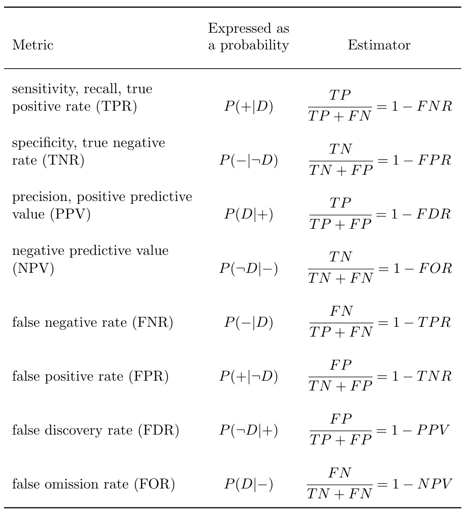
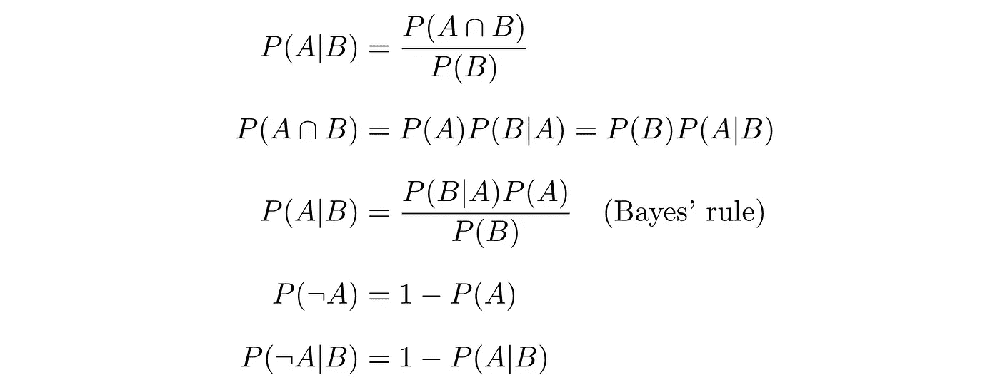
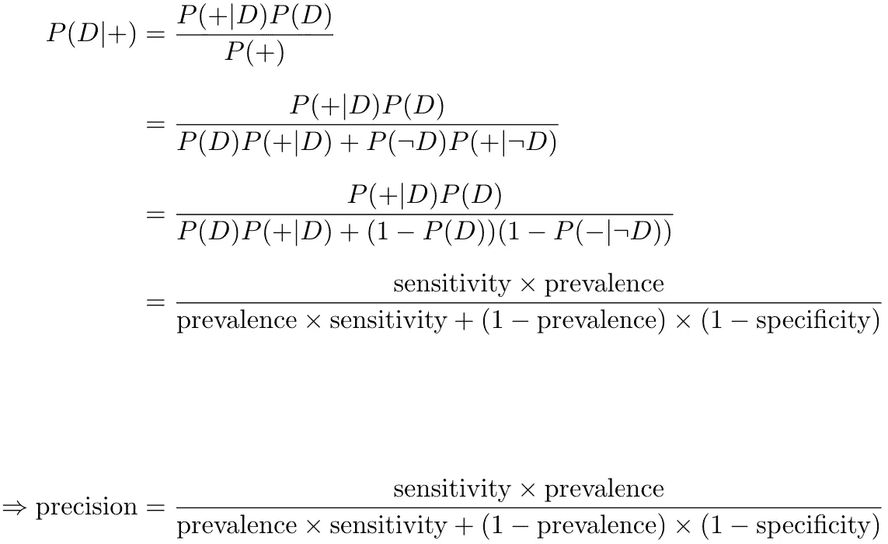
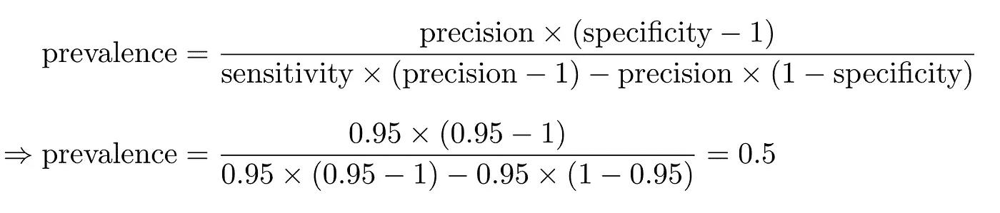
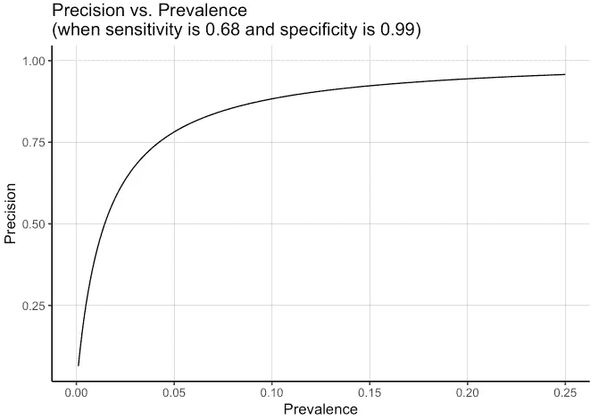
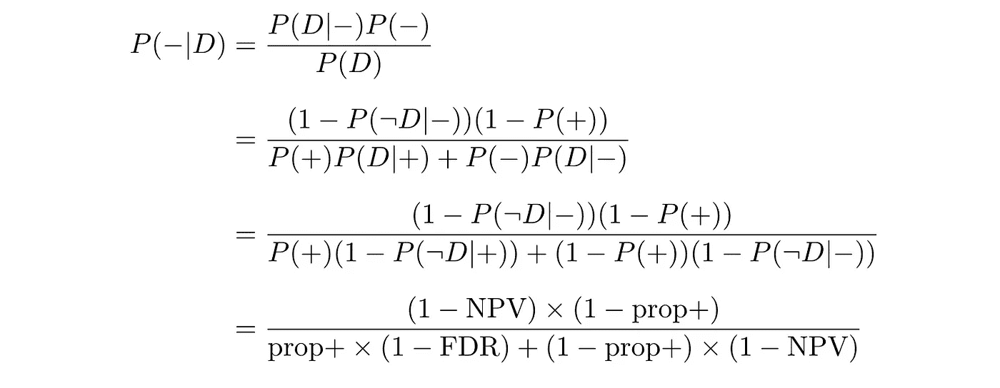

# 令人困惑的矩阵

> 原文：<https://towardsdatascience.com/the-confusing-matrix-71a43778b56a?source=collection_archive---------21----------------------->

## 当直觉让我们犯错时

[来源](https://unsplash.com/photos/pkKRdpurSPw):【https://unsplash.com/photos/pkKRdpurSPw】T2

# 你应该读这篇文章吗？

如果你能回答下面的问题，并充分解释原因(不只是提供一个有根据的猜测)，那么这篇文章可能对你没有什么价值。

1.  测试的精确度是 95%,我们被告知测试总是发现 10%的受试者是阳性的。我们对一个随机的受试者进行测试。测试返回真阳性的概率是多少？
2.  测试的特异性为 95%,精确度为 90%。
    我们对一个健康的受试者进行测试。测试返回阳性结果的概率是多少？
3.  测试的灵敏度(召回率)为 90%，特异性为 90%。假设我们将测试应用于患病率为 1%的数据集。假设测试返回阳性结果，受试者患病的概率是多少？
4.  一家公司试图向你推销他们的新测试，这种测试在检测某种疾病时(据说)非常准确。他们声称，它的灵敏度(回忆)为 95%，特异性为 95%，精确度为 95%。有没有可能这不是某种营销伎俩，这种测试确实存在？
5.  假设某项测试的灵敏度(召回率)为 95%，特异性为 95%。我们也知道患病率是 10%。我们对 1000 名受试者进行了测试。测试会发现多少阳性结果？
6.  假设某项测试的灵敏度(召回率)为 95%，特异性为 95%。我们也知道患病率是 10%。有没有可能检测的阴性预测值是 50%？
7.  假设在某个数据集上评估了一个测试，发现其精度为 95%。我们现在在不同的数据集上运行这个测试，其中 50%的受试者患有该疾病。测试会返回任何阳性结果吗？

# 介绍

通常的做法是通过从混淆矩阵容易获得的性能度量来评估返回二进制结果的测试(或模型)的性能，例如，给定混淆矩阵，我们可以容易地计算精度、召回、f1 分数等。

无论计算多么简单，一旦我们不仅仅考虑一个指标，或者当我们需要揭示一个口头调查的概率意义时，它就会变得相当棘手。
例如，“对于患有该疾病的受试者，检测结果呈阳性的概率是多少？”可以重新表述为“P 的估计值是多少(阳性测试结果|真条件为阳性)”，这可以使用估计值*# {真阳性}/# {真阳性+假阴性}* 来实现，即，我们希望对测试的灵敏度(召回)进行估计。

这篇文章的目的是提供一些问题的例子和可能的解决方案，它们可以帮助我们加深理解和直觉，让我们更容易地在一个测试的性能指标和每个指标所暗示的各种含义之间流动。

这篇文章并没有涵盖所有关于从困惑矩阵中得出的性能指标的问题。它确实(希望)涵盖了一些基础知识，可以帮助我们解决更复杂的问题，并更好地理解度量标准如何相互关联以及它们在实践中的意义。

# 符号及更多

当我们考虑一个检测疾病存在的测试时，我们将从回顾我们将在这篇文章中使用的符号开始。

将***【P(D)***表示为受试者**患病的概率**(即疾病的患病率)。
***P(不是 D)*** 或 ***P( D)*** 是一个受试者**没有患病**的概率。
***P(+)*** 是测试返回一个**阳性**结果的概率。
***P(–)***是测试返回一个**阴性**结果的概率。

根据以上我们得到:
***P(+|D)*** 这是假设受试者**患有疾病**，测试将返回**阳性**结果的概率。
***P(–| not D)***这是假设受试者****没有疾病**的情况下，测试返回**阴性**结果的概率。
同样我们有 ***P(不是 D|+)*** 、***P(D |–)***等条件概率。**

**我们将互换使用回忆和敏感性这两个术语，阳性率/患病率和精确度/阳性预测值也是如此。下表可能有助于解决本文中的问题:**

****

**作者图片**

**我们也可以在[这个维基百科页面](https://en.wikipedia.org/wiki/Precision_and_recall)中找到表格中的信息。**

## **一些概率定律的简要回顾**

**回忆几个可能对我们有用的基本概率定律:**

****

**作者图片**

# **关于完整性的几点说明**

## **评估者和估计**

**在这篇文章中，我完全忽略了一个事实，即我们基于经验混淆矩阵计算的指标，是运行一些实验、测试、模型等的结果。实际上是估计。**

**换句话说，如果以精度的估计量为例，TP/(TP + FP)只是检验(或模型)的真实(未知)精度的估计量。我们根据在数据集上运行模型/测试得到的混淆矩阵计算的任何度量值都是测试的真实(未知)度量的**估计**。**

## **贝叶斯或频率主义方法**

**我也避免讨论度量标准，这正是我们试图估计的，是某个未知的常数还是实际上是一个随机变量。对于这篇特定的文章来说，讨论是不太相关的，尽管在实践中它是非常有趣的。**

## **不适当的评分规则**

**在考虑分类性能指标时，存在使用正确的评分规则还是不正确的评分规则的问题。**

**这里就不赘述了，不过你可以在这里和[这里](https://www.fharrell.com/post/classification/)了解更多。**

**关于这个主题的全面综述可以在[gne iting&raftey(2007)](https://sites.stat.washington.edu/raftery/Research/PDF/Gneiting2007jasa.pdf)中找到。**

# **题型**

**关于各种性能指标，我们可以问许多类型的问题。在这里，我们将只涵盖几种类型的问题，你可以在这些问题的基础上提出更多的变化。**

## **型个性**

**该问题中仅提供了一个指标，我们以受试者的真实状况(患病/健康)为条件。**

**答案可能是度量值，1 减去度量值，或者使用现有信息无法回答问题。**

****问题格式:** 某测试的 **<度量 *>*** 为 **X%** 。
我们对一名< **健康/患病** >的受试者进行测试。测试返回一个 **<阳性/阴性>** 结果的概率是多少？**

****例** :
一项检测的特异性是 95%。我们对一名健康的受试者进行测试。测试返回阳性结果的概率是多少？**

**问题求假阳性率，`P(+|not D)` *。*
给定特殊性，应用规则`P(A|B) = 1 — P(not A|B)`我们知道`P(+|not D) = 1 — P(-|not D) = 1 — specificity`，所以答案是`1 — specificity = 1 — 0.95 = 0.05`。**

## **型个性**

**与上一个问题类型相同，只是添加了不相关的信息。**

****问题格式:** 某项测试的 **<指标 *>*** 为 **X%** 其 **<其他指标>** 为 **Y%** 。
我们对一名< **健康/患病** >受试者进行测试。测试返回一个 **<阳性/阴性>** 结果的概率是多少？**

****例** :
一项检测的特异性为 95%，精确度为 90%。我们对一名健康的受试者进行测试。测试返回阳性结果的概率是多少？**

**我们不需要精确来回答这个问题；特异性就足够了。这个问题的答案和上一个题型的答案一样:`1 - specificity`。**

## **C 型**

**在问题中，只有一个指标与阳性/阴性检测结果的流行率或比例一起出现。注意，在这种情况下，问题不会要求我们找到一个条件概率。**

****问题格式:** **<某项测试的度量 *>*** 为 **X%** ，我们被告知 **<患病率/阳性测试结果比例>** 为 **Y%** 。我们对一个随机的对象进行测试。测试返回一个 **<真/假> - <正/负>** 的概率是多少？**

****示例** :
测试的精确度是 95%，我们被告知测试总是发现 10%的受试者是阳性。我们对一个随机的对象进行测试。测试返回真阳性的概率是多少？**

**这些问题要求我们找到`P(+ and D)`。
我们知道`P(A and B) = P(B|A)P(A)`所以
`P(+ and D) = P(D|+)P(+) = (precision) * (proportion positive results)`
所以我们得到`0.95*0.1 = 0.095`。**

## **D 型**

**类似于前一种类型，但增加了冗余信息，这一次我们可能会问一个条件概率。**

****问题格式:**
某测试的< **度量** >为 **X%** 。我们还知道测试的< **其他指标** >是 **Y%** ，并且这些指标是在患病率为 **Z%** 的数据集上评估测试时获得的。
我们对单个对象执行测试，它返回一个< **阴性/阳性** >结果。是一个< **假/真** > - < **负/正** >的概率有多大？**

****举例:** 某测试的误发现率为 5%。我们还知道，该测试的阴性预测值为 95%，并且这些指标是在患病率为 10%的数据集上评估该测试时获得的。我们对单个受试者进行测试，结果是否定的。它是假阴性的概率是多少？**

**问题要求`P(D|-)`我们知道
**

**除了测试的阴性预测值之外的所有信息都不是回答问题所必需的，它们只是噪音。**

## **E 型**

**该问题包括两个指标和测试给出的阳性测试结果的流行率或比例。**

****问题格式:** 测试的< **度量** >为 **X%** 其< **其他度量** >为 **Y%** 。假设我们将测试应用于一个数据集，其中< **阳性结果的患病率/比例** >为 **Z%** 。假设测试返回一个< **阳性/阴性** >结果，受试者健康/患病 >的概率是多少？**

****例:** 某项检测的灵敏度为 90%，特异性为 90%。假设我们将测试应用于患病率为 1%的数据集。假设测试返回阳性结果，受试者患病的概率是多少？**

**这个问题要求我们找出测试的精确度，`P(D|+)`。
为了找到`P(D|+)`，我们可以应用贝叶斯法则，在明确写出这些术语后，我们看到只需插入灵敏度、特异性和患病率的值，就可以得到精确度的值。**

****

**作者图片**

## ****F 型****

**与上一个问题类型相同，只是更糟糕—问题包含看似相关的信息，但问题无法回答。**

**例:
用前面题型例中的阴性预测值替换特异性。当我们用贝叶斯法则重写它时，算出精度的形式，你会看到我们最终得到的项的值在问题中没有给出，所以它无法求解。**

# **再举几个例子**

1.  **假设某项测试的特异性为 95%。我们在没有受试者患病的数据集上运行这个测试。测试会返回任何阳性结果吗？
    **回答:**是的，该测试会将数据集的 5%标记为阳性，即使它们实际上都是该疾病的阴性。这是因为假阳性率也可以表示为`1 — specificity`，所以我们有`1 — 0.95 = 0.05`。**
2.  **假设某项测试的灵敏度为 60%。数据集中的患病率为 70%，我们还知道测试返回的结果中有 80%是阳性的。测试的精确度是多少？
    **回答** :
    问题让我们去找`P(D|+)`。
    我们可以用贝叶斯法则来解决:
    `P(D|+) = P(+|D)P(D) / P(+)`
    `= sensitivity * prevalence / proportion positive results`
    `= 0.6 * 0.7 / 0.8 = 0.525`**
3.  **假设在某个数据集上评估了一个测试，发现其精度为 95%。我们现在在不同的数据集上运行这个测试，其中 50%的受试者患有该疾病。测试会返回任何阳性结果吗？
    **回答:**根据问题中给出的信息，我们无法回答。考虑到我们现有的信息，我们知道`P(D|+) = 0.95`和`P(D) = 0.5`。
    问题问的是`P(+)`，或者更确切的说是问`P(+) > 0`是否。
    `P(+)`也可以写成
    `P(+) = P(D)P(+|D) + P(not D)P(+|not D)` *。* 由于我们不知道`P(+|D)`(灵敏度)的值，也不知道`P(+|not D)` (假阳性率)的值，所以我们无法回答这个问题。
    只是为了说明，我们确实知道`P(not D)` *、*的值，因为`1−P(D) = P(not D)`。**
4.  **假设某项测试的灵敏度为 95%，特异性为 95%。我们也知道患病率是 10%。我们对 1000 名受试者进行了测试。测试会发现多少阳性结果？
    **回答:**我们之前展示了如何使用贝叶斯法则解决一个非常相似的问题。我们现在将展示另一种方法。
    我们知道该疾病的患病率，因此我们知道 1000 名受试者中有 10%患有该疾病，因此有 100 名实际阳性。
    测试灵敏度为 95%,因此 100 个实际阳性中的 95 个将通过测试发现，并且它们是真阳性。
    测试特异性为 95%,因此 900 个实际阴性中的 855 个将通过测试发现，并且它们是真阴性。剩余的 45 个实际阴性将被测试错误地检测为阳性，并且将是假阳性。这与注意到我们的假阳性率是 5%是一样的，因为假阳性率等于 1-特异性。
    我们最终得到 95 个真阳性+ 45 个假阳性，总共 140 个阳性，这是我们被要求找到的数量。
    顺便说一下，我们现在也知道测试精度是`95/(95+45)=67.9%`**
5.  **假设某项测试的灵敏度为 95%，特异性为 95%。我们也知道患病率是 10%。有没有可能检测的阴性预测值是 50%？
    **答案:**否
    根据与上一个问题非常相似的计算，为了简单起见，假设我们对 1000 名受试者进行了测试:
    患病率为 10%，因此我们有 100 名实际阳性者和 900 名实际阴性者。
    95%的灵敏度为我们提供了 95 个真阳性和 5 个假阴性。95%的特异性产生 855 个真阴性和 45 个假阳性。
    阴性预测值为
    T1**
6.  **一家公司试图向你推销他们的新测试，这种测试在检测某种疾病时(据说)非常准确。他们声称，它的灵敏度为 95%，特异性为 95%，精确度为 95%。有没有可能这不是某种营销伎俩，这种测试确实存在？
    **回答:**正如我们看到的，我们可以把精确度写成患病率、敏感性和特异性的函数。让我们再看一遍:**

****

**作者图片**

**我们注意到，我们可以重新排列上述内容，以便将患病率表示为敏感性、特异性和准确性的函数。然后，我们插入公司报告的指标，如下所示:**

****

**作者图片**

**事实证明，根据该公司提供的指标，他们在患病率为 50%的数据集上评估了他们的测试，这是非常高的，可能与我们希望在我们打算使用该测试的人群中看到的真实患病率完全无关。换句话说，将相同的测试应用于患病率为 2%的一组受试者将导致不同的表现指标，并且不是所有的指标都可以达到 95%。**

## **使用贝叶斯因子**

**回答问题 4 的另一种方法是使用[贝叶斯因子](https://en.wikipedia.org/wiki/Bayes_factor)，该方法在本视频中有详细介绍:“[医学测试悖论，重新设计贝叶斯法则](https://www.youtube.com/watch?v=lG4VkPoG3ko)”。我不会在这里介绍这个方法，因为我认为这个视频解释得非常好，我强烈推荐观看。**

# **这玩意在现实生活中真的有用吗？**

**最近由科斯托拉斯等人(2021) 发表在《美国流行病学杂志》上的一项[研究报告了一项荟萃分析的结果，该分析评估了 RT-聚合酶链式反应测试对新冠肺炎的诊断准确性。](https://academic.oup.com/aje/article/190/8/1689/6206818)**

**在我们的案例中，研究的两个结果是令人感兴趣的，这两个结果是 RT-聚合酶链式反应测试的灵敏度估计值 0.68 和测试的特异性估计值 0.99。**

**正如我们之前看到的，给定敏感性和特异性，我们现在可以将精确度固定在某个值并获得患病率，或者反之，将患病率设置为某个值并获得精确度。**

**假设我们将疾病患病率固定在 1.5%。使用在[研究](https://academic.oup.com/aje/article/190/8/1689/6206818)中估计的敏感性和特异性值以及这个流行率值，我们最终得到 50.9%的精确度。在这种情况下，由 RT-聚合酶链式反应测试提供的大约 49%的阳性结果是假阳性。注意:49%是误发现率，不要和误报率混淆(这是两个不同的指标)。**

**另一方面，假设我们将精确度设置为 95%，同时仍然使用研究中发现的 68%灵敏度和 99%特异性的值。在这种情况下，我们发现这种疾病的患病率约为 12%，这有点高。**

**因此，我们看到了精确性和普遍性之间的权衡，假设敏感性和特异性是固定的。我们可以画出这种权衡:**

****

**作者图片**

**我们现在可以问更多的问题，关于我们在做各种公共卫生决策时使用 RT-PCR 检测结果的方式。**

**在 Andrew Gelman 的帖子中可以找到另一个很好的度量标准及其含义的例子:“[对斯坦福冠状病毒流行研究](https://statmodeling.stat.columbia.edu/2020/04/19/fatal-flaws-in-stanford-study-of-coronavirus-prevalence/)的关注”。**

# **练习练习练习**

**我们在这篇文章中讨论的问题有许多不同的风格。**

**我能想到的提高我们对主题的掌握的最好的方法是练习这些问题，并弥补我们在理解中发现的任何差距。**

**在以下链接中，您可以找到 1000 个这样的问题- [绩效指标问题](https://gist.github.com/roncho12/6a32187b093d1c0f200e942d5d171fd8)。这些问题是自动生成的，其中一些无法回答，也就是说，问题中提供的信息不足以回答它，我们可能缺少指标或其他一些数据。我们可以把这些看做是难题，这取决于我们去理解到底缺少了什么，以及为什么这个问题不能被回答。**

## **一些解决方案**

**这些是一些问题的解决方案，可以在[的链接](https://gist.github.com/roncho12/6a32187b093d1c0f200e942d5d171fd8)中找到。**

****第一个例子:****

> **测试的错误发现率为 95%,其阴性预测值为 85%。
> 这些指标是在数据集上评估测试时获得的，其中阳性测试结果的比例为 1%。我们对一个生病的受试者进行测试。测试返回否定结果的概率是多少？**

**先把问题中给出的信息写成概率:
`FDR = P(not D|+) = 0.95; NPV = P(not D|–) = 0.85``proportion of positive test results (prop+) = P(+) = 0.01`**

**这个问题要求我们找到`P(–|D)`，即假阴性率(FNR):**

****

**作者图片**

**我们现在可以代入 FDR，NPV，prop+的值，找到答案。**

****第二个例子:****

> **测试的精确度为 95%,假阳性率为 90%。我们对一个生病的受试者进行测试。测试返回否定结果的概率是多少？**

**和往常一样，我们先把问题中的信息表示成概率:
`precision = P(D|+) = 0.95; FPR = P(+|not D) = 0.9`**

**问题要求我们求`P(–|D)`，即假阴性率(FNR):
`P(–|D) = P(D|-)P(-) / P(D)`我们知道可以把`P(D)`写成`P(D) = P(+)P(D|+) + P(-)P(D|–) = P(+)P(D|+) + (1 — P(+))P(D|–)`但是，求`P(D)`的值需要我们知道`P(+)`的值，以及`P(D|+)`(在问题中作为精度给出)和`P(D|–)`(即没有给我们的假漏报率(FOR)。因此，我们无法回答这个问题，因为我们缺少一些必需的信息。**

# **面试问题——注意事项**

**如果你打算在求职面试中问这类问题，要记住的一点是，回答一个问题有不止一种方式，你应该能够跟随候选人沿着概率计算的道路走下去，直到当他正确回答时，你会对他露出放心的微笑。**

**你应该对你提出的问题非常熟悉。仅仅知道“5%是正确答案”是不够的，因为关键是要理解候选人是如何得出这个数字的，而不仅仅是让他凭直觉猜测。**

**如果你对材料不够熟悉，候选人将无法从你那里得到任何暗示和指导，以防他结结巴巴，或者更糟的是，如果答案变得有点复杂，他会意识到你无法理解他的答案，这绝不是一件好事。**

# **摘要**

**基于混淆矩阵中可用计数数据的性能度量被广泛用于评估预测性能。尽管它们很容易计算，但是一旦我们用语言描述它们，并试图解释它们的含义以及它们如何相互作用，这些指标就不总是直观的了。**

**仅仅因为一些指标只涉及简单的计算，并不意味着它也很容易掌握。**

**希望这篇文章能鼓励你花些时间深入研究这些常用的度量标准，并更好地理解当度量标准 X 取值 y 时的真正含义。**

**我希望你觉得这篇文章有用，而不是完全无聊:)**

**欢迎评论和反馈！**

**我们一直在寻找有才华的人加入我们的团队！**