# 混乱矩阵:读完这个之后就不那么混乱了——我保证！

> 原文：<https://towardsdatascience.com/the-confusion-matrix-not-so-confusing-after-reading-this-guaranteed-or-your-money-back-8b529156a101?source=collection_archive---------19----------------------->

## [动手教程](https://towardsdatascience.com/tagged/hands-on-tutorials) / [机器学习](https://towardsdatascience.com/tagged/machine-learning)

## 不要以貌取人！混乱矩阵可能会让很多人感到困惑，但读完这篇文章后你就不会困惑了


照片由[丹·列斐伏尔](https://unsplash.com/@danlefeb?utm_source=medium&utm_medium=referral)在 [Unsplash](https://unsplash.com?utm_source=medium&utm_medium=referral) 拍摄

# 目录

1.  [**简介**](#6a30)
2.  [**欢迎参加聚会**](#1b7d)
    ◘ [什么是困惑矩阵？](#be5c)
    ◘ [稍微预览一下](#8fe0)
    ♣ [我们先举个例子](#8f12)
    [我们来玩个游戏](#7cd5)
    ♥ [苹果还是不苹果？](#f0a8)
    ♠ [最终布局](#7bb6)
    ◘ [其他布局](#6d1f)
    ◘ [欺骗代码到混乱矩阵](#8903)
3.  [**事后方**](#393a)
4.  [**结论**](#b90d)
    ◘ [参考文献](#f243)
    ◘ [终言](#5fb8)

# 介绍

一天晚上，你和你的朋友决定去参加一个聚会，在聚会上，假设你看到了一个你感兴趣的人，于是你去介绍自己并交换信息。你重新和你的朋友在一起，让他们知道发生了什么，让你惊讶的是，你的一个朋友告诉你，他们个人认识你刚刚与之交换信息的这个人，并解释了为什么这可能是一个坏主意。在这种情况下，你是一个算法，你给你决定与之交换信息的人一个准确度分数，你的朋友在那里用解释来迷惑你，为什么你的准确度分数是误导的。

很有可能，类似的事情也发生在你身上。在这篇文章中，我将介绍你需要知道的关于混淆矩阵的几乎所有东西，为什么使用它，什么时候使用它，以及如何使用它。在我看来，最好的学习方法是从例子中学习，这就是为什么我会用两个例子，而不是一个例子来讲解——是的，混淆矩阵中的两个例子。我不认为我在上一段中给出的“例子”是一个实际的例子，相反，在我们前往实际的聚会之前，这是一个小小的*游戏前的*。

# 欢迎参加派对

队伍很长，外面很冷。你和你的朋友不想排很长很冷的队伍，所以你走向保镖，给他 500 美元。保镖向你和你的朋友点点头，让你进去，但有一个条件，保镖问，“困惑矩阵向你展示了什么？”你困惑地看着保镖，心想保镖一定是疯了。你的朋友突然脱口而出，“*混淆矩阵显示了你的分类模型在进行预测* <#f243>时混淆的方式。”当你看向你的朋友并回头看向保镖时，突然你的一条眉毛扬起。然后保镖向你的朋友点点头，让你和你的朋友进去，你敬畏地看着你朋友的反应。你带卡尔·皮尔逊来参加聚会是件好事。

你喝了几杯酒，突然对学习混淆矩阵更感兴趣，所以你向卡尔询问更多。
“你想了解什么？”他问，你回答，“实际上很多，但首先，是什么？”

## 混淆矩阵是什么？

准确性分数本身并没有太大的价值，因为它只是给你一个模型表现如何的“总体”评估。所以本质上，这意味着准确性分数*很酷，所有的*都很酷，直到你开始问更深层次的问题，比如“在算法做出的真实预测的数量中，有多少是真实的？”这是当我们使用更稳健的方法，如混淆矩阵，以更好地理解算法的性能。

混淆矩阵——也称为*错误矩阵* <#f243>或*混淆表* <#f243>，是一个`N x N`矩阵/表(具有相同行数和列数的矩阵)，它显示算法(通常是分类算法)的性能，其中`N`是您正在处理的分类或目标类的数量。

为了简单起见，让我们使用两个目标类(二进制分类)。这意味着我们的混淆矩阵将是一个 2x2 矩阵，也称为二进制混淆矩阵。

以下是二元分类的一些例子(区别问题):

*   区分苹果和橘子的分类器
*   区分短吻鳄和鳄鱼的分类器
*   区分水和伏特加的分类器
*   区分物体是否是人的分类器
*   区分一个人是否会得某种疾病的分类器

只有两个区别因素，因此我们的模型只能预测两种分类中的一种。

这是我们的矩阵表到目前为止的样子:

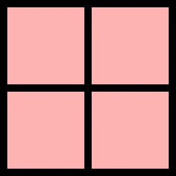

作者图片

是的…我知道，还没有，我必须实现我的[承诺](#4671) …

## 一点预览

我是一个相当冷静的人，我不介意事先告诉人们他们将会遇到什么，这样至少他们知道如何为即将到来的事情做准备。话虽如此，这里还是先睹为快，看看我们的困惑矩阵会是什么样子:

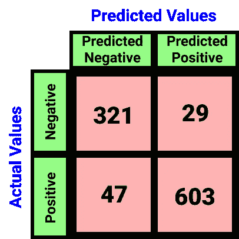

作者图片

让我们用苹果和橘子作为第一个例子。

## 我们的第一个例子

人类之所以擅长为人，是因为随着时间的推移，人类从反复试验中学会了今天的最佳状态。为了更好地理解混淆矩阵是如何工作的，我们必须假装是一个。我们必须了解混淆矩阵是如何形成的，以及为什么它决定以这种方式描述分类算法的性能。

现在我们已经有了混淆矩阵的布局，并且我们知道我们的目标类是什么(苹果或橙子)，我们可以更深入地理解这个矩阵。

我们矩阵的下一个补充将是两个指标，用于区分模型的预测值和实际值。这两个度量可以表示为矩阵的行或列。*将“预测值”和“实际值”视为行或列的标题。*现在，根据个人喜好，你可以用`Predicted Values`作为列、`Actual Values`作为行来设置你的混淆矩阵，反之亦然。

> **注**:不幸的是，我在网上看到了几篇文章，其中出版商不恰当地演示了这一点，导致他们的混淆矩阵无效。好像混乱矩阵还不够混乱。

就个人而言，我喜欢将`Predicted Values`作为我的列，将`Actual Values`作为我的行。

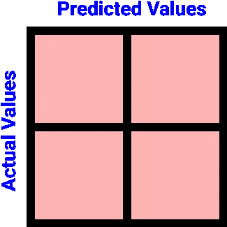

作者图片

因为我们的模型只能预测一个物体是一个桔子还是一个苹果(除此之外别无其他)，所以我们的矩阵是一个 2x2 矩阵。对于`Actual Values`，我们的对象可以是苹果或者橘子，对于`Predicted Values`也是一样。


作者图片

请注意，第 0 行是橙子，第 0 列也是橙子(第 1 行/第 1 列是苹果)。这不是偶然的，我们希望我们的行和列索引为每个`Actual Values`和`Predicted Values`列出相同的对象。

因为苹果在第 1 行/第 1 列，并且因为我们只处理两个预测:物体可以是苹果或桔子，但不能是两者(或者除了两者之外的任何东西)，我们可以将我们最初的区别问题从:`A classifier distinguishing between an apple and an orange`重新表述为:`A classifier distinguishing whether the object is an apple or not`。

> **注意** :
> 您也可以将原来的问题重新表述为`*A classifier distinguishing whether the object is an orange or not*`，但是您必须交换上表中行和列的`*Orange*`和`*Apple*`的位置。

记住我们新更新的区分问题是`A classifier distinguishing whether the object is an apple or not`。既然苹果肯定是苹果，我们可以用`Positive`代替苹果。
橙色呢？好吧，橙子不一定是苹果——橙子是一个阴性苹果。

> 橘子是一个阴性苹果。
> ——吉法里·霍克，2021

在这种情况下，我们可以用`Negative`替换 Orange，这将导致我们用新的表示法更改我们的表:

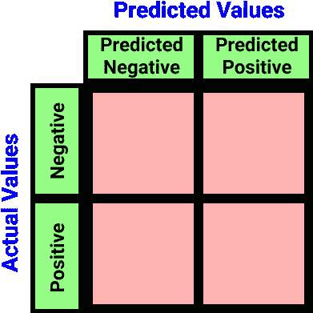

作者图片

我没有简单地为`Predicted Values`列编写`Positive`和`Negative`，而是决定编写`Predicted Negative`和`Predicted Positive`以减少混乱。

我们现在有四种不同的索引符号，组成了我们的表:

1.  (实际负值，预测负值)→索引[0，0]
2.  (实际为正，预测为负)→指数[1，0]
3.  (实际阴性，预测阳性)→索引[0，1]
4.  (实际阳性，预测阳性)→指数[1，1]

## 让我们玩一个游戏

用一个昵称来表示这些索引会很有帮助。让我们来玩一个小游戏。这个游戏是预测我脑海中的数字是负数还是正数，我们会记录下你的分数:

♠在第一轮，你预测这个值会是负的，实际上这个值是负的。这意味着*你的否定预测是真的*。
在第二轮中，你预测新值将为正，然而，它实际上是负的。这意味着*你对阳性的预测是错误的*。
♠在第三轮中，你预测新的值将是负的，事实上，值实际上是负的。这意味着*你的否定预测又一次为真*。
*真心*抱歉，不抱歉这么*消极*。

S̲c̲o̲r̲e̲:
♠预测:负|正确:真|计数:2
预测:正|正确:假|计数:1

那么，用真阴性(TN)、假阴性(FN)、假阳性(FP)和真阳性(TP)这样的昵称来表示指数怎么样？这些昵称听起来没那么糟糕，因为它们更有意义:

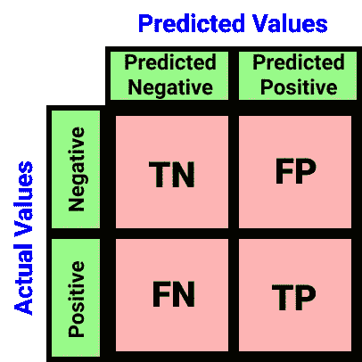

作者图片

我们现在必须对这些术语中的每一个给出某种描述，但是在玩了我们的小游戏之后，它看起来非常简单。让我们试一试:

1.  **真阴性(TN)** :实际上**阴性**的**阴性**预测的数量——正确。
2.  **假阴性(FN)** :做出的**阴性**预测的数量，实际上是**阳性**——不正确。
3.  **假阳性(FP)** :做出的**阳性**预测的数量，实际上是**阴性**——不正确。
4.  **真阳性(TP)** :实际为**阳性**的**阳性**预测的数量——正确。

> **注—其他昵称为**<#f243>****:**
> -TN:正确拒绝
> -FN:[ⅱ型错误](https://en.wikipedia.org/wiki/Type_I_and_type_II_errors#Type_II_error)、遗漏、低估
> -FP:[ⅰ型错误](https://en.wikipedia.org/wiki/Type_I_and_type_II_errors#Type_I_error)、虚警、高估
> - TP:命中、卫生纸**

## **苹果还是不是？**

**让我们继续我们的第一个例子。
这是我们的场景:我们用海量的图像完成了对数据集的训练，并在包含 1000 张苹果或橙子图像的测试数据集上进行了测试。这是我们得到的结果:**

**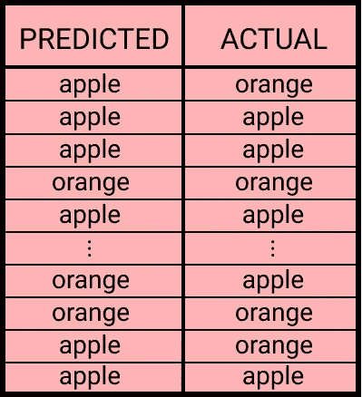**

**作者图片**

**而且因为我们更新的区分问题是:`A classifier distinguishing whether the object is an apple or not`，我们可以认为`Apple`为真(或 1)`Orange`为假(或 0)。
我们可以得到这样一个表格:**

**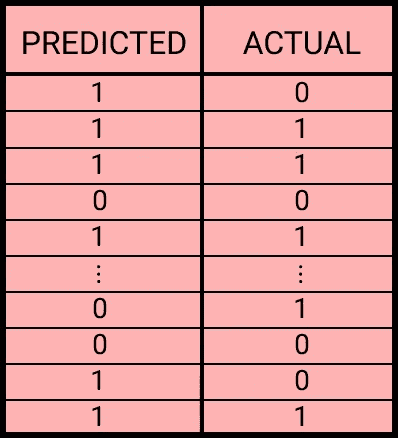**

**作者图片**

**在该算法做出的 1000 个预测中，有 924 个预测是正确的——准确率为 92.4%。这很糟糕，但是，喂，把橘子和苹果的奇异图像输入机器是我的错🤷🏽‍♂️.**

**不管怎样，我们的测试集总共有 650 张苹果图片和 350 张橙子图片；总共 1000 张图片。我们的算法正确分类了 650 幅苹果图像中的 603 幅和 350 幅橙子图像中的 321 幅。这意味着我们的算法错误地将 47 幅苹果图像声称为橙子图像`(650–603=47)`，并将 29 幅橙子图像错误地声称为苹果图像`(350–321=29)`。**

**还记得我之前给你的预览吗？**

****

**作者图片**

**现在开始有点眉目了，不是吗？在浏览之前，让我添加一些最后的细节，让这张表更生动一些。**

## **最终布局**

**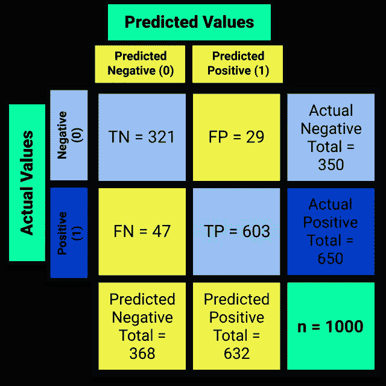**

**图片作者|实际行数、预测列数、负第一、正第二**

**这是我们混淆矩阵的最终表格。您可以在每个相应行的最右端看到实际总数，在每个相应列的最底端看到预测总数。右下角列出了测试数据集中的图片总数`n=1000`。在 1000 幅图像中，算法预测其中 368 幅是橙子的图像，632 幅是苹果的图像。**

**准确度分数通过将总氮和总磷的总和除以总人口(n)来计算。**

```
(TN+TP)
------- = Accuracy Score
   n(321+603)/1000 = 0.924
```

> ****记得** :
> 橘子=不是苹果=负苹果=负
> 苹果=正苹果=正
> t13】\_(ツ)_/**

****TN**:
——算法*正确*预测了 321 张橙子的图像。
-算法做出了 321 个**真**负**苹果(橙子)的预测。
**FP** :
-算法*认为* 29 个橙子的图像是苹果的图像。
-该算法对**阴性**苹果(橙子)做出了 29 个**错误**的预测。
**FN** :
-算法*认为* 47 张苹果的图像是橙子的图像。
-该算法对**阳性**苹果做出了 47 个**错误**的预测。
**TP** :
-算法正确预测了苹果的 603 张图像。
-该算法对**阳性**苹果做出 603 个**真**预测。****

**我相信你现在可以看到为什么混淆矩阵比单独的准确度分数更有用，因为它更详细地说明了为什么算法获得了这样的准确度分数。**

**我应该再次提到，这是我更喜欢的混乱矩阵的布局，不仅因为它看起来很干净，而且因为这是它在 Python 上的显示方式，在下一个例子中我将和你一起看一下⁴。**

## **其他布局**

**有时您会看到第一行和第一列都是`Positive`和`Predicted Positive`的表格，如下所示:**

**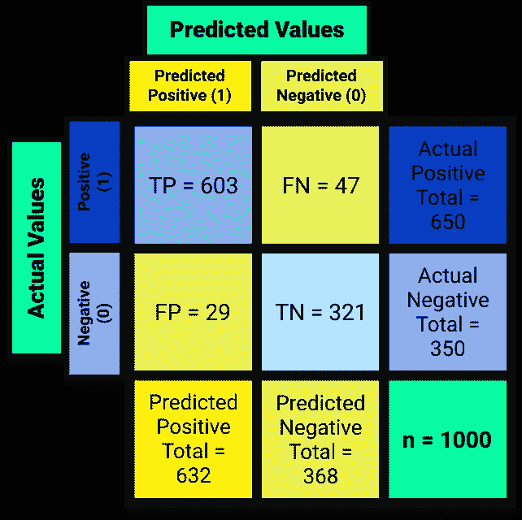**

**图片作者|实际行数、预测列数、正第一、负第二**

**其他时候，您会看到以`Actual Values`为列、`Predicted Values`为行的表格:**

****

**图片作者|预测行，实际列，正第一，负第二**

**有时，甚至像这样:**

**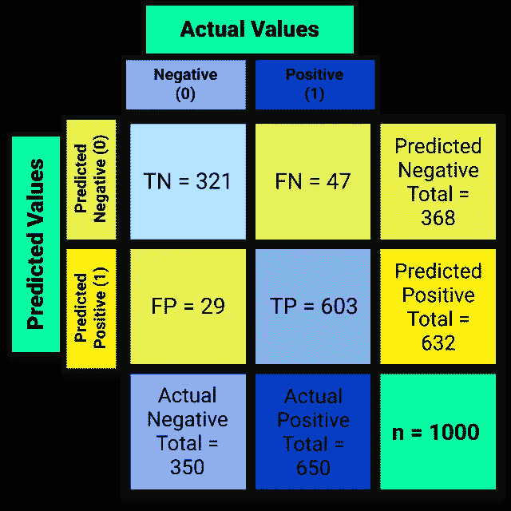**

**图片作者|预测行，实际列，负第一，正第二**

**所有这些都很好，但归根结底，都是关于索引的。这意味着，如果有人说了类似“左上角应该是 TN 或者右下角应该是 FN，等等”的话别听他们的，他们还很困惑。如果我说错了，请纠正我，嘿，我不是在向任何人或任何类似的事情抛出 subs(T49)或 T50，但是正如我所说的，在一天结束的时候，这都是关于索引的。**

**希望上面四个表中的颜色编码能让你更好地理解矩阵中变量的位置。如果你仍然很难理解它，不要担心，因为我知道生活中有时事情会变得令人困惑，这就是为什么我给你做了一个备忘单，总是能够理解每个变量在困惑矩阵中的位置。**

## **混乱矩阵的作弊代码**

**基本上，这是你应该知道的，以确保你的混淆矩阵不是无效的:**

> ***-(N&PN)= TN
> -(N&PP)= FP
> -(P&PN)= FN
> -(P&PP)= TP***
> 
> **其中`*N = Actual Negative*`、`*P = Actual Positive*`、
> 、`*PN = Predicted Negative*`、`*PP = Predicted Positive*`**
> 
> **还有`*TN = True Negative*`、`*TP = True Positive*`、
> 、`*FN = False Negative*`、`*FP = False Positive*`**
> 
> ***- TN+FP+FN+TP =总人口(n)
> - (TN + TP)/n =准确度得分***
> 
> **-如果某物是负的，并且算法**也**认为它是负的，那么它是真的负的。
> -如果某样东西是负的，**但是**算法认为它是正的，那它就是假阳性。
> -如果某样东西是正的，**但是**算法认为它是负的，那就是假阴性。
> -如果某个东西是正的，算法**也**认为它是正的，那它就是真正的。**

**当然，这个场景确实是你编造的，但是这个夜晚直到晚会结束后才结束。在下一章，我将使用一个更著名的数据集来回顾混淆矩阵的另一个例子。**

# **余兴派对**

**聚会可能已经结束了，但时间还早。
余兴派对马上就要开始了，
但是混乱矩阵还是让你放松了。**

**在这个例子中，我将使用皮马印第安人糖尿病数据库，该数据库可以在 [Kaggle](https://www.kaggle.com/uciml/pima-indians-diabetes-database) 上找到。不必赘述，数据集中有 768 个记录(患者)的分类为 0 或 1，即二元分类，其中 0 表示患者为糖尿病阴性，1 表示患者为糖尿病阳性。500/768 名患者为糖尿病阴性，268/768 名患者为糖尿病阳性。**

> **数据集在多个要素中包含大量缺失数据。我用过 sklearn 的[迭代估算器](https://scikit-learn.org/stable/modules/generated/sklearn.impute.IterativeImputer.html)，它是一个多元估算器，用来估算缺失值。我在 [Kaggle](https://www.kaggle.com/gifarihoque/pidd-missing-data-ml-iterimputer-tut-86) 上做了一个笔记本来回顾这个策略，并写了一篇关于这个策略如何运作的文章。[点击这里](https://gifari.medium.com/a-better-way-to-handle-missing-values-in-your-dataset-using-iterativeimputer-9e6e84857d98)阅读我写的教程，了解更多关于 IterativeImputer 的知识！**

**在用`test_size=0.2`(和`stratify=y` ——在这个例子中你不必担心理解)分割数据集之后，你在训练集中得到 400 个糖尿病阴性和 214 个糖尿病阳性患者(训练集中 614 个患者)&在测试集中得到 100 个糖尿病阴性和 54 个糖尿病阳性患者(测试集中 154 个患者)。**

**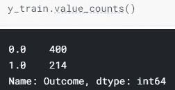**

**图片由作者提供|列车组**

**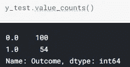**

**作者图片|测试集**

**在缩放、执行所有的算法和对测试集进行预测之后，您可以通过在 Python 中运行以下代码来获得[准确度分数](https://scikit-learn.org/stable/modules/generated/sklearn.metrics.accuracy_score.html):**

```
>>> from sklearn.metrics import accuracy_score
...
>>> accuracy_score(y_test, pred)where 'y_test' is the test set and 'pred' is the predictions returned from the algorithm.
```

**返回的准确度分数约为 73.3766%。这意味着在测试集中的 154 名患者中，该算法能够正确分类 73.3766%的患者——或 113 名患者。然后，我们可以通过运行以下代码来查看 Python 中的[混淆矩阵](https://scikit-learn.org/stable/modules/generated/sklearn.metrics.confusion_matrix.html):**

```
>>> from sklearn.metrics import confusion_matrix
...
>>> confusion_matrix(y_test, pred)
```

**Python 随后返回以下输出:**

**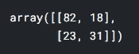**

**作者图片**

**不幸的是，输出没有我做的表格那么漂亮，但是，嘿，如果 [sklearn](https://twitter.com/scikit_learn) 正在阅读这篇文章并且喜欢我的布局，请私下联系我进行[业务咨询](https://qph.fs.quoracdn.net/main-qimg-4d6b1652d7cd7f5a10c92e6e55571ace-c)。:3**

**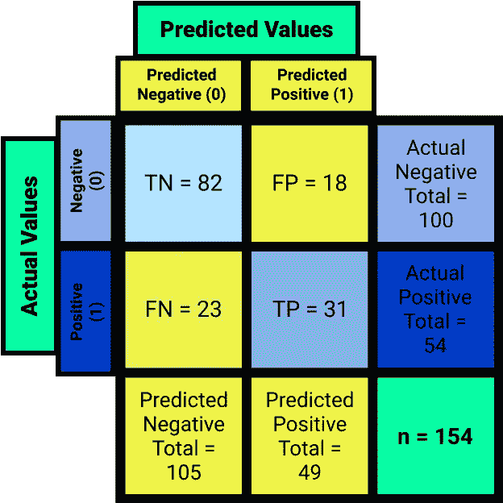**

**作者图片**

**那更好。继续比较上面两个表的变量位置。你现在明白为什么我在上一章展示的 4 个布局中选择了这个布局了吗？**

**我敢肯定，即使不知道这些数字背后的背景故事，你也可以通过阅读上面的混淆矩阵，对算法做出的预测做出假设。然而，让我们来分析一下:**

> ****记住** :
> `*0*`表示患者为糖尿病阴性。
> `*1*`表示患者为糖尿病阳性。**

*   **该算法正确预测 82 名患者为真正的**糖尿病患者**-**阴性**。
    ○ `TN = 82`**
*   **该算法**错误地**预测 18 名患者为糖尿病- **阳性**。
    ○ 18 名*实际为*糖尿病阴性的患者被*预测为*糖尿病阳性
    ○ `FP = 18`**
*   **算法**错误地**预测 23 名患者是糖尿病患者- **阴性**。
    ○ 23 名*实际为*糖尿病阳性的患者被*预测为*糖尿病阴性🤦🏼‍♂️
    ○ `FN = 23`**
*   **该算法正确预测 31 名患者为真正的**糖尿病患者**-**阳性**。
    ○ `TP = 31`**
*   **测试集总共包含 154 条记录(患者)
    ○`n = 154`=`len(y_test)` ○82+18+23+31 = 154→`TN+FP+FN+TP = n`**
*   **该算法的准确率分数约为 73.3766%
    ○`(TN + TP) / n = Accuracy Score` ○( 82+31)/154≈73.3766%**
*   **在 154 名患者中，有 100 名是*实际上*糖尿病阴性或`0`。
    ○`Actual Negative Total = TN + FP`
    ○82+18 = 100→`TN + FP = 100`=`y_test.value_counts()[0]`**
*   **在 154 名患者中，有 54 名*实际上是*糖尿病阳性或`1`。
    ○`Actual Positive Total = FN + TP`
    ○23+31 = 54→`FN + TP = 54`=`y_test.value_counts()[1]`**
*   **在这 154 名患者中，算法*预测*其中 105 人是糖尿病阴性
    ○ `Predicted Negative Total = TN + FN` ○ 82+23 = 105 → `TN + FN = 105`**
*   **在 154 名患者中，算法*预测*其中 49 名为糖尿病阳性
    ○ `Predicted Positive Total = FP + TP`
    ○ 18+31 = 49 → `FP + TP = 49`**

# **结论**

**晚会结束了，现在该回家了。虽然你在聚会上没有遇到任何陌生人，但你已经知道了*知识打开了*大门。我是说，如果不是因为卡尔，保镖可能都不会让你们进去。**

**希望在读完这篇文章后，你不再害怕混淆矩阵。事实上，你现在应该能够意识到它是多么的有用。这篇文章只是对*理解*困惑矩阵的一个介绍。我没有讨论如何使用混淆矩阵提供的数据进行其他统计分析。困惑矩阵的内容远不止这里所介绍的，但是现在你已经理解了基础知识，毫无疑问，你将能够理解其他的一切。我对你有信心。
如果没有给混淆矩阵起这样一个名字，它就不会这么混乱了。**

**如果你已经跟了我这么久，你**应该**理解为什么混淆矩阵有用的更“开箱即用”的方法，这是我没有看到其他人提到的。如果你在这里只是为了阅读结论，请阅读整篇文章，我很努力地工作，所以我可以帮助你，相信我，它对我来说是一个*真正积极的*值得一读，谢谢你再次光临。**

**在我们的第一个例子中，在我们的测试数据集中的 1000 个图像中，如果 950 个图像是苹果，只有 50 个图像是橙子，并且如果我们的算法以某种方式正确地预测了所有 950 个苹果图像，并且错误地假设所有 50 个橙子图像都是苹果图像，那么我们仍然可以获得 95%的准确率。混淆矩阵将是有用的，因为我们可以看到有多少苹果和橘子的图像算法实际上是正确的/错误的。在混淆矩阵的帮助下，你将能够看到该算法正确地分类了所有苹果的图像，但是不能正确地分类一个橙子的图像。它不仅有助于获得更多关于数据集或算法的统计数据，还能帮助你回溯理解为什么你的算法能获得如此高的精度。**

**话虽如此，下次你出去参加聚会，看到你感兴趣的人时，要小心，因为外表可能具有欺骗性。
谢谢。**

> ****免责声明**:如果你感到比最初更困惑，这是正常的，因为你的神经元可能会因此兴奋地放电。**

## **参考**

**[1] Z .查科，[息肉检测自动化](https://books.google.com/books?id=cM_pDwAAQBAJ&pg=PA540&lpg=PA540&dq=the+confusion+matrix+shows+the+ways+in+which+your+classification+model+is+confused+when+it+makes+predictions.&source=bl&ots=2AOpNSRRAG&sig=ACfU3U3mgF0OhFLsvTUPzJthsX2yEfBd-g&hl=en&sa=X&ved=2ahUKEwichZv134T0AhW9knIEHThEDFsQ6AF6BAgkEAM#v=onepage&q=the%20confusion%20matrix%20shows%20the%20ways%20in%20which%20your%20classification%20model%20is%20confused%20when%20it%20makes%20predictions.&f=false) (2020)，信息系统与技术的趋势与创新:第 2 卷。
( [点击返回](#1b7d))**

**[2]斯蒂芬·斯泰曼(1997 年)。“选择和解释主题分类准确性的衡量标准”。*环境遥感*。**62**(1):77–89。Bibcode : [1997RSEnv..62…77 秒](https://ui.adsabs.harvard.edu/abs/1997RSEnv..62...77S)。[doi](https://en.wikipedia.org/wiki/Doi_(identifier)):[10.1016/s 0034–4257(97)00083–7](https://doi.org/10.1016%2FS0034-4257%2897%2900083-7)。
( [点击返回](#be5c))**

**[3]维基百科，[困惑表](https://en.wikipedia.org/wiki/Confusion_matrix#:~:text=Table%20of%20confusion%5Bedit%5D)(最后编辑，2021)，困惑矩阵。
( [点击返回混淆矩阵的昵称](#be5c) )
( [点击返回 TN、FN、FP、TP 的昵称](#db4a))**

**[4] Scikit-learn，[混淆矩阵](https://scikit-learn.org/stable/modules/generated/sklearn.metrics.confusion_matrix.html#:~:text=of%20a%20classification.-,By%20definition%20a%20confusion%20matrix,.,-Read%20more%20in) (2021)，Sklearn。
( [点击返回](#f320))**

## **最后的话**

**如果你注意到我的文章中有任何错误，请留下评论并联系我，这样我可以尽快修复它！我不想误导任何人，也不想教任何人错误的东西。对我来说，任何批评都是积极的批评，这是我学习的最好方法之一。我也总是乐于接受提示和建议。此外，请随意使用我在这篇文章中的任何内容，但请给我信用，谢谢！**

**如果您有兴趣了解如何使用多变量策略而不是单变量策略来输入缺失数据，请阅读下面的文章！**

**</a-better-way-to-handle-missing-values-in-your-dataset-using-iterativeimputer-9e6e84857d98>  <https://gifari.medium.com/a-better-way-to-handle-missing-values-in-your-dataset-using-iterativeimputer-on-the-stock-market-dbbb5d4ef458>  

如果你喜欢阅读这篇文章，请关注我的 [***中型***](https://gifari.medium.com/) *和*[***Kaggle***](https://www.kaggle.com/gifarihoque)*我会不时在这里发布更多内容。还有，随时和我联系*[***LinkedIn***](https://www.linkedin.com/in/gifari/)*。如果你认为我的工作值得一杯咖啡，请给我买一杯吧！任何支持都帮助我坚持下去。*

一如既往，再次感谢你的来访。**