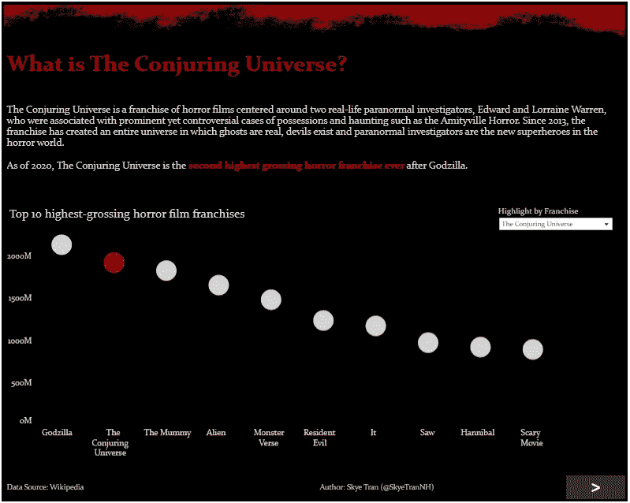
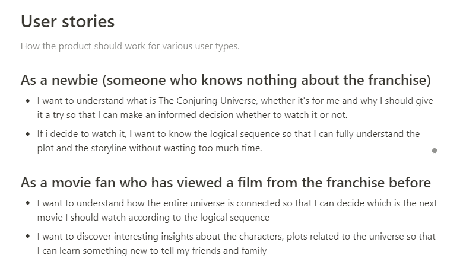
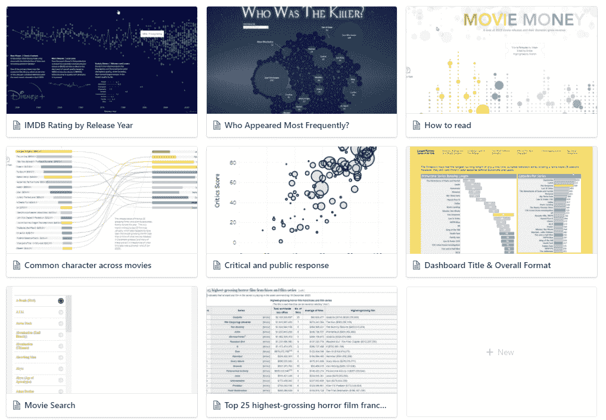

# 召唤宇宙:我为期两天的数据可视化项目

> 原文：<https://towardsdatascience.com/the-conjuring-universe-my-2-day-data-visualisation-project-556dde6e98c5?source=collection_archive---------38----------------------->

## 这个项目教会了我如何从我所在的地方开始，使用我所拥有的，尽我所能坚持不懈地完成它

作者照片

[展示完整的数据可视化](https://public.tableau.com/views/TheConjuringUniverse/Overview?:language=en&:retry=yes&:display_count=y&:origin=viz_share_link)

我为我的个人数据项目所做的并不奏效。我开始做一件事，做了一段时间，陷入困境，然后当一个更令人兴奋的想法出现时就放弃了。在 2020 年的最后一周，在认真审视了我的半成品项目后，我突然意识到有些事情必须改变。

所以我开始反思我过去的经历，通读几本关于生产力的书，回顾我最喜欢的项目成果。我意识到了两件事。

1.  那些被放弃的想法被放弃了，因为我只是觉得它们不够好，或者我没有足够的技术知识来实现它。
2.  当我不得不克服一个具有挑战性但又不可避免的任务，而时间又不够的时候，我最好的作品实现了。

如果我可以按 F5 键刷新，我可以做些什么不同的事情？以下是我所做的。

# 就从我妹妹和我喜欢的东西开始吧

没有给自己足够的时间思考(可能会患上分析麻痹)，我决定从一个我和妹妹都喜欢的话题开始。为什么我会想到我妹妹？因为她一直是我最好的朋友和同甘共苦的依靠。**如果你有精神障碍或自我怀疑，那么想想你爱的人，为他们创造一些乐趣，肯定会激发快乐和动力。**这也是我希望你从这篇文章中得到的最重要的信息。

一些想法出现了，但在一个安静凉爽的夜晚，独自在家，没有什么可以打败那些令人毛骨悚然的恐怖电影。嗯，有很多，但是哪一个呢？嗯，毫无疑问，它必须是魔法宇宙，一个我姐姐和我最喜欢的恐怖系列。如果我能和我妹妹分享一些我们最喜欢的恐怖系列的有趣事实，还有什么不喜欢的呢？

耶！现在我有了一个题目，但是我能用它做什么呢？好吧，让我们谷歌一下，看看有什么数据。

照片由[本杰明达达](https://unsplash.com/@dadaben_?utm_source=unsplash&utm_medium=referral&utm_content=creditCopyText)在 [Unsplash](https://unsplash.com/?utm_source=unsplash&utm_medium=referral&utm_content=creditCopyText) 上拍摄

维基百科是第一站，有几个有趣的表格显示了所有电影和该系列的角色(安娜贝尔和瓦拉克，有人还记得吗？)，它们的全球总票房，收视率和事件的时间顺序。对于商业成功和公众反应的简单分析，这些都是很好的起点。

我也看到了几页，似乎人们对每部电影是如何与可怕的魔鬼和鬼魂的世界联系在一起感兴趣。这将是伟大的添加一些有趣的有趣的事实。一浏览内容，一个想法就慢慢形成了。一个黑暗的令人毛骨悚然的数据故事板介绍了关于魔法宇宙的事实。我知道这是我妹妹想看到的。

# 设定严格的截止日期

知道我在赶时间的时候工作得更好，我设定了收集和分析数据的目标，然后在两天内设计并制作了一个仪表板。我的直觉告诉我，两天的时间可以让我保持动力，同时感受到高效工作的压力。这是我的进攻计划。

*   第一天:制定目标+草图+收集数据
*   第二天:制作图表+完成故事板+测试

嗯，这听起来像是我需要开始的所有东西，或者我是这么想的。但是如果我坚持我的旧习惯，一遍又一遍地做同样的事情，我怎么能期待一个不同的结果呢？这一次，我需要一个新的方法。

# 专注于真正重要的事情

我欣赏我自我批评的事实。我知道这不是最好的品质。这让我有动力坚持一些体面的标准，但它也偶尔会引发无数“如果……会怎样”的担忧。我非常清楚，如果我找不到一种方法来应对我的自我批评，我的 2 天项目将很快变成 2 周的马拉松。但是怎么做呢？

首先，我承认只有两天时间意味着我必须认真考虑事情的实用性。简而言之，保持简单，笨蛋！其次，我必须制定基本规则，与我自我批判的个性和平共处。受到敏捷宣言的启发，我写下了以下 6 条基本规则，以确保我专注于真正重要的事情。

1.  **足够好的成品胜过完美的半成品**
2.  **草图超过详细计划**
3.  **利用奇特技术的结果**
4.  **按照计划适应变化**
5.  **复杂视觉效果上简单有意义的图表**
6.  **寻求帮助来了解自己**

在两天的时间里，这些要点对我的决策有很大的帮助，并帮助我坚持下去。你猜怎么着？我认为它们在未来的项目中也是可重用的。

# 让用户故事定义交流的目的

表白时间:我是用户故事的粉丝。不，我说的不是冗长的产品评论。我的意思是几个简短而甜蜜的句子，遵循一个一般的结构，如“作为一个[最终用户角色]，我想要[产品的能力或特性]，因为[无论我能获得什么好处或能避免什么麻烦]。”你可能经常会发现用户故事被用来获取软件产品的功能。但是我个人认为用户故事非常有效，可以确保我做的任何事情都把用户放在第一位。这是我为《召唤宇宙》故事板写的东西。

作者照片

哦，等等！首先，当我没有足够的时间时，为什么还要费心去写故事呢？在开发过程中，**这些用户故事帮助我明确受众想要什么，这样我就不会浪费时间去收集不相关的数据或构建无附加值的功能。**既然时间不多了，那就必须专注于主要目标，你同意吗？还有呢？**在测试和审查期间，这些故事帮助我验证我的故事板是否已经完成，是否如预期的那样工作。**我认为 20 分钟的垃圾用户故事和思考视觉传达的目的是非常值得的。

如果你想知道更多关于人们是如何为软件开发编写用户故事的，看看这篇[精彩的文章](https://www.atlassian.com/agile/project-management/user-stories)。懒读书？不要担心，这里是我给每个人的关于用户故事的 3 个快速提示。

*   尝试将单个用户归纳为具有相似目标、需求和需要的组(也称为角色)。这样你就不会有成百上千的故事。
*   遵循上面提到的一般结构。这很简单，简洁，而且很有效。
*   每当你感到迷茫时，总是回头看看用户故事。

# 拥抱好的，坏的和丑的

到目前为止，事情似乎好得不像真的，或者你是这么想的。但让我分享一些关于哪里出了问题以及我如何设法摆脱困境的见解。错误不应该发生不止一次，所以希望你能避免犯和我一样的错误。

## 创建第一个草图

我通过查看数据和在一张白纸上涂鸦开始了我的第一张草图。如果你真的很有创造力并且擅长画画，这没什么不好。但我知道我没有。不出所料，30 分钟过去了，我只有一些奇怪的盒子，没有具体的想法。只剩下 30 分钟，直到我吃进我的数据收集时间。红旗！是时候实施 b 计划了。

看看其他人在为电影设想什么怎么样？所以我去看了 Tableau 公共画廊，重点是电影和电视部分。一个充满可能性的世界突然展现在我面前。因为剩下的时间不多了，我得找条捷径。所以我把那些我喜欢的设计截图下来，放在一个共同的存放处。下面是我在我信任的一体化工作空间 ideal 中所做的事情。但是你可能想打开一个 PowerPoint 空白幻灯片，开始在里面粘贴一些图片。

作者照片

找不到什么好看的设计？那么，从简单的盒子开始，陈述你想要展示的内容。草图旨在指导您需要收集哪些数据，但是您可以收集的数据将决定最终图表的外观。所以要把握好时机，不要纠结于小细节。谈到素描，我更喜欢电子格式，而不是纸和笔，因为我可以很容易地编辑，移动东西和添加新的东西。但是你可能会有不同的想法，这完全没问题。这里的教训是记住从别人那里寻求帮助和灵感，而不是强迫自己重新发明轮子，凭空创造一些魔法。

## 收集数据

从一开始，网络抓取就是我想在这个项目中练习的技能之一。所以我高兴地一头扎进去，写了一大堆 Python 脚本来从几个网页中提取数据，花了更多的时间来调试和测试我的脚本，以确保它们能够工作。

但是等等！手动复制和粘贴会更快吗？可悲的是，是的！有了几个包含不同网站的 7 部电影的简单统计数据、一堆角色和制作团队成员的表格，我可以复制并粘贴到 Excel 文件中，稍微清理一下细节，我的数据集就可以开始工作了。幸运的是，意识到紧张的 2 天时间再一次在正确的时刻抓住了我。以我工作的速度，我不可能在第一天内完成我的数据收集。还记得我之前写的 6 条基本原则吗？**利用花哨的技巧获得的结果。**这就是它如何让我避免浪费更多不必要的时间。

## 可视化 Tableau 中的数据

我不得不承认，摆弄颜色、字体、字号，并试图在不同的页面上保持一致的格式是很烦人的。Tableau 中各种各样的定制选项有时也增加了我的困惑。我后悔不得不艰难地学习如何正确格式化 Tableau 仪表板。但是嘿，**迟到总比不到好**，对吧？这里有几个节省时间的提示，可能会对你有用。

**初始设置**

*   为了确保不同页面的格式一致，请专注于设计一个页面，并将其作为模板反复使用。这样你就不用担心第一页的文字比第二页的大了。
*   为了避免修改格式，首先发布模板来测试它在最终显示媒体上的实际效果。我没有足够早地这样做，不得不单独编辑字体颜色，因为 Tableau Public 中的颜色似乎比我在屏幕上看到的要暗。不要像我一样！

**创建单独的图表**

*   要调整图表大小，请使用单元格大小热键(格式>单元格大小)，而不是费力地试图找到单元格的边缘并用鼠标拖动它
*   要在画布上拖动多个度量，请使用 CTRL 键，而不是一个一个地拖动它们
*   要在双轴图表中使用相同的度量两次复制一个字段，请按住 CTRL 键并将药丸拖动到它本身旁边，而不是在筛选左侧菜单上的一堆其他字段时迷路(并且意外地拖动了具有相似名称的字段)

**巩固故事板**

*   隐藏与已完成仪表板相关的所有工作表，以避免意外修改。
*   避免过早地配置导航流，因为您可能会在测试期间调整仪表板的顺序。我做得太快了，结果不得不一次又一次地更新。下一次，那只需要等到我对内容的逻辑流程完全满意。

**完成最后的润色**

*   通过设备预览来测试手机上的视觉效果，并相应地进行定制(如果时间允许)，而不是热情地向朋友展示，然后意识到通过手机观看时格式混乱。好尴尬！

万一你想知道 2 天开发后的最终结果是什么样的(加上之后解决的一些愚蠢的格式问题)，请随意查看最终产品[这里](https://public.tableau.com/views/TheConjuringUniverse/Overview?:language=en&:display_count=y&:origin=viz_share_link)。

# 离别的思绪

很难保持对个人项目的巨大动力，因为你根本没有得到报酬。但是如果我能从两天的项目中学到这么多，你也可以。就我个人而言，我选择相信所有的学习、勇气、激情和毅力都是为了某样东西。单个来看，每个小项目对我来说可能都不太重要。然而，我意识到我学到了大量的技能，这使我能够更自信地承担更大的项目。

如果你感到停滞不前或者认为你已经失去了尝试新事物的动力，这里有我的 4 个简单的建议。希望他们能给我们带来一些光明，并在困难的时候带来好运。

1.  想想你爱的人，创造一些能让他们微笑的东西。这是打破思维障碍、享受更多数据乐趣的最简单方式。
2.  **永远不要等待那个完美的时刻。**与数据打交道让我明白，在开始工作之前，我不需要知道所有的事情。从来都是反过来的。直接投入进去，这就是我如何慢慢地从这里多了解一点，从那里多接触一点。你永远不会知道所有的事情，这就是我们学习的方式。
3.  **确保你设定的最后期限足够短，以保持承诺。压力自然迫使我专注于最终目标，消除不必要的浪费，并快速思考。**
4.  拥抱好的、坏的和丑的。能够认识到自己的弱点、不好的品质和愚蠢的错误，然后采取行动与之和解，这意味着你正在成为最好的自己。

就这样，我祝愿每个人都有一个健康、快乐和神奇的 2021 年。充满爱！

*原载于 2021 年 1 月 3 日 http://thedigitalskye.com**的* [*。*](http://thedigitalskye.com/2021/01/03/the-conjuring-universe-my-2-day-data-visualisation-project/)