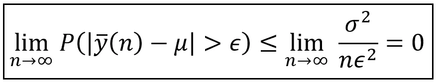

# 一致估计量

> 原文：<https://towardsdatascience.com/the-consistent-estimator-913fab06f4f3?source=collection_archive---------18----------------------->


样本和总体标准偏差之间的绝对差值与样本大小的关系图(图片由作者提供)

## 回归建模器指南

一致估计量是一种随着处理的数据样本不断增加而产生越来越好的估计值的估计量。当数据样本的大小变得与总体一样大时，这种改进继续到极限情况，此时估计变得等于参数的真实值。

一致性是估计量的属性之一，还有其他属性，如[偏差](/understanding-estimation-bias-and-the-bias-variance-tradeoff-79ba42ab79c)、均方误差和效率。

让我们用真实世界的数据集来说明这个概念。我们将使用前一篇文章中使用的相同数据，即东北大西洋的海洋表面温度:


[东北大西洋实时海表温度数据集](https://data.gov.ie/publisher/marine-institute)下载自 [data.world](https://data.world/marineinstitute/a88b89dc-401b-48ea-a917-4185d0c5d5d5) 下 [CC BY 4.0](https://creativecommons.org/licenses/by/4.0/)

让我们使用基于 Python 的 [Pandas](https://pandas.pydata.org/) 库将数据集加载到内存中，我们将通过删除所有丢失的值来清理它:

```
**import** pandas **as** pddf = pd.**read_csv**('NE_Atlantic_Sea_Surface_Temperatures.csv', **header**=0, **infer_datetime_format**=True, **parse_dates**=['time(UTC)'])df = df.**dropna**()
```

让我们打印出数据集:

```
**print**(df)
```


清除了所有 NaN 行的数据集(图片由作者提供)

清理后的数据集差不多有 80 万个数据点，这相当大。让我们把这个数据集看作是值的总体。因此，在这种情况下，我们可以说我们可以访问人口，尽管在现实生活中，我们总是必须处理值的样本，并且我们永远不会知道人口的全部范围。

让我们计算并打印出“总体”的平均值和标准偏差:

```
pop_mean = df[**'sea_surface_temperature(degree_C)'**].mean()
pop_stddevs = df[**'sea_surface_temperature(degree_C)'**].std(ddof=0)print(**'Population mean (mu)='**+str(pop_mean))
print(**'Population variance (sigma^2)='**+str(pop_stddevs))
```

以下是这些值:

```
Population mean (**mu**)=**11.94113359335031**
Population variance (**sigma^2**)=**1.3292003777893815**
```

## 补替抽样法

为了说明估计量一致性的概念，我们将从这个“总体”值中随机抽取一个大小为 *100(即 n=100)* 的样本 *[y_1，y_2，…y_i，…，y _ n】*。我们将使用名为**取样替换**的技术抽取样本。这意味着我们将随机抽取第一个数据点 *y_1* ，记下它的值，并将其放回总体中。我们将对所有的 *n* 值重复这个过程。

替换取样会产生重复，因此它并不总是一种实用的取样技术。例如，想象你正在为一项临床试验挑选志愿者。如果你使用置换抽样，理论上你可以多次登记同一个人，这显然是荒谬的。但是，如果您的值的总体非常大，即使在进行替换后，多次选择相同的数据点是一种极其罕见的可能性。

使用替换抽样的一大优点是，它确保样本的每个变量 *y_i* 可以被认为是一个**独立、同分布(i.i.d .)的随机变量**，这一假设可以简化很多分析。具有讽刺意味的是，尽管在现实生活中几乎不可能遇到独立同分布变量，但独立同分布假设却构成了统计科学中的几个基本结果。

在我们进入抽样领域之后，让我们回到我们关于估计量一致性的讨论。

对于每个样本【y_1，y_2，…y_i，…，y _ n】，我们将使用以下样本均值( **y_bar** )和样本偏差( **s** )的公式作为总体均值和标准差 *σ* 的估计量:


总体均值和标准差的估计值(图片由作者提供)

我们将使用上面的公式对一个大小为 *100 的样本计算总体均值 *( )* 和标准差 *(σ)* 的估计值。*接下来，我们将样本量增加 *100* ，并重复和 *σ* 的估计，我们将继续这样做，直到样本量 *n* 接近总体量 *N=782668* 。

以下是 Python 代码:

```
**from** tqdm **import** tqdm increment = 100**#Define two arrays to store away the means and standard deviations for various sample sizes**
sample_means_deltas = []
sample_stddevs_deltas = []**#Increase the sample size by 100 in each iteration, and use tqdm to show a progress bar while we are at it 
for** sample_size **in** tqdm(**iterable**=range(10, **len**(df), increment), **position**=0, **leave**=True): **#Select a random sample of size=sample_size, with replacement**    random_sample = df.**sample**(**n**=sample_size, **replace**=True) **#Calculate the sample mean**    y_bar = random_sample[**'sea_surface_temperature(degree_C)'**].**mean**() **#Calculate and store the absolute diff between sample and population means, and sample and population standard deviations**    sample_means_deltas.**append**(**abs**(y_bar - pop_mean))

    s = random_sample[**'sea_surface_temperature(degree_C)'**].**std**() sample_stddevs_deltas.**append**(**abs**(s-pop_stddevs))**#Plot |y_bar-mu| versus sample_size** plt.**plot**(sample_means_deltas)plt.**xlabel**('Sample size (n)')
plt.**ylabel**('|y_bar-mu|')plt.**show**()**#Plot |s-sigma| versus sample_size** plt.**plot**(sample_stddevs_deltas)plt.**xlabel**('Sample size (n)')
plt.**ylabel**('|s-sigma|')plt.**show**()
```

我们看到以下两个图:


样本和总体平均值之间的绝对差异相对于样本大小绘制(图片由作者提供)


样本和总体标准偏差之间的绝对差值与样本大小的关系图(图片由作者提供)

在这两种情况下，观察到参数的估计值和真实值之间的绝对差值随着样本量的增加而逐渐减小。

还要注意，即使样本大小( *n* )等于总体大小 *N=782668，样本和总体均值之间的差的绝对值也不会变为零。*这似乎有悖常理。如果样本和总体一样大，为什么样本均值不完全等于总体均值？答案在于回想一下，我们是使用替换抽样技术来生成样本的。当该技术用于有限大小的总体时，该技术的“替换”方面将导致样本具有几个重复值，即使样本大小等于总体大小。因此，即使在 *n=N* 的情况下，样本也永远不会与总体相同。

# 一致估计量

随着样本量的增加，总体均值和标准差的估计量似乎收敛于相应的总体值，这不仅仅是偶然现象。

我们可以证明它们总是会收敛到种群值。

在我们证明之前，让我们回忆一下什么是一致估计量:

> 一致估计量是一种随着处理的数据样本不断增加而产生越来越好的估计值的估计量。这种改进持续到极限情况，当数据样本的大小与总体一样大时，估计值等于参数的真实值。

我们可以用概率术语来表示一致性，如下所示:


将样本平均值指定为总体平均值的一致估计量 y_bar(图片由作者提供)

在上面的等式中，我们是说，无论你选择某个正值ε有多小，当样本量 *n* 趋向于 *∞* 时， *n* 样本值 *y_n* 的平均值与总体均值大于 *ε* 的绝对差值的概率 *P()* 为零

## 思想实验

人们可以使用如下的思维实验来观察上面的等式:

选择 *ε* 的一些微小正值。说 *ε=0.01* 。

1.  从随机选择(替换)的 *n* 个值的样本开始。计算它的平均值 *y_n* ，从总体平均值中减去它，取差值的绝对值并存储起来。重复这个过程一千次，产生一千个绝对差值 *|y_bar(n)- |。*
2.  将这些 *1000* 的差值分成如下两组值:第一组***【S1】***包含小于等于 *0.01* 的差值，即 *|y_bar(n)- |* ≤ *ε。*第二组 ***S2*** 包含大于 *0.01* 的值，即 *|y_bar(n)- | > ε* 。
3.  计算绝对差值大于 *0.01* 的概率。这就是第二套的尺寸除以 *1000* 。即
    *P(| y _ bar(n)-|>ε)= sizeof(S2)/1000*
4.  现在增加样本量 100，重复步骤 1、2、3 重新计算概率 *P(|y_bar(n)- | > ε)。*
5.  你会发现:
    *随着样本量 n 的增加，概率 P(|y_bar(n)- | > ε)减小，越来越接近零*

你会发现，无论你选择 *ε有多小，你还是会看到 P(|y_bar(n)- | > ε)随着 n 的增加而趋近于零。*

# 任何估计量相合的一般条件

对于任何用于估计总体水平参数 *θ* 的估计量 *θ_cap(n)* ， *θ_cap(n)* 是 *θ* 的一致估计量当且仅当:


任何估计量一致性的一般条件(图片由作者提供)

# n 个样本值的平均值估计量是总体均值的一致估计量

回想一下，在文章的开头我们说过我们可以证明 *y_bar* 是*的一致估计量。*

为了说明这一点，我们将首先介绍**Bienaymé–Chebyshev 不等式**，它证明了以下适用于各种概率分布的有趣结果:

考虑一个概率分布，例如下面的[泊松分布](/the-poisson-process-everything-you-need-to-know-322aa0ab9e9a)具有均值和标准差σ。在下图的样本泊松分布中， *=20* 和 *σ = sqrt(20)=4.47213* 。


平均比率=20 的泊松分布(图片由作者提供)

**Bienaymé–Chebyshev 不等式**表示随机变量 ***X*** 达到一个值的概率超过 *k* 偏离概率分布*的均值最多为 *1**

**

*bienaymé–Chebyshev 不等式(图片由作者提供)*

*继续我们的泊松分布变量 ***X*** 的例子，平均值 *=* 20，标准差 *σ = sqrt(20)=4.47213，*我们得到下表:*

**

*对于泊松随机变量 **X** ~泊松( *=* 20)，最多 W%的值大于 k *偏离均值的标准差(图片由作者提供)**

**k* 不必是整数。例如，如果 *x=26，*它与均值 *20* 的距离为*| X-|/σ= | 20–26 |/4.47213 = 1.34164*乘以标准差*。*因此，根据**Bienaymé–Chebyshev**不等式，泊松分布***×泊松分布*** 中最多有 100 个 */(1.34164) = 56%* 的值会大于 26。*

*那么所有这些如何帮助我们证明 n 个样本值的平均值均值 *y_bar* 是总体均值*的一致估计量呢？**

*让我们再次陈述我们想要证明的东西，以及 Bienaymé–Chebyshev 不等式:*

**

*(图片由作者提供)*

*让我们在 Bienaymé–Chebyshev 不等式中进行如下替换:*

**

*将随机变量 ***X*** 设置为样本平均值(图片由作者提供)*

*如果随机变量 ***X*** 设为样本均值 ***y_bar*** ，那么样本均值的*均值就是总体均值*[*样本均值的方差可以表示为σ /n.*](/understanding-estimation-bias-and-the-bias-variance-tradeoff-79ba42ab79c)***

*在 Bienaymé–Chebyshev 不等式的等式中，当我们用 *y_bar* 代替 ***X*** 时，我们保持不变，我们用 *σ/sqrt(n)代替标准差 *σ* 。**

**

*将 **X** 替换为 **y_bar** 并将 *σ* 替换为*σ/sqrt(n)*后的 bienaymé–Chebyshev 不等式*

*现在让我们进行第二次替换:*

**

*(图片由作者提供)*

*我们得到以下结果:*

**

*(图片由作者提供)*

*现在我们将样本大小 n 增加到等于理论上无限的总体大小:*

**

*(图片由作者提供)*

*求解极限会得到我们想要的结果，即当样本大小变得任意大时，概率的极限为零，从而证明 n 个样本值的平均值是总体平均值的一致估计量。*

# *回归建模的适用性*

*回归模型通常在样本(即训练数据集)上训练。经过训练后，模型的参数获得一组拟合值 ***β_cap*** 。如果您在另一个随机选择的相同大小的样本上训练该模型，则经过训练的模型很可能会获得另一组拟合值***β’_ cap****。*对第三个样本数据集的训练将产生第三组拟合参数值***β″_ cap***等等。因此， ***回归模型β_cap 的拟合系数实际上是具有均值和标准差的随机变量*** 的向量。实际上，回归模型不能对所有的值进行训练。因此 ***β_cap*** 永远无法获得系数的真实群体水平值 ***β*** 。这就是一致性联系的来源。如果要在越来越大的随机选择的样本上训练模型，当训练数据集的大小趋于无穷大时，如果*P(|****β_ cap—β|****>****【ε****)= 0*，则可以说 ***β*** 的估计过程是一致的。*

# *参考文献和版权*

## *数据集*

*[东北大西洋实时海表温度数据集](https://data.gov.ie/publisher/marine-institute)由 4.0 从 [CC 下](https://creativecommons.org/licenses/by/4.0/) [data.world](https://data.world/marineinstitute/a88b89dc-401b-48ea-a917-4185d0c5d5d5) 下载*

## *形象*

*本文中所有其他图片的版权归 [Sachin Date](https://www.linkedin.com/in/sachindate/) 所有，版权归 [CC-BY-NC-SA](https://creativecommons.org/licenses/by-nc-sa/4.0/) 所有，除非图片下面提到了不同的来源和版权。*

**感谢阅读！如果您喜欢这篇文章，请* [***关注我***](https://timeseriesreasoning.medium.com/) *获取关于回归和时间序列分析的技巧、操作方法和编程建议。**