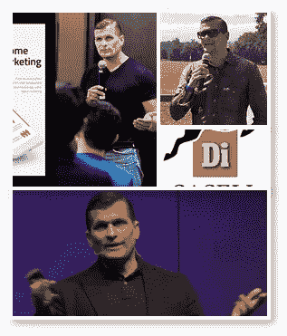
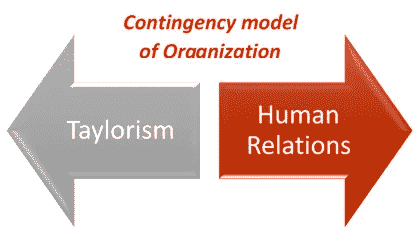
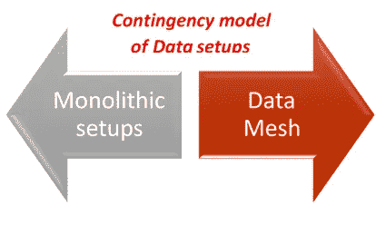
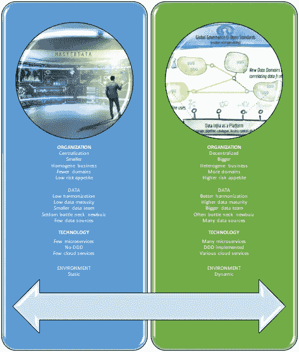
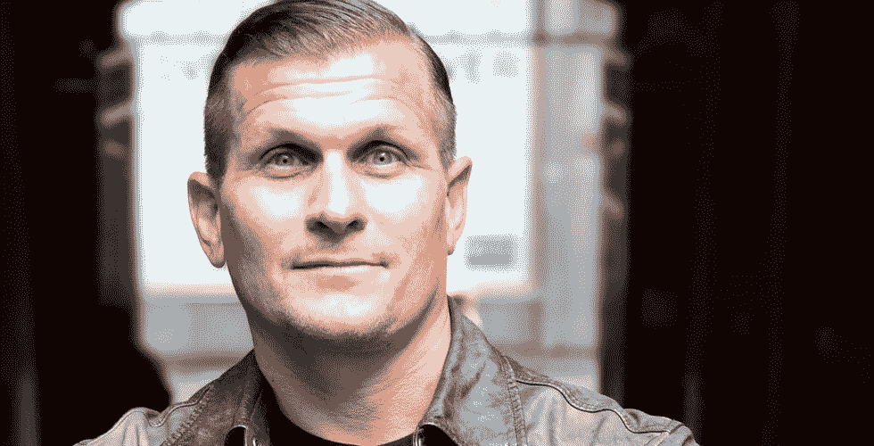

# 数据网格的权变模型

> 原文：<https://towardsdatascience.com/the-contingency-model-of-data-mesh-c4bbe57577d6?source=collection_archive---------35----------------------->

## 数据中断的最终基础

图片由 Diego Sanchez 在 Unsplash 上提供。

即使在数字世界里，也不能否认，自远古以来，技术和组织之间就一直存在着动态的相互作用，如果前者与后者不一致，那么前者永远也不能确定地产生某种结果。作为本文的起点，本文展示了即使在今天仍然存在显著的组织“趋势”，其中选定的组织模型并不总是基于给定特定背景、技术或特定目标的最合适的模型(也称为“权变模型”)，而是遵循其他公司、研究人员或顾问当前视为最“现代”模型的论述。近年来的数字化如何爆炸式地进入一个新的数据破坏时代越来越清晰，与此同时，有人认为我们正在数据领域看到完全相同的过程——从数据湖中的单一设置到适应本地管理的更加分布式的数据设置(即所谓的数据网格)的趋势越来越强。本文提请注意在这种情况下，我们现在如何能够看到比该领域的“最新趋势”更有成效的方法的初步迹象，这变得更加有希望，在该领域中，我们以类似于组织研究中的方式能够辨别数据设置的权变模型的第一个胚胎。这篇文章认为，这很可能是 2022 年及以后取得数据颠覆性成功的最重要的先决条件之一。

# 技术和组织之间的动态互动

虽然几十年来，我主要被认为是一般意义上的[数字战略](https://www.linkedin.com/in/onlinestrategy/)的先驱之一，随着时间的推移，它在[数据破坏](https://www.linkedin.com/pulse/another-my-articles-published-eventually-most-lidman-fil-lic-)中的应用，特别是[技术创新](https://www.linkedin.com/pulse/how-use-new-technology-doing-good-joining-26-ministers-rufus-lidman/)的优点，但自从我在几百年前完成变革过程的[博士研究以来，我一直对组织领域着迷。](http://uu.diva-portal.org/smash/record.jsf?dswid=https://images-na.ssl-images-amazon.com/images/G/01/personalization/ybh/loading-4x-gray._CB485916920_.gif&pid=diva2%3A116937&c=3&searchType=SIMPLE&language=sv&query=rufus+lidman&af=%5B%5D&aq=%5B%5B%5D%5D&aq2=%5B%5B%5D%5D&aqe=%5B%5D&noOfRows=50&sortOrder=author_sort_asc&sortOrder2=title_sort_asc&onlyFullText=false&sf=all)

因为不管你有多喜欢，都不可能回避它们之间的联系。技术永远不会为某个目标提供片面确定的结果，它最多可以充当“变革的触发器”，新技术的引入可以提供机会——甚至“理由”——以不同的方式进行重组。在我们有了愿景和战略之后，或者在数字的动态中至少有一个弹性框架在发挥作用之后，真正的动态就在技术和组织之间的界面上发生了。

作者图片

对我来说，这一点在我与三大洲 100 多家公司的数字战略合作的几十年中变得尤为明显。我们已经确定了目标，并相应地调整了数字战略，但是为了实际实现不同的数字实体和实现目标，我们无法避免组织需要进行的改变。

因此，在重要的会议和活动中，他们可能会称我为数字战略家或技术影响者，但这些年来我所取得的任何成功的最大原因之一仍然是我不仅对数据、创新和新兴技术着迷，而且至少对组织着迷。

# 组织变革的双重驱动力

当我称赞对组织的兴趣时，我并不仅仅指它作为“工具”的工具功能(这个词的词源来自希腊语“organon”，意思是“工具”)，以在各种事情上取得成功，从而获得商业成功或解决社会挑战。

因为除了组织的工具功能之外，我指的至少是我们人类如何让自己被吸引到最新的社会“趋势”中来组织自己的魅力，而不管这种趋势是否实际上构成了实现我们目标的更好的“工具”。

图片由 Unsplash 上的 Caroline van Oijen 提供。

这在宏观层面的[同构](https://www.jstor.org/stable/2095101)研究和微观层面的[种群生态](https://www.journals.uchicago.edu/doi/abs/10.1086/226424)研究中都有所体现。在更具体的层面上，最新的“[管理话语](http://su.diva-portal.org/smash/record.jsf?dswid=-1302&pid=diva2%3A451591&c=1&searchType=RESEARCH&language=sv&query=&af=%5B%22personName%3A%5C%22Furusten%2C+Staffan%5C%22%22%2C%22publicationTypeCode%3AmonographDoctoralThesis%22%5D&aq=%5B%5B%7B%22freeText%22%3A%22staffan+furusten%22%7D%5D%5D&aq2=%5B%5B%5D%5D&aqe=%5B%5D&noOfRows=50&sortOrder=author_sort_asc&sortOrder2=title_sort_asc&onlyFullText=false&sf=all)”展示了公司是如何被改变的，即目前在经理和顾问中最“时髦”的是什么。

当人们考虑到这些趋势是如何看待经典二分法之间的永恒振荡过程时，这变得更加可怕，例如高层次和低层次，严格和宽松监管的过程，为[开发或探索](https://www.amazon.com/Creative-Destruction-Underperform-Market-Successfully/dp/038550134X)而建立的组织，尤其是它在集权和分权之间的振荡。

在本文中，我们将讨论这种振荡过程是如何在大型组织中的公司处理数据的过程中表现出来的，以及它与下一个大趋势“数据网格”的关系。

# 我们如何面对数据中断的新时代

几年前，这个故事开始将数据视为世界上的新石油，这是我们都投身于元宇宙的先决条件，去年在金平达到高潮，宣布数据为“第五种生产要素”，等同于劳动力、土地、资本和技术。这是一个长期趋势[的结果](https://medium.com/aiar/digital-trendspotting-2019-2a-the-total-breakthrough-for-ai-on-every-single-front-baa8710353d3)，数据被视为新的数字应用蓬勃发展所需的燃料，不管结果是好是坏。随着所有这些现在终于在一个真正的数据颠覆时代爆发，数据的关键价值已经体现在它如何突破成为过去十年全球独角兽、decacorns 和 hectocorns 的最重要的 KSF 之一。

数据爆炸正在快速发生。虽然人类从文明的黎明到千年之交设法在世界上创建了 0.005 zetta 字节的数据(1 ZB = 1⁰字节= 1 万亿 GB)，但今天同样数量的数据是在不到 1 天的时间内生成的。与我们人类从线下生活到线上生活的方式一致，在极端情况下成为一个完全的[远程物种](https://www.linkedin.com/pulse/birth-remote-species-reporting-from-most-important-event-rufus-lidman)，今天产生了如此巨大的数量，以至于很快就会以[三位数的 ZB/年](https://www.statista.com/statistics/871513/worldwide-data-created/)来计算。

而且不止于此。因为通过近几十年 4G 和现在 5G 的发展，这也意味着数据可以以更大的容量和更快的速度传输。当我们朝着越来越强大的计算机平行前进，并且量子计算机即将到来时，我们已经迈出了处理这些数据的大步。

最重要的是，我们后来看到了真正的破冰船，我们从生硬的“大数据”到日益先进的人工智能、人工智能甚至 AGI，在那里，我们在大量令人敬畏的数据科学家的帮助下，可以在使用人工智能将这些海量数据转化为以惊人的精度执行预测、预防和处方时创造奇迹。

所有这些对我个人来说都是我整个职业生涯中最重要的基石之一，从我的应用统计学(多元方法)论文开始，以及后来的科学理论和研究方法的[博士研究](https://www.linkedin.com/pulse/how-become-successful-create-better-world-huge-both-rufus)，我已经将[数据作为我成功的唯一最重要的工具](https://www.linkedin.com/pulse/hur-du-med-digital-m%C3%A4tning-s%C3%A4kerst%C3%A4ller-framg%C3%A5ng-lidman-fil-lic-/)。

这不仅仅是关于我作为一个科学的“行业反叛者”是如何在千禧年快乐的转折之后进入的，并开始要求和应用数据来为一大群价值数十亿美元的公司确定最合理的战略，以及率先使用数据和高级分析来优化其摇篮中的数字营销。这导致了瑞典围绕数字营销分析和战略的 real gem(Anegy，后来被出售给一家上市公司)的成立，也是我担任 WFA 600 家公司数字顾问的荣誉职位数年的平台，代表了全球所有媒体投资的 90%。

作者图片

对于所有这些，甚至在我自己的科技企业中——6 家，其中 2-3 家存在——基础都是数据。这不考虑它是否是关于相当基本的事情，如我们应该如何选择和优化交通渠道以及形式和内容，成为该国最大的健康网站，拥有 100 万游客。它是关于移动游戏应该如何发展，以达到我们在全球收到的 1500 万次下载。它也是关于我们如何在移动平台上使用人工智能的，它的第一个表现形式成为该领域中世界上最大的独立应用程序，受到 165 个国家超过 20 万人的喜爱，以及随后开发的 EdTech 平台，不仅使学习的形式个性化，而且使内容本身个性化，从而一劳永逸地彻底改造了世界上需要学习的人。

在所有这些情况下，数据已经成为“业务”本身的一个基本部分，它已经从数字产品的推动者变成了产品本身。也就是说，我们如何从将数据作为其他功能和服务的副产品放在外围设备中，发展到将数据作为产品( [DaaP](https://medium.com/@itunpredictable/data-as-a-product-vs-data-as-a-service-d9f7e622dc55) )。

# 在现代组织中应该如何处理数据

考虑到这一点，以及近年来数据在社会中的普遍地位，特别是它在公司和组织中扮演的核心角色(在某些情况下是最核心的角色),对我来说，毫无疑问，组织内部处理数据的方式迫切需要范式转变。

毫无疑问，这种模式转变是一种已经持续了一段时间的趋势，而集中和分散之间永恒振荡过程的下一步，分散模式，如[【DDD】](https://www.amazon.com/Domain-Driven-Design-Tackling-Complexity-Software/dp/0321125215)、微服务和 DevOps，已经慢慢开始跟上。所有这些都由 [MACH 架构](https://www.contentstack.com/resources/eb/break-replatform-cycle-mach-enterprise-architecture/)提供技术支持，从广泛的套件和生态系统到 api 优先战略，该战略由许多具有无头部署的最佳 SaaS 平台组成，并通过现代 IPaaS 进行集成。可以也应该认为，这一切都遵循了一个更广泛的趋势，即边缘计算等技术创新和“自主细胞”等组织趋势，都在使用章鱼触手中分散大脑的比喻，而不是集中的哺乳动物大脑。在数据领域，操作层面的所有内容都体现在 [DataOps](https://hyperight.com/dataops-is-the-backbone-of-ai-innovation-interview-with-lars-albertsson/) 中，而在架构层面，则体现在更加面向领域的数据，以及本地管理。

关于后一个领域，通过推出概念[数据网](https://martinfowler.com/articles/data-monolith-to-mesh.html)，Zhamak Dehghani 在数据架构的分散设置的包装和品牌重塑方面产生的极端影响是不可避免的。今天，她的观点越来越闻名于世，但对于那些还没有遇到它的人(至少我仍然会遇到一些人，特别是在传统的“it”中，他们仍然没有)，它简要地讲述了我们如何将数据设置重新分配给各个领域实体，这些实体通过分散的自助服务设计(例如 ELT 管道)可以对他们自己的领域数据负责，他们“作为产品”处理这些数据(DaaP)。

为了确保全公司范围内通用数据的可访问性和标准化，从而实现互操作性和跨域协作，这两个领域的优势将通过分布式数据的基础设施生态系统结合起来，即所谓的[数据网格架构。](https://www.youtube.com/watch?v=L_-fHo0ZkAo)

在这种情况下，最有意思的是实际应用中的实际价值，作为我们对技术和组织之间互动的讨论的直接反映，通常是如何被[以“组织反思”的形式](https://databricks.com/session_na20/data-mesh-in-practice-how-europes-leading-online-platform-for-fashion-goes-beyond-the-data-lake)在本地“数据所有者”甚至“[数据产品经理](/data-product-management-ffa582f7e047)”的层面上理解为组织的——这里用 eCom 巨头 Zalando 的数据工程经理的话来说明:

> “我们将以前未维护的数据集转变为有价值的资产，具有明确的目的和明确的利益相关方/… /确保此类数据产品的所有权和责任属于最了解数据的人。”

虽然从单一数据仓库到数据湖的“革命”更多的是使用新技术来修复旧流程，而不是创新新流程，但很明显，数据网格的技术和组织应用构成了一个极端的支点(或使用 Kuhns 和 Dehghanis 的话来说是“范式转换”)，与世界上大多数组织传统上处理数据的方式不同。

因此，毫不奇怪的是，这个包装得如此之好、背景如此之好、理由如此之充分的概念，有可能一下子粉碎旧的单片计算机工程师、架构师和 It 顾问视为他们在大型组织中的核心能力和“存在理由”的一切。

当然，这引起了强烈抗议。当然，也会有摩擦。当然，是时候去旧迎新了。

还是？

# 组织的权变模型

回到我们开始的话题，我们几乎不可能摆脱技术和组织之间的互动。当这种情况没有发生时，无论“其他地方”有什么证据表明某项技术带来了什么，都无关紧要——同样，无论数字战略在纸面上看起来有多好，如果它与组织中不同的背景条件不协调，如果组织中的人们没有参与并实际意识到这一点，也就是说，从虚构变为事实，也无关紧要。

柏林墙并没有在 1989 年“倒下”。是人让它“倒下”的。

图片由 Claudio Schwarz 在 Unsplash 上提供。

在我对组织着迷的数字时代之前，这是最让我着迷的事情之一。

因为无论对组织的兴趣发生在公司和工程师身上，正如它最初在科学管理中表达的那样，还是由所有对运动中的软因素采取完全辩证立场的心理学家和社会学家进行的，后来被称为 T2 人际关系，所有早期的组织研究都致力于寻找“完美”的组织。

这种思维模式在 1965 年消亡了。

它在琼·伍德沃德发表她关于[技术对组织的影响](https://www.amazon.com/Industrial-Organization-Practice-Joan-Woodward/dp/0198741227)的伟大实证著作的那一天寿终正寝，随后是 [Lawrence & Lorsch](https://www.amazon.com/Organization-Environment-Managing-Differentiation-Integration/dp/0875841295/ref=sr_1_5?dchild=1&keywords=lawrence+and+lorsch&qid=1630274182&s=books&sr=1-5) 和其他人，以及“组织的权变模型”的发展。简而言之，这是一个理解的问题，即永远不会有一个“完美”的组织，而只是取决于各种背景条件(市场、技术、产品、经济、环境的动态程度等)的最合适的组织。).

在组织研究中，这在当时几乎和尼采在 1983 年宣布[上帝已死](https://www.amazon.com/Nietzsches-Thus-Spoke-Zarathustra-ABSURDs/dp/1537267361)从而向世俗化迈出最后一步一样亵渎神明和“权威”。

尽管如此，它后来又开始冒泡了。再一次。再一次。1982 年，麦肯锡咨询公司的彼得斯&沃特曼(Peters & Waterman)凭借他们的著作“[寻找卓越](https://www.amazon.com/Search-Excellence-Americas-Best-Run-Companies/dp/0060548789)”取得了突破性进展，该书通过研究 42 家(当时*)表现良好的公司，声称发现了“优秀公司的八大特征”。当他们的麦肯锡同事吉姆·科林斯 13 年后突破性地出版了同样值得纪念的书籍《持续经营》(Built to Last)，该书对 18 家(当时*)有远见的公司进行了研究，并声称已经确定了有远见的公司的标准，随后是真正经典的“[从优秀到卓越](https://www.amazon.com/s?k=good+to+great+jim+collins&i=stripbooks-intl-ship&crid=3GNKMVNJGAMP4&sprefix=good+to+%2Cstripbooks-intl-ship%2C249&ref=nb_sb_ss_ts-doa-p_2_8)”，该书对 11 家(当时*)财务上成功的公司进行了研究，确定了公司在财务表现方面从“优秀”到“优秀”的五个标准。当著名的研究人员，也是麦肯锡的顾问 Nohria 和 Williams 在《[什么真正有效](https://www.amazon.com/What-Really-Works-Sustained-Business/dp/0060513004/ref=sr_1_6?dchild=1&keywords=what+really+works&qid=1630279469&s=books&sr=1-6)》一书中，基于对 160 家(当时*)最成功的公司中使用的 200 种管理技术的研究，声称他们已经确定了事实上导致财务成功的 4 + 2 方法时，这种观点再次出现。

现在它又冒泡了。这次是在如此重要的数据领域。我们又到了哪里，“追求卓越”，想要“从优秀走向卓越”。因为在这个极其重要的领域，我们终于找到了答案。唯一的方法。“真正管用的”。

这肯定是我们发现的，不是吗？

# 数据设置的权变模型

在这里，我不得不指出，历史总是如此频繁地重演，这是多么有趣。对于那些认真研究过这个世界上变化过程是如何发生的人来说，要知道辩证过程往往比逻辑过程更重要。

作者图片

我们之前已经看到，在组织理论中有这样一种趋势，即从一个命题(科学管理)到一个对立面(人际关系)，最后在一个综合中内爆(权变)——在这种情况下，在前面两个极端中断言的模型反而被证明根据上下文产生不同程度的成功。

同样，我认为，在目前世界上可能最关键的领域——数据——中，我们已经能够看到完全相同的过程——趋势从命题(单一数据仓库和数据湖)走向对立面(分布式数据网格)，这反过来不需要太多的智能来准确预测可以和应该遵循的综合。

作者图片

也就是说，这两个极端本身并不构成“错误”,而仅仅是它们的优点不同，这取决于实施它们的组织中不同的环境条件。

考虑到数据和数据处理的方式并不是一个重要的领域，但对于许多公司和组织来说，这可能是未来成功的最重要的领域(无论今天是否意识到这一点)，如果人们愿意，至少可以慢慢辨别出这种初步综合的雏形，或者“数据的应急模型”，这应该是令人满意的。

其中一个问题是，数据网格对于大公司来说是否比小公司更能实现其 T2 功能。在当前的一篇论文中，这一点已经成为问题，文章认为，决定数据网格成功与否的往往不是规模，而是除了特定行业对数据的主要需求之外，更关心的是组织拥有具有高数据成熟度的分散数据解决方案，以及域定义和数据所有权的清晰性。其他[更技术性的建议](https://hyperight.com/is-data-mesh-right-for-your-organisation/)针对适合数据网状架构而非单一变体的情境因素，包括组织是否启动了 DDD，使用微服务，或使用基于云的迁移，以及在高级别上如何在结构上良好地协调数据，以及在文化上*公司有多高的数据成熟度。*

除此之外，还可以添加更多与数据相关的背景,其中，域的数量、数据团队的规模以及数据团队成为支持数据的新一代产品的瓶颈的频率，被认为是在集中式和分散式数据架构之间做出选择的决定性因素，并结合了数据源的数量、需求和公司对数据治理的优先级。类似方向的另一个步骤是来自 [Strengholt](/data-mesh-topologies-85f4cad14bf2) 的一个精心设计的帖子，在那里，他部分地展示了，像在 [Balnojan](/theres-more-than-one-kind-of-data-mesh-three-types-of-data-meshes-7cb346dc2819) 之前一样，它如何不是关于集中化和去中心化之间的二分法，而是相反地，确定了至少三种不同的方法来实现数据网格架构——从“受管网格拓扑”到“高度联合网格类型”的递减规模。同样，模式的选择是基于从组织成熟度和技能到组织的结构、规模、动态和风险偏好等各方面的背景。

基于以上所述，这种第一个高度试验性的元理论至少可以作为数据设置的权变模型的初始胚胎的种子，并看起来像下面这样——所有这些都需要在溯因过程的未来阶段通过更多经验数据的展开来验证和证伪。

作者图片

# 前进的道路

越来越清楚的是，我们正在走向一个新的数据破坏时代。因此，当现在开始追踪第一个胚胎到一个初始的应急模型，以获得更富有成效的数据设置选择时，我认为我们都可以感到高兴，因为它将从当前的仅仅是指示性的数据转向更具体的大量经验数据，从而能够提供统计意义和明确的证据。但是，最重要的是，我们在对“真正有效的东西”的诱人追求和“从优秀到卓越”的雄心中，永远不会再陷入最新的“趋势”——而是要检测什么样的背景因素将导致什么样的数据架构是最好的，以便从优秀到卓越。

只有到那时，我们才能找到一个基于情况的模型，该模型有一些成功的机会，可以显示某个处理数据的设置何时比另一个更好。只有到那时，我们才有可能成功，释放资源，包括技术和人力资源，这是认真处理“数据即产品”所必需的，并在重塑公司、行业甚至整个社区方面发挥主导作用。

活着的人会看到。行动的人不仅要看到，而且要享受所看到和播种的果实。一旦我们面临一个数据中断的时代，可能没有什么比这更重要了。QED。

*后来，这些公司中的大多数不仅失去了他们当时所谓的“卓越”和“有远见”的品质，而且完全失败了。

# 鲁弗斯·利德曼，电影。Lic。

Lidman 是著名的数字创新者和数据颠覆者，连续社会企业家和顶级技术影响者，拥有 50，000 名追随者。他拥有双学位和博士学位，并以数据科学为平台，是 IAB 的创始人，WFA 的数字顾问，拥有 300 多场讲座的知名演讲者，并在 100 多家公司担任数字战略和创新方面的任务，如三星、宜家、梅赛德斯、伊莱克斯、普华永道等。作为一名数字企业家，他已经经营了 6 家企业，拥有 2-3 个 ok 出口，包括访问量达数百万的网站和一些下载量超过 1500 万的全球最大应用。作为他的最新投资，他在瑞典联合创建了领先的数字人才收购公司 Digitalenta，并在新加坡创建了 EdTech PTE Ltd，利用领先的技术为新兴市场的贫困人口重新创造学习机会。除此之外，他还出版了 4 本书和世界上最大的数字战略学习应用，受到 165 个国家 20 万人的喜爱。