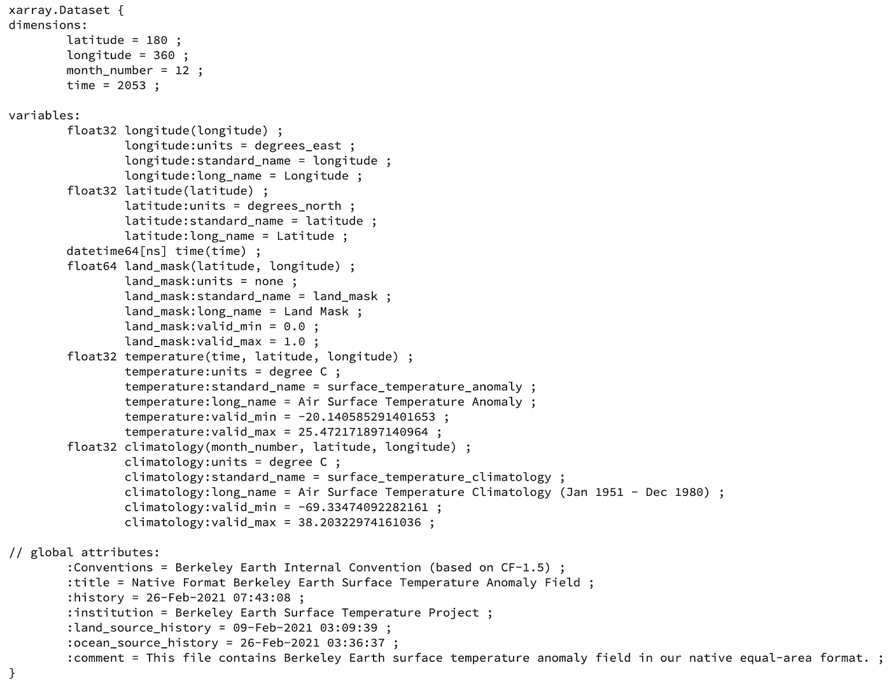
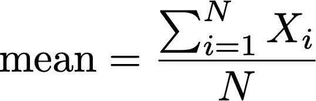
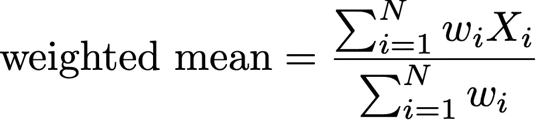
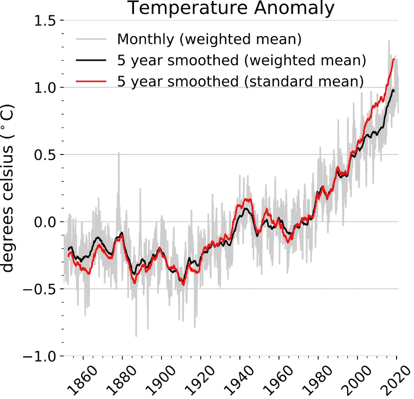

# 平均全球的正确方法

> 原文：<https://towardsdatascience.com/the-correct-way-to-average-the-globe-92ceecd172b7?source=collection_archive---------22----------------------->

## 为什么对数据进行面积加权很重要


美国宇航局在 [Unsplash](https://unsplash.com?utm_source=medium&utm_medium=referral) 拍摄的照片

平均值。这是一个非常简单的计算:把你所有的数据点加起来，然后除以总点数。举例来说，如果你正在计算全球平均温度，这个简单的等式是否有效？不完全是。这篇文章概述了如何计算维度为`time`、`latitude`和`longitude`的网格数据集的全局平均值。换句话说，在每个`time`步计算`latitude`和`longitude`的平均值。我首先解释为什么使用经典公式计算变量的空间平均值是不合适的，然后说明为什么加权平均值是合适的，最后给出一个使用公开可用数据集的示例。

# 下载数据

我将使用的数据是来自伯克利地球的陆地和海洋温度异常的 1 x 1 网格数据集。以下 python 代码将下载数据并将其读入内存。

```
import xarray as xr
import pooch# save data to temporary location
flname = pooch.retrieve(‘[http://berkeleyearth.lbl.gov/auto/Global/Gridded/Land_and_Ocean_LatLong1.nc’](http://berkeleyearth.lbl.gov/auto/Global/Gridded/Land_and_Ocean_LatLong1.nc'), None)# read data into memory
ds = xr.open_dataset(flname)
```

可以用`ds.info()`查看文件的元数据。从元数据中，我们看到地表温度距平变量`temperature`，它是地表气温与气候学的差值。在这种情况下，气候学是 1951 年 1 月和 1980 年 12 月的平均值。



文件元数据(图片由作者提供)

# 传统意义上

当我们想到数据集的平均值`X`时，可能会想到下面的等式。这是传统的意思。等式中，`i`代表每个`latitude`，`longitude`坐标对，`N`为总对数对。



向量 X 的均值方程(图片由作者提供)

我也称之为“平地球平均值”，它假设地球没有曲率，每个纬度和经度位置的数据都被平等对待。为什么这很重要？因为 1×1 的网格盒从热带移动到极点时占据的面积更小。这意味着赤道附近的数据比北极对平均值的影响更大，因为它占据了更多的区域。这表明我们应该根据每个数据点所占的面积对其进行加权。

> 我也称之为“平地球平均值”，它假设地球没有曲率，每个纬度和经度位置的数据都被平等对待。

在`xarray`符号中，这个传统的或“平地球”的意思可以这样计算:`traditional_mean = ds['temperature'].mean(['latitude','longitude'])`

# 加权平均值

这是加权平均值的一般公式:



向量 X 的加权平均值方程(图片由作者提供)

这类似于传统的平均值，只是每个数据点都有一个权重，`wi`，分母是所有权重的总和。传统平均值只是加权平均值的一个特例，其中每个权重等于 1。

> 传统平均值只是加权平均值的一个特例，其中每个权重等于 1。

# 计算全球面积

在地球科学中，首选方法是按面积对数据进行加权，即按每个网格单元的面积对每个数据点进行加权。在计算面积加权平均值之前，我们首先需要知道每个格网单元的面积。如果没有提供网格单元区域，下面的代码将有助于计算区域网格。

地球的形状是一个扁球体，就像“压扁”的球体。下面的代码计算地球的格网单元面积，半径是 1984 年世界大地测量系统[中纬度的函数。等式的一个推导是](https://earth-info.nga.mil/GandG/publications/tr8350.2/tr8350.2-a/Chapter%203.pdf)[这里是](https://planetcalc.com/7721/)。

# 区域加权全球平均值

现在我们知道了什么是加权平均值以及如何计算面积图，让我们将所有这些信息放在一起，使用下面的代码计算全球平均温度异常。

```
# area dataArray
da_area = area_grid(ds['latitude'], ds['longitude'])# total area
total_area = da_area.sum(['latitude','longitude'])# temperature weighted by grid-cell area
temp_weighted = (ds['temperature']*da_area) / total_area# area-weighted mean temperature
temp_weighted_mean = temp_weighted.sum(['latitude','longitude'])
```

# 可视化全球平均值

下面是全球气温异常图，月值显示为灰色，5 年平滑值分别使用标准平均值和面积加权平均值显示为红色和黑色。差别是微小的，但面积加权平均值显示在过去 20 年中有轻微的异常。原因是因为北极比低纬度地区变暖得更快，尤其是在最近一段时间。标准平均值放大了变暖幅度，尽管它只占地球的一小部分。加权平均值减弱了北极变暖的影响，为全球平均温度异常提供了更精确的计算。



使用伯克利地球数据集的全球平均温度异常(图片由作者提供)

# 最后的想法

计算地理空间平均值时，对数据进行加权不仅重要，还需要如实显示平均值，而不是夸大结论。

计算全球平均值时，需要注意以下几点:

1.  注意总面积。如果只计算陆地上的全球平均温度，则需要在区域数据集中屏蔽掉海洋，并根据陆地总面积对权重进行归一化。
2.  如果数据集在空间上是不完整的，[复杂的方法](https://academic.oup.com/climatesystem/article/3/1/dzy003/5056434)【2】更合适。

总之，如果您有一个空间完整的格网数据集，面积加权是计算全球平均值的正确和最佳方法。然而，如果网格化数据包含间隙，则需要先进的技术。最后，另一种方法是对数据进行余弦加权，即通过纬度的余弦值对数据进行加权。概念是相同的，你可以使用`cos('latitude')`作为你的权重矩阵，而不是使用网格单元面积。

希望这篇文章能在计算全球平均值时提供一些有用的指导。

# 代码源

这篇文章中使用的所有代码都在这里

*如果您对这篇文章有任何疑问或觉得它有帮助，请留下您的评论。*

## 参考

[1]罗德和豪斯父亲， [**《柏克莱地球陆地/海洋温度记录》**](https://essd.copernicus.org/articles/12/3469/2020/essd-12-3469-2020.html) (2020)，ESSD

[2]考坦、雅各布斯、索恩和威尔金森， [**简单全球温度估值器覆盖误差的统计分析**](https://academic.oup.com/climatesystem/article/3/1/dzy003/5056434) (2018)，DSCS

*感谢阅读和支持媒体作者*

<https://lukegloege.medium.com/membership> 