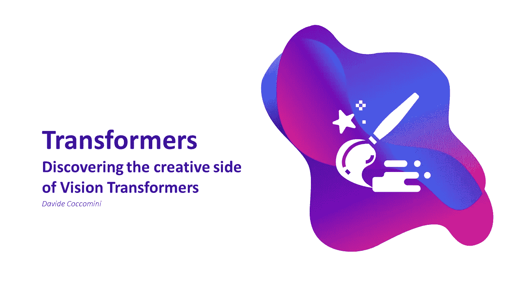
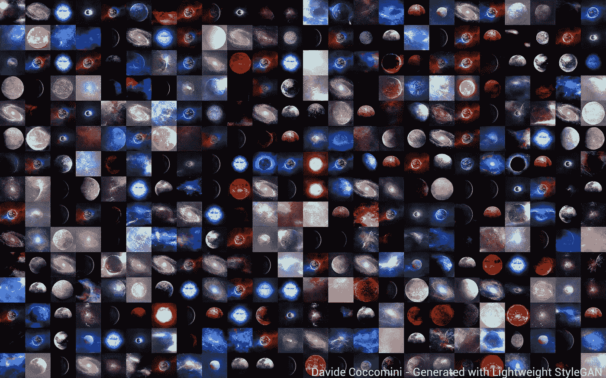
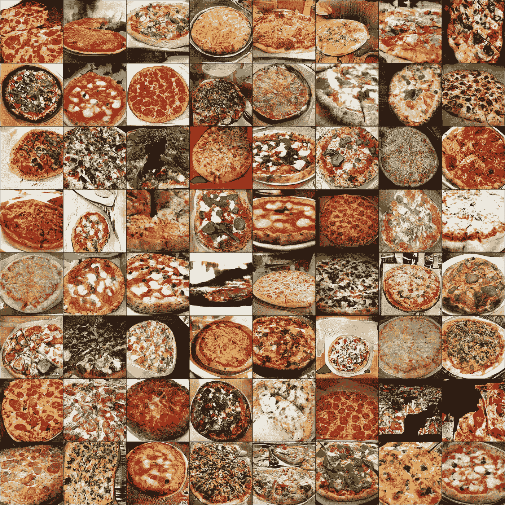
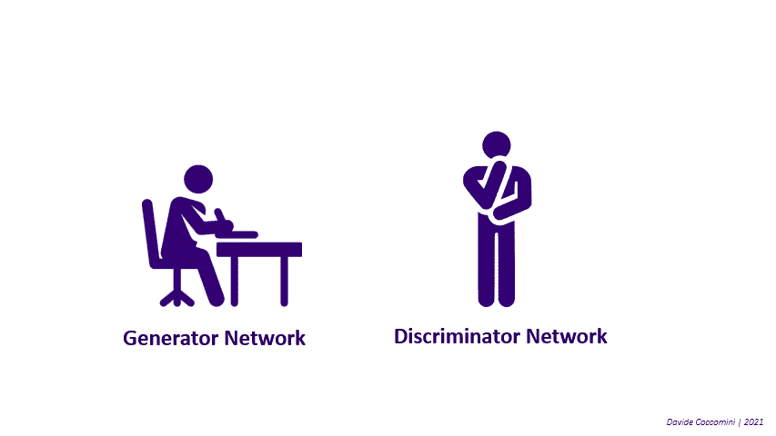
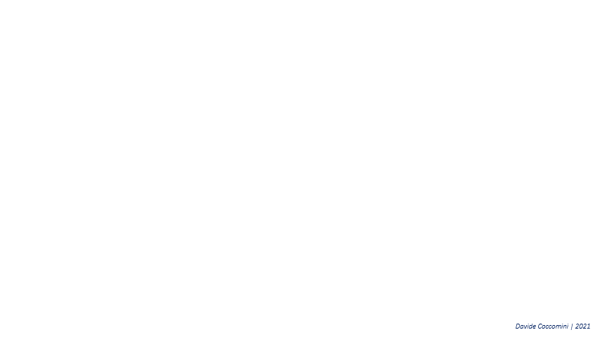
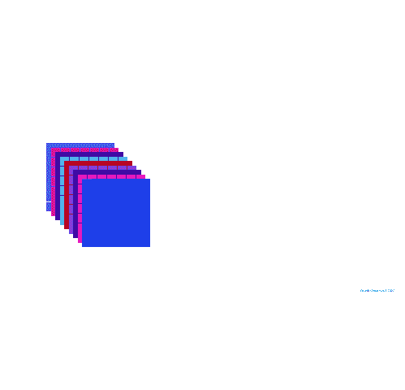
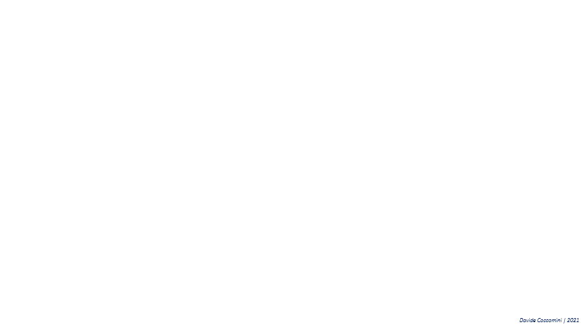
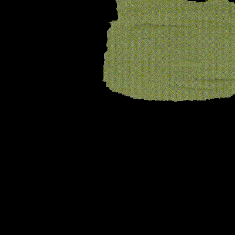
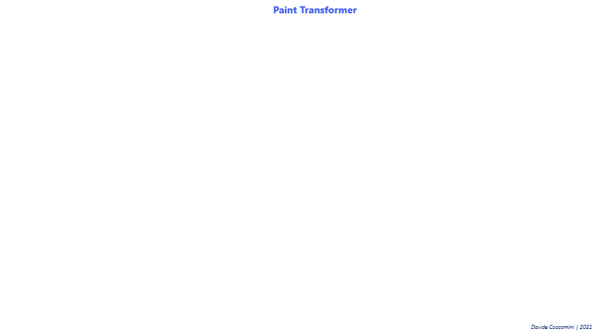
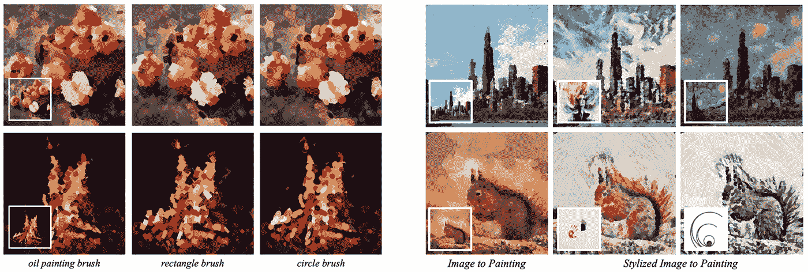

# 视觉变形金刚的创意一面

> 原文：<https://towardsdatascience.com/the-creative-side-of-vision-transformers-e3efa7c4b859?source=collection_archive---------22----------------------->

## 视觉变形器生成图像并绘制照片

什么是创造力？最受认可的定义如下:

*“创造力是创造新奇事物的能力”*

它被认为是人类最重要和不可替代的特性之一。但如果这是如此特殊的特征，神经网络就不可能模仿它，不是吗？不完全是。今天，我们在创建具有生成模型的创造性人工智能方面面临着一些特殊的问题，主要被称为生成对抗网络(GANs)。这些被深度学习之父之一 Yann Le Cunn 认为是本世纪在 AI 领域最重要的突破[8]。

# 生成对抗网络

生成对抗网络(GANs) [3]由 Ian Goodfellow 在 2014 年提出，并立即用于执行壮观的和从未探索过的任务。

第一个也是最广泛使用的应用是生成新图像，正如我在以前的文章《[人工智能如何想象宇宙》中所展示的那样？](/how-does-an-ai-imagine-the-universe-d1d01139b50a)【5】生成如下行星和天体的图像:

图片由[作者](https://www.linkedin.com/in/davide-coccomini/)

所有这些图像都代表了由神经网络生成的不存在的对象，动物、人以及所有形状和类型的对象也是如此。

使用[轻量级 GAN](https://github.com/lucidrains/lightweight-gan) 生成的图像

这些网络最近被证明能够执行非常有用的任务，例如提高照片的分辨率，或者有时非常有趣，例如让史蒂夫·鲍尔默和小罗伯特·唐尼合唱布鲁诺·马斯的《Uptown Funk！

作者使用 Wombo.ai 制作的视频

尽管乍一看这似乎很吸引人，而且完全无害，但这背后隐藏着严重的影响和危险。这些模型还每天被用来欺骗人们或破坏他们的声誉，例如通过所谓的 deepfakes。

现在有了这项技术，就可以把源演员的脸转置到目标演员的脸上，使其看起来、说话或动作都和源演员一模一样。一个视频 deepfake 可以让人们相信一位政治领导人发表了特别危险的言论，加剧了人们之间的仇恨，或将一个人置于他或她从未经历过的不恰当的环境中，或者这些视频可以在司法程序中代表伪造的证据。

像所有的工具一样，它没有好坏之分，它总是取决于你如何使用它。

但是在深入本文的核心之前，对生成性对抗网络的内部工作原理做一点解释是合适的。

图片由[作者](https://www.linkedin.com/in/davide-coccomini/)来自[人工智能如何想象宇宙？](https://medium.com/r?url=https%3A%2F%2Ftowardsdatascience.com%2Fhow-does-an-ai-imagine-the-universe-d1d01139b50a)

GANs 由两个不同的网络组成，通常是两个卷积网络，一个生成器和一个鉴别器，它们是相互对照的。生成器查看输入数据，试图生成新的可信图像，以欺骗鉴别器。另一方面，鉴别器试图理解给定的图像是生成的还是原始的。当生成器在生成图像方面变得足够好以至于骗过鉴别器时，除了输入数据中存在的例子之外，它还可以用于创建其他可信的例子。

# 视觉变形金刚

在进入文章核心之前，最后一点题外话。对于那些从未听说过视觉变形金刚的人来说，这是一种正在彻底改变计算机视觉领域的新架构。它基于自我注意的机制，该机制使用通过将输入图像分割成小块并将它们投影到线性空间而获得的向量。基于视觉转换器的架构是当今计算机视觉中最有前途的方法之一，并取得了惊人的成果。

图片由[作者](https://www.linkedin.com/in/davide-coccomini/)从[上看变形金刚、时代先锋和关注](/transformers-an-exciting-revolution-from-text-to-videos-dc70a15e617b)

[关于视觉变形金刚的深入解释，建议你去看看我之前的文章。](/transformers-an-exciting-revolution-from-text-to-videos-dc70a15e617b)

但是如果视觉变形金刚这么棒，难道不值得用它们来做 GANs 吗？

# TransGAN:两个纯变形金刚可以组成一个强大的 GAN，而且可以扩大规模！

这项研究旨在回答这样一个问题:不使用卷积网络能否创建 GAN？gan 通常依赖卷积网络作为生成器和鉴别器。相反，在这种架构中，只使用视觉转换器，这对于鉴别器来说非常简单，因为它是一个普通的分类器，必须判断图像是否是伪造的，但生成器呢？在这种情况下，情况更加复杂，因为依赖于自关注机制的变压器需要大量的计算资源，因此以期望的分辨率直接生成图像可能很快变得过于昂贵。

因此，发生器的架构由一系列变换编码器组组成。每一个都以增加的分辨率接收图像，但是在减少的通道数量上，以便降低复杂性。换句话说，生成器开始处理带有许多通道的小图像，然后处理带有较少通道的较大图像。

图片由[作者](https://www.linkedin.com/in/davide-coccomini/)基于 [TransGAN:两个纯变形金刚可以做一个强 GAN，并且可以放大](https://arxiv.org/pdf/2102.07074.pdf)

例如，如果我们想要在 3 个通道上生成一个 32×32 像素的图像，则最初会生成一个代表简单噪声、大小为 8×8 的图像，就像在经典 GAN 中一样。这由一系列的变换编码器进行变换，过一会儿，进行放大，将其变换为 16x16，并减少通道的数量。这个过程被进一步重复，直到达到 32×32 的目标分辨率。最后，由最后一组编码器生成的矢量被转换回小块，以构成输出图像。

因此，有了 TransGANs [1]，就有可能以一种计算上可持续的方式生成图像，而不使用卷积网络，但是有一个小细节仍然需要研究:**放大是如何执行的？**

图片由[作者](https://www.linkedin.com/in/davide-coccomini/)基于[的实时单幅图像和视频超分辨率采用高效的亚像素卷积神经网络](https://arxiv.org/pdf/1609.05158.pdf)

在增加分辨率的同时减少通道所采用的策略如图所示，包括将每个像素“列”转换成单个超像素。所有超像素被组合在一起以获得单个更高分辨率的图像。

为了通过实现更高分辨率的输出来进一步提高性能，最后的变压器编码器被**网格变压器模块**所取代。

图片由[作者](https://www.linkedin.com/in/davide-coccomini/)基于 [TransGAN:两个纯变压器可以组成一个强大的 GAN，并且可以按比例放大](https://arxiv.org/pdf/2102.07074.pdf)

在所谓的网格自注意中，不是计算给定标记和所有其他标记之间的对应关系，而是将全尺寸特征图划分成许多不重叠的网格，并且在每个局部网格内计算标记交互。

TransGAN 能够在 STL-10 上建立新的最先进水平，并在 CelebA 和 CIFAR-10 等其他数据集上匹配基于卷积网络的架构的结果。

结果在许多情况下都非常出色，激发了人们对基于视觉变形金刚的新 GAN 变体的兴趣！

# 油漆变压器

另一个基于视觉变形金刚的有趣且有创造性的作品是油漆变形金刚[2]。这个模型能够把一幅普通的画变成一幅画！

图片来自[官方油漆变形金刚库](https://github.com/wzmsltw/PaintTransformer)

这里的问题是作为给定图像的一系列笔划的预测来处理的，以便以非真实感的方式重新创建它。

该过程是渐进的，在每一步，模型并行预测多个笔画，以最小化当前画布和目标图像之间的差异。两个模块用于实现这一点:**笔划预测器**和**笔划渲染器**。

笔划渲染器负责将一系列笔划作为输入，并将它们放在画布上。笔画预测器是架构的核心，其任务是学习预测生成图形所需的笔画。

图片由[作者](https://www.linkedin.com/in/davide-coccomini/)基于[绘制转换器:带有笔画预测的前馈神经绘制](https://arxiv.org/pdf/2108.03798.pdf)

整个培训过程是自我监督的，[一种创新的和更可持续的培训方法](/self-supervised-learning-in-vision-transformers-30ff9be928c) [7]。首先，生成一些随机的背景笔画，并由笔画渲染器放置在空画布上，从而获得中间画布。随后，随机的前景笔划被生成并放置在前一个画布上，以从另一个笔划渲染器获得目标画布。预测器接收中间画布和目标画布，并试图生成要放置在中间画布上的潜在前景笔画。预测的笔画然后被放置在中间画布上，并且笔画和目标画布都被用于计算与原始笔画的差异，并且因此损失被最小化。

图片由[作者](https://www.linkedin.com/in/davide-coccomini/)基于[绘制转换器:带有笔画预测的前馈神经绘制](https://arxiv.org/pdf/2108.03798.pdf)

笔画预测器包含两个 CNN，它们负责从两个输入画布中初步提取特征。这些笔画首先通过一个转换器编码器，然后通过一个转换器解码器输出所需的笔画。

来自[绘制转换器的图像:带有笔划预测的前馈神经绘制](https://arxiv.org/pdf/2108.03798.pdf)

由于这种架构，现在有可能将任何照片变成一幅具有不同和特殊效果的画！

# **结论**

有人说，除了创造性的工作，人工智能将能够做任何事情。今天，这种说法不再可靠。他们正在让现实变得不那么清晰，伪造的图像和视频很难与原始图像和视频区分开来，他们正在制作照片，给照片上色，假装自己是画家，以及许多其他有趣的应用。现代深度学习技术正在展示使用人工智能可能获得的奇迹，而我们只是触及了这个迷人领域的表面。

# 参考资料和见解

[1]“江一帆等人”。 [TransGAN:两个纯变压器可以组成一个强 GAN，并且可以放大](https://arxiv.org/abs/2102.07074)

[2]《刘松华等著》。"[绘制转换器:带有笔画预测的前馈神经绘制](https://arxiv.org/pdf/2108.03798.pdf)"

[3]“伊恩·j·古德费勒等人”。"[生成性对抗网络](https://arxiv.org/abs/1406.2661)"

[4]“阿列克谢·多索维茨基等人”。"[一幅图像相当于 16x16 个字:大规模图像识别的变形金刚](https://arxiv.org/abs/2010.11929)"

[5]《大卫·柯考米尼》。"[人工智能如何想象宇宙？](/how-does-an-ai-imagine-the-universe-d1d01139b50a)

[6]《大卫·柯考米尼》。"[关于变形金刚，时间创造者和注意力](/transformers-an-exciting-revolution-from-text-to-videos-dc70a15e617b)"

[7]《大卫·柯考米尼》。"[视觉变形金刚中的自我监督学习](/self-supervised-learning-in-vision-transformers-30ff9be928c)"

[8]《凯尔·威格斯》。"[生成性对抗网络:什么是 gan 以及它们是如何进化的](https://venturebeat.com/2019/12/26/gan-generative-adversarial-network-explainer-ai-machine-learning/)"

[9]“大卫·科科米尼等人”。"[结合 EfficientNet 和视觉转换器进行视频深度防伪检测](https://arxiv.org/abs/2107.02612)"