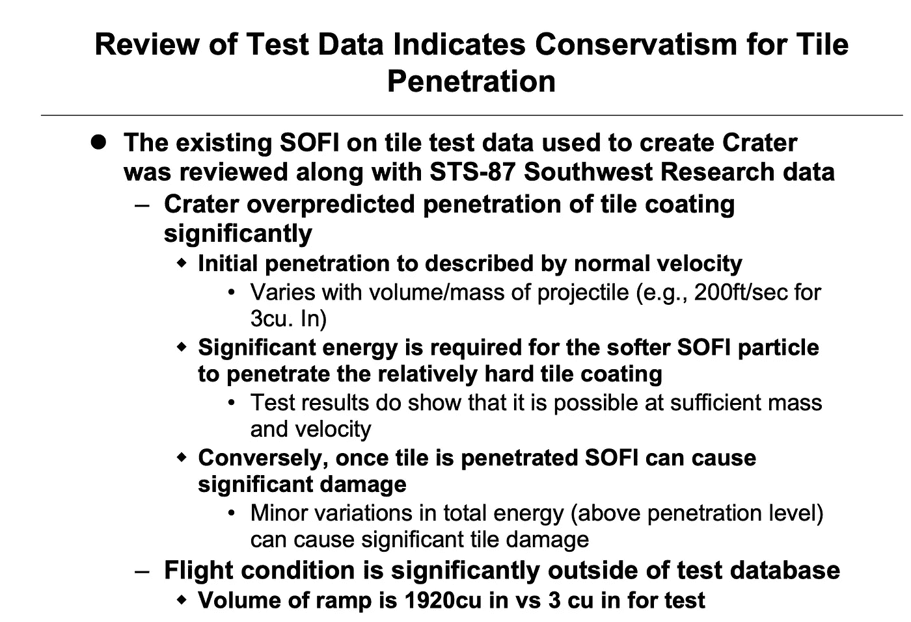
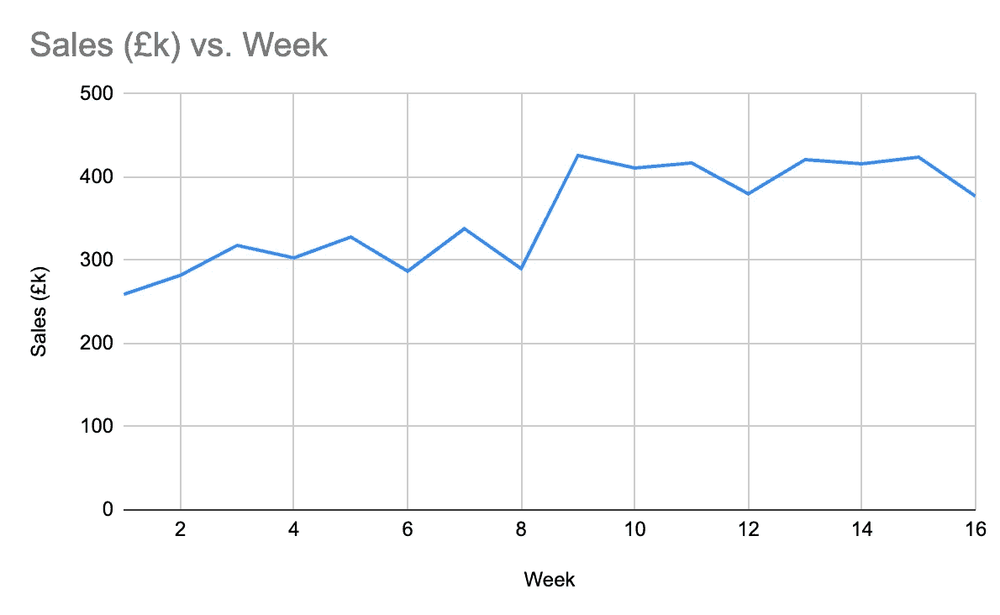
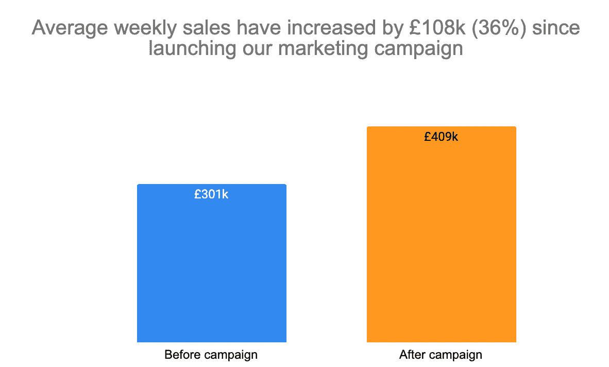
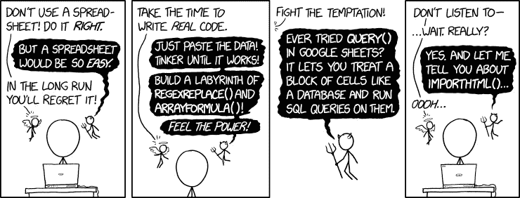

# 数据科学和分析中关键但经常被忽视的技能

> 原文：<https://towardsdatascience.com/the-critical-but-often-overlooked-skills-in-data-science-analytics-f5af692495c6?source=collection_archive---------17----------------------->

## 超越技术技能

卢卡斯·布拉塞克在 [Unsplash](https://unsplash.com?utm_source=medium&utm_medium=referral) 上的照片

现在有比以往更多的方式来学习进入数据科学和分析所需的技术技能——在线课程、Kaggle 竞赛、youtube 教程和 stack overflow 金矿，仅举几例。

希望进入这一领域的人经常会问这样的问题:“做 X 数据工作我需要什么编程技能？”、“我应该学习哪些机器学习技术？”，以及“我应该做什么项目来建立我的技能/投资组合？”。

技术技能当然很重要，如果你不知道汽车是如何工作的(希望如此)，你就不可能成为一名汽车修理工。

但是，仅仅关注技术技能忽略了使数据专业人员真正有用的关键方面——能够使用他们的技术技能产生**业务影响**。

## 弥合差距

照片由[大卫·马丁](https://unsplash.com/@davidmartinjr?utm_source=medium&utm_medium=referral)在 [Unsplash](https://unsplash.com?utm_source=medium&utm_medium=referral) 上拍摄

数据专业人员在任何业务中的角色都是在工作的技术部分和帮助影响业务决策之间架起一座桥梁。

第一部分是技术性的，定义很明确——你通过课程学习编码和软件，或者在工作中学习。

第二部分，帮助影响业务，要模糊得多，也不太明确。它包括让非技术人员更容易理解角色的技术部分，并关注最终用户的需求。

在这篇文章中，我将尝试从我自己的经验中提炼出如何产生更大的商业影响的主要知识，以及在招聘过程中区分优秀候选人和优秀候选人的非技术技能类型。

这些是我要讲的要点:

*   了解你的受众
*   保持简单
*   关注结果

## 了解你的受众

[产品学校](https://unsplash.com/@productschool?utm_source=medium&utm_medium=referral)在 [Unsplash](https://unsplash.com?utm_source=medium&utm_medium=referral) 上的照片

根据我的经验，大多数数据专业人士都有大学背景，并习惯于被与他们知识水平相似的人包围。

与和你有相似背景的人分享你的工作是非常简单的，你不需要担心过于专业，甚至不需要解释核心概念。

但在我工作过的任何行业中，数据专业人士最多只占员工总数的 2%，其余 98%的人可能不知道也不关心什么是超参数，也不知道要花多长时间才能将这些可怕的数据集转换成可行的格式。

了解你的观众是谁，他们做什么和不关心什么，并把你的作品翻译成****它如何使他们受益**，这是一项至关重要的技能。**

> **史蒂夫·乔布斯没有通过谈论其 5GB 的硬盘，甚至更小的尺寸来宣传最初的 iPod，他将它推销为“[你口袋里的 1000 首歌](https://thisdayintechhistory.com/10/23/1000-songs-in-your-pocket/)”。人们不关心技术细节，他们关心你能为他们做什么。**

**每当我参与招聘新的数据分析师/科学家时，这总是最大的绊脚石——能够翻译他们的技术工作，以便非技术人员理解为什么它很重要。**

**那么这在实践中是如何运作的呢？**

**假设你已经建立了一个模型来预测客户是否会购买你的产品。这是一个非常好的模型，有 80%的准确率。**

**你将把这个演示给你的销售主管，你的总结是这样的:**

> **我们的随机森林机器学习算法对 10，000 行销售数据进行了训练，对客户销售结果的分类准确率为 80%。**

**销售主管可能不会关心这些，除了 80%的部分。**

**相反，想想“那又怎样？”，设身处地为他们着想，想想他们关心的是什么。**

**所以我们为什么不尝试一种不同的方法:**

> **我们已经建立了一个模型，可以在 80%的情况下识别客户是否会从我们这里购买。我们可以利用这一点向可能从我们这里购买的客户进行追加销售，并针对那些不愿意购买的客户进行营销。**

**我们在这里做了三件事:**

*   **去掉不必要的行话**
*   **用他们理解的术语描述模型性能**
*   **给定一个“那又怎样”的问题，说明可以用输出做什么**

**用其他人能理解的术语表述你的工作发现，用不相关的信息或行话过多会导致你的要点被遗漏。**

**这就把我们带到了第二点上。**

## **保持简单**

****

**由 [Fabrizio Chiagano](https://unsplash.com/@fabriziochiagano?utm_source=medium&utm_medium=referral) 在 [Unsplash](https://unsplash.com?utm_source=medium&utm_medium=referral) 上拍摄的照片**

> **“如果你不能简单地解释它，你就不能很好地理解它”——阿尔伯特·爱因斯坦，[可能是](https://skeptics.stackexchange.com/questions/8742/did-einstein-say-if-you-cant-explain-it-simply-you-dont-understand-it-well-en)**

**我以前工作的数据主管在给我写的一份(过于复杂的)分析提供建议时说过一句话，这句话让我记忆犹新:**

> **不要让人觉得**

**起初我有点迷惑，因为他似乎在暗示，阅读它的人需要填鸭式的喂养。但是很快就明白了——尽可能让别人容易地理解你想表达的观点。**

**一个臭名昭著的拙劣演示的例子是“幻灯片之死”，波音公司的工程师旨在向美国宇航局传达哥伦比亚号航天飞机(在起飞时受损)在重返地球大气层时解体的风险。**

**这是他们试图证明自己的关键幻灯片:**

****

**来源:[美国宇航局](https://www.nasa.gov/pdf/2203main_COL_debris_boeing_030123.pdf)**

**这当然不是有史以来最具视觉吸引力的幻灯片——但关键是他们没有传达他们的警告信息([本文](https://mcdreeamiemusings.com/blog/2019/4/13/gsux1h6bnt8lqjd7w2t2mtvfg81uhx)更深入)，航天飞机最终在重返大气层时破碎。**

**幻灯片上最相关的信息隐藏在最后 3 点中，即使这样，你也需要读几遍才能理解。**

**虽然这场悲剧不会仅仅是由这张幻灯片引起的，但它真的没有帮助。主要罪行:**

*   **幻灯片的标题没有概括他们想要传达的信息**
*   **最重要的几点用小字体写在底部**
*   **幻灯片本身在演示顺序中排在第六位，而不是第一位**
*   **里面全是行话(“SOFI”和“斜坡”都是泡沫的意思)**

**那么，我们如何“不让人思考”？让我们看一个基本的例子。**

**假设你在一家有限公司工作(创意满分)，在 2021 年的第 9 周，他们开始了一场营销活动——你被要求展示它有多有效。**

**所以，你画了一个折线图(毕竟，如果你想看一段时间内的变化，折线图不是最好的方法吗？)，你就这样结束了。**

****

**作者图片**

**现在，这包含了所有的关键信息——销售额在第 9 周上升并保持不变，太棒了！但是让我们想一想，如果你没有折线图，你不得不谈论你的发现，你会说什么？**

> **发起营销活动后，销售额增加了 X%**

**如果这是我们想要传达的信息，那么我们为什么不展示一些切中要点的东西呢？**

****

**作者图片**

**这就在标题中表达了主要观点，条形图对于显示“之前与之后”的区别是很有用的。微小的调整，但它需要少得多的思考，以达到完全相同的点。**

**当然，这是一个非常简单的例子——这并不意味着你可以用一个等效的条形图来代替每一个折线图，但关键是要考虑如何将你的信息提炼为尽可能简单的格式。**

**我经常会看到标题为“分析”或“发现”的演示幻灯片，页面的标题是人们阅读的第一件事——为什么不把它作为你要告诉他们的内容的摘要呢？**

**人们很少有时间和精力去通读大量的方法论和背景材料，直接切入主题，否则你工作中的重要部分会被忽略。**

## **关注结果**

****

**Photo by [金 运](https://unsplash.com/@jinyun?utm_source=medium&utm_medium=referral) on [Unsplash](https://unsplash.com?utm_source=medium&utm_medium=referral)**

**企业在乎钱(震惊和恐惧)，要么多赚钱，要么少花钱。作为一名数据专业人员，您的工作必须以某种方式为此做出贡献。**

**作为一名技术人员，你可能会喜欢建造东西和解决难题——然而这有成为完美主义者的风险。**

**完美主义者希望花时间无休止地调整他们的模型，或者完全自动化数据输入，但这并不总是有最大的影响。**

> **“不要让完美成为足够好的绊脚石”**

**你的工作产生的大部分影响将来自于你努力的最初部分，而把所有额外的时间花在完美上很少会有额外的好处。**

**这种权衡被更好地称为 [**帕累托法则**](https://en.wikipedia.org/wiki/Pareto_principle) ，或者 80 : 20 法则，你工作的 80%影响来自 20%的努力。**

**但这实际上意味着什么呢？**

**让我们看几个具体的数据示例:**

*   **你正在建立一个预测模型，使用 5 个最重要的特征给出了 80%的准确率，但是使用额外的 5 个特征给出了 85%的准确率*【你会在额外的 5 个特征上花费额外的时间吗？]***
*   **你正在建立一个客户盈利能力模型，你可以花很长时间在你的模型中引入**准确的**客户入职成本，或者你可以使用硬编码的假设*【你硬编码了吗？】***
*   **你正在为一个销售团队构建一个仪表板，他们要求你提供 10 种不同的图表/图形——你可以轻松地构建其中的 7 种，但最后 3 种需要大量的工作*【你会花时间在最后 3 种上吗？]***

**你可能在看这个列表时会想“好吧，在每个例子中，这不都取决于上下文吗？”—你绝对是对的。**

**这更像是退一步思考“我现在做的是我能做的最有影响力的事情吗？”。**

**无休止地修补你已经建立起来的东西总是很诱人的，它很容易成为某种舒适区。确保你定期花时间评估你正在做的事情，以避免被吸进完美主义者的兔子洞。**

**现在，这并不意味着突然之间你可以积累科技债务，就像没有明天一样..**

****

**必修 xkcd 漫画([来源](https://xkcd.com/2180/))**

**..但是就像生活中的所有事情一样，在中间的某个地方需要找到一个平衡点。**

**保持自己的目标，你构建的东西什么时候会“完成”,或者你会满意什么水平的功能/性能。毫不留情地坚持下去，并不断问自己，你所做的事情是否真的会产生最大的影响。**

## **摘要**

**希望这已经让您很好地了解了数据领域中一些经常被忽略的技能。**

**重申一下，这并不意味着你可以在技术知识上吝啬，这只是为了让你思考更广泛的技能，这些技能可以对你的效率产生巨大的影响。**

**希望你喜欢阅读！**