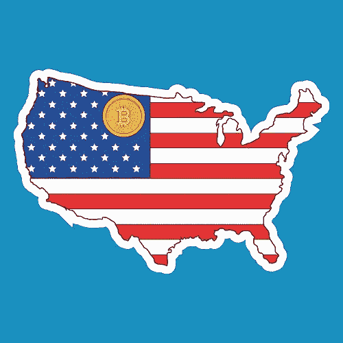
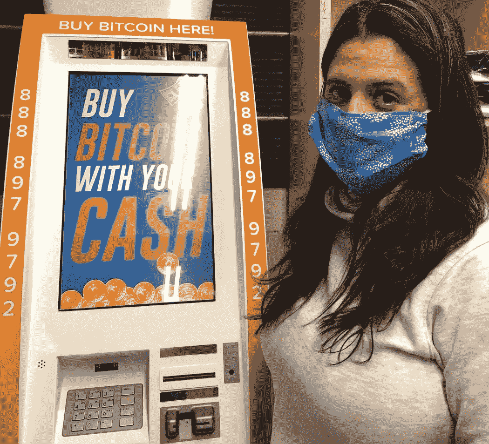
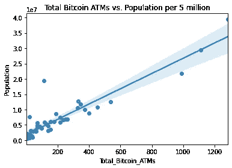
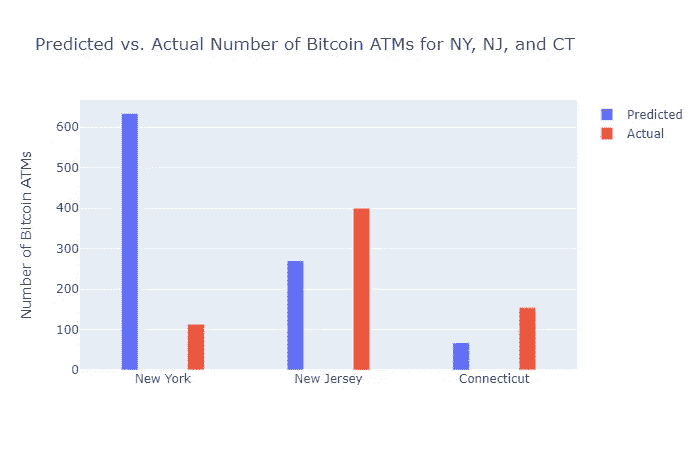

# 美国的加密状态:

> 原文：<https://towardsdatascience.com/the-cryptographic-states-of-america-ebe94659cb6?source=collection_archive---------67----------------------->

## 全美比特币自动取款机一览

从 Anytask.com 的 artgraffiti 购买

对于这个数据故事项目，我感兴趣的是:

*   可视化全美比特币自动取款机的分布
*   评估限制性比特币立法的可能负面影响以及对比特币 ATM 可用性的影响

我的**研究问题**——纽约州 2015 年通过的 BitLicense 立法是否对该州的比特币 ATM 可用性产生了负面影响？

**背景**

比特币是一个透明、去中心化的网络，由一个化名为中本聪的人在 2009 年创建。比特币的支持者频繁宣传比特币允许每个人“成为自己的银行”的观点。

由于其去中心化的本质，比特币网络允许用户进行点对点交易，而不需要我们习惯的中介:传统银行。不过，这种想法有一个障碍；个人需要一种简单的方式来购买比特币。

比特币基地等中央交易所允许个人购买比特币，但这样做需要一个银行账户。这导致了一个循环的情况:**要“成为你自己的银行”，你首先需要一个银行账户**来启动这个过程。

2018 年，美联储估计有多达 5500 万成年美国人没有银行账户。没有银行账户的个人购买比特币更加困难；有银行账户的人有更多的选择。

比特币似乎正在转变为一种价值储存手段，而不仅仅是一种日常货币；在全球疫情期间，美元价值出现了前所未有的增长。美国证券交易委员会主席杰伊·克莱顿(Jay Clayton)表示，“我们认为比特币不是一种证券，它更像是一种支付机制和价值储存手段。”

Paypal 最近允许用户直接购买比特币，但目前，客户没有办法提取他们购买的东西。如果没有银行账户的个人想要购买比特币，他们从其价值储存中受益的选择很少，独立式比特币自动取款机可以满足没有银行账户和有银行账户的用户的需求。尽管使用比特币需要支付费用和费率，但比特币自动取款机非常方便。

比特币自动取款机允许用户走到机器前，用现金购买比特币，并让它立即被发送到他们选择的比特币地址，这是一种宝贵而方便的购买比特币的方法。我为这个项目评估的 CoinATMRadar 数据集包含符合该标准的比特币 ATM。(独立式比特币自动取款机的替代方案要求用户登录其网站来兑换他们购买的比特币。)

**数据集描述**

在这个数据故事项目中，我评估了一个数据集，该数据集详细描述了美国各地比特币 ATM 的位置和数量。我直接从 CoinATMRadar 获得了主要数据集，其中包括截至 2020 年 11 月 16 日美国的独立比特币 ATM。你可以在这篇博文底部的链接查看这个项目对应的 code/IPython 笔记本。

CoinATMRadar 是一个列出比特币 ATM 位置的在线目录，他们对列表有严格的要求。他们的目录还包括买卖其他加密货币的 ATM 机，包括 Ethererum、Monero 和 Dash 等。我没有评估这个项目的替代加密货币；比特币是独家焦点。比特币 ATM 上市有一个自我报告机制，因此在发现任何潜在错误之前可能会有一小段时间。

**该数据集的具体限制:**

*   仅截至 2020 年 11 月 16 日
*   不包含 CoinStar 机器(它们需要以后用有效的驾驶执照进行兑换)
*   不包含 LibertyX 自动柜员机，因为它们允许借记卡购买

我还从 census.gov 下载了美国各州 2020 年的人口数据。合并两个数据集，这样我就可以评估比特币自动取款机的数量与每个州人口的关系。

2015 年，纽约州通过立法，要求任何想要在该州运营交易所或出售加密货币的公司申请 BitLicense。许多人推测这对该行业产生了负面影响，我想量化并证明这种影响。

在这里，我正在从 CoinATMRadar 的数据集中列出的本地比特币 ATM 机购买比特币。我不得不在雨中跋涉，这个自动取款机被塞在一个小加油站的角落里。

**数据争论和特征工程**

我的数据争论过程包括清理列出城市位置的列。有一些拼写错误需要纠正。此外，在某些情况下，城市栏包括标点符号和州缩写。所有这些都需要移除。使用 Python 的 split()方法，我可以轻松地删除许多行中的逗号以及其后出现的任何两个字母的缩写。

我还使用了 Python 的 RegEx 模块。总之，我花了 16 行代码来清理一个包含 9550 行的数据集。在未来的单元中，我期待着扩展我的数据辩论技能，能够用更少的代码行完成这个过程，并尽可能使用最少的计算密集型过程。

我还向数据集添加了一个新特性，包括一个计算每 10 万居民人均 ATM 的列。这是显示这些计算的图像。

为了创建上面的可视化，我需要定义一个数据字典并将其映射到每个州，从而在数据集中产生一个新列，其中包含每个州的两个字母缩写。

对于那些喜欢按名称查看各州的人来说，这里有另一个显示每 100，000 名居民中使用比特币 ATM 机最多的十个州的可视化图。

我的统计方法包括创建一个散点图并覆盖一条回归线，该回归线显示人口和比特币 ATM 机数量之间存在明显的正线性相关性，异常值为 1e7。

然后我计算了一个相关系数来衡量这种关系的强度和方向。结果是 0.93，这代表了很强的相关性。纽约州是美国人口第四多的州，但只有 113 台比特币自动取款机。这比 198 的平均值低多了，这是我们从一个那么大的州所没有想到的。

接下来，我想调查一下我最初的想法，即纽约在 2015 年颁布的限制性 BitLicense 立法对加密货币行业产生了负面影响，这一点从纽约州限制比特币 ATM 机的数量超过了我们通常对人口稠密的州的预期就可以看出。因此，我创建了一个线性回归模型，并用它来计算三个独立的预测。

线性回归模型显示，比特币自动取款机数量的 86%的可变性可以通过人口来解释，所以我不确定这个项目是否能够量化我最初的想法。然而，由此产生的预测是一个惊喜！

**结果和结论**

我首先计算了一个人口相当于纽约的州的比特币自动取款机数量预测，以及新泽西州和康涅狄格州的预测。

**预测一个人口与**纽约州**人口相当的州的比特币 ATM 机数量**为 **634.69** ，比纽约州仅有的 113 台比特币 ATM 机多 521.73 台！

**新泽西州**比邻近的**纽约州**多 286 台**比特币自动取款机，尽管新泽西州的人口还不到纽约州的一半**。

线性回归模型预测，新泽西州大小的一个州将有 270 台比特币自动取款机，康涅狄格州将有 67.3 台。根据我们的数据集，新泽西州有 399 台比特币自动取款机，康涅狄格州有 154 台。

当然有可能的是，原本会在纽约开设比特币自动取款机的企业会去邻近的新泽西州和康涅狄格州，在那里开设比特币自动取款机，以避免申请比特币许可证的高昂成本。

这可以解释新泽西州的比特币 ATM 机数量比我们的线性回归模型预测的大约多 129 台，比纽约州多 286 台，尽管新泽西州的人口还不到纽约州的一半。这也可以解释康涅狄格州比特币自动取款机的实际数量是预测数量的两倍多。与纽约州相比，康涅狄格州多了 41 个 ATMS，尽管康涅狄格州的人口还不到纽约州的五分之一！

进一步的研究领域包括对最近的数据集进行定期的类似评估。此外，在比较之前交叉参考多个来源的比特币 ATM 位置可以进一步完善结果。涉及比特币和整个加密货币行业的立法正在发展，未来的研究和分析可以考虑这些发展变化。

还有，我做了很多特征工程，探索量化“比特币友好状态”这个词的可能性。这一探索没有成为最终的 IPython 笔记本，但它本身可能是一个相当大的独立研究领域！

下面是这篇博文对应的 IPython 笔记本的链接:[https://github . com/cryptobellum/DS-Unit-1-Build/blob/main/The _ Cryptographic _ States _ of _ America . ipynb](https://github.com/cryptobellum/DS-Unit-1-Build/blob/main/The_Cryptographic_States_of_America.ipynb)

引用的作品

(1)[https://www . Bloomberg . com/news/articles/2019-06-04/why-Cleveland-wants-to-bring-back-postal-banking](https://www.bloomberg.com/news/articles/2019-06-04/why-cleveland-wants-to-bring-back-postal-banking)

(2)[https://news . bit coin . com/us-crypto currency-regulation-sec-chairman-Jay-Clayton-bit coin/](https://news.bitcoin.com/us-cryptocurrency-regulation-sec-chairman-jay-clayton-bitcoin/)