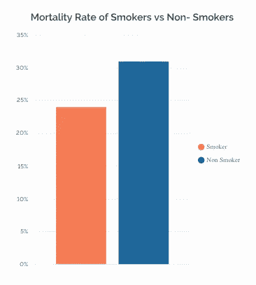
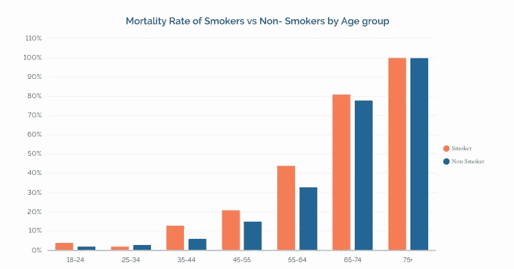
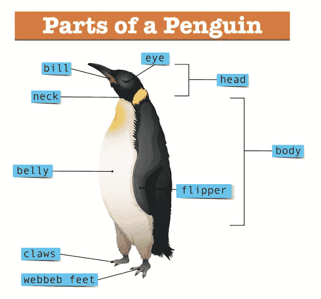
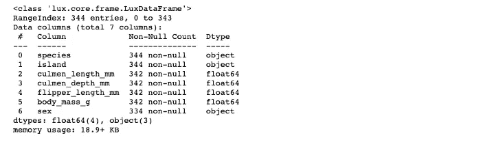
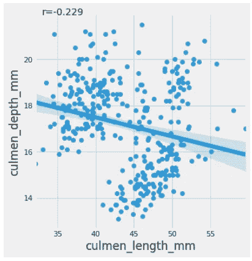
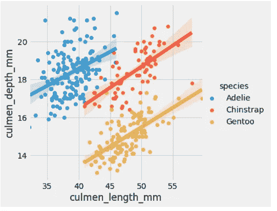
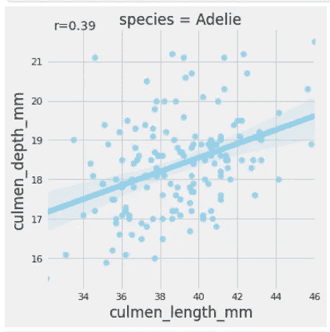
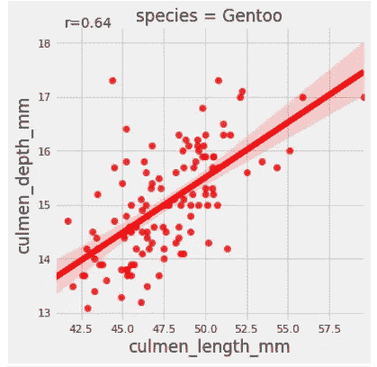
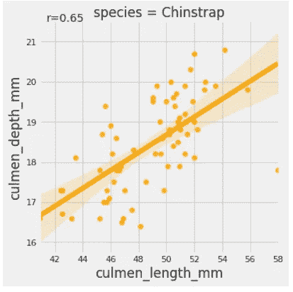

# 辛普森悖论的奇特案例

> 原文：<https://towardsdatascience.com/the-curious-case-of-simpsons-paradox-6f178548d7e8?source=collection_archive---------21----------------------->

## 统计测试和分析可能会因为对数据的简单误解而被混淆


照片由[布伦丹·丘奇](https://unsplash.com/@bdchu614?utm_source=medium&utm_medium=referral)在 [Unsplash](https://unsplash.com?utm_source=medium&utm_medium=referral) 上拍摄

> 统计学很少提供做任何事情的单一“正确”方式——查尔斯·惠兰在《赤裸裸的统计学》中

1996 年， [*阿普尔顿、弗伦奇和范德普姆*](https://www.researchgate.net/publication/254331089_Ignoring_a_Covariate_An_Example_of_Simpson's_Paradox) 进行了一项实验，研究吸烟对一个样本人群的影响。这项研究进行了 20 多年，包括 1314 名英国女性。与普遍的看法相反，这项研究表明吸烟者往往比不吸烟者长寿。尽管我不是吸烟对人体健康影响的专家，但这一发现令人不安。下图显示，吸烟者的死亡率为 23%，而不吸烟者的死亡率约为 31%。



吸烟者与非吸烟者的死亡率|作者图片

现在，事情变得有趣了。把同样的数据按年龄组分开，我们会得到一个完全不同的画面。结果显示，在大多数年龄组中，吸烟者的死亡率比不吸烟者高。



按年龄组细分的研究结果|作者图片

## 那么，为什么会有这种困惑呢？🤔

嗯，我们刚刚在上面看到的现象是**辛普森悖论**的一个经典案例，它不时地让位于大量数据驱动的分析。在本文中，我们将对此进行更深入的探讨，并理解如何在我们的分析中避免类似的谬误。

# 辛普森悖论:事情并不总是像它们看起来的那样


图片由[卡洛斯·里贝罗](https://pixabay.com/users/ctribeiro-680997/?utm_source=link-attribution&utm_medium=referral&utm_campaign=image&utm_content=1708964)拍摄，来自[皮克斯拜](https://pixabay.com/?utm_source=link-attribution&utm_medium=referral&utm_campaign=image&utm_content=1708964)

***按维基百科，辛普森悖论，*** *又叫* ***尤尔-辛普森效应*** *，可定义如下:*

> [辛普森悖论(Simpson's Paradox)是概率统计中的一种现象，一种趋势出现在几组不同的数据中，但当这些组组合在一起时就消失或逆转。](https://en.wikipedia.org/wiki/Simpson%27s_paradox)

换句话说，根据不同的分组方式，同一个数据集可能呈现相反的趋势。这正是我们在吸烟者和非吸烟者死亡率的例子中看到的。当按年龄分组时，数据显示不吸烟者往往活得更长。但是，当我们看到一个整体画面时，吸烟者往往活得更长。这里到底发生了什么？为什么同样的数据会有不同的解释，第一种情况下是什么在逃避我们的眼睛？嗯，在这种情况下，罪魁祸首被称为**潜伏变量——**条件变量，它可以影响我们对两个变量之间关系的结论——在我们的情况下，吸烟和死亡率。

# 识别潜在变量🔍


图片由 [Peggy_Marco](https://pixabay.com/users/peggy_marco-1553824/) 来自 [Pixabay](https://pixabay.com/?utm_source=link-attribution&utm_medium=referral&utm_campaign=image&utm_content=1708964)

潜伏的意思是以一种潜在的或难以辨别的状态存在，尽管仍然有影响。同样，潜在变量是一个不包括在分析中的变量，但是如果包括在内，可以极大地改变分析的结果。

在讨论的例子中，**年龄组**是潜在的变量。当数据按年龄分组时，我们发现不吸烟者的平均年龄明显更大，因此，更有可能在试验期间死亡，正是因为他们总体上活得更长。

# 你自己试试吧。💻

这是辛普森悖论的另一个显而易见的例子。我们都知道 [**帕企鹅**](https://allisonhorst.github.io/palmerpenguins/articles/intro.html) **🐧** [**数据集**](https://allisonhorst.github.io/palmerpenguins/articles/intro.html) —著名虹膜数据集的替代产品。该数据集由三种企鹅的详细信息组成，包括它们的长度和深度、鳍状肢长度、体重和性别。企鹅喙本质上是企鹅喙的上脊，而它们的翅膀被称为鳍状肢。数据集[可在 Kaggle 上下载](https://www.kaggle.com/parulpandey/palmer-archipelago-antarctica-penguin-data?select=penguins_size.csv)。



[brgfx-www.freepik.com 创建的自然向量](https://www.freepik.com/vectors/nature) |归属 1.0 通用( [CC BY 1.0](https://creativecommons.org/licenses/by/1.0/) )

## 导入必要的库和数据集

```
import pandas as pd
import seaborn as sns
from scipy import stats
import matplotlib.pyplot as plt
%matplotlib inline#plt.rcParams['figure.figsize'] = 12, 10
plt.style.use("fivethirtyeight")# for pretty graphsdf  = pd.read_csv('[penguins_size.csv'](https://raw.githubusercontent.com/parulnith/Website-articles-datasets/master/penguins_size.csv'))
df.head()')
df.info()
```



数据集中几乎没有丢失的值。让我们摆脱那些。

```
df = df.dropna()
```

现在让我们想象一下企鹅的**长度和它们的**深度之间的关系。同样，我们将使用 seaborn 的`lmplot`方法(其中“`lm`”代表“`linear model`”)。



企鹅的长度与深度|作者图片

在这里，我们看到了数据集的 culmen 长度和 culmen 深度之间的负相关。上述结果表明，越长的秆或喙，密度越小。我们还计算了两列之间的相关系数，以使用[皮尔逊相关系数](https://en.wikipedia.org/wiki/Pearson_correlation_coefficient#:~:text=In%20statistics%2C%20the%20Pearson%20correlation,between%20two%20sets%20of%20data.) (PCC)查看负关联，称为**皮尔逊相关系数*r。PCC***是一个介于-1 和 1 之间的数字，用于测量两个数据集之间的线性相关性。Scipy 库为此提供了一个名为`pearsonr()`的方法。

## 在物种级别向下钻取

当你进一步挖掘并按物种对数据进行分组时，发现正好相反。“`hue`”参数决定了数据框中的哪一列应该用于颜色编码。

```
sns.lmplot(x **=** 'culmen_length_mm',y **=** 'culmen_depth_mm', data **=** df, hue **=** 'species')
```



企鹅的长度和深度按物种分类|图片由作者提供

瞧啊。我们有一个辛普森效应的经典例子。虽然秆的长度和深度在群体水平上呈负相关，但物种水平的数据显示出相反的相关性。因此**物种的类型**在这里是一个**潜伏变量**。我们还可以使用下面的代码来查看每个物种的人的系数:



作者提供的图片

> **这里是** [**nbviewer 链接**](https://nbviewer.jupyter.org/github/parulnith/Data-Science-Articles/tree/main/The%20curious%20case%20of%20Simpson%27s%20Paradox/) **到你想跟随的笔记本柜。**

# 发现辛普森效应的工具🛠

在数据集中检测辛普森效应可能很棘手，需要一些仔细的观察和分析。然而，由于这个问题在统计世界中不时出现，很少有工具可以帮助我们处理它。一篇题为“[利用辛普森悖论发现行为数据中有趣的模式](https://arxiv.org/abs/1805.03094)”的论文于 2018 年发布，强调了一种数据驱动的发现方法，利用辛普森悖论来揭示行为数据中有趣的模式。*该方法系统地分解数据，以识别群体中行为与群体中其他成员明显不同的子群体。*这是一本很好的读物，也有代码链接。

# 结论

数据具有强大的力量，可以很容易地被操纵以满足我们的需求和目标。聚合和分组数据有多种方式。根据分组方式的不同，数据可能会产生混淆的结果。这取决于我们使用统计工具仔细评估所有细节，并寻找可能影响我们决策和结果的潜在变量。

*👉有兴趣看我写的其他文章。这个* [*回购*](https://github.com/parulnith/Data-Science-Articles/blob/main/README.md) *包含了我分类写的所有文章。*