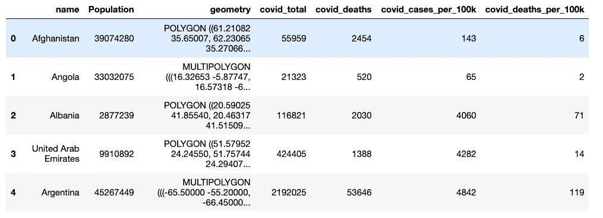
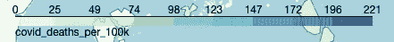
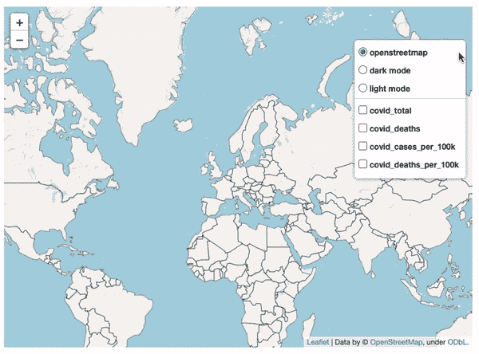
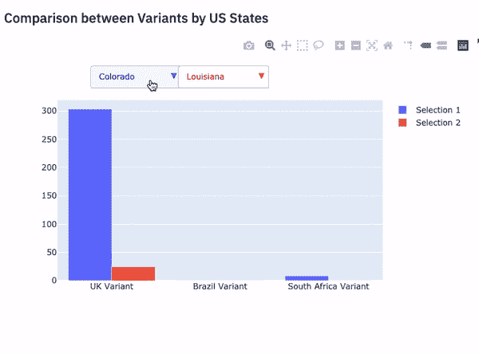
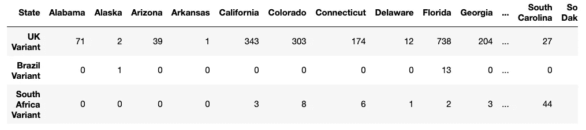

# 从三个不同的角度看新冠肺炎的现状

> 原文：<https://towardsdatascience.com/the-current-state-of-covid-19-from-3-different-perspectives-3fbaabcd0348?source=collection_archive---------25----------------------->

## **让数据和图像说话——一个简化的网络应用**


作者图片

你是否曾经想在几个小时内而不是几周内与世界上的任何人分享你的项目？如果是这样，那么你来对地方了。本文将带您了解我是如何使用 Streamlit 创建自己的新冠肺炎仪表板的。Streamlit 允许您以简单的方式为机器学习和数据科学创建定制的 web 应用程序。以下是我的应用程序的链接:

[https://share . streamlit . io/navido 89/covid 19-dashboard-dataviz/app . py](https://share.streamlit.io/navido89/covid19-dashboard-dataviz/app.py)

# 目标:

首先，为了更好地理解我的项目，我将带你经历我试图完成的事情。这个项目的目的是从三个不同的角度看新冠肺炎的现状。这些图是通过使用数据可视化工具(如 Plotly 和 Folium)创建的。这个项目分为三个部分。

**1。全球新冠肺炎情况**:我显示了一个叶子地图，上面显示了总病例数、总死亡数、每 10 万人的总病例数和每 10 万人的总死亡数。除此之外，我还展示了各种时间序列图，以便更好地理解这种疾病是如何随着时间在全球传播的。

**2。世界卫生组织区域(世卫组织)的新冠肺炎情况**:在下面的部分，我从世界卫生组织的区域角度来看这种疾病。我根据不同地区的总病例数、总死亡数、每 1 亿人的总病例数和每 1 亿人的总死亡数对它们进行了比较。

**3。美国的新冠肺炎局势**:最后但同样重要的是，我调查了美国，并根据病例、死亡人数(有和没有人均)、疫苗状况以及不同变种在各州传播的状况，探讨了美国的现状。

这些数据来自各种资源，每天都会更新。请[点击这里](https://github.com/navido89/covid19-dashboard-dataviz)进入我的回购，你就可以拉数据了。

# 方法:

在进入 Streamlit 之前，我为每个图创建了一个函数。如上所述，我使用 Plotly 和 Folium 进行可视化。这样做的原因是因为我希望我所有的图形都是交互式的，Plotly 和 lyum 在这方面做得很好。一旦我为每个图创建了函数，我就创建了一个主函数。主函数是我为我的 Streamlit 应用程序编写代码并调用每个 plots 函数的地方。在我进入 Streamlit 部分之前，我将首先向您介绍我必须实现的方法，以准备好这些图。

## **数据清理**:

正如你们中的许多人所知，当涉及到数据科学项目时，我们将大部分时间花在数据清理上。我的网络应用也是如此。清理所有不同的数据，我拉进创建图花了我最多的时间。我不打算详细说明我是如何清理每个图的数据的，但是它们中的许多都有一个共同的模式。我必须采取的为图表准备数据的步骤包括:

*   读入数据
*   移除列和行
*   用新的字符串值替换字符串
*   按功能分组
*   合并数据集

## **特色工程**:

同样，我不会详细讨论特性工程，但是现在我将强调一些常见的模式。例如，在时间序列图中，我必须将类型从 object 更改为 DateTime。除此之外，我还创建了显示人均病例或死亡总数的列。对于这些特定的列，我必须通过使用特定位置的人口、总病例数和死亡人数来进行计算。获得人均数字的目的是为了更好地了解不同地点之间的情况。

## **数据可视化**:

正如本文前面提到的，我使用 Plotly 和 Folium 进行可视化。对于 Plotly 绘图，Streamlit 有一个名为 plotly_chart()的函数，对于 follow，可以导入以下库:

```
from streamlit_folium import folium_static
```

foloum_static 是一个函数，它允许您将一个叶子地图作为参数传入，以便它可以在您的应用程序中呈现。

在我的项目中有两个高级的情节，我将更详细地讨论，以便您能够在自己的项目中创建它们。其他情节相当简单，我强烈建议仔细阅读 Plotly 文档。请查看下面的链接:

[](https://plotly.com/python/) [## Plotly Python 图形库

### Plotly 的 Python 图形库制作出交互式的、出版物质量的图形。如何制作线图的示例…

plotly.com](https://plotly.com/python/) 

首先，我们来谈谈 app 中的 follo pleth 地图。我之前写过一篇关于如何绘制更高级的多层 Choropleth 地图的教程。如果你不熟悉 leav，请查看这篇文章来学习你的 leav 技能。

[](/how-to-step-up-your-folium-choropleth-map-skills-17cf6de7c6fe) [## 如何提高你的 Choropleth 地图技能

### 将你的 Choropleth 地图带到下一关

towardsdatascience.com](/how-to-step-up-your-folium-choropleth-map-skills-17cf6de7c6fe) 

在上面的文章中，我正在查看一个例子，在这个例子中我实现了一个更高级的 map。当我写这篇文章时，我无法解决的一个问题是，我们如何删除 choropleth 的图例并为每个图层创建一个图例，因为默认情况下，每个列的所有图例都将显示在图上。在我的教程中，除了图层之外，每个图例都有一个单独的按钮。然而，我的最终目标是用一个图例绑定每一层。换句话说，当我点击层控制器和一个特定的列，层将自动出现其相关的图例。下面我将带您了解如何在我的应用程序中创建地图的步骤。

在下图中，您可以在我的应用程序中看到其中一个 Choropleth 地图的数据框。在清理和特征工程之后，我们得到以下结果:



作者图片

我们将实现一个 JavaScript 函数。首先，我们创建一个 BindColormap 类，它将一个定制的色彩映射表绑定到一个给定的层。要使它工作，您需要导入宏元素和模板，如下所示。

```
from branca.element import MacroElementfrom jinja2 import Templateclass BindColormap(MacroElement):
    """Binds a colormap to a given layer.Parameters
    ----------
    colormap : branca.colormap.ColorMap
        The colormap to bind.
    """
    def __init__(self, layer, colormap):
        super(BindColormap, self).__init__()
        self.layer = layer
        self.colormap = colormap
        self._template = Template(u"""
        
            {{this.colormap.get_name()}}.svg[0][0].style.display = 'block';
            {{this._parent.get_name()}}.on('overlayadd', function (eventLayer) {
                if (eventLayer.layer == {{this.layer.get_name()}}) {
                    {{this.colormap.get_name()}}.svg[0][0].style.display = 'block';
                }});
            {{this._parent.get_name()}}.on('overlayremove', function (eventLayer) {
                if (eventLayer.layer == {{this.layer.get_name()}}) {
                    {{this.colormap.get_name()}}.svg[0][0].style.display = 'none';
                }});
        
        """) 
```

一旦我们有了上面的函数，现在是时候为每一列创建定制的图例了。

```
# We create the colors for the custom legends
    colors = ["YlGn","OrRd","BuPu","GnBu"]# Create a custom legend using branca for each column
cmap1 = branca.colormap.StepColormap(
        colors=['#ffffcc','#d9f0a3','#addd8e','#78c679','#238443'],
        vmin=0,
        vmax=df_global_folium['covid_total'].max(),  
        caption='Covid Total')cmap2 = branca.colormap.StepColormap(
        colors=["#fef0d9",'#fdcc8a','#fc8d59','#d7301f'],
        vmin=0,
        vmax=df_global_folium['covid_deaths'].max(),  
        caption='Covid Deaths')

cmap3 = branca.colormap.StepColormap(
        colors=branca.colormap.step.BuPu_09.colors,
        vmin=0,
        vmax=df_global_folium['covid_cases_per_100k'].max(),  
        caption='covid_cases_per_100k')

cmap4 = branca.colormap.StepColormap(
        colors=branca.colormap.step.GnBu_09.colors,
        vmin=0,
        vmax=df_global_folium['covid_deaths_per_100k'].max(),  
        caption='covid_deaths_per_100k')cmaps = [cmap1, cmap2,cmap3,cmap4]
```

正如你在上面看到的，我们使用 Branca 库来使用 StepColormap 功能。在这里，我们从上述数据框中为以下各列创建了 4 个单独的图例:

*   **covid_total**
*   **covid _ 死亡人数**
*   **covid_cases_per_100k**
*   **covid_deaths_per_100k**

为了更好地理解 StepColormap 函数的属性，请查阅下面的文档:

 [## 布兰卡

### 用于处理色彩映射表的实用模块。一个创建色彩映射表的通用类…

python-visualization.github.io](https://python-visualization.github.io/branca/colormap.html) 

让我们关注上面代码中的 cmap4，它是 covid_deaths_per_100k 的图例。其他列的过程是相同的，但是我想让您看看代码实际输出了什么。在最后一个代码片段的顶部，我创建了一个颜色列表来表示每个图例的颜色。首先，我使用调色板 GnBu_09 将 colors 属性设置为 Branca 步骤颜色。然后，我设置 vmin 值，这是一个允许我们在 leged 中设置最小数量的属性。另一方面，vmax 允许我们设置最大数量。最后一个属性标题允许我们为图例设置一个名称。我们在 cmap4 中创建的图例如下所示。



作者图片

在代码的最后一行，我创建了一个名为 cmaps 的列表，其中包含了我为上述四列创建的所有图例。

下一步是创建叶子地图，并将各个图例与每个图层绑定。

```
columns_list_global_map = ["covid_total","covid_deaths","covid_cases_per_100k","covid_deaths_per_100k"]sample_map = folium.Map(location=[51,10], zoom_start=2)# Set up Choropleth map
for color, cmap, i in zip(colors, cmaps, columns_list_global_map):

        choropleth = folium.Choropleth(
        geo_data=df_global_folium,
        data=df_global_folium,
        name=i,
        columns=['name',i],
        key_on="feature.properties.name",
        fill_color=color,
        colormap= cmap,
        fill_opacity=1,
        line_opacity=0.2,
        show=False
        )

        # this deletes the legend for each choropleth you add
        for child in choropleth._children:
            if child.startswith("color_map"):
                del choropleth._children[child] style_function1 = lambda x: {'fillColor': '#ffffff', 
                            'color':'#000000', 
                            'fillOpacity': 0.1, 
                            'weight': 0.1}
        highlight_function1 = lambda x: {'fillColor': '#000000', 
                                'color':'#000000', 
                                'fillOpacity': 0.50, 
                                'weight': 0.1} NIL1 = folium.features.GeoJson(
            data = df_global_folium,
            style_function=style_function1, 
            control=False,
            highlight_function=highlight_function1, 
            tooltip=folium.features.GeoJsonTooltip(
            fields= ['name',"covid_total","covid_deaths",
                    "covid_cases_per_100k",
                    "covid_deaths_per_100k"],
            aliases= ['name',"covid_total","covid_deaths",  
                    "covid_cases_per_100k",
                    "covid_deaths_per_100k"],
            style=("background-color: white; color: #333333; font- 
            family: arial; font-size: 12px; padding: 10px;") 
            )
        )
        sample_map.add_child(NIL1)
        sample_map.keep_in_front(NIL1) # add cmap to `sample_map`
        sample_map.add_child(cmap)

        # add choropleth to `sample_map`
        sample_map.add_child(choropleth)

        # bind choropleth and cmap
        bc = BindColormap(choropleth, cmap)

        # add binding to `m`
        sample_map.add_child(bc)

# Add dark and light mode. 
folium.TileLayer('cartodbdark_matter',name="dark mode",control=True).add_to(sample_map)

folium.TileLayer('cartodbpositron',name="light mode",control=True).add_to(sample_map)sample_map.add_child(folium.LayerControl())sample_map
```

首先，我们为想要迭代的每一列创建一个列表。接下来，我们建立了我们的叶子地图，并将其命名为 smaple _ map。之后，我们对一个 zip 对象进行迭代，这个对象是由 colors、cmaps、country_lists_global_map 组成的元组的迭代器。我们循环的第一个 zip 对象是-> ("YlGn，" cmap1，covid_total)。第二个 zip 对象将是(" OrRd，" cmap2，covid_deaths)等等。接下来，我们创建一个 choropleth 变量，并将其设置为 folium.choropleth()函数。在函数内部，我们将属性设置为您可以在下面的数据框中看到的值。**注意 df_global_folium 是上面的数据帧。再看下面:**


作者图片

```
 geo_data=df_global_folium,
        data=df_global_folium,
        name=i,
        columns=['name',i],
        key_on="feature.properties.name",
        fill_color=color,
        colormap= cmap,
        fill_opacity=1,
        line_opacity=0.2,
        show=False
```

创建图层后，我们会立即删除默认显示的图例。删除图例的原因是为了避免在一个图上出现多个图例。请参见下面删除图例的代码。

```
# this deletes the legend for each choropleth you add
        for child in choropleth._children:
            if child.startswith("color_map"):
                del choropleth._children[child]
```

删除图例后，我们实现悬停功能以在地图上显示数据。

```
style_function1 = lambda x: {'fillColor': '#ffffff', 
                            'color':'#000000', 
                            'fillOpacity': 0.1, 
                            'weight': 0.1}
highlight_function1 = lambda x: {'fillColor': '#000000', 
                                'color':'#000000', 
                                'fillOpacity': 0.50, 
                                'weight': 0.1}NIL1 = folium.features.GeoJson(
            data = df_global_folium,
            style_function=style_function1, 
            control=False,
            highlight_function=highlight_function1, 
            tooltip=folium.features.GeoJsonTooltip(
            fields= ['name',"covid_total","covid_deaths",
                    "covid_cases_per_100k",
                    "covid_deaths_per_100k"],
            aliases= ['name',"covid_total","covid_deaths",  
                    "covid_cases_per_100k",
                    "covid_deaths_per_100k"],
            style=("background-color: white; color: #333333; font- 
            family: arial; font-size: 12px; padding: 10px;") 
            )
        )
sample_map.add_child(NIL1)
sample_map.keep_in_front(NIL1)
```

我们创建一个样式函数和一个高亮函数，我们将在 folio . features . geo JSON()函数中使用它们。我们将 style_function 和 highlight_function 分别设置为 style_function1 和 highlight_function1。这些属性设置了我们悬停在某个位置时的视觉外观。在 tooltip 变量中，我们指定当鼠标悬停在某个位置时，数据框中显示的数据。然后，我们将 NIL1 变量作为子变量添加到地图中，并将其放在地图的前面。

```
 # add cmap to `sample_map`
        sample_map.add_child(cmap)

        # add choropleth to `sample_map`
        sample_map.add_child(choropleth)

        # bind choropleth and cmap
        bc = BindColormap(choropleth, cmap)

        # add binding to `m`
        sample_map.add_child(bc)

    # Add dark and light mode. 
    folium.TileLayer('cartodbdark_matter',name="dark mode",control=True).add_to(sample_map)
    folium.TileLayer('cartodbpositron',name="light mode",control=True).add_to(sample_map)sample_map.add_child(folium.LayerControl())sample_map
```

正如您在上面看到的，我们然后将单个图例(“cmap”)添加到绘图，将 choropleth 添加到地图，绑定 choropleth 和图例，并将其作为子元素添加到地图。注意，上面的步骤只是针对一次迭代。一旦循环结束，代码继续下一行。最后，我们添加黑暗模式，光明模式，和层控制器到地图。这就是了。下面是最终的 Choropleth 叶地图。



作者 Gif

我将更详细介绍的第二个图是关于 Plotly 图，其中我向一个图形添加了两个下拉菜单。使用两个下拉菜单的目的是选择不同的州，并比较记录的不同新冠肺炎变异体的总病例情况。首先，让我们看看情节，然后我们将深入代码。



作者 Gif

正如你在上面看到的，我们可以通过不同的变异体引起的新冠肺炎病例来比较不同的州。在深入研究代码之前，让我们先看看数据框架。下面可以看到上面 Plotly 图的数据框，叫做 cdc_variants_data。



作者图片

该索引由三个不同的变量组成，其他列都是不同的状态。绘制上图的代码如下:

```
df = cdc_variants_data# plotly figure setup
    fig = go.Figure()# one trace for each df column
    fig.add_trace(go.Bar(name="Selection 1",x=df.index, y=df["Alabama"].values))# one trace for each df column
    fig.add_trace(go.Bar(name="Selection 2",x=df.index, y=df["Alabama"].values))# one button for each df column
    updatemenu= []
    buttons=[]# add second buttons
    buttons2 = []for i in list(df.columns):
        buttons.append(dict(method='restyle',label = str(i),args=[{'x':[df.index],'y':[df[i].values]},[0]])
                    )

for i in list(df.columns):
        buttons2.append(dict(method='restyle',label = str(i),args=[{'x':[df.index],'y':[df[i].values]},[1]])
                    )# some adjustments to the updatemenus
button_layer_1_height = 1.23
    updatemenu = list([dict(
        buttons = buttons,
        direction="down",
        pad={"r":10,"t":10},
        showactive=True,
        x= 0.1,
        xanchor="left",
        y= button_layer_1_height,
        yanchor="top",
        font = dict(color = "blue")
    ),dict(
        buttons = buttons2,
        direction="down",
        pad={"r":10,"t":10},
        showactive=True,
        x= 0.37,
        xanchor="left",
        y=button_layer_1_height,
        yanchor="top",font = dict(color = "red"))])fig.update_layout(showlegend=True, updatemenus=updatemenu)
fig
```

我们使用 Plotly 的图形对象。我们首先创建一个名为 df 的变量，并将其设置为数据帧 cdc_variants_data。然后，我们添加两条轨迹，使同一图形上有两条不同的线条。我们使用 Bar 函数，将 x 值设置为索引，将 y 轴设置为 Alabama 列。之后，我们创建三个空列表。第一个是更新名为 updatemenu 的菜单。另外两个叫做按钮 1 和按钮 2。之后，我们有两个单独的 for 循环，在这里我们遍历所有的列(状态)并将它们添加到每个按钮中。args 属性很重要，因为我们将数据框的索引添加到 x，并将每个状态的列值添加到 y。此外，[0]和[1]分别表示第一个和第二个按钮。除此之外，我们还创建了一个名为 updatemenu 的字典列表。在每个字典中，我们将 buttons 属性设置为在两个 for 循环之前创建的 button 变量。最后，我们调用 Plotly update_layout()函数，并将 updatemenus 属性设置为 updatemenu 变量。我强烈建议您获取上面的代码，并获取一个示例数据框，然后使用它进行试验，这样您就可以更好地理解如何绘制它。

既然我们已经介绍了不同的方法(数据清理、要素工程和数据可视化)，现在我们可以将注意力转移到如何创建应用程序上。

# 创建 Web 应用程序:

为了理解我是如何在 Streamlit 中创建我的应用程序的，我将首先带您看一个简单的例子。首先，您需要在您的环境中安装库。请查看下面关于如何安装 Streamlit 的文档。

[](https://docs.streamlit.io/en/stable/troubleshooting/clean-install.html) [## 如何全新安装 Streamlit - Streamlit 0.79.0 文档

### 如果您在安装 Streamlit 时遇到任何问题，或者如果您想进行全新安装，请不要担心，我们会帮助您…

docs.streamlit.io](https://docs.streamlit.io/en/stable/troubleshooting/clean-install.html) 

接下来，打开一个新的 python 脚本并复制粘贴以下内容:

```
import streamlit as stdef main():
    st.title("Deploy me to Heroku")
    st.subheader("Welcome to my app.")if __name__ == '__main__':
    main()
```

正如您在上面看到的，我们首先导入 streamlit 库。之后，我创建了一个主函数。在里面，主要功能是我开始在我的应用程序的前端工作的地方。我调用 st.title()为我的应用程序添加一个标题，后面跟着一个我用 st.subheader()调用的子标题。接下来，保存文件，在命令行界面(CLI)中，转到保存 python 脚本的位置。接下来，要查看上面的代码输出了什么，只需运行下面的代码:

```
streamlit run app.py
```

浏览器中会自动弹出一个窗口，您会看到以下内容:


作者图片

瞧，这就是你的应用程序。上面的输出将在您的本地机器上运行。完成应用程序后，如果您想要部署它，您可以使用 Streamlit 共享。您需要在这里请求邀请[。根据文档，Streamlit 共享只能通过邀请获得。一旦你提出请求，需要几天时间才能收到邀请。如果您迫不及待，想要立即将您的应用程序托管到 Heroku，请查看我下面的文章，这是如何将您的 Streamlit 应用程序部署到 Heroku 的分步指南。](https://streamlit.io/sharing)

[](/a-quick-tutorial-on-how-to-deploy-your-streamlit-app-to-heroku-874e1250dadd) [## 关于如何将您的 Streamlit 应用程序部署到 Heroku 的快速教程。

### 欢迎学习如何将您的 Streamlit 应用程序部署到 Heroku 的分步教程。在过去的两周里，我一直…

towardsdatascience.com](/a-quick-tutorial-on-how-to-deploy-your-streamlit-app-to-heroku-874e1250dadd) 

现在您已经有了更好的理解，我将带您看一下我自己的应用程序。如上例，我的 main()函数由我的 Streamlit 应用程序的代码组成。我的应用程序由一个侧边栏组成，允许用户在应用程序和以下页面中导航:

*   主页
*   全球形势
*   世卫组织地区的情况
*   美国的情况

我在应用程序中使用的组件如下:

*   圣题
*   st.subheader
*   圣马克当
*   圣侧边栏电台
*   st.sidebar.markdown
*   st.info
*   圣映像
*   st.table
*   圣普罗特利图表
*   叶子 _ 静电

为了更好地理解每个功能，我强烈推荐文档。点击[此处](https://docs.streamlit.io/en/stable/getting_started.html)获取文档。我花了几天时间才找到创建应用程序的窍门。添加一个侧边栏、图片、gif 和不同种类的情节真的很简单。如前所述，对于我的 Plotly 和 folium 图，我使用了 st.plotly_chart()和 folium_static()函数。要完全访问我创建 Streamlit 应用程序的主函数，请单击下面的链接并向下滚动到 main()函数。

[](https://github.com/navido89/covid19-dashboard-dataviz/blob/master/app.py) [## navido 89/covid 19-仪表板-数据

### 此时您不能执行该操作。您已使用另一个标签页或窗口登录。您已在另一个选项卡中注销，或者…

github.com](https://github.com/navido89/covid19-dashboard-dataviz/blob/master/app.py) 

总体而言，Streamlit 的性能令人印象深刻。为了提高应用程序的性能，我强烈建议利用缓存机制。点击[此处](https://docs.streamlit.io/en/stable/caching.html)查看如何在你的应用中实现缓存机制的文档。

# 结论:

总的来说，我对使用 Streamlit 的简单性印象深刻。更让我印象深刻的是它在数据加载时间和图形渲染时间方面的性能。当我今天(2021 年 3 月 18 日)写这篇文章时，Strimlit 宣布了它的自定义主题。你现在可以在你的应用中打开黑暗模式和光明模式。除此之外，你可以自定义你的应用程序的风格。当我看到它的新更新的消息时，我抓住了这个机会，给我的应用程序添加了一些样式。请参见下文，了解如何在不同主题之间切换。


作者 Gif

我希望你喜欢这篇文章，并从中获得灵感来创建自己的 Streamlit 应用程序。如果你对这个话题有任何问题或者对我的应用有任何反馈，请告诉我。总有改进的余地。如果你喜欢这篇文章，如果你能在任何社交媒体平台上分享它，我将非常感激。直到下一个 time️！✌️

[](https://www.navidma.com/) [## 纳维德·马辛奇作品集

### 我是 Navid Mashinchi，是加利福尼亚州萨克拉门托的一名数据科学家。我一直在分析领域工作…

www.navidma.com](https://www.navidma.com/)