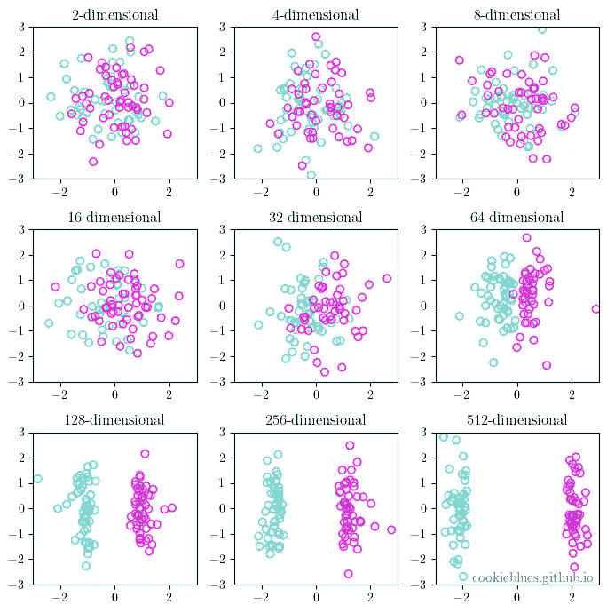
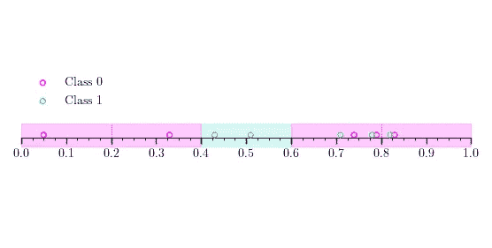
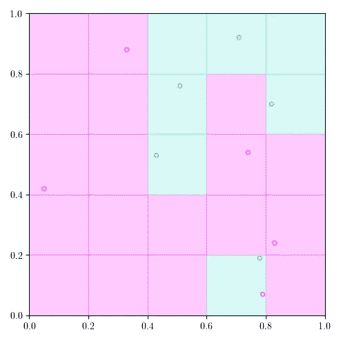
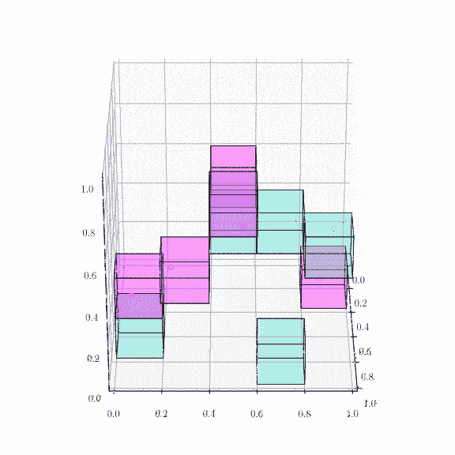

# 维度的诅咒

> 原文：<https://towardsdatascience.com/the-curse-of-dimensionality-5673118fe6d2?source=collection_archive---------26----------------------->

## 对维度诅咒的直观演示，以及我们可以做些什么来对抗它



随着数据维度的增加，特征空间变得更稀疏，数据更容易分离。简而言之，这就是维度的诅咒。

# 内容

这篇文章是我将要发表的一系列文章的一部分。你可以通过点击[这里](https://cookieblues.github.io/guides/2021/03/11/bsmalea-notes-1b/)在我的个人博客上阅读这篇文章的更详细版本。您可以在下面看到该系列的概述。

## 1.机器学习导论

*   [(一)什么是机器学习？](/what-is-machine-learning-91040db474f9)
*   [(b)机器学习中的模型选择](/model-selection-in-machine-learning-813fe2e63ec6)
*   **(c)维度的诅咒**
*   [(d)什么是贝叶斯推理？](/what-is-bayesian-inference-4eda9f9e20a6)

## 2.回归

*   [(a)线性回归的实际工作原理](/how-linear-regression-actually-works-theory-and-implementation-8d8dcae3222c)
*   [(b)如何使用基函数和正则化改进您的线性回归](/how-to-improve-your-linear-regression-with-basis-functions-and-regularization-8a6fcebdc11c)

## 3.分类

*   [(a)分类器概述](/overview-of-classifiers-d0a0d3eecfd1)
*   [(b)二次判别分析(QDA)](/quadratic-discriminant-analysis-ae55d8a8148a#204a-71584f33e137)
*   [(c)线性判别分析](/linear-discriminant-analysis-1894bbf04359)
*   [(d)(高斯)朴素贝叶斯](/gaussian-naive-bayes-4d2895d139a)

# 什么是维度的诅咒？

在[上一篇](/model-selection-in-machine-learning-813fe2e63ec6)中，我们讨论了，一个模型好意味着什么，以及如何确定哪个模型是最好的。**维度的诅咒**是这种决心的共同敌人，它甚至是我们训练数据中固有的！

为了理解维数灾难，我们将通过一个分类的例子。正如在本系列的第一篇文章中提到的，分类是一项监督学习任务，我们必须将我们的数据点组织成离散的类别，我们称之为类。

到目前为止，在这个系列中，我们一直在看只有一维输入变量 *x* 的多项式回归。然而，在大多数实际情况下，我们将不得不处理高维度的数据，例如，如果人类是我们的观察对象，他们可能有多个描述他们的值:身高、体重、年龄等。对于这个例子，我们有 10 个数据点，2 个类，每个数据点都是三维的。

```
import numpy as npX = np.array([
    [0.33, 0.88, 0.11],
    [0.74, 0.54, 0.62],
    [0.79, 0.07, 0.31],
    [0.83, 0.24, 0.47],
    [0.05, 0.42, 0.47],
    [0.82, 0.70, 0.10],
    [0.51, 0.76, 0.51],
    [0.71, 0.92, 0.59],
    [0.78, 0.19, 0.05],
    [0.43, 0.53, 0.53]
])
t = np.array([0, 0, 0, 0, 0, 1, 1, 1, 1, 1])
```

上面的代码片段显示了我们的训练数据集；`X`是我们的 10 个维数为 3 的输入变量(我们有 3 个特征)，而`t`是我们的目标变量，在这种情况下对应于 2 个类别。我们还可以看到，前 5 个数据点属于 0 类，后 5 个数据点属于 1 类；我们在各班之间平均分配。

如果我们只使用第一个特征(T2 的第一列)来绘制点，我们会得到下面的图。一种简单的对点进行分类的方法是将线分成 5 段(每段长度为 0.2)，然后决定将该段中的所有点分类为 0 类或 1 类。我也在我们将得到的分类之后给这些部分涂上了颜色。用这种天真的方法，我们犯了 3 个错误。



仅使用第一特征对点进行分类。

但是让我们看看我们是否能做得更好！使用前两个特征现在给了我们一个网格(0.2×0.2 块)，我们现在可以将它用于我们的简单分类模型。如下图所示，我们现在可以对这些点进行分类，这样我们只犯一个错误。



使用两个特征对点进行分类。

如果我们使用所有的 3 个特征，我们可以完美地分类所有的点，如下图所示。这是因为，我们现在有 0.2 乘 0.2 乘 0.2 的立方体。由此看来，使用所有 3 个特征似乎比只使用 1 个或 2 个更好，因为我们能够更好地对我们的数据点进行分类——但这就是反直觉的概念“维数灾难”的由来，并且**我告诉你，使用所有特征**并不是*更好。*



使用所有 3 个特征对点进行分类。

这个问题与我们的数据点相对于我们的分类部分的比例有关:对于 1 个特征，我们有 10 个点和 5 个部分，即 10/5=2 个点/部分，对于 2 个特征，我们有 10/(5×5)=0.4 个点/部分，对于 3 个特征，我们有 10/(5×5)= 0.08 个点/部分。

**随着我们添加更多的特征，特征空间中的可用数据点变得指数稀疏**，这使得分离数据点变得更加容易。然而，这并不是因为数据中的任何模式，事实上这只是高维空间的本质。事实上，我列出的数据点是从均匀分布中随机生成的，所以我们要拟合的“模式”实际上根本不存在——这是维度增加的结果，这使得可用的数据点变得更稀疏。

由于这种固有的稀疏性，当我们向数据中添加更多的特征时，我们最终会过度拟合，这意味着我们需要更多的数据来避免稀疏性——这就是维度的诅咒:**随着特征数量的增加，我们的数据变得更加稀疏，这导致过度拟合，因此我们需要更多的数据来避免它**。

下面的插图显示了这一点，但有 100 个不同维度的数据点。这些点是从越来越高的多元正态分布中随机采样的，并随机分配给一个类别。找到一个试图分离这些点的超平面。然后，我们将这些点投影到二维空间，看看它们被分离得有多好。随着点的维数增加，分离它们变得越来越容易。事实上，总是有可能用 *N* 维度完美地分离 *N* +1 点。


维数灾难的例证。

## 非一致性的祝福

那么我们如何避免被诅咒呢？幸运的是，非一致性的**祝福**【1】**来拯救我们了！在大多数实际(真实世界)场景中，我们的数据不是均匀分布的，而是集中在一些地方，这可以稍微消除维数灾难。**

**但是如果当我们过度适应时，这真的是维度的诅咒呢？没有一个确定的答案，因为它确实取决于数据集，但是有一个相关的[十分之一的经验法则](https://en.wikipedia.org/wiki/One_in_ten_rule)；对于每个模型参数(大致特征)，我们需要至少 10 个数据点。一些更好的选择属于**降维**的主题，我们将在本课程的后面部分讨论。**

# **摘要**

*   ****功能越多**，过度拟合的风险就越高**就是坚果壳中的维度诅咒。****
*   ****在大多数实际场景中，非一致性的祝福抵消了维数灾难。****
*   ******降维**可以成为补救维度诅咒的工具。****

# ****参考****

****[1] P. Domingos，“关于机器学习需要知道的一些有用的事情”，《美国计算机学会通讯》，第 55 卷，第 10 期，第 78–87 页，2012 年。****