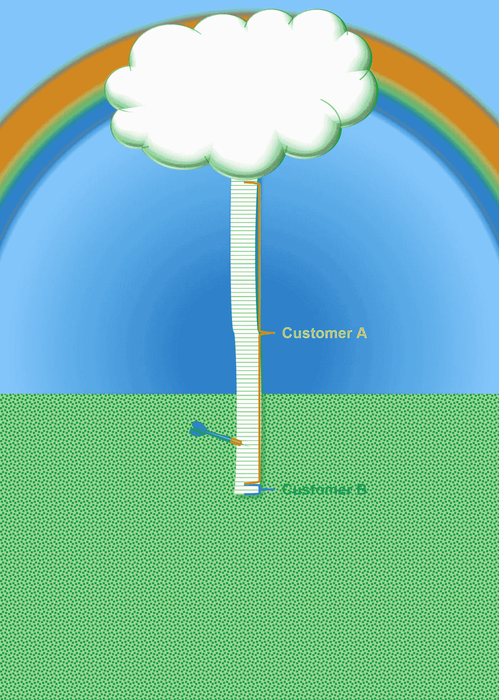
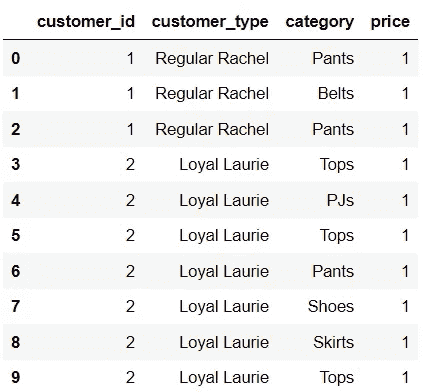
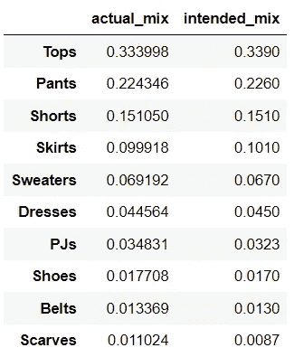
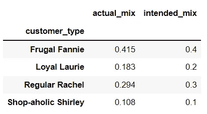
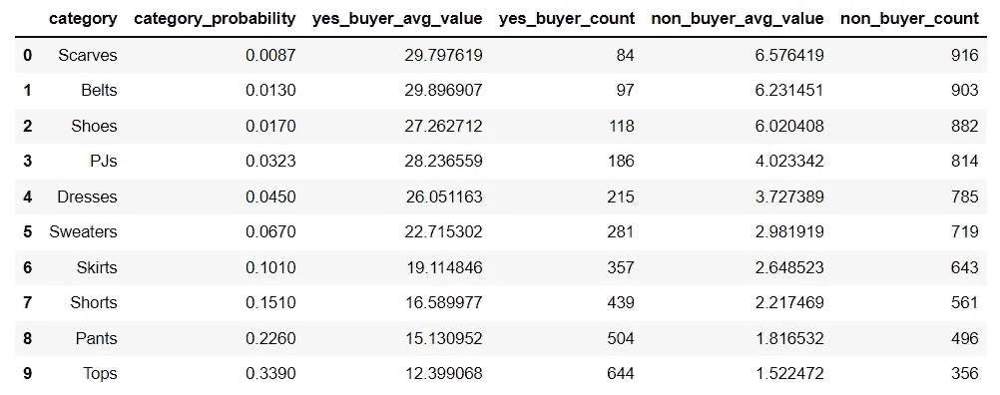
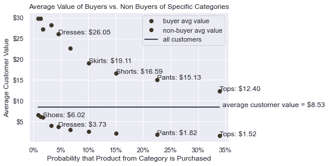
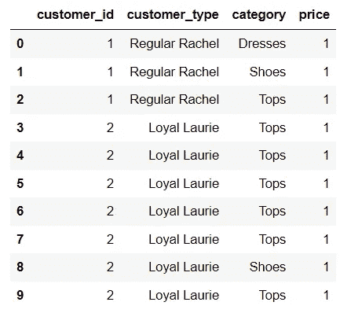
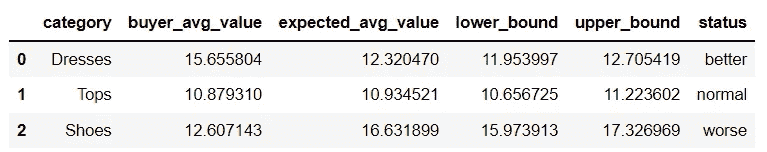
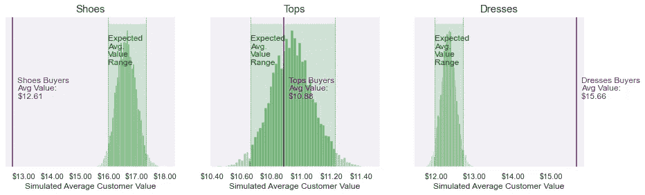

# 顾客价值悖论

> 原文：<https://towardsdatascience.com/the-customer-value-paradox-6d908612c2b4?source=collection_archive---------16----------------------->

## 对隐藏偏差(即统计偏差)的探索

[自由股票](https://unsplash.com/@freestocks?utm_source=medium&utm_medium=referral)在 [Unsplash](https://unsplash.com?utm_source=medium&utm_medium=referral) 上的照片

# **谎言、可恶的谎言和统计数据**

照片由[约翰·卡梅隆](https://unsplash.com/@john_cameron?utm_source=medium&utm_medium=referral)在 [Unsplash](https://unsplash.com?utm_source=medium&utm_medium=referral) 上拍摄

我们都知道，相关性不一定意味着因果关系。但有时，看起来非常强的相关性根本不是实际的相关性——它更多的是一种统计上的转移视线，可能导致错误的决策。

马克·吐温有句名言:

> 有三种谎言:谎言、该死的谎言和统计数字。

下面是一个真实的故事，在这个故事中，我几乎无意中说了一个伟大的统计谎言，试图分析客户价值。这个故事继续详细讲述了我是如何通过发现看似矛盾的相互关系、随后的智力斗争以及最终真相的揭示而识破谎言的。它包括对这一现象的所有直观解释，以及用于模拟的 Python 代码、表格和图表，以帮助您理解这一概念，并可能在您自己的工作中使用它。抓紧你的帽子。

# 背景故事

一家在美国各地都有商店的女装品牌的服装类别经理认为，购买服装(该品牌的一个相当小的类别)的顾客比普通顾客更有价值。她认为，通过提供更多种类的服装，并在广告、商店标牌和网站形象中更加关注服装，该品牌将吸引更多的高价值客户。然而，她需要证据来支持她的直觉，所以她问我，我们是否可以使用我们的交易数据来确定购买服装的顾客是否确实比其他顾客更有价值。

为了有效地分析数据，我们需要精确地定义我们的术语。我们将“顾客”定义为在给定年份从该品牌商店或网站购买至少一件商品的人。然后，我们将这些顾客分为两组:“服装购买者”，他们那一年的购买至少包括一件服装；以及“非服装购买者”，他们那一年的购买不包括任何服装。最后，我们将“客户价值”定义为该客户在那一年中花费的总金额。值得注意的是，服装购买者的顾客价值包括他们在所有商品上的花费——不仅仅是服装。

然后，我们比较了过去三年中每年购买礼服和不购买礼服的顾客的价值。我们看到，购买礼服的人平均花费*明显比不买礼服的人多*(同样，在**所有**商品上，不仅仅是礼服)。由于这些数据的专有性质和我记忆的限制，我不能报告具体的数字，但这些数字会说服最反服装设计师立刻放弃她的裤子图案。服装品类经理很兴奋地把这个消息告诉了经理们。她所在类别的顾客非常有价值！

我有一种挥之不去的感觉，有些事情不太对劲，所以我要求经理把这些发现看作是初步的，因为我还需要做更多的调查。我很惊讶买礼服的人比不买礼服的人花费更多，我想知道其他类别的买家和非买家分析会是什么样的，所以我也重复了其他类别的分析。

我试过买裤子的和不买裤子的，买毛衣的和不买毛衣的，买围巾的和不买围巾的，你明白了吧。对于每一个类别,“x 类买家”始终是比“非 x 类买家”好得多的顾客！显然有些不对劲，为什么每个类别的买家都比平均水平好？！

也许是因为我在比较专门**买了**东西的顾客和专门**没买**东西的顾客？虽然直觉上我看不出这有什么关系，因为根据定义，非 x 类买家至少购买了一件商品，但我决定再尝试一种方法。这一次，我比较了至少购买了类别 x 中的一件商品的客户和所有客户(包括那些购买的商品包含和不包含类别 x 中的商品的客户)。虽然这一分析缩小了年度支出的差异，但它仍然显示，每一个类别的买家都比真正的普通客户更有价值。

照片由 [Yogendra Singh](https://unsplash.com/@yogendras31?utm_source=medium&utm_medium=referral) 在 [Unsplash](https://unsplash.com?utm_source=medium&utm_medium=referral) 上拍摄

这怎么可能？这似乎很矛盾！我被弄糊涂了！所以我做了任何一个理智的人都会做的事，用头撞墙，直到我想明白为止。

最后，在一阵悸动的头痛、咖啡因引起的嗡嗡声，以及带着我不满意的发现去找服装部经理的迫在眉睫的羞愧中，困惑消失了，真相像可怕的暴风雨后美丽的彩虹一样以其晶莹剔透的光彩出现了。

# 直觉

如果你已经明白为什么我会得到上述结果，恭喜你！你是一个聪明的人，请随意跳过剩下的部分，去做一些聪明的事情。对于其他人，让我们想想数据集——因为在认真思考了很长时间之后，在我深入分析了数据集本身之后，我终于想到了答案。

作者插图

我们可以将数据集想象成一个巨大的收据(有点像美国某家连锁药店的收据，其名称由三个字母组成)，它列出了每一位顾客在一整年内在每一家商店购买的每一件商品。收据上的每一行都列有所购物品的类别、支付的价格和购买者。

想象一下，我们把这张收据挂在我前面提到的彩虹顶端的一朵蓬松的云上，向它扔一个飞镖(不瞄准)，然后读出离飞镖最近的那一行。您认为该行中列出的客户最有可能是这样的人:

*   超过平均水平？
*   低于平均水平？
*   平均水平左右？

作者插图

如果直觉上不能确定答案是“高于平均水平”，想象一下上面的相同场景，除了只有两个客户:客户 A 购买了收据上 99%的商品，客户 B 购买了收据上 1%的商品。从理论上讲，一个“普通顾客”会购买(99% + 1%)/2 = 50%的收据上的商品，但是这个顾客实际上并不存在，我的飞镖很可能会落在顾客 A 的某一行，一个高于普通顾客的顾客。这个概念适用于许多不同类型客户的不太极端的情况。每当随机选择一行(或被飞镖击中)时，它更有可能是属于有许多行的客户的行，而不是属于只有几行的客户的行。因此，您可以预期所选的系列将属于更好的客户。

如果我们投掷大量飞镖，取所有被击中的客户的平均值(有些客户可能有多行被击中，没关系，我们只数一次)，我们很可能会发现这个平均值大于没有被击中的客户的平均值(因为这些客户往往在收据上占用较少的空间)。

通过选择属于一个类别的物品(在我们的例子中是服装)，即使从顾客价值的角度来看，从那个类别购买是完全没有意义的，我们仍然期望那个类别的普通购买者比其他人有更高的顾客价值！我们需要回答的问题是，我们预计这些买家的价值会比平均水平高出多少？如果服装购买者的价值明显高于这一理论价值，那么我们可以得出结论，他们是更有价值的客户。

# 基于模拟的演示

如果您仍然不相信直觉，让我们用 Python 中一个有趣的小模拟来演示这一现象！如果您确信这些代码，或者只是对它们不感兴趣，请随意滚动到解决方案部分。

假设我们有 10 个产品类别，为了简单起见，让我们将每个类别中的每个产品定价为 1 美元。

现在让我们假设在所有可能的客户的大世界中存在四种类型的客户:

*   节俭的房利美:40%的顾客每年只购买一件商品
*   常规瑞秋:30%的顾客，一年购买三件商品
*   忠诚的劳里:20%的顾客，每年购买 10 件商品
*   购物狂雪莉:10%的顾客，一年购买 50 件商品

假设在这一年，我们有 1000 名客户。每个客户本质上都是从客户类型群体中随机抽取的。根据她的类型，她会购买 1、3、10 或 50 件商品，但与普通购物者的品味和偏好不同，这位模拟购物者会从我们无限庞大的 10 类商品库存中随机抽取一件商品:

*   第 1 类，围巾:占商品的 0.9%
*   第 2 类，腰带:1.3%的物品
*   第 3 类，鞋类:占商品的 2.0%
*   类别 4，PJs:项目的 3.0%
*   第 5 类，服装:占商品的 4.5%
*   第 6 类，毛衣:占商品的 6.7%
*   第 7 类，裙子:10.1%的项目
*   第 8 类，短裤:占 15.1%
*   第 9 类，裤子:占 22.6%
*   第 10 类，最高:33.9%的项目

为了构建我们的数据集，我们首先从潜在客户群中选择一位客户，并根据她的类型确定她将购买多少商品。然后，对于她购买的每一件商品，我们会从库存中随机选择一件商品，并将购买记录在我们的巨型收据上。我们对所有 1，000 名客户重复这一过程:

作者截图

好的，看起来不错，让我们检查一些东西。

首先，品类组合是否符合我们的预期？

作者截图

看起来差不多了，现在让我们看看客户类型组合是什么样子的。

作者截图

好的，这个看起来也不错。现在，我们来分析 10 个类别中每个类别的买家与非买家的平均客户价值:

作者截图

让我们在这个表格中指出两件事。首先，正如我们所料，每一类买家的平均花费总是大于非买家的平均花费。其次，随着类别概率的增加，平均买家支出和平均非买家支出似乎都呈下降趋势，即每组中的平均客户价值似乎与类别概率成反比。

让我们用图表来进一步研究:

作者使用 MatPlotLib 和 Seaborn 绘制的图形

请注意，随着从特定类别购买产品的可能性增加，该类别购买者的平均支出趋向于所有客户的平均支出。这在直觉上是有意义的，因为如果只有一种产品，那么购买该产品的概率将是 100%，并且其购买者的平均花费将与所有客户的平均花费完全相同，因为所有客户都将购买该商品。如果我们回到飞镖类比，随着我们投掷越来越多的飞镖，我们覆盖越来越多的收据，直到最终，每个客户都有一行被击中，因此被击中的客户是普通客户。

还要注意，随着类别概率的增加，非购买者的平均花费趋向于 1 美元(我们数据集中任何客户的最小花费)。这是因为购买一件商品的可能性越大，不买这件商品的顾客就越有可能是节俭的消费者，正如我们之前定义的，他们每人只买一件商品。假设我们还方便地将每件产品的价格设定为 1 美元，那么每一个节俭的房利美将正好花费 1 美元。因此，随着购买某种特定产品的可能性增加，节俭的房利美在非购买者中的流行程度增加，所有非购买者的平均支出接近 1 美元。

# 一个解决方案

我们证明了服装购买者的人均消费高于平均水平是意料之中的，任何类别的购买者都是如此。然而，问题仍然是，如果购买一件衣服与顾客价值不相关，那么我们应该期望普通的衣服购买者多花多少钱。如果服装购买者的实际顾客价值显著高于预期数字，我们会得出结论，服装购买者确实是更好的顾客，如果服装购买者的实际顾客价值显著低于预期，我们会得出结论，他们实际上是更差的顾客。然而，如果它相对接近预期的平均顾客价值，我们会简单地假设服装购买者只是普通顾客。换句话说，当我们选择客户子集时，我们如何纠正引入的偏差，以便进行比较？

不幸的是，没有封闭形式的数学公式(据我所知)来计算这个。然而，正如我们使用模拟演示了该现象一样，我们也可以用这种方式解决它。

让我们假设一年中卖出了 5000 件衣服。如果服装购买者是真正的普通顾客，那么我们会期望服装购买者的平均顾客价值大致相当于从我们的巨型收据中随机选择的 5000 行上列出的顾客的平均顾客价值，或者使用我们之前的类比，巨型收据上的行被 5000 次投掷击中。它不会完全一样——可能会有一些误差——但这个随机选择应该是一个很好的近似，因为。如果从顾客价值的角度来看，购买一件衣服毫无意义，我们可以认为它本质上是随机的。

不幸的是，这只能给我们一个参考点——我们不知道这是特别不寻常的 5000 次投掷还是典型的。我们可以做的是投掷这 5000 个飞镖，记录被击中的行的平均客户价值，移除飞镖，然后再做一次。如果我们重复这个过程很多很多次(比如说 10，000 次)，我们现在将得到一个非常正态(钟形)的平均客户价值分布。如果购买一件衣服是真正随机的，这些平均值的平均值将是一个非常好的和无偏见的估计。然后，我们可以用可量化的统计意义来确定实际的服装购买者到底有多有价值。到目前为止的例子，如果一件衣服购买者的平均价值大于 97.5 百分位，我们可以以大于 95%的信心说，如果购买一件衣服与平均顾客消费无关，就不太可能看到我们得到的结果。好吧，这是非常静态的语言——换句话说，他们可能是比平均水平更好的客户，我们对此有 95%的把握。

让我们像以前一样对此进行编码，只是这一次，我们只使用三个产品类别:腰带、上衣和连衣裙。让我们有目的地让服装更有可能被最好的顾客购买，让皮带更有可能被最差的顾客购买。

作者截图

现在让我们模拟一下分布情况(在收据练习中重复投掷飞镖):

作者截图

正如预期的那样，礼服买家的价值明显高于他们的预期价值，上衣买家的价值完全在他们的预期价值范围内，腰带买家的价值明显低于他们的预期价值。

让我们绘制模拟分布图，这样我们可以更清楚地看到这一点！

作者使用 Python 中的 Seaborn 和 Matplotlib 包绘制的图表

现在，我们可以清楚地看到，买皮带和买裙子的人的价值观离预期的范围有多远。虽然这并不能证明因果关系，即我们仍然不知道购买一件衣服是否会使顾客变得更好，或者只是更好的顾客倾向于喜欢衣服(实际上我们知道在这种情况下是后者，因为我们创建了模拟，但在现实生活中我们不会知道这一点)，但我们仍然拥有关于购买各种类别产品的顾客的价值的有价值的信息。例如，如果这家公司考虑停止一个类别，他们可能会更好地停止皮带比服装，因为疏远最好的客户的风险是最低的。

但是我们能确定因果关系吗？如果公司真的想知道是否有产品，当购买时，实际上导致客户成为一个更好的客户？想象一下，买一台视频游戏机，这会导致购买许多游戏和配件。或者在我们的服装案例中，想象一下这家公司出售的一种产品(比如一件衣服),它可以完美地搭配一条皮带、一双鞋子、一个耸肩头和一个手提包。我们如何用统计学来确定呢？

让我们在以后的文章中更全面地探讨这个问题。

又及:在现实生活中，购买服装的人确实成为了更有价值的顾客(尽管没有我在这里展示的模拟图那么极端)，服装品类经理从此过上了幸福的生活。

# 关于作者

嗨，我是丹尼尔。我是数据科学的学生、实践者和领导者。我特别着迷于数据科学如何帮助企业做出更好的决策和更有效地做事。我目前领导 Red Oak Sourcing 的数据科学团队，我已经在各种行业建立、领导了几个数据科学团队。如果你有兴趣与我建立职业联系，请点击这里查看我的 LinkedIn 个人资料:[https://www.linkedin.com/in/danielwiesenfeld/](https://www.linkedin.com/in/danielwiesenfeld/)，如果你想听听我偶尔发表的观点，请点击这里关注我的推特[https://twitter.com/DataDan5](https://twitter.com/DataDan5)。你也可以在 github 这里【https://github.com/dan-s-w找到我的公开回复和帖子。我希望你喜欢我的文章。