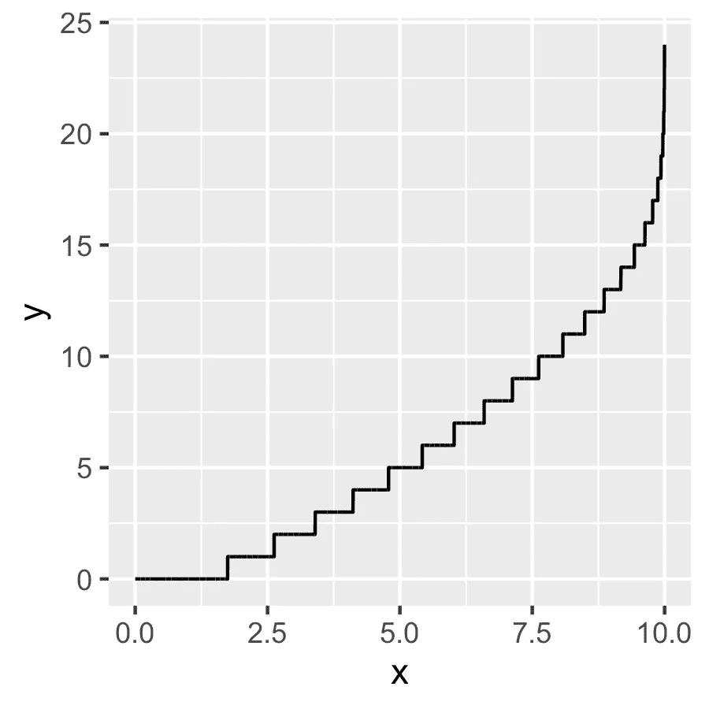

# 随机种子的危险

> 原文：<https://towardsdatascience.com/the-danger-of-random-seeds-fa1c728c1121?source=collection_archive---------31----------------------->

## R 中的一个案例研究，讲述了迂腐地使用随机种子会导致不想要的结果。


凯文·杰瑞特在 [Unsplash](https://unsplash.com/s/photos/danger?utm_source=unsplash&utm_medium=referral&utm_content=creditCopyText) 上拍摄的照片

手动设置[(伪)随机发生器](https://en.wikipedia.org/wiki/Random_number_generation)的种子是一把双刃剑:

*   这确实意味着运行相同的脚本将总是产生相同的结果，从而使**实验可重复**；
*   但是它也可能从随机性中带走比你想要的更多的东西，从而使**实验潜在地变得无用**。

以下是前阵子发生在我一个…咳咳…朋友身上的事。回想起来，这是一个非常明显的错误，但是我并没有经常看到这种情况，所以我很确定其他人也会遇到这种问题。

让我们看看我的朋友做错了什么，让他的例子成为所有人的警告标志！

# 这个计划

我的朋友想要实现的是:

*   生成 10k 个随机数，在 0 和 10 之间均匀分布，我们称此列为`x`；
*   做一些其他的事情；
*   生成另一组 10k 随机数，这次是从一个[泊松分布](https://en.wikipedia.org/wiki/Poisson_distribution)，λ=`x`，让我们称这个列为`y`。

他还希望能够引用结果并使它们可重复，所以他设置了一个随机种子。他用 R 语言编程的方式:

```
library(data.table)my_random_seed <- 123set.seed(my_random_seed)
tbl <- data.table(x = runif(10000) * 10)# ... other stuff ...set.seed(my_random_seed)
tbl[, y := rpois(10000, x)]
```

> 你能看出他做错了什么吗？

(如果可以的话，你几乎可以停止阅读，因为这将是全部。)

# 有什么不对劲的迹象

在找到朋友犯的错误之前，先来看看结果吧！

`tbl`本身看起来是这样的:

```
 x  y
    1: 2.875775  2
    2: 7.883051 10
    3: 4.089769  3
    4: 8.830174 12
    5: 9.404673 14
   ---            
 9996: 4.663523  4
 9997: 8.989519 13
 9998: 1.135348  0
 9999: 5.712259  6
10000: 9.005851 13
```

到目前为止没有什么可疑的，泊松分布的期望值是它的λ参数，所以我们期望`x`和`y`接近。

然而，如果我们按`x`分组调查结果，就会出现一个不太理想的画面:

```
tbl[,.(y_mean = mean(y), count = .N), 
    keyby = .(x_rounded = round(x, 1))]
```

退货:

```
 x_rounded   y_mean count
  1:       0.0  0.00000    52
  2:       0.1  0.00000   102
  3:       0.2  0.00000   107
  4:       0.3  0.00000   103
  5:       0.4  0.00000   102
 ---                         
 97:       9.6 15.16495    97
 98:       9.7 16.00000    90
 99:       9.8 16.74118    85
100:       9.9 17.96078   102
101:      10.0 20.36957    46
```

这可不好。例如，假设泊松分布的 102 个随机数的λ值约为 9.9，其平均值为 17.96。

总数也不匹配。每个泊松都有其各自λ的期望值，正如我们所知，对于独立变量，期望值相加，因此我们会期望`x`和`y`的和接近，但它们大约是 50k 和 57k。

好吧，再多一点来说明问题，策划`x`对`y`的攻击也表明有些事情显然是错误的:



拙劣的泊松生成(作者图片)

# 揭秘

而杀手是……(击鼓)……用同一个数字两次作为随机种子。

在引擎盖下，当我们要求`rpois`从一个特定的泊松分布中产生一个随机数时，它会从一个随机的均匀数开始，并使用反演技术找到相应的值。(至少对于小 lambda 来说是这样。否则，它似乎是使用一个正常的近似值，但我很肯定，这也归结为一个随机的统一数字。详情请看[源代码](https://github.com/SurajGupta/r-source/blob/master/src/nmath/rpois.c)。)

所以我们有一个随机的统一号，姑且称之为`w`。泊松生成然后将使用累积分布函数(CDF)找到整数`u`，其中`CDF(u-1) < w ≤ CDF(u)`，然后生成的数字将是`u`。(这里不要引用我的话，只是大概的想法。)

> 问题是，在我们的例子中，这个随机的均匀数将总是来自与泊松分布的λ相同的随机种子。

具体来说，λ将与随机统一数乘以 10 相同。(这就是我们最初生成数据的方式，得到一个 U(0，10)分布。)

# 重现问题

我们可以很容易地重现正在发生的事情。首先，生成 CDF 值(是的，有一个内置函数，但我认为从头开始做会很有趣):

```
tbl[,cdf0 := x^0 * exp(-x) / factorial(0)]
tbl[,cdf1 := cdf0 + x^1 * exp(-x) / factorial(1)]
tbl[,cdf2 := cdf1 + x^2 * exp(-x) / factorial(2)]
tbl[,cdf3 := cdf2 + x^3 * exp(-x) / factorial(3)]
...
```

然后我们使用这些来“生成”我们自己的“泊松”(观察我们如何使用`x/10`作为“随机”均匀数):

```
tbl[y2 := NULL]
tbl[x/10 <= cdf0, y2:=0]
tbl[x/10 > cdf0 & x/10 <= cdf1, y2:=1]
tbl[x/10 > cdf1 & x/10 <= cdf2, y2:=2]
tbl[x/10 > cdf2 & x/10 <= cdf3, y2:=3]
...
```

现在，如果我们检查`tbl`，我们将看到列`y`(最初的泊松生成)和`y2`(我们的重新计算)将匹配。

# 如何避免这种情况

我觉得意识到这种对随机种子的潜在滥用是成功的一半。然后，您可以在每个环境中只设置一次随机种子，使用不同的种子，或者干脆不使用它们。

这个话题的另一个有趣的角度来自[johndcook.com](https://www.johndcook.com/blog/2016/01/29/random-number-generator-seed-mistakes/)，作者警告在一个序列中使用太多的随机数作为种子，因为你会比你预期的更快地遇到重复的数字。这篇文章使用 16 位整数进行计算，而 [R 的随机数生成器](https://stat.ethz.ch/R-manual/R-devel/library/base/html/Random.html)使用 32 位整数作为默认值(至少这是我的理解)，但我认为这个建议仍然有效。

stats.statexchange.com[上有一些值得思考的东西，如果太多人使用相同的随机种子会发生什么(就像我朋友用 123)，如果人们一直选择相同的 4-5 个数字，会不会导致任何问题。可悲的是，讨论没有结论。我猜正确的解决方案是生成一个足够大范围的随机整数，并使用它作为种子，而不是通常的 123、1234、100、42 等。](https://stats.stackexchange.com/questions/205961/if-so-many-people-use-set-seed123-doesnt-that-affect-randomness-of-worlds-re)