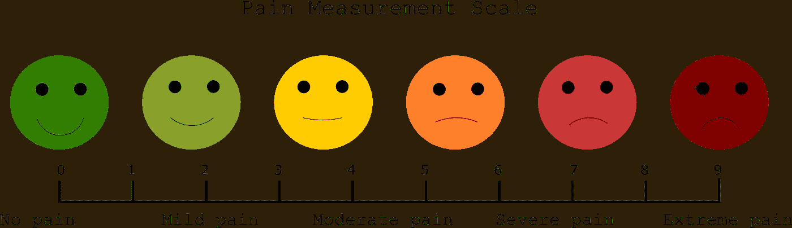

# 叙述的危险诱惑

> 原文：<https://towardsdatascience.com/the-dangerous-allure-of-the-narrative-bae44b38cfde?source=collection_archive---------35----------------------->

## [办公时间](https://towardsdatascience.com/tagged/office-hours)

## 对强有力的数据叙事的渴望是如何折磨你的。

照片由[达留什·桑科夫斯基](https://unsplash.com/@dariuszsankowski?utm_source=medium&utm_medium=referral)在 [Unsplash](https://unsplash.com?utm_source=medium&utm_medium=referral) 上拍摄

在数据科学或任何其他严重依赖于与其他方分享结果的定量学科中，你会经常听到这样的话:当你进行分析时，它应该向你的观众讲述一个故事。像[福布斯](https://www.forbes.com/sites/brentdykes/2020/01/22/why-data-storytellers-will-define-the-next-decade-of-data/?sh=6a8f408524fb)、[哈佛商业出版](https://www.harvardbusiness.org/what-makes-storytelling-so-effective-for-learning/)和 [Tableau](https://www.tableau.com/about/blog/2020/8/importance-data-storytelling-next-decade-data) 这样的文章已经讨论了讲故事在商业和/或数据分析中的重要性，并且被他们的导师传达给无数新面孔的分析师、研究助理和初级数据科学家。所有这一切都是有充分理由的——众所周知，以故事形式呈现的信息比仅仅分享原始数据更容易记忆，并与更广泛的学习风格产生共鸣。

在个人层面上，在分享发现时，展示可靠的故事和对叙事的强大控制的有效性以前在很大程度上拯救了我的培根——当我花了几个月时间对诗歌行进行分类的卷积神经网络得出 29%的测试准确率，而不是我希望的 70%或 80%时，它拯救了我的本科荣誉论文。这种拯救究竟是如何完成的，这是另一个故事，我很乐意分享，但我认为在赞美数据科学中讲故事的优点之前，首先探索它的陷阱是重要的，因为正如它在一种情况下拯救了我，在另一种情况下它几乎是我的毁灭。

你看，好故事的诱惑是一把双刃剑。如果使用得当，它可以发挥很大的作用，使你的分析更有力，更容易理解，更流畅，看起来更准确。然而，它也可能像一匹突然脱缰的马，疯狂地把你带向一个不是你选择的方向，让你不确定自己的方向。为了更具体地说明这一点，我给你提供了以下轶事——不，这是一个 21 世纪对有抱负的数据科学家的寓言。

在获得学士学位前不久，我和两个朋友参加了美国统计协会(American Statistical Association)举办的数据科学黑客马拉松(data science hackathon ),他们在周五晚上提供了一个来自行业合作伙伴的数据集，我们必须在周日早上之前准备一份分析，该分析必须限于两张幻灯片，时间不超过五分钟。我们与大约十几个其他团队在各种类别中竞争，例如最佳展示、最佳外部数据使用、最佳可视化和最佳商业洞察力，我们获得的数据包括加拿大国家女子橄榄球队的各种健康、生物测定和 GPS 数据。

在数据集公布后，我的团队共同决定在我们深入研究之前仔细考虑现有的信息，并在上面睡一觉。当我们第二天早上神采奕奕地出现时，我们立即坐下来制定了一个策略。首先，我们决定将重点放在健康数据上，因为它比 GPS 数据更简单、更清晰。我们还选择了直截了当的分析，而不是尝试任何过于花哨的东西，因为我们是在计时器上，认为一个不那么雄心勃勃，但更精致的分析会给评委留下更好的印象。最后，我们决心至少赢得外部数据最佳使用奖，因此我们为此分配了相当多的时间，因为我们已经知道分析本身不会过于复杂。

健康数据中包含一个列，指示给定球员在给定日期是否报告了受伤，我们将此作为一个感兴趣的变量，因为球员受伤可能会对他们效力的组织产生非常严重的财务影响。自然地，像任何面临二元结果变量的数据科学家一样，我们的第一直觉是在我们的分析中采用某种形式的逻辑回归。我们决定进行回归，将球员受伤作为因变量，所有其他健康指标作为自变量，计算比值比，并查看哪些指标可能被用作受伤的可靠预测指标，或许可以作为教练的一种早期预警系统。

到目前为止一切顺利——我们建立了模型，其中一个变量成为受伤的最强预测因素。这个变量被称为“疼痛程度”，由运动员每天自我报告，范围从 0 到 10。我们很高兴有这样的结果，但如果我们想在比赛中取得好成绩，这本身是不够的——毕竟，疼痛与受伤有某种关联并不奇怪。到目前为止，我们已经确定了我们想要使用的外部数据源，这是一个按照最强到最弱对运动队进行排序的排名图表，因此我们决定采用我们模型的结果，并将其作为在即将到来的比赛中对疼痛程度(我们最重要的受伤预测指标)和对手实力之间的关系进行一些探索性数据分析的理由。

一个简单的双变量散点图揭示了一个令人惊讶的发现——大部分报道的疼痛程度整齐地分为两类。如果即将到来的对手排名高于团队，报告的疼痛值通常会在量表的下半部分。相比之下，如果排名认为对手比团队弱，疼痛值将在很大程度上处于量表的上半部分。起初，我们觉得奇怪的是，在他们的球队处于劣势的比赛中，球员会不那么痛苦，但经过一些讨论后，我们设法找到了一个潜在的解释。我们的结论是，运动员知道他们将面对一个强大的对手，不想让球队失望，因此低估了自己的疼痛，以确保在比赛当天，他们仍将在球队的比赛计划中扮演重要角色。反过来，这种对报告疼痛的放任态度导致了更高的伤害发生率。这就是我们周日早上要拿出来讨论的观点。

在这次活动中，有几位导师，其中一些是法官，另一些只是感兴趣的观察员，他们自愿四处走动，与小组讨论他们的分析，并在一个小组似乎陷入困境时提供一些温和的推动。整整一天，我们和许多不同的导师一起进行了几次我们的推销演习，解释了我们的发现和我们认为它们意味着什么，每次我们都充满了热情和兴趣。这种积极的反馈循环使我们的信心膨胀，我们得意洋洋——我们挖掘了数据，从中得出了一个很好的故事来告诉评委。

那么问题出在哪里呢？

问题在于我们对“疼痛程度”变量的解释，以及它被定义的违反直觉的方式。你看，当你看到一个名为“酸痛程度”的变量，从 0 到 10 分不等，直观的解释方式(至少对我和我的队友来说是直观的)是，数值越高，运动员声称越酸痛。也就是说，你自然会认为这些数字的含义与你在医院和诊所看到的疼痛图表上的含义相似，看起来像这样:

作者创建的图像。

然而，自我报告的健康指标及其精确定义不是由数据科学家、统计学家、分析师或任何其他认识到这一点的数据专业人员确定的。相反，它们是由教练组创建的，他们希望能够将运动员报告的每一项健康指标汇总成一个总和，并希望总数越高，运动员感觉越好。因此，虽然像激励程度或信心程度这样的指标被解释为这些质量随着值的增加而增加，但疼痛程度却相反:相反，0 值意味着运动员非常疼痛，而 10 值意味着他们一点也不疼痛。换句话说，我们已经把分析的解释和我们感兴趣的主要变量的方向性放在了一起，并准备在第二天早上展示这个解释。

我们怎么会犯这样一个愚蠢的错误，并且进行了完整的分析却没有发现它呢？就我个人而言，我认为有三个因素造成了这个错误。

1.  首先，很难说变量本身不是以令人困惑的方式构建和呈现的。这个变量的正确解释不仅与常识相矛盾，而且与其他所有健康变量的解释也不同。这不是借口，因为仔细检查他们对数据的假设以避免这种错误仍然是数据科学家的责任，但这确实使这种错误更有可能发生——在我们向六七位导师介绍我们的研究结果时，没有一个人质疑我们对变量的最初解释。
2.  第二，我们时间紧迫，行动迅速。因此，我们没有在更宽松的环境中工作得那么认真。
3.  最后，也是最重要的一点，我们完全沉浸在我们围绕结果构建的叙述中，并被我们收到的关于该叙述的极其积极的反馈所陶醉。

当我说强有力的叙述的诱惑是一把双刃剑时，我的意思应该很清楚了。一个好的故事会让你的结果更有说服力，但也会让你更容易说服自己相信一个不正确或无效的结果是正确的。更糟糕的是，它让你更容易欺骗他人，即使是在不知情的情况下，虽然这种情况发生在轻松的黑客马拉松中是一回事，但发生在现实世界中的分析中则完全是另一回事。在商业和工业领域，你面对的观众很大程度上和其他人一样容易被一个好故事所影响，正如我们所看到的，你不能指望中间人帮你发现错误。我们不正确的分析顺利地通过了六个或更多的导师，这意味着如果你在工作中，一个好故事中的错误可能会越过你的主管，他们的主管，等等，一直到高管，如果最终发现你有一个反向变量，他不会感到好笑。对你工作的责任止于你，止于你。

最终，我们恢复了理智，通过数据字典进行了检查，发现了错误，并在周六晚上的最后一刻成功地调整了我们的材料，以呈现一个远没有那么有趣，但可能更正确的故事:运动员最有可能在与强劲对手比赛前的几天过度训练，消耗身体，使自己疼痛，因此受伤的风险更高。这个项目很受欢迎，虽然我们没有达到最佳表现，但我们获得了团队排名外部数据的最佳使用奖。结局好就一切都好。我们都对结果感到高兴，更重要的是，我学到了宝贵的一课，即在相对低风险的环境中，一个好故事的潜在风险。

说到底，在数据科学中讲故事*是*有价值的，并且在呈现结果时应该继续被强调，但是请记住:如果一个好的故事是基于糟糕的工作，那么它是没有意义的。当扮演分析师的角色时，你的工作是对数据提供的见解保持客观，不要被叙述带走(不管它看起来多么令人信服或“性感”)，直到分析完成、尘埃落定并得到充分验证。在你一丝不苟、兢兢业业地完成工作，并尽职尽责地遵循坚如磐石的数据科学原则之后，你就可以放松了。当你*确定*的时候，尽情享受展示结果的乐趣:讲一个非常好的故事，尽可能让它引人注目、激动人心、有趣。让它变得伟大——但首先，让它变得正确。