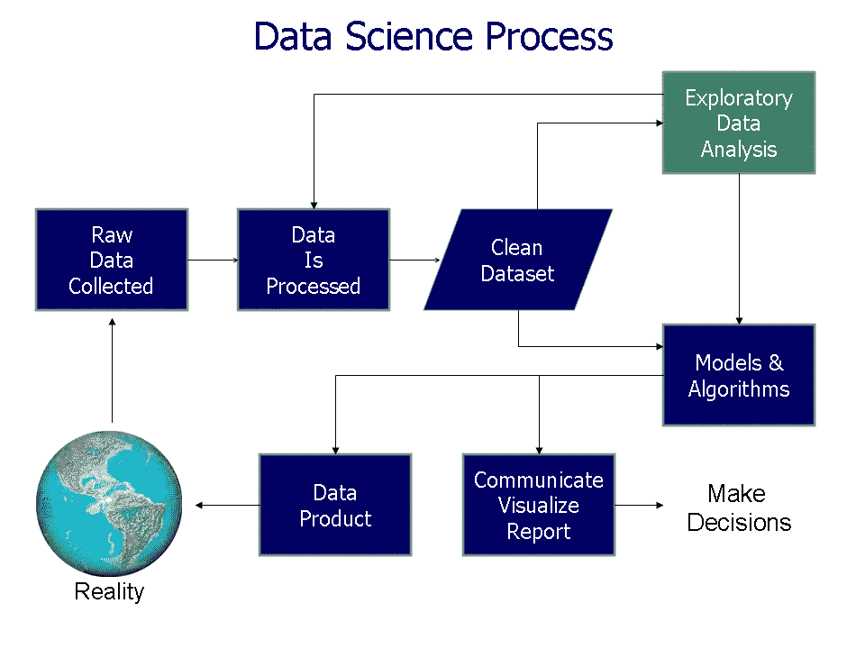

# 流行的数据分析范式的问题是

> 原文：<https://towardsdatascience.com/the-dark-side-of-data-science-30b554bcf946?source=collection_archive---------36----------------------->

作者:[法卡斯特](https://en.wikipedia.org/wiki/User:Farcaster)在[英文维基百科](https://en.wikipedia.org/wiki/) ( [维基共享](https://commons.wikimedia.org/wiki/File:Data_visualization_process_v1.png#globalusage))

## 流行的数据分析范式植根于逻辑实证主义哲学。不主要处理数据的机构需要更灵活的方法。

流行的数据分析范式深深埋藏在一个叫做逻辑实证主义的哲学学派的贫瘠土壤中。该框架的特点是源自实证主义的三个神秘信条

*   数据是所有分析的唯一自然出发点
*   我们通过公正地收集数据来确保模型的客观性
*   数据“说话”。也就是说，它们在模型的构建中引导我们的思维。

正如我在我的文章“[建模的神话:数据说话](/myths-of-modelling-data-speak-358805890baa)”中所讨论的，实证主义——以及与之相关的，其神话般的信仰——在 20 世纪 60 年代已经被彻底质疑。不幸的是，就像思想史上经常发生的情况一样，反革命得过且过。早期的革命者会放松狭隘的经验主义的枷锁，并在假说和启发并规范它们的数据之间展开更开明的对话，而下一代人会把经验主义一起扔出去。在随之而来的常识真空中，从业者别无选择，只能爬回沉浸在实证主义中的框架。

因此，今天维基百科关于数据分析的页面以以下对狭义归纳主义的敬意开始:

> 数据分析是对数据进行检查、清理、转换和建模的过程，目标是发现有用的信息、**提供结论**，以及**支持决策**。

并在页面顶部提供了实证主义代表的明珠，完成了从数据分析到模型(而不是其他方式)的箭头和一个称为“原始”数据的活动，最大限度地远离理论。

# 实证主义数据范式的问题

数据科学做得很好，尽管它的认识论基础令人怀疑，但它的许多最大成功发生在主要处理数据的公司:通过交易创造数据的公司，将他们偶然或设计产生的数据货币化的公司；简而言之，公司通过他们的数据寻找和积累分析。

但随着“数字化转型”的加速，主要不处理数据的机构正越来越多地依靠数据来解释他们所处的世界，并解决他们面临的业务和政策问题。他们在分析的驱动下寻找并积累数据。

在这里，数据科学的成功可能是它的毁灭，因为当问题去寻找数据时，已经如此成功地应用于数据寻找分析的范式在实证主义的认识论和沙堆上搁浅了。

在下文中，我假设我们处于后一种情况，我们分析数据是为了一个特定的目的，解决手边的问题，“提供结论”或“支持决策”

## 数据是不公正的

数据的选择必然假设相关性，而相关性意味着对将数据与手头问题联系起来的叙述的某种程度的承诺。数据的处理和清理也有同样的必要性；如果没有对数据的重要性以及它们如何与手头的问题相关的一些相关性或期望的概念，你就无法知道什么是信号，什么是噪声。没有猜想就没有数据。

## 数据不一定足够

在选择数据时，我们不仅被自己经过审查的猜想默默地引导着，如果我们试图压制解释性的概念或框架，我们就没有办法知道我们收集的数据是否是那些与理解或解决手头问题最相关的数据。我们没有机制来激发对进一步数据的搜索，以提供确认、反驳或进一步的见解。

## 数据不是分析的唯一自然起点

为了分析现象以形成结论或提供解释，潜在的解释是一个有效的起点。对于决策来说，你试图实现的目标和你试图实现这些目标的决策杠杆是自然的起点。

## 数据不会说话，更不会解释

无论是实证主义者还是他们的数据分析辩护者都无法给出一个客观、透明的过程，更不用说一个演绎过程，通过数据的积累产生一个解释性的理论或假设。数据不会说话。如果不借助于一些理论背景，我们甚至无法解释数据。

# 但是客观性呢？

对公正数据的渴望源于对明智选择和扭曲数据的恐惧，这种选择和扭曲是为了服务于一种宠物理论或一个隐藏的议程。这是卡尔·波普

> …如果我们不加批判，我们总会找到我们想要的:我们会寻找，并找到证实，我们会远离，而不是看到，任何可能对我们钟爱的理论有危险的东西。用这种方法，很容易就能获得压倒性的证据来支持一种理论…

但是理论化在数据的发现、选择和呈现中是必不可少的。波普尔的解决方案是通过创造多种解释性理论来确保客观性，然后将客观性的审查转移到一个对抗性的舞台上，在这个舞台上，我们裁决这些猜测之间的关键竞争。

> 知识进步的方式，尤其是我们的科学知识，是通过不合理的(和不合理的)预期，猜测，对我们的问题的尝试性解决方案，推测。这些猜想被批判所控制…

抛弃数据“说话”的概念，解放我们去创造性地推测，把假设放回它正确的位置，与数据对话，而不是屈从于它。数据激发多种猜想，区分假说的尝试引导我们选择数据，并激发新数据的搜索和发现。这些反过来又在批判性话语的熔炉中考验我们推测的勇气。假设被提炼、拒绝、确认；它们合并和分裂并产生新的假设，这反过来又激发了额外数据的发现等等。