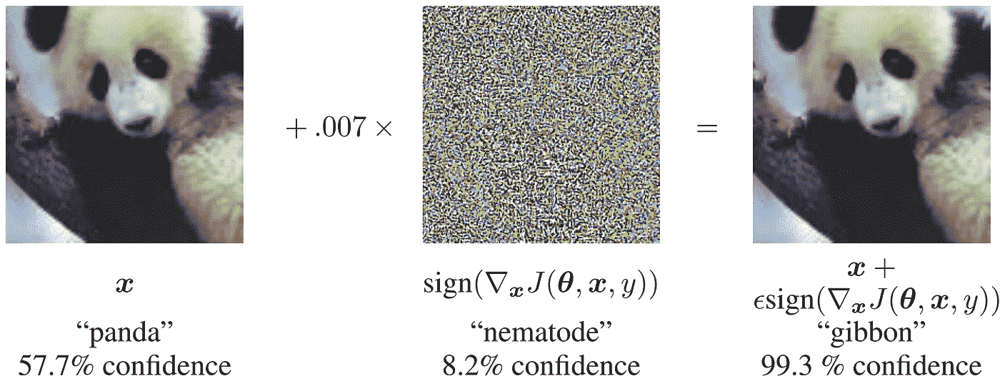
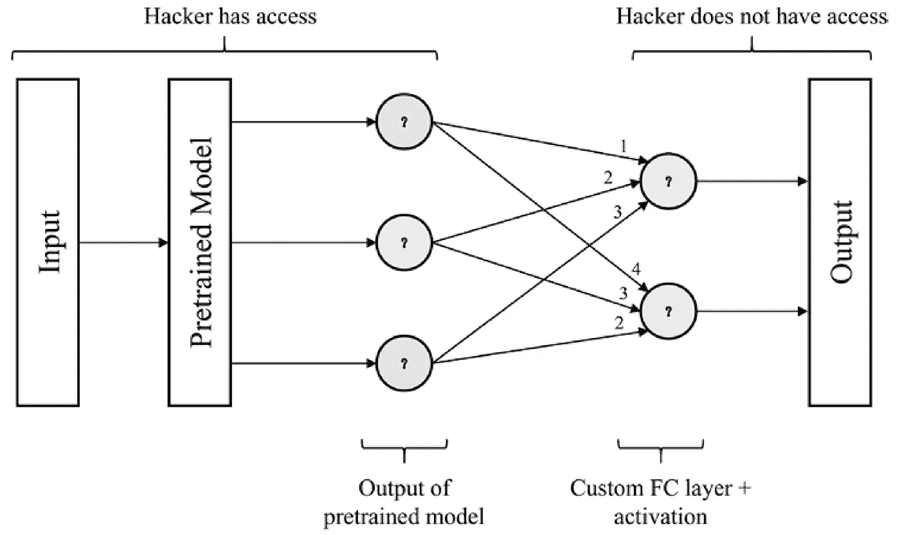
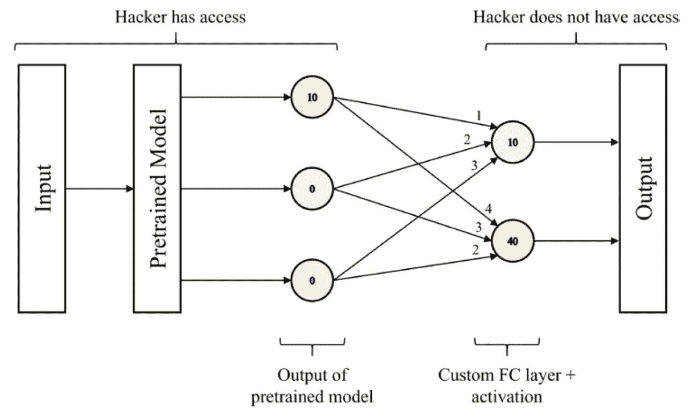
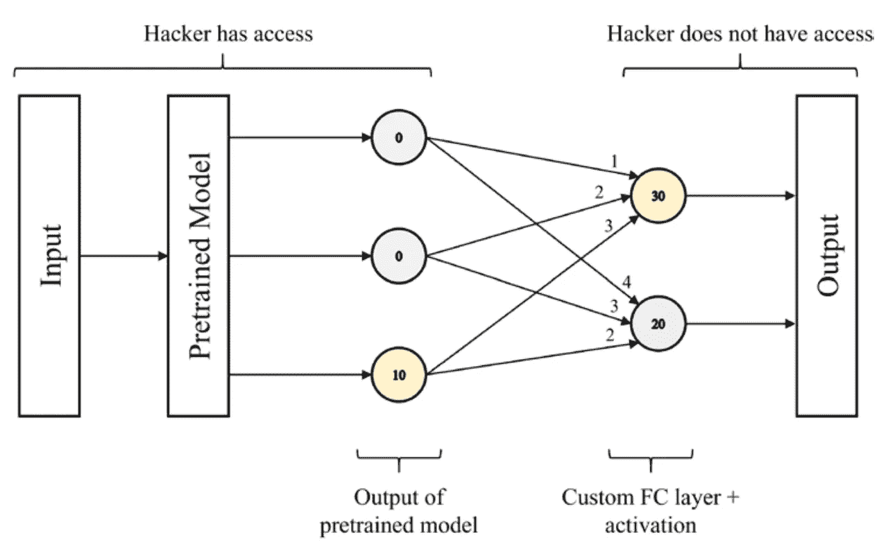
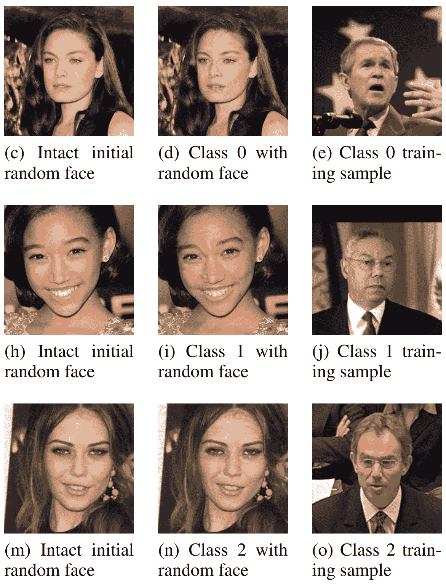

# 迁移学习的阴暗面

> 原文：<https://towardsdatascience.com/the-dark-side-of-transfer-learning-b752102b4c09?source=collection_archive---------18----------------------->

[去飞溅](https://unsplash.com/photos/6C1LwWx40hs)

## 使用基本/基础模型进行预训练时的安全漏洞

迁移学习始于图像识别的金童，并迅速成为深度学习的既定支柱——这是有充分理由的。基础模型允许新一波非常容易访问和有效的深度学习应用。

虽然强大得令人难以置信，但人们应该永远记住已被证明适用于各种体制的通用建模原则:永远没有免费的午餐！绩效的捷径和进步几乎总是与外部性联系在一起。

就迁移学习而言，有一个外部性:安全性。已经证明，恶意黑客可以通过利用公开可用的基础模型，有效地破坏任何利用迁移学习*的深度学习模型，即使他们无法访问它*。

随着深度学习模型越来越多地被部署在重要的决策应用中，它们像任何其他全球技术一样，成为劫持和腐败的对象。*对抗性学习*是对深度学习模型的知识表示结构如何被利用来产生恶意输出的研究的名称。

这里有一个(著名的)具体例子:GoogLeNet 模型正确地给一张熊猫图片分配了一个合理的高概率标签。然而，当一个非常小的、视觉上察觉不到的噪声矩阵(一个*扰动*)叠加在原始图像上时，GoogLeNet 错误地将修改后的图像标记为一个具有异常高可信度的“长臂猿”。

摘自 Goodfellow 等人著[“解释和利用对立的例子”](https://arxiv.org/pdf/1412.6572.pdf)

研究人员还发现了更多的恶意攻击，例如通过在限速标志上粘贴一条两英寸宽的黑色胶带，并打印一个 3d 玩具乌龟，其纹理旨在使谷歌的物体检测系统将其归类为步枪，从而欺骗无人驾驶汽车加速超过限速 50 英里/小时。已经发表了大量关于在大范围的基准深度学习中预测漏洞的文献。

如果深度学习中一些最关键的基准模型被证明容易受到敌对攻击，我们应该问问自己，从这些易受攻击的基准模型中微调的迁移学习模型的安全影响。

在“对深度模型的目标不可知攻击:利用迁移学习的安全漏洞”中，加州大学戴维斯分校的沙赫巴兹·雷扎伊和刘鑫演示了在只知道所用基础模型的情况下，使用迁移学习对深度学习模型的攻击。黑客不需要知道应用程序模型的权重集或体系结构，也不需要知道它被重新训练的数据；攻击因此被认为是*目标不可知*。这种攻击可以利用公开可用的预训练模型来利用广泛部署的深度学习模型。

考虑下面这个简单的例子，一个利用迁移学习的模型。模型的输入通过预训练的模型传递，预训练的模型的输出(在这种情况下，是三维向量)通过自定义的、新添加的完全连接的层传递，产生二维向量输出。

由作者创建。

黑客只能访问预训练模型，因为假设它是公共的，但不能访问自定义 FC 层和处理预训练模型输出的任何操作。(如果黑客不知道*定制模型中使用了哪个*公开可用的预训练模型，那么用与问题相关的几个基础模型中的每一个来重复攻击是微不足道的。)

假设黑客想要构建一个输入来触发一个特定的输出神经元，就像上面例子中自定义 FC 层的底层神经元一样。黑客可以构建一个输入，使得预训练模型的顶部神经元输出是某个非常大的数(例如，10)，而所有其他输出神经元都是 0。当乘以相应的权重时，完整模型的输出产生:

*   `10 * 4 + 0 * 3 + 0 * 2 = 40`
*   `10 * 1 + 0 * 2 + 0 * 3 = 10`

由作者创建。

softmax 激活功能放大了这种差异。完整模型的底部输出神经元是黑客所期望的模型的最终决策，因为它具有最大的关联值/概率。

另一方面，如果黑客想要激活完整模型的顶部*输出神经元，他们将设计一个输入，使得预训练模型的输出神经元除了底部的一个之外都是零，这将是一个任意大的数字。*

由作者创建。

已经确定，在这个简单的迁移学习示例中，黑客理论上可以设计一个输入来产生某个预训练的模型输出，该模型输出控制完整定制模型的期望输出。然而，在这些示例中，我们基于预训练模型外部的模型权重，推断出要“激活”预训练模型的哪个输出神经元(即，设置为非常大的数字，并将所有其他节点减少到零)。

我们需要一种方法将预训练模型输出中某个节点的“激活”与完整定制模型输出中某个节点的“激活”关联起来。一个简单的强力搜索就足够了，黑客的目标是构建一个输入，使得预训练模式的输出首先是`[*a*, 0, ..., 0, 0]`，然后是`[0, a, ..., 0, 0]`，以此类推，每次都记录完整的定制模型的输出。

应该注意的是，为了使这种策略能够激活完整定制模型的每个输出节点，以下(必须是冗长的)条件:*对于完整模型的每个输出节点，必须存在从预训练模型的输出节点的连接，其权重大于从该预训练模型的输出模型到完整模型中任何其他输出节点的连接*。如果这个条件不成立，那么无论输入是什么，完整模型的一些输出节点都不会被激活。在大多数深度学习问题中，特别是在唯一类数量较少的情况下，这个条件是满足的。

攻击现在已经归结为*找到预训练模型的输入，这将导致特定的预训练模型输出*。这是一个很好定义和探索的问题。值得注意的是，超现实的图像(艺术？)可以使用[深度梦方法](https://deepdreamgenerator.com/)从神经网络中产生，其中目标是产生最大化某个选定层的激活的输出。

保持预训练模型权重不变，黑客可以使用梯度下降来改变输入中的每个特征，使得对应的预训练模型输出和期望的预训练模型输出之间的差异最小化。

这个简单的攻击出奇的有效。考虑下面的例子，其中左栏包含随机的初始未改变的面部，中间栏包含具有相关类的对立例子(即改变的面部)，而右栏包含来自该类的真实例子。在第一行中，我们看到，我们可以欺骗 VGG 训练的面部识别模型，认为任何人的图像都是乔治·布什，只有轻微可见但似乎无关紧要的变化。

来源:[热扎伊和刘](https://arxiv.org/pdf/1904.04334.pdf)。

虽然这种攻击只在简单的迁移学习模型中持续成功，但它暴露了更复杂应用程序中的潜在漏洞，并为共享/迁移权重表示和敌对利用的进一步研究铺平了道路。

点击阅读完整论文[。](https://arxiv.org/pdf/1904.04334.pdf)

最近，人工智能领域的领导者们围绕所谓的“基础模型”展开了一场广为人知的辩论。这个术语是在斯坦福大学的一项研究中创造的，是计算机科学家、社会学家和哲学家之间的合作成果，指的是 BERT、T5、CLIP 和 Inception 等模型。这些都是代表各自领域主要成就的基础模型，无论是语言建模、图像识别还是其他前沿领域。特定的应用程序建立在这些基础模型之上，以便在更短的时间内获得更好的性能。

虽然基本模型或多或少是现代人工智能系统的基础，但人们对它们的可靠性有许多担忧。自从 GPT-3 在 2020 年高调发布以来，许多研究都认为它没有展示出对语言的“真正”或“真实”理解。其他基金会模式也存在类似的问题。

每一个实例中出现的问题都是这样的:如果基础模型本身不稳定，那么构建在它之上的部署模型有多稳定？

演示的对抗性攻击为迁移学习在稳定性/安全性和可访问性之间的权衡增加了额外的考虑因素。

感谢您的阅读，请在回复中告诉我您的想法！

如果你对最新的文章感兴趣，可以考虑[订阅](https://andre-ye.medium.com/subscribe)。如果你想支持我的写作，通过我的[推荐链接](https://andre-ye.medium.com/membership)加入 Medium 是一个很好的方式。干杯！