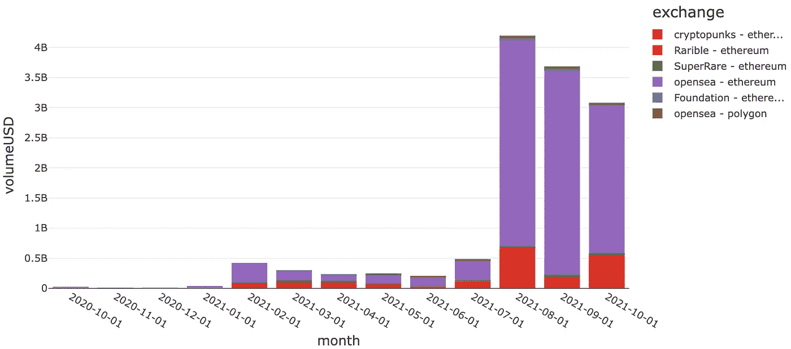
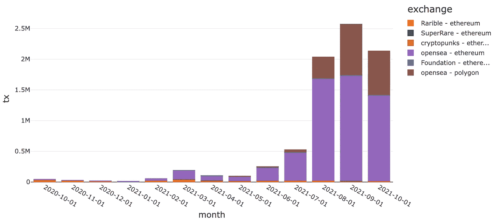
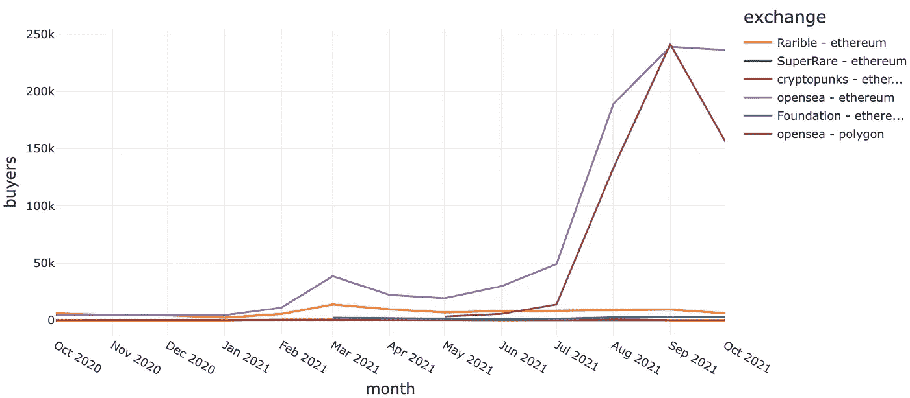
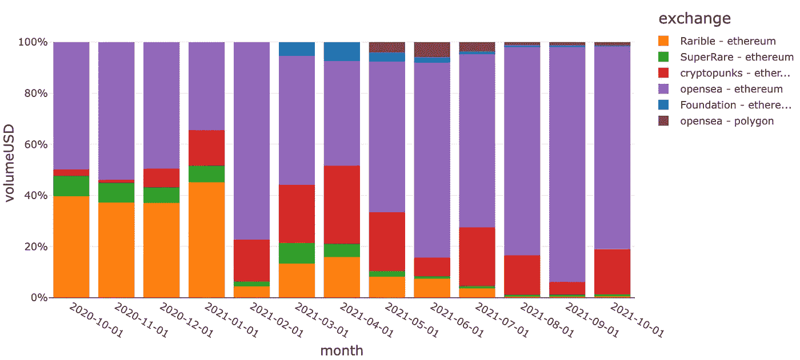
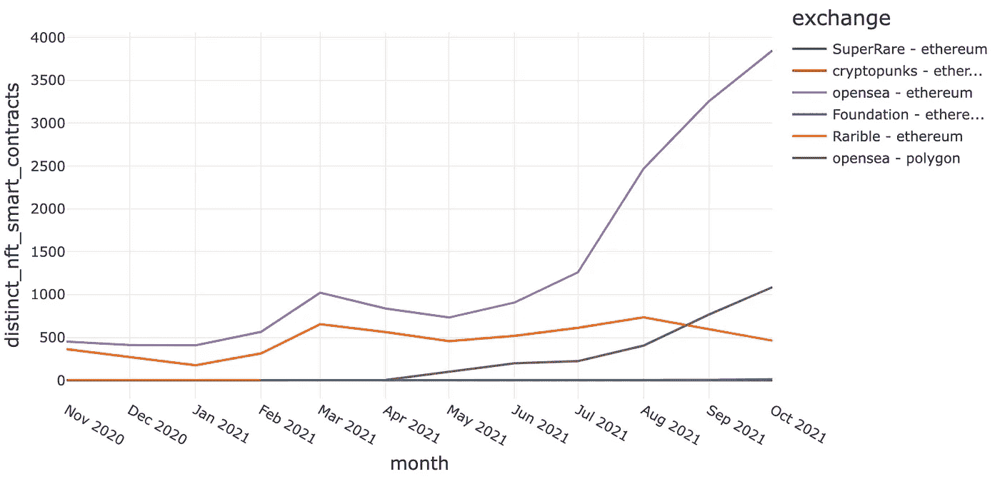
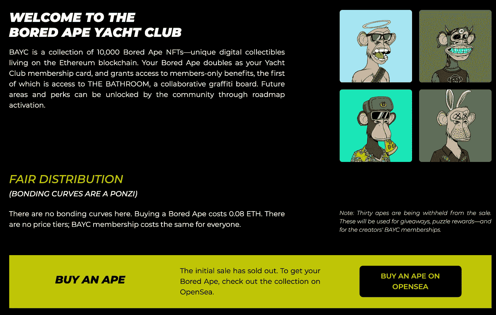
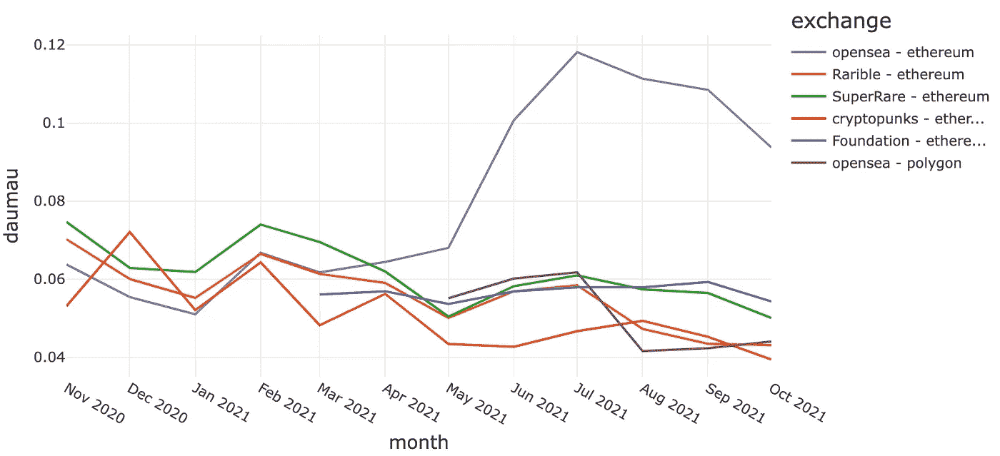
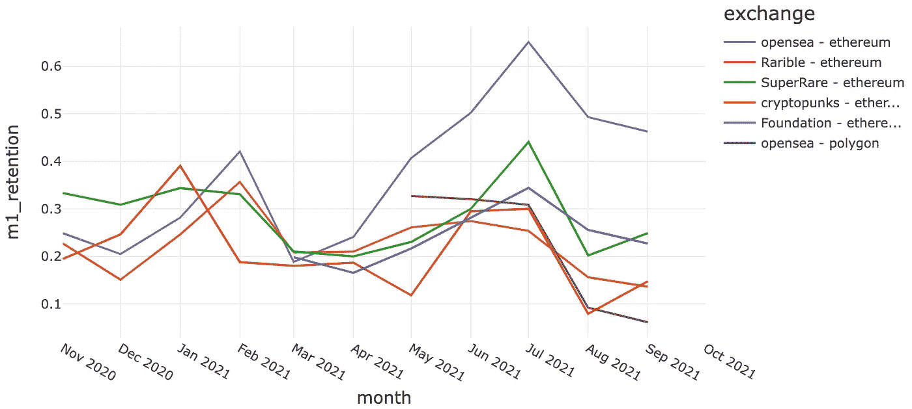
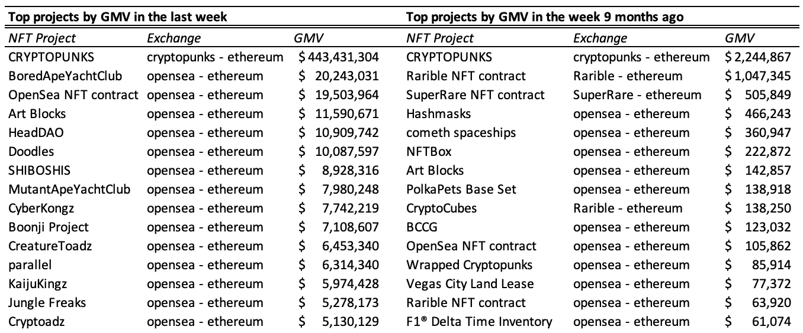

# NFT 炒作背后的数据

> 原文：<https://towardsdatascience.com/the-data-behind-the-nft-hype-32f6f92c27cb?source=collection_archive---------8----------------------->

## 加密数据实践—第 2 部分

在 [Unsplash](https://unsplash.com?utm_source=medium&utm_medium=referral) 上拍摄的 [Verena Yunita Yapi](https://unsplash.com/@verenayunita?utm_source=medium&utm_medium=referral)

加密分散应用程序创建了一个新的数据透明范例，这在传统的 web 2.0 应用程序中是不存在的。我之前说过，这是定义下一代消费平台的[关键特征。在这篇文章中，我将通过展示一个工作中的数据透明性的例子来使这一点更加具体。特别是，我们将深入探究 NFTs 迅速崛起背后的数据。](/why-every-data-scientist-should-pay-attention-to-crypto-39b4c25ff319)

在过去的几个月里，非功能性测试已经成为主流意识。从[时代杂志创造钟表](https://time.com/6100404/timepieces-nft-collection/)，到[抖音建立一个创造者领导的收藏](https://nbatopshot.com/)，到[斯蒂芬·库里买了一只无聊的猿](https://decrypt.co/79676/nba-star-stephen-curry-buys-ethereum-bored-ape-yacht-club-nft-for-180k)，NFT 似乎无处不在。如果你不熟悉的话，NFT 代表不可替代令牌，由 [ERC721](https://eips.ethereum.org/EIPS/eip-721) 和 [ERC1155](https://eips.ethereum.org/EIPS/eip-1155) 接口标准定义。用不太专业的术语来说，它们是区块链上唯一的、不可替代的、稀缺的、可以拥有和转让的数字资产。

数字所有权的概念并不新鲜，已经广泛应用于游戏环境中，允许玩家通过皮肤、升级等定制他们的体验。数字资产和所有权的加密版本是一个有意义的发展，因为它们被证明是唯一的，而不是由一个单一的中央实体管理。任何可以访问区块链生态系统的人都可以独立地验证一个人在区块链上拥有某些东西的事实——这使得它们在应用程序之间更加可移植。例如，人们可以想象一个世界，NFT 头像的所有者是唯一能够在所有他们喜欢的社交平台上使用该头像的人。在那个世界里，NFT 成为数字身份的增强，可以扩展到更多的应用，而不仅仅是化身。然而，这种潜力在今天很大程度上没有实现，坦率地说，许多 NFT 收藏都是试图快速赚钱的肤浅项目。这就是为什么 NFT 是一个如此两极分化的话题——一些人认为它们为元宇宙铺平了道路，另一些人认为它们只不过是价格过高的 JPEGs。我不会试图把你推向一个或另一个方向，但我想告诉你如何使用加密数据来理解 NFTs 的宏观趋势和微观趋势。

# NFT 市场

迄今为止，人们与 NFTs 互动的主要渠道是像 [Opensea](https://opensea.io/) 、[基金会](https://foundation.app/)、 [SuperRare](https://superrare.com/) 、 [Rarible](https://rarible.com/) 等交易所。一些 NFT 智能合约，最著名的是[crypto 朋克](https://www.larvalabs.com/cryptopunks)，也实现了自己的交换功能。这些交易所是区块链上的分散式应用程序，使用户能够发现、购买和出售 NFT。通过解码这些智能合约生成的交易、跟踪和日志，使用[我在本帖](/decoding-ethereum-smart-contract-data-eed513a65f76)中描述的技术，我们可以创建一个数据集，其中包含以太坊生态系统中每一笔 NFT 交易的细节[1]。

例如，Opensea 的相关合同是以太坊上的 [WyvernExchange 合同](https://etherscan.io/address/0x7be8076f4ea4a4ad08075c2508e481d6c946d12b#code)，以及 Polygon 上的两个 ZeroExFeeWrapper 合同( [1](https://polygonscan.com/address/0xf715beb51ec8f63317d66f491e37e7bb048fcc2d#code) 和 [2](https://polygonscan.com/address/0xfede379e48c873c75f3cc0c81f7c784ad730a8f7#code) )。利益的具体功能和事件是以太坊契约的`atomicMatch_`和`OrdersMatched`以及多边形契约的`machOrders`和`Fill`。其他 exchange 应用程序实现了它们自己风格的这些方法和事件，但是它们通常遵循类似的约定。解码这些信息使我们能够从任何给定的 NFT 交易中提取相关细节，即买方、卖方、时间戳、NFT 合约(NFT 也是智能合约)、特定的 NFTs、交易中使用的货币以及价格。

*我不会在此详述所有各种解码和转换，但如果您想了解这些细节和/或获得解码数据集的副本以供自己分析，请随时直接联系我。*

使用该数据集，我们可以看到 NFT 交易的商品总值(GMV 或交易值之和)在 2021 年 2 月首次出现拐点，从 2021 年 1 月的约 2500 万美元增长到 2021 年 2 月的约 4.5 亿美元，增长了约 20 倍。这在很大程度上是由 Opensea 的以太坊交易所和密码朋克的发展所推动的。

NFT 市场月度 GMV—作者图片

这一势头随后停滞不前，直到 7 月和 8 月，GMV 绝对爆炸式增长至约 42 亿美元，这也主要是受 Opensea 和 crypto 朋克的增长推动[2]。

在交易数量上也可以观察到类似的趋势…

NFT 市场月度交易-图片由作者提供

…还有买家

NFTs 每月唯一买家—按作者分类的图片

为了提供一个规模感，Ebay 和 Etsy 在 2021 年第三季度分别完成了约 195 亿美元[3]和 3B[4]的 GMV 交易。在截至 2021 年 10 月的 3 个月中，所有 NFT 交易的总 GMV 为 109 亿美元，其中仅 Opensea 就有约 93 亿美元。这是 Etsy 的 3 倍多，大约是 Ebay 的一半。这确实是一个令人印象深刻的规模，尤其是对于一个一年前还不存在的市场来说。

另一个值得注意的趋势是 Opensea 在 NFT 市场的份额越来越大。2021 年 1 月，Opensea 拥有 GMV 约 35%的份额，比当时的领先者 Rarible 落后约 10 个百分点。从那时起，Opensea 已经设法获得了大约 85%的 GMV 市场份额，Cryptopunk 是唯一一个有可观交易量的交易所。如果我们按交易或买家来比较份额，领先优势甚至更大。

NFT 市场的市场份额-作者图片

这就回避了“Opensea 是如何在瓶子里捕捉到 NFT 闪电的”这个问题。虽然在不知道 2021 年每个交易所的产品路线图和交付情况的情况下，我们无法明确回答这个问题，但我们可以在智能合约数据中寻找线索。特别是，如果我们检查在不同交易所交易的不同 NFT 收藏的数量[5],我们看到 Opensea 和 Rarible 在 2020 年底是并驾齐驱的。然而，Opensea 能够大幅增加 2021 年交易的 NFT 藏品数量，并在 10 月底之前领先 Rarible 近 7 倍，Rarible 的表现相对持平

每个月在每个交易所交易的独特的 NFT 收藏的数量——图片由作者提供

我相信这是 Opensea 不断增长的市场份额背后的驱动力。通过利用以太坊区块链的数据透明性，Opensea 专注于快速识别新的 NFT 项目，并在其平台上发现和销售这些项目[6]。这种深思熟虑的策略使它成为发现和购买新的热门项目的最佳去处。再加上加密社区的高度兴奋和 FOMO，这一优势很快在潜在买家中占据主导地位，并且每个新 NFT 项目的网络效应都使 Opensea 成为他们默认的二级市场。例如，参见 Bored Ape 游艇俱乐部网站上的“购买”链接。

像许多其他 NFT 项目一样，BAYC 将 Opensea 作为他们默认的二级市场

我们还可以观察到消费者行为的同步变化，这似乎证实了这一假设。具体来说，我们可以看到，Opensea 的买家参与度(由 DAU/MAU 或每日独立买家数量除以每月独立买家数量定义)在 2021 年 3 月开始增加，大约在收藏数量开始增加的时候，并在 2021 年 7 月达到高达 12%。这几乎是竞争对手交易所的两倍，竞争对手都保持在不到 5%的水平。

NFT 交易所每月 MAU 毛指数-作者图片

在 Opensea 的买家保持率中也可以看到类似的趋势，即在上次购买后一个月内再次购买的买家比例。这一保留指标也在 3 月份左右开始上升，并在 7 月份达到了 65%。这也几乎是竞争对手交易所的两倍。

NFT 交易所每月 M1 留存率—图片由作者提供

当然，这些数据点本身并不能证明我在假设中提出的因果关系。它们只是与理论一致的相关性。为了证明这一假设，我们可能需要用产品路线图中的数据来补充交易数据，以了解每个交易所的功能和实施时间表，并对 NFT 的买家和创作者进行定性采访，以了解他们为什么选择 Opensea 而不是其他交易所。我们不会在这篇文章中继续探讨这个问题，但希望我们已经展示了一个例子，说明加密数据是如何成为分析分散式消费者应用程序的增长和发展的有力工具。

# 结束语

NFTs 一直处于疯狂状态，尽管有迹象显示从峰值开始放缓，但它仍在实现惊人的 GMV 水平。你当然可以提出一个可信的论点，即这是一个终将破裂的泡沫，但对 2021 年 2 月的最初拐点说这话的人肯定被证明是错误的，至少现在是这样。这个领域有大量的创造性能量，新项目一直在涌现。除了 CryptoPunks 等少数项目，GMV 的 NFT 顶级项目相对于 9 个月前已经完全改变。

与 9 个月前的 7 天相比，最近 7 天的 NFT 热门项目—图片由作者提供

很难预测任何一个项目是否会成功，更难预测更广泛的 NFT 生态系统会变成什么样，但凭借加密智能合同获得的数据透明度，我们可以在展览展开时获得前排座位。

希望这是一次有益的讨论，并很好地展示了加密数据的威力。在我的下一篇文章中，我将尝试用图形算法来探索前沿 NFT 交易。如果你想在帖子发布时得到通知，请务必点击电子邮件图标进行订阅。

*如果您想了解更多关于我用来创建数据集的特定解码和转换逻辑的细节，和/或一份解码数据集的副本供您自己分析。请直接联系我。* [*推特*](https://twitter.com/yifei_huang) *|* [*领英*](https://www.linkedin.com/in/yifeihuangdatascience/)

[1]在以太坊之外，有相当多的其他 NFT 生态系统开始出现。最著名的是索拉纳 NFT 生态系统和集中交易所，如比特币基地和 FTX。我可能会在未来的分析中增加这些分析

[2]crypto 朋克是 10k 个 NFT 化身图像的单个集合。它在 NFT 社区中受到高度重视和追捧，因为它是第一个以太坊非功能区创建者之一。人们还普遍认为它帮助定义了 ERC721 标准，该标准是当今许多 NFTs 项目的支柱。

[3]Ebay 10Q[https://d 18 rn 0 p 25 nwr 6d . cloudfront . net/CIK-0001065088/6a 4215 C2-5a 07-4f 46-88 C1-6 fbdf 496 b6a 0 . pdf](https://d18rn0p25nwr6d.cloudfront.net/CIK-0001065088/6a4215c2-5a07-4f46-88c1-6fbdf496b6a0.pdf)

[4]Etsy 10Q[https://d 18 rn 0 p 25 nwr 6d . cloudfront . net/CIK-0001370637/673 e5ce 5-839 c-48 a3-911 a-a9 e68e 855677 . pdf](https://d18rn0p25nwr6d.cloudfront.net/CIK-0001370637/673e5ce5-839c-48a3-911a-a9e68e855677.pdf)

[5]集合是来自同一项目的一组 NFT。CryptoPunks 就是这样一个集合，它在自己的交易所进行交易。

[6]这是一个假设，也是我作为生态系统参与者的轶事观察