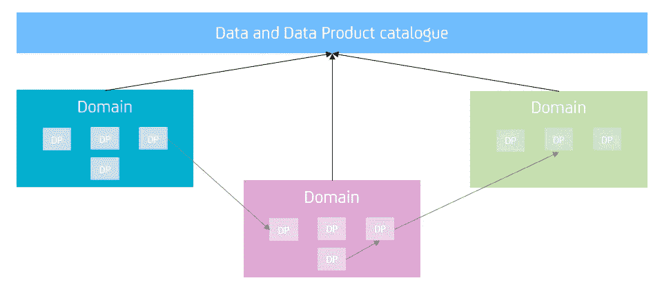

# 数据网格体系结构

> 原文：<https://towardsdatascience.com/the-data-mesh-architecture-a68acb8d4bc4?source=collection_archive---------21----------------------->

## 不仅仅是一个流行词

扎克·沃尔夫在 [Unsplash](https://unsplash.com/?utm_source=unsplash&utm_medium=referral&utm_content=creditCopyText) 上的照片

数据架构不仅仅是一种技术架构，也是一种组织结构，因此，它是构建任何数据帝国的关键因素。随着时间的推移，出现了不同类型的架构，其目的总是为了用理想的解决方案来弥补差距:我们从*数据仓库*开始，它主要专注于创建用于报告的结构化数据集，然后扩展到*数据湖*，目的是集中访问数据，无论数据在哪里，以何种形式出现，并消除数据湖中存在的棘手问题。大约两年前， [Zhamak Dehghani](https://twitter.com/zhamakd) 推出了一种称为*数据网格*的新架构。

## 你的数据网是什么

作者图片

我们都知道这是一个充满流行词汇的领域，所以每当有新东西出现时，都需要一段时间(如果有的话)来确定它的确切含义；数据网格也不例外。然而，最简单的解释是，这是一种面向领域的数据结构化，重点是数据产品所有权，数据产品所有权，管理良好的数据使用，以及提供自助式数据基础设施。但是这些关键词到底是什么意思呢？

**面向领域:**去中心化 ***所有权*** 和 ***架构*** 。与数据湖中的集中化不同，我们定义域和它们覆盖的边界，然后在这些域的基础上定义产品和所有权。

**数据产品**:表格、数据库、数据仓库、应用于数据的机器学习算法，可以根据业务需求定义为一个数据产品，强烈强调*可重用性*的概念。数据产品可以有不同的类型:原始数据、派生数据、算法、决策支持(如仪表板)和自动化决策制定。

**数据产品所有者**:对产品了如指掌的人或团队，负责添加新功能，并满足其他数据产品所有者的要求或业务需求。

**数据治理**:并不是什么新东西，而是更注重于全面记录数据产品及其与其他数据产品的关系，以及整个数据生命周期的管理。

**自助式数据基础设施**:使数据以独立的方式跨区域使用成为可能，可能没有数据所有者的干涉。

一旦定义好一切，前景就是为所有数据和数据产品(包括文档)提供一个单一的参考点，用户可以在那里访问它们，*以这种方式加强架构的自助服务方面*。

## 我们会采纳的

在这个行业呆得够久的人都知道，任何改变的第一步都是*可行性研究，*一种涵盖如何缩小现状和潜在目标之间差距的分析。这不是最令人兴奋的活动，但也是一个好主意，可以更好地了解整个公司的情况。在这种情况下，现状的可行性研究涉及*当前数据架构*，但最重要的是正在使用的*技术*。

第二步是设计未来。适应也意味着塑造理论定义，使它们符合现实，最重要的是你公司的现实。也就是说，一个架构应该被看作是一个*指导方针*,用最佳实践来填补理论和实践之间的空白，这样的指导方针经常需要被调整和微调以使它们真正有用。虽然组件的定义可以被认为是一个简单的步骤，但技术和工具却不是:从数据编目、治理以及所有可用数据的可见性和可访问性，使用支持数据网格体系结构的技术至关重要。因此，未来设计中的一个关键步骤是选择要使用的正确工具，无论是旧工具还是需要集成的新工具；很大程度上取决于公司内部的现状。

## 挑战

你公司的规模和年龄，也就是你数据的数量(和质量)决定了第一个复杂因素。虽然一个相当新的公司，使用的平台较少，数据量较少，在实施新的架构时更容易逃脱，但对于一个拥有多年数据的公司来说，情况就完全不同了，多个平台的集成，随着时间的推移缺乏结构以及许多其他方面都可能成为需要克服的巨大障碍。情况越复杂，可行性研究的时间就越长，新架构的设计就越困难，所有这些都会转化为更多的成本。

为了实现数据网格的好处，很有可能在使用的工具方面发生变化。最具挑战性的挑战之一可能是迁移到云世界，这本身会带来一系列的复杂性和返工。引入新技术也可能令人望而生畏，因为目前市场上有许多可能的选择，因此需要仔细考虑。

在实现数据网格体系结构时，另一个可能的挑战是商定一个单一的定义，适用于所有场景的跨领域，以实现数据处理的标准化。

对于这样一个快速变化的领域，有利也有弊的一点是，存在持续的改进动力，这转化为新架构的引入相当频繁。目前，已经有了一个新的时髦词，*数据结构*，它本身被视为数据网格的一种演变。然而，在跟上最新的方法和采用它所需的成本之间总是有一个权衡；*总是奔向最新的解决方案并不总是最明智的决定*。有时采用一些最佳实践可能是有利可图的，而其他时候坚持你所拥有的，并坚持认为那是最好的解决方案。重要的是始终意识到弱点，并随着时间的推移努力减少它们。