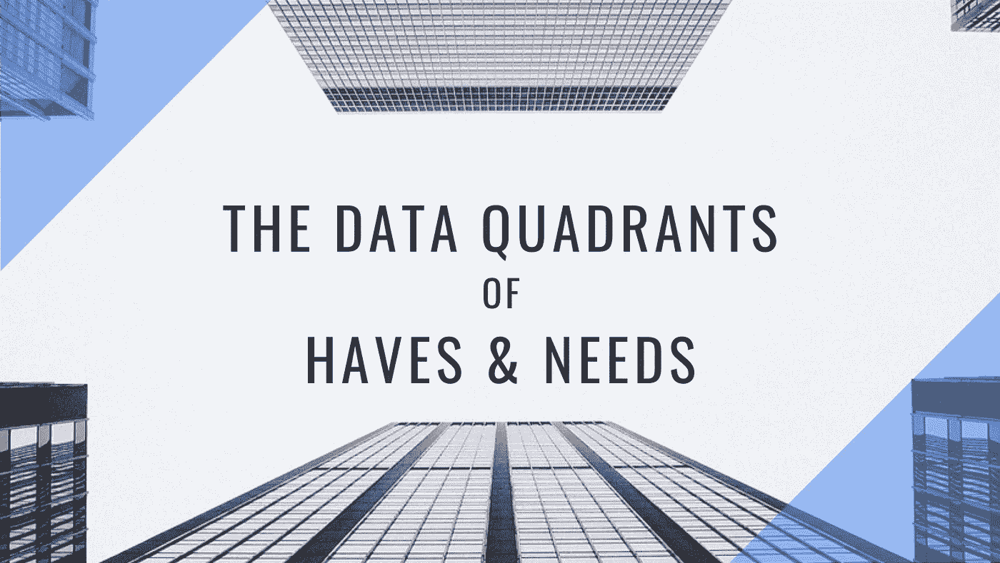
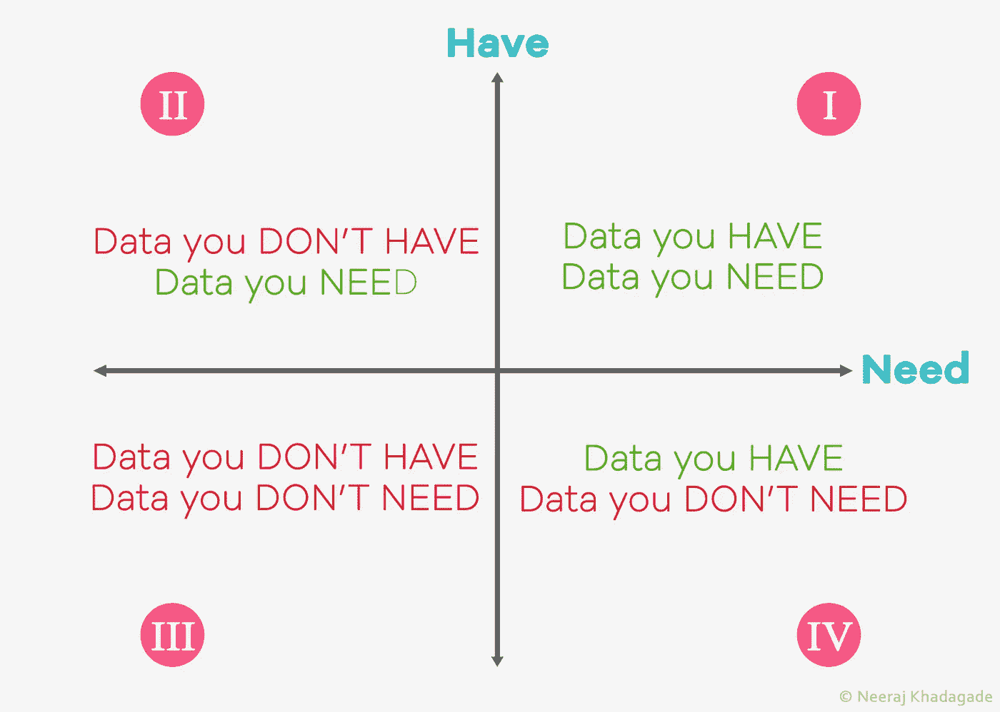
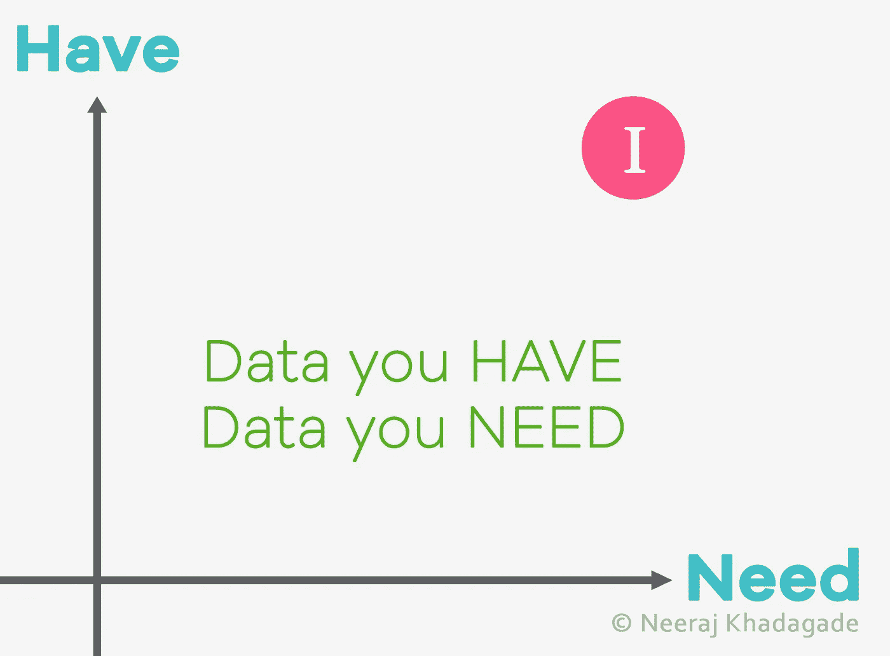
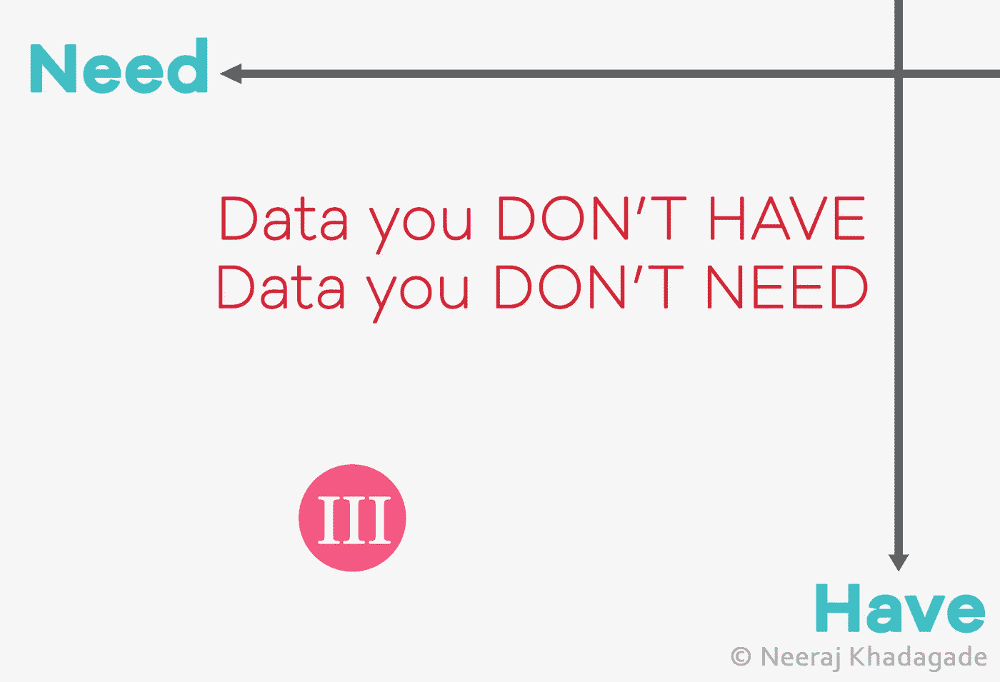
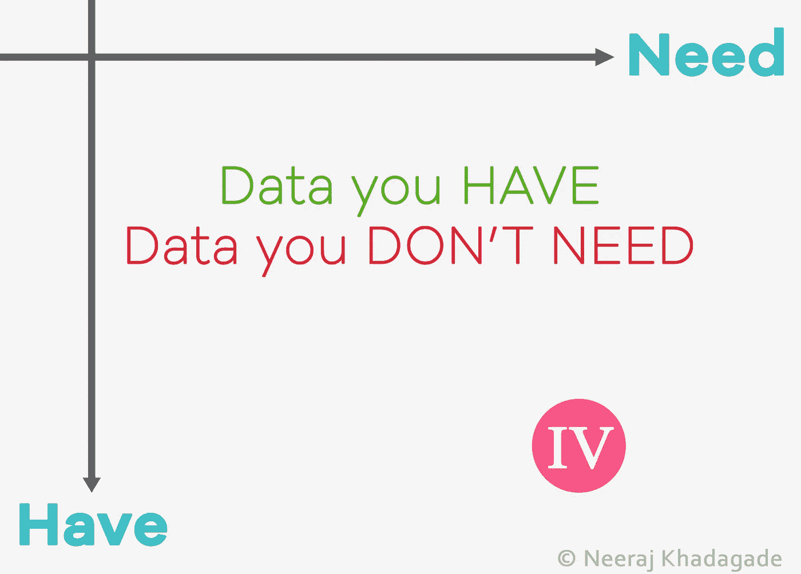
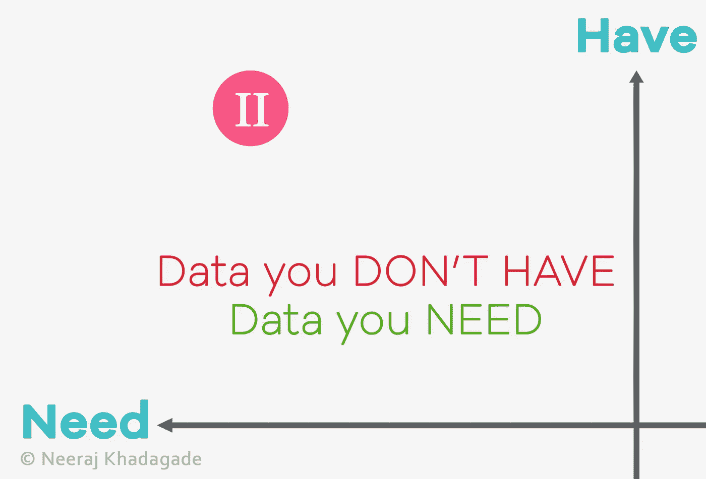

# 拥有和需求的数据象限

> 原文：<https://towardsdatascience.com/the-data-quadrants-of-haves-and-needs-df3d997294ec?source=collection_archive---------28----------------------->

## 为数据分析和构建机器学习模型区分要素优先级的另类方法

想象一下，一个客户向你提出了一个商业问题，你需要用你的技能和专业知识来解决它；有报告、分析和建立机器学习模型。你开始这个项目，看看数据。你看到数据，注意到数据不干净，有数据缺失，有出入。

在开始数据分析之前，您需要处理数据，填充缺失的值(如果可能)，并将其转换成可用的格式。问题是“**如何**

图片由作者提供，灵感来自来源[【https://www.canva.com/】T2

在这篇文章中，我将向你展示我用可用的形式准备数据的步骤，以及为什么我称之为**“数据象限”**

# **坐标轴**

在我研究这些数据时，有两个基本要求。我把它们称为:

1.  **需要** —分析和构建机器学习模型所需的数据
2.  **拥有** —客户已经提供给您的数据，无论您是否可以使用它们

它们将作为我们的主轴，如下图所示:

象限(*作者图片)*

不是世界上所有的公司都有最好的数据存储技术；人们会遇到许多缺失的数据。你会发现自己在所有的象限里。

让我们更深入地了解每个象限。

# **象限**

**象限 I:** 理想场景

象限 I ( *作者图片)*

这是每个数据/业务分析师、数据工程师、机器学习工程师和数据科学家的梦想场景，在这里，客户提供的数据是一流的、高质量的、没有缺失值的、干净的。

当我们开始学习数据科学时，我们总是从这个数据干净完整的象限开始。然而，在现实世界中，情况并非如此。

正如我所说，这是一个“理想”的场景。在我们开始分析数据和建立我们的 ML 模型之前，我们必须努力达到这个象限。

**象限三:**舒适象限

象限三(*作者图片)*

基于这些数据，你会发现很少(或很多)你既不需要也不需要*具备*的特性。最好不要使用那些功能。虽然是基于业务问题，但最好还是先和你的客户取得联系，了解更多的特性。

如果客户端确认不使用这组功能，您可以放弃它们。如果客户说他们很重要，那么你最终会进入 ***象限 2*** 。

我们一会儿会谈到象限 2。正如人们所说，“把最好的留到最后”。

**象限四:**“依赖”象限

象限四(*作者图片)*

有趣的是，我们注意到几乎没有你*拥有*的特征，但是你*不需要*。不使用它们并丢弃它们会更好吗？嗯，不总是这样。

这就是你的*领域专业知识*可以帮助你的地方。根据业务问题，您可以决定是使用这些功能还是放弃它们。如果您不是领域专家，您可以随时与您的客户交谈，了解这些特性是否重要，以及它们如何影响分析。

**鼓声* *

**第二象限:**操场

象限 II ( *作者图片)*

几乎总是，你会发现自己在象限 II；数据你*需要*，但你*没有。*这是一个象限，您会在其中找到大量缺失值的要素。您可能听说过，“在数据准备好进行分析之前，80%的时间都花在了“争论”或“蒙骗”数据上”[1]。

好的一面是你知道数据分析需要哪些特性。具有挑战性的部分是填补这些缺失的价值。用于填充缺失值的方法之一称为*数据丰富*，这是提高数据质量的常规做法。

我用过几个解决方案/技术，它们是:

1.  网页抓取
2.  使用 REST API
3.  从第三方数据提供商处购买批量数据
4.  归罪

我不会说这会直接把你带到*象限 I* ，因为上面提到的上述技术和数据来源并不能保证提取或拥有完整的信息。但是它肯定会让你有更好的数据质量来进行分析和构建 ML 模型。

**最终步骤**

理解数据和特征、它们的重要性以及它们对目标特征的整体影响肯定需要时间。这种方法不仅节省时间，而且有助于理解和优先考虑您的功能，并计划您和您的团队要采取的后续步骤。

我希望这篇文章对你有用。请在下面的评论区留下您的反馈。

参考资料:

[1][https://blog . coursera . org/why-big-data-science-depends-skilled-data-engineers/#:~:text = In % 20 fact % 2C % 20 some % 20 data % 20 科学家，建立% 20 data % 20 管道% 20 和% 20 仓库。](https://blog.coursera.org/why-big-data-science-depends-on-skilled-data-engineers/#:~:text=In%20fact%2C%20some%20data%20scientists,build%20data%20pipelines%20and%20warehouses.)