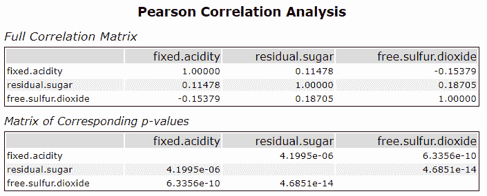
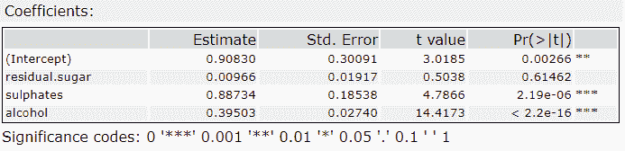

# 数据科学名人问答:满足 p 值(又名 p 值)

> 原文：<https://towardsdatascience.com/the-data-science-celebrity-q-a-meet-p-value-aka-p-value-5dc021d078f6?source=collection_archive---------40----------------------->

## [入门](https://towardsdatascience.com/tagged/getting-started)

## p 值到底是谁？这是我们这个时代最流行的名人计算——也可能是最被误解的。

图片由杰克·布吕克在 Unsplash 上拍摄

p 值(也称为 p 值)的神秘和影响使它成为我们这个时代最流行的名人计算方法——也可能是最容易被误解的。尽管在成千上万的数据分析中扮演着重要的角色，许多人仍然发现 p 值令人困惑，甚至是误导。

那么 p 值到底是谁呢？我们的采访者与 P. Value 坐下来进行了独家问答，听听它的起源故事，并找出为什么它的成功不仅仅是由于机遇。是的，我们问了一些棘手的问题:你会了解到你所听说的“p-hacking”争议背后的真相。

请继续阅读我们无拘无束的对话！

*图片经由*[GIPHY](https://media.giphy.com/media/ytJ7u4V0N4EKgJzOIc/giphy.gif)

# 告诉我们你的根。P. Value 的人生故事是什么？

你想让我把茶洒了，嗯？有趣。我其实是因为一个关于茶的实验而诞生的。

[罗纳德·费雪](https://en.wikipedia.org/wiki/Ronald_Fisher)是我的父亲，但他是一个……嗯，不管怎样，他是一个英国统计学家和遗传学家——他也有一些[可怕的想法](https://www.newstatesman.com/international/science-tech/2020/07/ra-fisher-and-science-hatred)。与此同时，他在统计学方面做了一些有趣的事情，至今人们仍在使用。比如，也许你听说过费希尔的精确测试？还是最大似然估计？你可以责怪他的虹膜数据集，每个人都用它来试验数据科学的东西。

那是 20 世纪 20 年代初的一天。我父亲的同事穆里尔·布里斯托(Muriel Bristol)是一名研究藻类的博士，他做出了一个大胆的声明。她说她能品尝出倒茶前或倒茶后加入牛奶的茶之间的区别。这有点像[的长篇故事](https://rss.onlinelibrary.wiley.com/doi/full/10.1111/j.1740-9713.2012.00620.x)，也有不同的版本。甚至有一整本书[的书名也来源于这一事件。](https://en.wikipedia.org/wiki/The_Lady_Tasting_Tea)

总之，很明显，我爸爸和生物化学家威廉·罗奇做了一个实验，看看穆丽尔是否真的能分辨出哪个是哪个。这让他想到了我。

*罗纳德·费雪(维基媒体)和穆里尔·布里斯托(罗瑟姆斯泰德研究站/劳斯农业信托基金)*

# 发生了什么事？你是如何帮助他们理解实验结果的？

对于茶叶的情况，他们有一个“零假设”和一个“替代假设”。无效假设是穆里尔*不能*分辨出倒茶前和倒茶后的奶茶之间的区别。另一个假设是她*实际上能够*分辨出不同。

你做了一个实验，想弄清楚零假设或替代假设是否能更好地解释正在发生的事情。这些人不得不问他们如何建立一个实验来有效地测试这一点。此外，穆里尔要正确辨别多少杯茶才能让我爸爸和罗奇感觉到替代假说得到了支持？

我就是从那里进来的。基本上是我爸编我来解决这个问题的。我是一个计算，显示你的结果是否*与你在零假设下的预期足够*不同…这样你就应该考虑替代假设可能是对正在发生的事情更好的解释。

剧透:穆里尔实际上可以品尝到不同之处！她甚至嫁给了威廉·罗奇。

*图像通过* [*GIPHY*](https://media.giphy.com/media/Nw8z2olm0nGHC/giphy.gif)

# 好的，但是多谈谈这个“结果足够不同”的事情——那是什么意思？

我所做的是告诉实验者，结果是否足够不同于仅仅是猜测，仅仅是偶然，看看是否会有不同的事情发生——我的意思是，会有对替代假设的支持。

我变得越小，你的结果就越不可能是偶然的。平时人家找我就是 0.05 以下。这意味着，如果假设零假设成立，你得到这些结果的概率是 5%或更低。你可以认为这些结果“出乎意料”或“令人惊讶”

0.05 bar 通常被大多数假设检验目的所接受。但有时人们对我来说可以接受更高或更低的数字。要看具体情况。你知道，有些人更放松，有些人要求更高。

然而，这里有一个重要的细节。p 值等于或低于 0.05，或任何阈值，仅仅意味着在你的自变量和因变量之间存在统计上显著的关系。这只是在你测试的环境中。

例如，如果您构建一个回归模型，您将在模型中的每个独立变量旁边看到 p 值，以及为整个模型计算的 F 统计的 p 值的总体值。p 值太多了！

如果某个特定自变量的 p 值低于 0.05(或您选择的阈值)，这就意味着在回归模型中，该变量与结果变量之间存在显著的统计关系。

*图片经由* [*GIPHY*](https://media.giphy.com/media/tdu0n3HeVHfRS/giphy.gif)

# 耶！所以你是在告诉我哪些变量更能预测我的结果。

没有抱歉。这是*方式*比较复杂。

p 的极小值并不意味着一个“显著的”变量必然*在预测你的结果变量方面真的很好*。小的 p 值并不意味着大的预测能力。它也是一种特定于回归模型配置的计算，包括您已经包括的任何其他变量，以及您在特定分析方法中的特定数据。都非常…具体。所以这个变量并不是在所有情况下都永远重要。

(不幸的是，你分析的这种超特异性意味着你也可能有其他变量*确实*有预测能力，但是它们的 p 值太大而不显著。诡异却[真实](https://www.pnas.org/content/pnas/112/45/13892.full.pdf)！所以领域知识和其他检查数据的方法仍然很重要。)

一个小的 p 值仅仅意味着你有更好的机会拒绝零假设——这可能是那个变量和结果变量之间没有关系。换句话说，这个微小的 p 值只是一个指标，表明这个变量与你的结果变量相关。我知道你喜欢找相关的东西，所以还是不错的。这是理解数据的一步。

以及基于 f 检验的整个回归模型的 p 值？它只是说，你通过设置一组你认为以特定方式连接的特定变量而提出的关系——嗯，如果 p 值如你所愿地低，那么恭喜你！与没有*变量的模型相比，你的模型在拟合数据方面做得更好。我知道，你的模型不再像是一个成就了。但是，是的，还是有很好的信息。*

最后一个令人震惊的事实是:你可以有一个总体上重要的模型，但没有单独重要的自变量。我知道，对吧？！这只是[意味着](https://statisticsbyjim.com/regression/interpret-f-test-overall-significance-regression/#:~:text=The%20F%2Dtest%20of%20overall%20significance%20indicates%20whether%20your%20linear,that%20contains%20no%20independent%20variables.&text=F%2Dtests%20can%20evaluate%20multiple,fits%20of%20different%20linear%20models.)这些变量的联合交互作用是显著的……但是没有一个变量单独达到这个标准。

在你开始告诉大家你提出的另一个假设是如何完全真实地解释事物之前，我还有一件事要告诉你。微小的 p 值不会“证明”你的替代假设是“真的”。这只是意味着你的零假设不太可能是事实。

*图像通过* [*GIPHY*](https://media.giphy.com/media/YEongvRqe8sXC/giphy.gifhttps://media.giphy.com/media/l4pTsh45Dg7jnDM6Q/giphy-downsized.gif)

# 今天，我们在哪里可以找到你在不同的统计分析中施展你的魔法呢？

我在所有的统计类型中都得到了很棒的角色！你会看到我主演(懂了吗？*)在 t 检验中，当您想要查看两个组对于某个变量是否具有显著不同的均值时。那就是 Alteryx Designer 中手段工具的[测试。t 检验也是](https://help.alteryx.com/current/designer/test-means-tool) [A/B 分析](https://help.alteryx.com/current/designer/ab-analysis-tool)的核心，所以我在那里也是一个配角。当你检查变量之间关系的实际差异时，我还展示了一个[列联表](https://help.alteryx.com/current/designer/contingency-table-tool)。

当然，我也参与分析[相关性](https://community.alteryx.com/t5/Alteryx-Designer-Knowledge-Base/Tool-Mastery-Association-Analysis/ta-p/40459)，如下图所示。这个输出的下部表格中的数字是我对这些相关性中每一个的值。

作者图片

*图像通过* [*GIPHY*](https://media.giphy.com/media/TPSE689GGzEo8/giphy.gif)

如果你对模特感兴趣，那么，除了我其他迷人的工作之外，我也做模特。我们之前讨论过回归。如果你建立一个回归模型，就像我们说的，我会弹出你的每个自变量，向你展示哪些与你的结果变量有显著的统计关系。同样，统计显著性仅仅意味着通过分析你的变量之间的关系得到的结果是*令人惊讶的*并且具有潜在的意义，但并不意味着发现具有较低 p 值的变量必然是你的结果变量的更强预测因素。当然，您需要检查 f 检验的 p 值，以了解整个模型的表现。

作者图片

这是一个用[红酒数据集](https://www.kaggle.com/uciml/red-wine-quality-cortez-et-al-2009)预测葡萄酒质量分数的模型。看右边那个 [Pr( > |t|)](https://stats.stackexchange.com/questions/49939/interpreting-summary-function-for-lm-model-in-r) 栏目，追星！***表示酒精和硫酸盐的 p 值小于 0.001，但残留糖的空白点表示其 p 值大于 0.05。因此，在这个特定的模型和这个数据集中，残余糖可能比其他两个变量与葡萄酒质量的相关性更低，因为它没有显示出与葡萄酒质量的结果变量的意外或令人惊讶的联系。然而，在这种特定的数据情况下，硫酸盐和酒精可能与葡萄酒质量有关。

你也可以看到我在[比较机器学习模型](https://machinelearningmastery.com/statistical-significance-tests-for-comparing-machine-learning-algorithms/)中扮演配角。想知道一个模特比另一个表现好是否只是偶然？我也可以帮你一把。

基本上，如果你有一个假设，我可以帮你测试它。

*图像通过* [*GIPHY*](https://media.giphy.com/media/ATt7p8OO4mvvO/giphy.gif)

# 你最近在一些研究丑闻中被点名——人们可能听说过“ [p-hacking](https://www.wired.com/story/were-all-p-hacking-now/) ”。这是怎么回事？

是啊，那都不是我的错。我只是一个计算，你知道吗？黑客行为听起来像是犯罪之类的——但这种事情只会发生在数据分析中，即使人们的意图是好的。

有些人如此坚定地要在他们的研究中找到有统计学意义的结果，以至于他们只是不停地挖掘他们的数据，用各种方式运行他们的数字，直到他们得到一些我小于 0.05 的结果。有人称之为数据挖掘或者——我最喜欢的——意义探寻。我喜欢成为探索的目标！

当人们认为仅仅因为他们没有发现任何有统计学意义的东西，他们所有的工作就不值得分享时，这是令人失望的。比如，找不到东西也很重要。

无论如何，最好的做法是在开始分析您的数据之前，决定并陈述您要测试的假设以及您的测试统计将会是什么，比如 t 测试中的 t 统计或列联表的卡方… *。这样，当你的结果不像你希望的那样时，你就不能改变事情了。你必须承诺。给这种分析方法加上一个环。*

同样，一段重要的关系，在现实世界中可能不会有什么不同。有一次，有人对我说，“统计意义和实际意义是不一样的。”

那是深刻的。我们都要问，这个世界上真正重要的是什么？我只是想尽我的一份力量来回答这个问题。

*图片经由*[GIPHY](https://media.giphy.com/media/riQw6Nc9i4sKc/giphy.gif)

# 推荐阅读

*   [科学没有被打破](https://fivethirtyeight.com/features/science-isnt-broken/):来自 FiveThirtyEight 的关于 p-hacking 的互动文章和解释者
*   [如何解释回归分析中的 p 值和系数](https://statisticsbyjim.com/regression/interpret-coefficients-p-values-regression/)
*   [用于比较机器学习算法的统计显著性测试](https://machinelearningmastery.com/statistical-significance-tests-for-comparing-machine-learning-algorithms/)

# 奖金

想要借助一些非常可爱的小狗对 p 值进行另一种解释吗？看看这段来自谷歌首席决策科学家 Cassie Kozyrkov 的视频。

*原帖* [*Alteryx 社区数据科学博客*](https://community.alteryx.com/t5/Data-Science/The-Data-Science-Celebrity-Q-amp-A-Meet-P-Value-aka-p-value/ba-p/743016) *。*